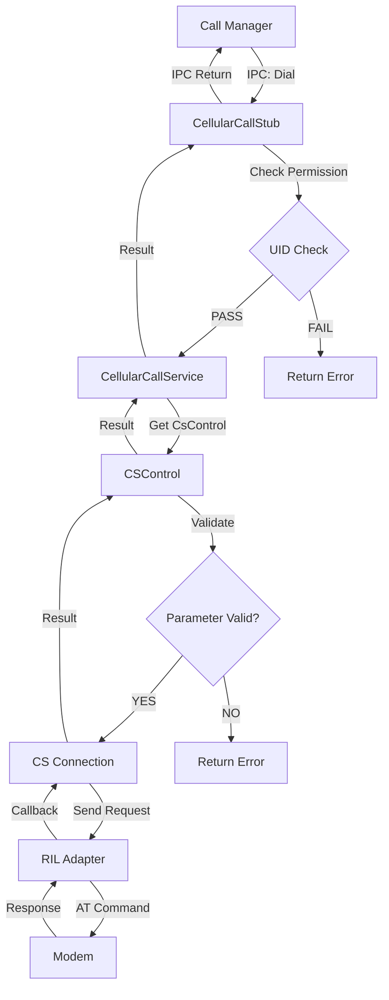
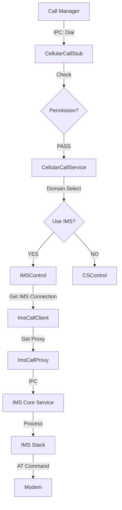
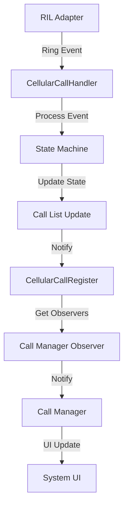
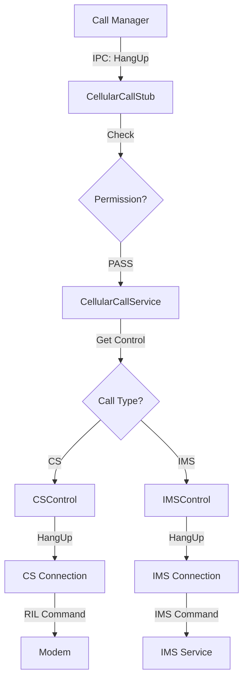
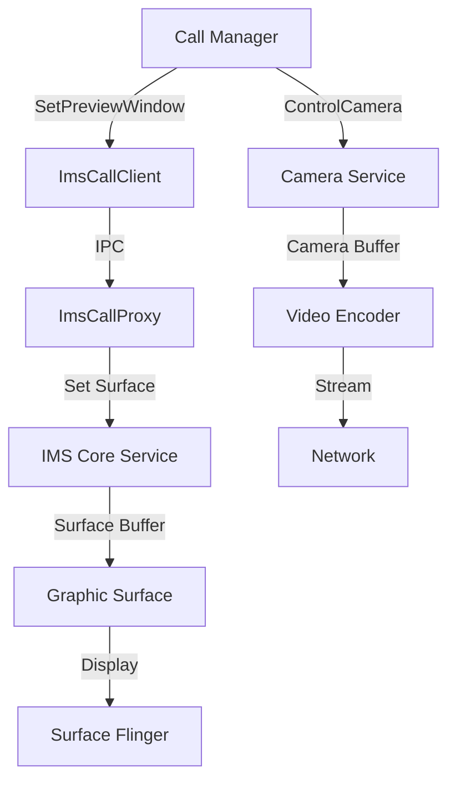
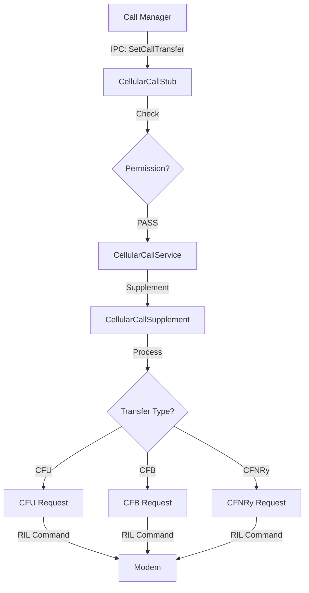
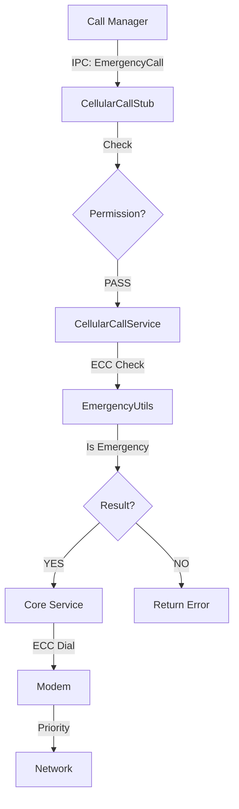
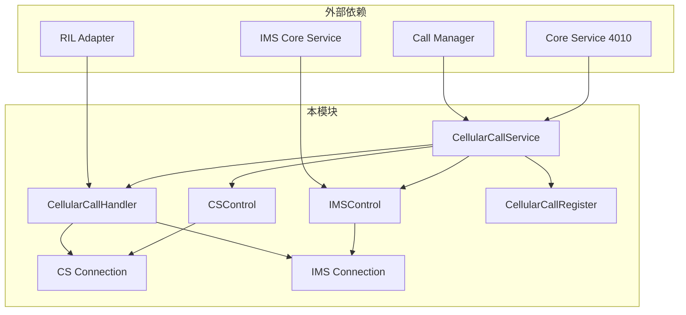

# 附录 - 关键调用链

## 目的

本文档提供 Cellular Call 模块的**关键调用链图示**，帮助开发者理解主要功能的调用路径。

## 调用链索引

| 功能 | 调用链 | 复杂度 |
|------|--------|--------|
| [拨号 (CS)](#1-拨号-cs) | Call Manager → Stub → Service → Control → Connection → RIL | ⭐⭐⭐ |
| [拨号 (IMS)](#2-拨号-ims) | Call Manager → Stub → Service → Control → Connection → IMS Service | ⭐⭐⭐ |
| [接听来电](#3-接听来电) | RIL → Handler → Service → Register → Call Manager | ⭐⭐ |
| [挂断通话](#4-挂断通话) | Call Manager → Stub → Service → Control → Connection → RIL | ⭐⭐⭐ |
| [IMS 视频通话](#5-ims-视频通话) | Call Manager → IMS Client → IMS Service → Camera/Surface | ⭐⭐⭐⭐ |
| [补充业务](#6-补充业务) | Call Manager → Stub → Supplement Utils → RIL | ⭐⭐⭐ |
| [紧急呼叫](#7-紧急呼叫) | Call Manager → Stub → Emergency Utils → Core Service → RIL | ⭐⭐⭐ |

---

## 1. 拨号 (CS)

### 调用链

### 调用点索引

| 步骤 | 文件 | 行号 | 函数 |
|------|------|------|------|
| IPC 入口 | `cellular_call_stub.cpp` | 33 | `OnRemoteRequest()` |
| 权限检查 | `cellular_call_stub.cpp` | 45-50 | `CheckPermission()` |
| 服务调用 | `cellular_call_service.cpp` | - | `Dial()` |
| Control 获取 | `cellular_call_service.cpp` | - | `GetCsControl()` |
| CS Dial | `cs_control.cpp` | - | `Dial()` |
| Connection | `cellular_call_connection_cs.cpp` | - | `SendRequest()` |

---

## 2. 拨号 (IMS)

### 调用链

### 调用点索引

| 步骤 | 文件 | 行号 | 函数 |
|------|------|------|------|
| 域选择 | `cellular_call_service.cpp` | - | `DialNormalCall()` |
| IMS Client | `ims_service_interaction/` | - | `ImsCallClient` |
| IMS Proxy | `ims_call_proxy.cpp` | - | `Dial()` |
| IMS Service | `ims_core_service` | - | (外部依赖) |

---

## 3. 接听来电

### 调用链

### 调用点索引

| 步骤 | 文件 | 行号 | 函数 |
|------|------|------|------|
| RIL 回调 | `cellular_call_handler.cpp` | - | `ProcessEvent()` |
| 状态机 | `cellular_call_handler.cpp` | - | `ProcessCallInfoChanged()` |
| 通知注册 | `cellular_call_register.cpp` | - | `Register()/Notify()` |

---

## 4. 挂断通话

### 调用链

---

## 5. IMS 视频通话

### 调用链

### 视频通话相关调用

| 功能 | 接口 | 证据位置 |
|------|------|----------|
| 预览窗口 | `SetPreviewWindow()` | `ims_video_call_control.h` |
| 显示窗口 | `SetDisplayWindow()` | `ims_video_call_control.h` |
| Camera 控制 | `ControlCamera()` | `ims_video_call_control.h` |
| 缩放 | `SetCameraZoom()` | `ims_video_call_control.h` |
| 旋转 | `SetDeviceDirection()` | `ims_video_call_control.h` |

---

## 6. 补充业务

### 调用链

### 补充业务列表

| 业务 | 接口 | 证据位置 |
|------|------|----------|
| 呼叫转移 | `SetCallTransferInfo()` | `cellular_call_service.h:307` |
| 呼叫等待 | `SetCallWaiting()` | `cellular_call_service.h:334` |
| 呼叫限制 | `SetCallRestriction()` | `cellular_call_service.h:360` |

---

## 7. 紧急呼叫

### 调用链

### 紧急呼叫相关

| 功能 | 接口 | 证据位置 |
|------|------|----------|
| 紧急号码判断 | `IsEmergencyPhoneNumber()` | `cellular_call_service.h:161` |
| 紧急列表设置 | `SetEmergencyCallList()` | `cellular_call_service.h:170` |
| 紧急工具 | `emergency_utils.cpp` | `services/utils/src/` |

---

## 跨模块依赖图

---

*最后更新：2026-02-06*
