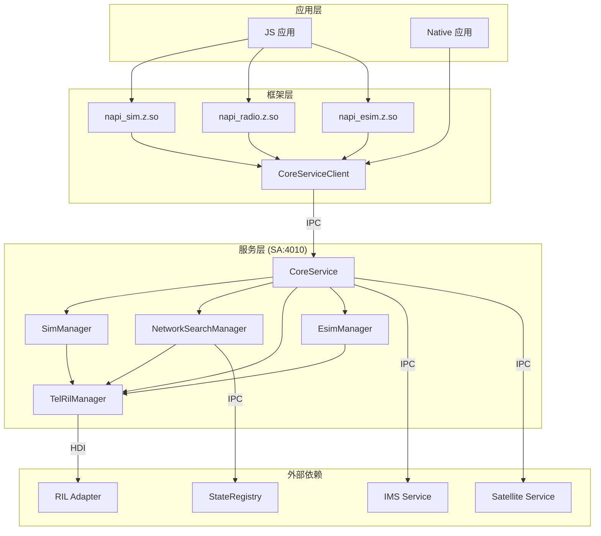
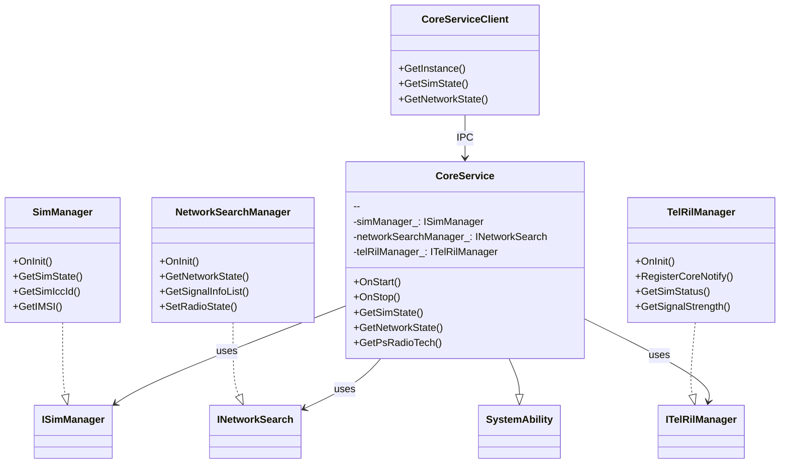
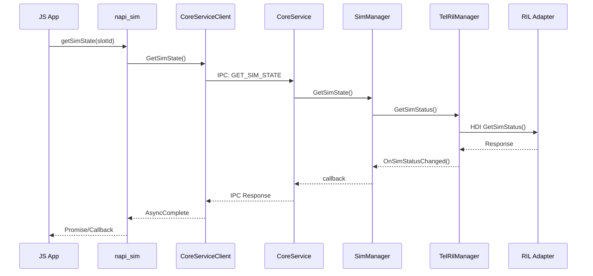
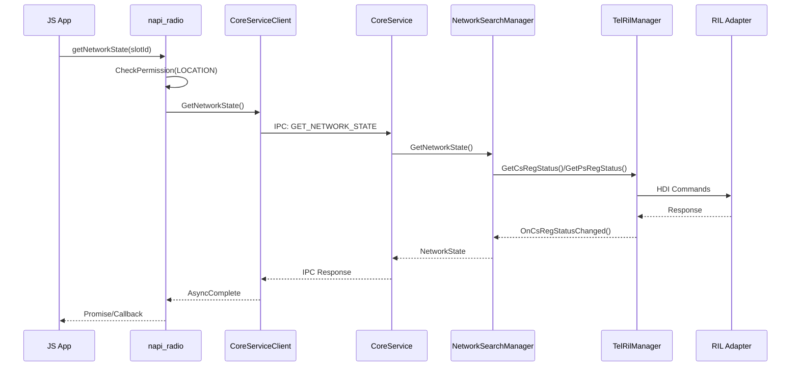
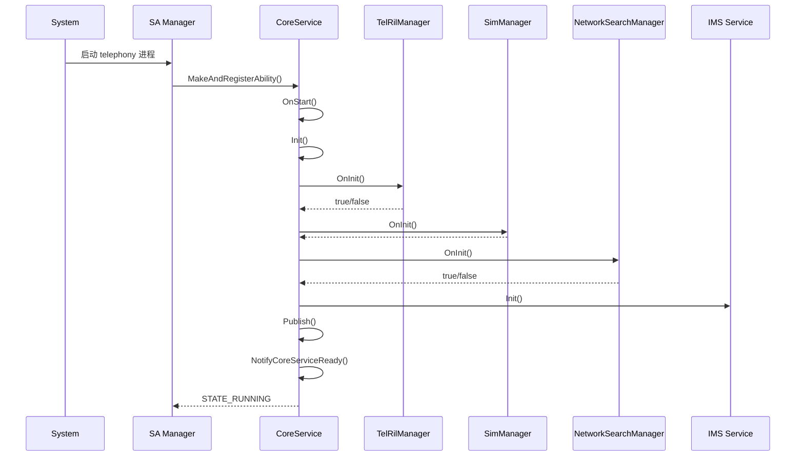

# 架构设计

## 目的

本文档描述 `telephony_core_service` 的组件架构、数据流、线程模型和关键时序。

---

## 组件架构图



## 核心类图



## 线程模型

### CoreService 线程架构

```
┌─────────────────────────────────────────────────────────┐
│                    CoreService                          │
│                      (主线程)                            │
├─────────────────────────────────────────────────────────┤
│  networkSearchHandler (FFRT)  │  simManagerHandler      │
│                               │  (FFRT)                 │
├─────────────────────────────────────────────────────────┤
│  simPinManagerHandler (FFRT)  │                         │
└─────────────────────────────────────────────────────────┘
```

**代码证据** (`services/core/src/core_service.cpp:157-194`):

```cpp
void CoreService::AsyncNetSearchExecute(const std::function<void()> task)
{
    if (networkSearchManagerHandler_ == nullptr) {
        auto networkSearchRunner = AppExecFwk::EventRunner::Create(
            "networkSearchHandler", AppExecFwk::ThreadMode::FFRT);
        networkSearchManagerHandler_ = std::make_shared<AppExecFwk::EventHandler>(
            networkSearchRunner);
    }
    networkSearchManagerHandler_->PostTask(task);
}
```

### FFRT 配置

```cpp
// services/core/src/core_service.cpp:46
const int32_t MAX_FFRT_THREAD_NUM = 32;

// OnStart 中设置
ffrt_set_cpu_worker_max_num(ffrt::qos_default, MAX_FFRT_THREAD_NUM);
```

### TelRilManager 线程模型

TelRilManager 使用 `ffrt::shared_mutex` 进行并发控制:

```cpp
// services/tel_ril/include/tel_ril_manager.h:371-372
ffrt::shared_mutex mutex_;
ffrt::shared_mutex telRilMutex_;
```

## 数据流图

### SIM 状态查询流程



### 网络状态获取流程



## 关键时序

### CoreService 启动时序



**代码证据** (`services/core/src/core_service.cpp:55-124`):

```cpp
void CoreService::OnStart() {
    // ... 时间记录
    if (!registerToService_) {
        bool ret = Publish(DelayedSingleton<CoreService>::GetInstance().get());
        // ...
    }
    ffrt_set_cpu_worker_max_num(ffrt::qos_default, MAX_FFRT_THREAD_NUM);
    if (!Init()) { return; }
    state_ = ServiceRunningState::STATE_RUNNING;
    NotifyCoreServiceReady();
}

bool CoreService::Init() {
    telRilManager_ = std::make_shared<TelRilManager>();
    if (!telRilManager_->OnInit()) { return false; }
    
    simManager_ = std::make_shared<SimManager>(telRilManager_);
    simManager_->OnInit(slotCount);
    
    networkSearchManager_ = std::make_shared<NetworkSearchManager>(telRilManager_, simManager_);
    if (!networkSearchManager_->OnInit()) { return false; }
    // ...
    return true;
}
```

## IPC 接口定义

### CoreService SA (ID: 4010)

IPC 命令码定义在 `interfaces/innerkits/include/core_service_ipc_interface_code.h:22-154`:

```cpp
enum class CoreServiceInterfaceCode {
    GET_PS_RADIO_TECH = 0,
    GET_CS_RADIO_TECH,
    GET_OPERATOR_NUMERIC,
    // ... 更多命令
    GET_SIM_STATE = 37,
    HAS_SIM_CARD = 36,
    GET_IMEI = 32,
    // ...
};
```

### 回调接口

| 接口 | 用途 | 位置 |
|------|------|------|
| `INetworkSearchCallback` | 网络搜索回调 | `i_network_search_callback.h` |
| `IRawParcelCallback` | 通用原始数据回调 | `i_raw_parcel_callback.h` |
| `ImsRegInfoCallback` | IMS 注册状态回调 | `ims_reg_info_callback.h` |

## 相关链接

- [N-API 接口](./03_NAPI_API.md)
- [内部 API](./04_Inner_API.md)
- [目录结构](./01_Directory_Structure.md)
