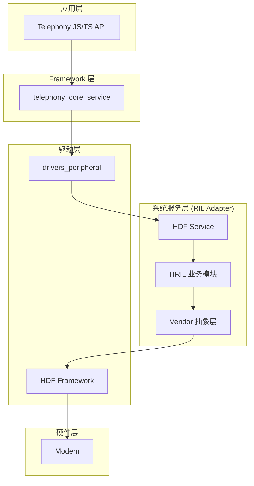

# 项目概览

> 理解 RIL Adapter 在 OpenHarmony Telephony 子系统中的角色

## 1. 一句话定义

**RIL Adapter** 是 OpenHarmony Telephony 子系统的核心适配层，通过 HDF 服务向上层 telephony 服务提供统一的无线通信能力，同时屏蔽不同 Modem 厂商的硬件差异。

> **证据**：`README.md:11` - "The RIL Adapter module provides functions such as vendor library loading, service interface implementation, and event scheduling and management."

## 2. 能力边界

### 2.1 能做什么 ✅

| 功能模块 | 核心文件能力描述 |  |
|----------|----------|----------|
| **通话管理** | 语音通话拨打、接听、挂断、保持、会议、DTMF | `hril_call.cpp` (45KB) |
| **数据连接** | PDP 上下文管理、数据连接激活/去激活、带宽上报 | `hril_data.cpp` (35KB) |
| **网络服务** | 网络注册、信号强度、邻区信息、5G NR 选项 | `hril_network.cpp` (79KB) |
| **SIM 卡管理** | PIN/PUK 管理、IMSI 读取、APDU 通信、STK | `hril_sim.cpp` (44KB) |
| **短信服务** | GSM/CDMA 短信、短信中心配置、蜂窝广播 | `hril_sms.cpp` (41KB) |
| **Modem 控制** | 射频开关、IMEI/MEID 读取、基带版本查询 | `hril_modem.cpp` (17KB) |
| **厂商适配** | 动态加载厂商库、AT 命令封装 | `vendor_adapter.c` |

### 2.2 不能做什么 ❌

| 限制 | 说明 |
|------|------|
| **不直接对外暴露 N-API** | 仅通过 `drivers_peripheral` 调用 |
| **不实现 Modem 硬件驱动** | 依赖厂商库 (Vendor Library) 实现 |
| **不处理应用层业务** | 仅提供底层通信能力 |
| **不支持独立运行** | 必须配合 HDF 框架和 telephony 服务 |

> **证据**：`README.md:43` - "The RIL Adapter does not provide external APIs and can only be called by through drivers_peripheral."

## 3. 运行环境

### 3.1 系统依赖

| 依赖组件 | 版本要求 | 用途 |
|----------|----------|------|
| **HDF Framework** | 内核模块 | 硬件驱动框架基础 |
| **drivers_interface** | V1.5+ | RIL HDI 接口定义 |
| **drivers_peripheral** | V1.5+ | 外设驱动实现 |
| **telephony_core_service** | V1.0+ | 上层电话服务 |
| **IPC/Kit** | 标准组件 | 进程间通信 |
| **SAMGR** | 标准组件 | 服务管理框架 |

> **证据**：`bundle.json:29-39` - 依赖组件清单

### 3.2 硬件要求

| 要求 | 说明 |
|------|------|
| **Modem** | 支持独立蜂窝通信的调制解调器 |
| **通信接口** | 串口 (AT 命令) 或 USB |
| **SIM 卡槽** | 至少一个 SIM 卡接口 |

> **证据**：`README.md:37-39` - "In terms of hardware, the device must be equipped with a modem capable of independent cellular communication."

### 3.3 资源占用

| 资源 | 占用量 | 说明 |
|------|--------|------|
| **ROM** | ~700KB | 编译后静态库大小 |
| **RAM** | ~1MB | 运行时内存占用 |

> **证据**：`bundle.json:26-27`

## 4. 架构位置

### 4.1 在 Telephony 子系统中的位置



### 4.2 模块划分

```
┌─────────────────────────────────────────────────────────────┐
│                    RIL Adapter                               │
├─────────────────────────────────────────────────────────────┤
│  interfaces/          services/                              │
│  ┌──────────────┐   ┌─────────────┬─────────────┬─────────┐ │
│  │ innerkits    │   │ hril        │ hril_hdf    │ vendor │ │
│  │              │   │ (业务实现)  │ (HDF服务)   │ (厂商)  │ │
│  │ 头文件定义    │   │             │             │         │ │
│  │              │   │ 10 个模块    │ 1 个模块     │ 11 个   │ │
│  │ 12 个头文件   │   │ C++ 文件    │ C 文件      │ C 文件  │ │
│  └──────────────┘   └─────────────┴─────────────┴─────────┘ │
├─────────────────────────────────────────────────────────────┤
│  utils/                                                         │
│  ┌─────────────────────────────────────────────────────────┐   │
│  │ telephony_log_wrapper.h - 日志宏定义                      │   │
│  └─────────────────────────────────────────────────────────┘   │
└─────────────────────────────────────────────────────────────┘
```

## 5. 快速开始

### 5.1 构建项目

```bash
# 在 OpenHarmony 构建系统中
hb build -p telephony_ril_adapter

# 或使用 hdc 命令
hdc target mount
```

### 5.2 查看服务状态

```bash
# 查看 RIL 服务是否运行
hilog | grep "HRIL"
```

### 5.3 验证安装

```bash
# 查看服务注册
cat /proc/driver/hdf/ril

# 查看内核日志
dmesg | grep -i "ril"
```

## 6. 相关项目

| 项目 | 仓库 | 关系 |
|------|------|------|
| telephony_core_service | telephony_core_service | 上层服务，调用 RIL Adapter |
| drivers_interface | drivers_interface | 提供 HDI 接口定义 |
| drivers_peripheral | drivers_peripheral | HDF 服务绑定实现 |
| telephony_js_napi | telephony_js_napi | JS API 接口 |

> **证据**：`README.md:45-55`

## 7. 关键概念

### 7.1 HRIL vs Vendor

| 概念 | 描述 | 代码位置 |
|------|------|----------|
| **HRIL** | Harmony RIL，业务逻辑实现层 | `services/hril/` |
| **Vendor** | 厂商抽象层，屏蔽硬件差异 | `services/vendor/` |

### 7.2 HDF Service

RIL Adapter 通过 HDF 框架注册为系统服务，接收来自 telephony_core_service 的 IPC 调用。

> **证据**：`services/hril_hdf/include/hril_hdf.h` - HDF 服务接口定义

### 7.3 Request/Notification 机制

| 类型 | 方向 | 描述 | 示例 |
|------|------|------|------|
| **Request** | 上层 → RIL | 请求发起，如拨打电话 | `HREQ_CALL_DIAL` |
| **Response** | RIL → 上层 | 请求响应结果 | 通话状态响应 |
| **Notification** | RIL → 上层 | 事件通知，如信号变化 | `HNOTI_NETWORK_STATE` |

> **证据**：`interfaces/innerkits/include/hril_request.h`, `hril_notification.h`

## 8. 小结

RIL Adapter 是 OpenHarmony 电话服务的核心组件，其设计目标包括：

1. **统一接口**：为上层提供标准化的 RIL 操作接口
2. **厂商无关**：通过 Vendor 层屏蔽 Modem 硬件差异
3. **安全通信**：基于 HDF 框架的进程间通信
4. **高效事件处理**：支持异步事件和回调机制

---

**相关文档**：
- [架构与数据流](02_Architecture.md) - 深入理解模块划分
- [代码地图](03_CodeMap.md) - 定位核心代码
- [攻击面分析](05_AttackSurface.md) - 安全研究入口
