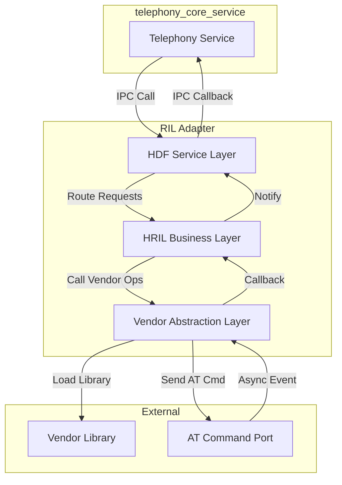
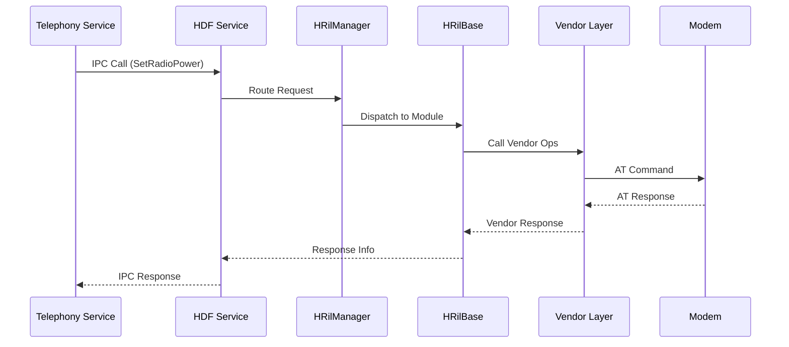
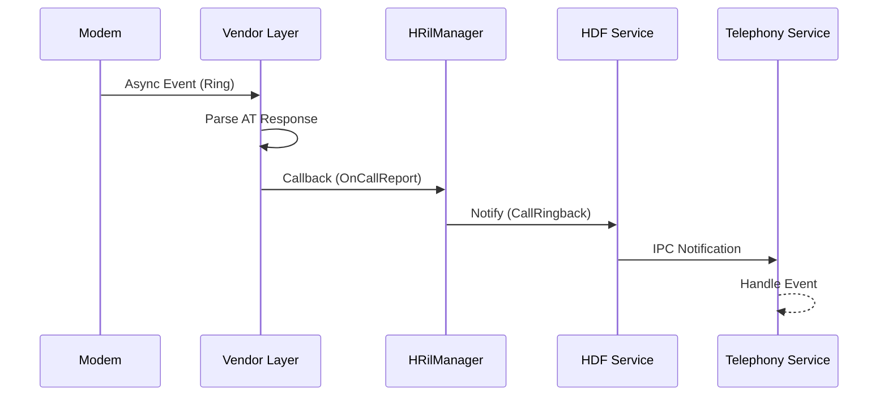
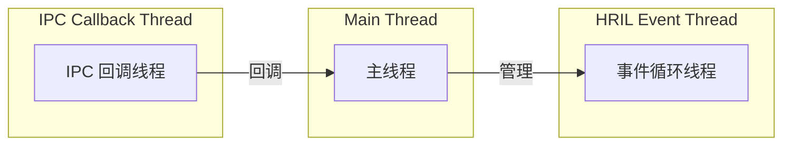
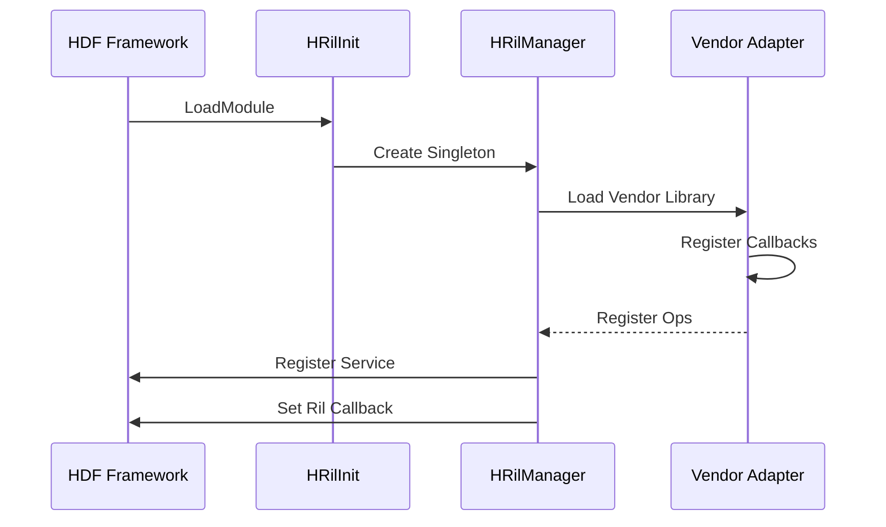
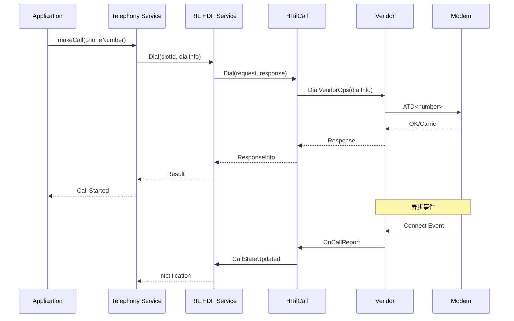
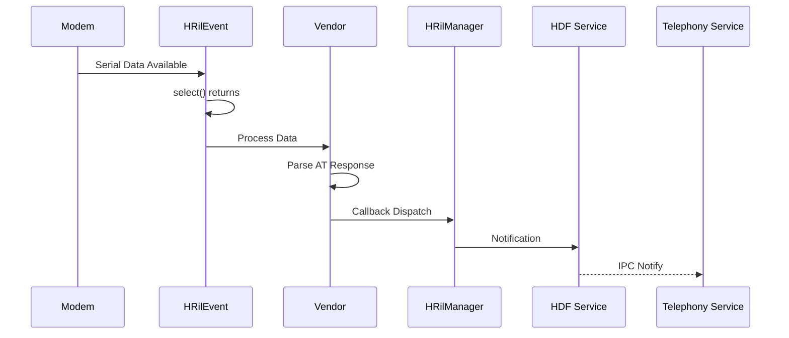

# 架构与数据流

> 理解 RIL Adapter 的模块划分、数据流动和线程模型

## 1. 组件架构

### 1.1 总体架构图



### 1.2 模块职责

| 模块 | 职责 | 代码位置 |
|------|------|----------|
| **HDF Service** | HDF 服务注册、IPC 消息转发 | `services/hril_hdf/` |
| **HRIL Business** | 请求路由、业务逻辑处理、回调分发 | `services/hril/` |
| **Vendor Abstraction** | 厂商库加载、AT 命令封装 | `services/vendor/` |
| **Interfaces** | 接口定义、类型定义、错误码 | `interfaces/innerkits/` |

### 1.3 类继承体系

```
IHRilReporter (接口 - IHRilReporter.h)
    └── HRilManager : public IHRilReporter
        ├── vector<unique_ptr<HRilCall>>     # 语音通话 (45KB)
        ├── vector<unique_ptr<HRilData>>     # 数据连接 (35KB)
        ├── vector<unique_ptr<HRilModem>>    # Modem控制 (17KB)
        ├── vector<unique_ptr<HRilNetwork>>  # 网络注册 (79KB)
        ├── vector<unique_ptr<HRilSim>>       # SIM卡管理 (44KB)
        └── vector<unique_ptr<HRilSms>>       # 短信服务 (41KB)

HRilBase (基类 - hril_base.h)
    ├── HRilCall : public HRilBase
    ├── HRilData : public HRilBase
    ├── HRilModem : public HRilBase
    ├── HRilNetwork : public HRilBase
    ├── HRilSim : public HRilBase
    └── HRilSms : public HRilBase
```

> **证据**：`services/hril/include/` 头文件列表

## 2. 数据流图

### 2.1 请求处理流程（同步）



### 2.2 事件通知流程（异步）



### 2.3 关键数据路径

| 路径 | 描述 | 关键代码 |
|------|------|----------|
| **请求路由** | 上层请求 → 模块分发 | `hril_manager.cpp` |
| **响应处理** | Vendor 响应 → 回调上层 | `hril_base.cpp` Response() |
| **事件通知** | 异步事件 → 通知上层 | `hril_base.cpp` Notify() |

## 3. 线程模型

### 3.1 线程划分



### 3.2 线程职责

| 线程 | 职责 | 实现代码 |
|------|------|----------|
| **主线程** | 服务初始化、请求处理协调 | `HRilManager` |
| **事件循环线程** | 监听 AT 端口事件、select() 循环 | `HRilEvent::Run()` |
| **IPC 回调线程** | HDF 回调分发 | HDF Framework |

### 3.3 事件循环实现

**文件**：`services/hril/src/hril_event.cpp`

```cpp
// select()-based 事件循环
HRilEvent::Run() {
    while (!stopRequested_) {
        fd_set readfds;
        struct timeval timeout;
        timeout.tv_sec = TIMEOUT_SEC;
        timeout.tv_usec = 0;

        int maxFd = GetMaxFd();
        int ready = select(maxFd + 1, &readfds, nullptr, nullptr, &timeout);
        if (ready > 0) {
            // 处理就绪的文件描述符
            ProcessReadyFds(readfds);
        }
    }
}
```

### 3.4 定时器机制

**文件**：`services/hril/src/hril_timer_callback.cpp`

```cpp
// 定时器回调管理
class HRilTimerCallback {
    void SetTimer(int32_t timerId, uint64_t interval, TimerCallbackFunc callback);
    void CancelTimer(int32_t timerId);
};
```

## 4. 线程安全机制

### 4.1 互斥锁保护

**证据来源**：`hril_base.cpp`, `hril_manager.cpp`

```cpp
// 回调访问的互斥保护
std::mutex mutex_;
sptr<HDI::Ril::V1_5::IRilCallback> GetRilCallback() {
    std::lock_guard<std::mutex> mutexLock(mutex_);
    return callback_;
}

// 请求列表保护
std::mutex requestListLock_;
```

### 4.2 Running Lock

**功能**：防止关键操作期间系统休眠

```cpp
// 防止休眠的运行锁
std::atomic_uint runningLockCount_ = 0;

void HRilManager::ApplyRunningLock() {
    runningLockCount_++;
    // 调用系统 API 防止休眠
}

void HRilManager::ReleaseRunningLock() {
    if (runningLockCount_ > 0) {
        runningLockCount_--;
    }
}
```

## 5. 初始化流程



**关键初始化代码**：

```cpp
// services/hril_hdf/src/hril_hdf.c
HRilInit() {
    HRilManager::GetInstance();
    InitRilAdapter();
    HRilRegOps();
}

// 设置回调
void SetHrilReporter(const HRilReporter *reporter) {
    // 配置上报回调
}
```

## 6. 关键时序图

### 6.1 电话拨打流程



### 6.2 Modem 事件处理



## 7. 错误处理机制

### 7.1 错误码定义

**文件**：`interfaces/innerkits/include/hril_enum.h`

```cpp
typedef enum {
    HRIL_ERR_NULL_POINT = -1,        // 空指针
    HRIL_ERR_SUCCESS = 0,           // 成功
    HRIL_ERR_GENERIC_FAILURE,        // 通用失败
    HRIL_ERR_INVALID_PARAMETER,     // 无效参数
    HRIL_ERR_MEMORY_FULL,           // 内存不足
    HRIL_ERR_CMD_SEND_FAILURE,      // 命令发送失败
    HRIL_ERR_CMD_NO_CARRIER,        // 无载波
    HRIL_ERR_INVALID_RESPONSE,      // 无效响应
    HRIL_ERR_REPEAT_STATUS,         // 重复状态
    HRIL_ERR_HDF_IPC_FAILURE = 65535, // HDF IPC 失败
} HRilErrNumber;
```

### 7.2 错误处理策略

| 错误类型 | 处理方式 | 示例 |
|----------|----------|------|
| **参数错误** | 返回错误码，不执行操作 | `HRIL_ERR_INVALID_PARAMETER` |
| **IPC 失败** | 重试机制 + 上报错误 | `HRIL_ERR_HDF_IPC_FAILURE` |
| **Vendor 失败** | 透传错误码 | `HRIL_ERR_GENERIC_FAILURE` |

## 8. 小结

RIL Adapter 的架构设计特点：

1. **分层清晰**：HDF Service → HRIL Business → Vendor 三层架构
2. **模块化设计**：6 个业务模块独立处理各自领域
3. **事件驱动**：基于 select() 的事件循环处理异步 Modem 事件
4. **线程安全**：互斥锁保护关键资源
5. **统一接口**：通过 HDF 提供标准化的 HDI 接口

---

**相关文档**：
- [项目概览](01_Overview.md) - 项目定位
- [代码地图](03_CodeMap.md) - 文件定位
- [攻击面分析](05_AttackSurface.md) - 安全视角
- [安全风险评估](06_SecurityReview.md) - 深度安全分析
