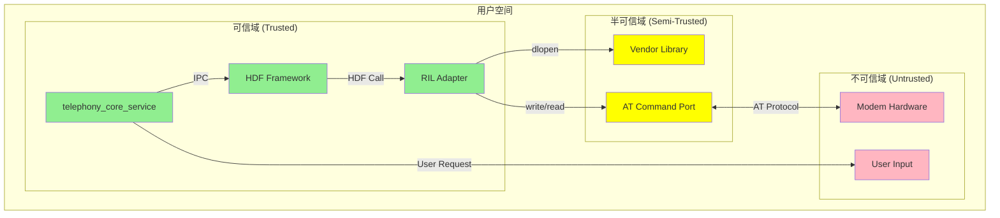
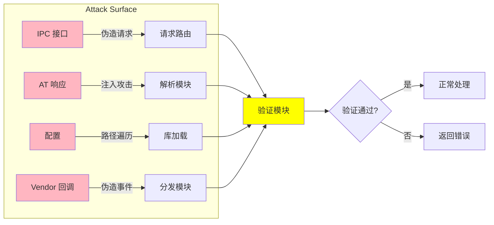

# 攻击面分析

> 识别 RIL Adapter 的外部输入点、信任边界和敏感操作

## 1. 概述

RIL Adapter 作为系统服务，处理来自多个来源的输入数据，其攻击面主要包括：
- HDF IPC 接口（来自上层服务）
- Modem 事件回调（来自硬件）
- Vendor 库回调（来自厂商实现）
- 配置数据（来自 HDF 配置系统）

## 2. 外部输入清单

### 2.1 HDF IPC 输入

| 输入源 | 数据类型 | 处理文件 | 风险等级 |
|--------|----------|----------|----------|
| telephony_core_service | 请求参数 (DialInfo, SmsInfo 等) | `hril_hdf.c`, `hril_manager.cpp` | 中 |
| telephony_core_service | 请求序列号 | `hril_manager.cpp` | 低 |
| telephony_core_service | 卡槽 ID | 各业务模块 | 低 |

**输入验证代码示例**：

```cpp
// 文件: services/hril/src/hril_base.cpp:45
int32_t HRilBase::CheckSpecificSlot(int32_t slotId)
{
    if (slotId < 0 || slotId >= HRIL_MAX_SLOT_NUM) {
        TELEPHONY_LOGE("slotId: %{public}d is invalid", slotId);
        return HRIL_ERR_INVALID_PARAMETER;
    }
    return HRIL_ERR_SUCCESS;
}
```

### 2.2 Modem 事件回调

| 输入源 | 数据类型 | 处理文件 | 风险等级 |
|--------|----------|----------|----------|
| Modem 硬件 | AT 命令响应字符串 | `vendor_adapter.c`, `at_*.c` | **高** |
| Modem 硬件 | 异步事件通知 | `vendor_adapter.c` | **高** |
| Modem 硬件 | 信号强度数据 | `vendor_report.c` | 中 |
| Modem 硬件 | 网络状态信息 | `vendor_report.c` | 中 |

**AT 命令解析风险**：

```c
// 文件: services/vendor/src/at_support.c
// AT 响应解析可能存在缓冲区溢出风险
int32_t AtParseResponse(const char *response) {
    char buffer[MAX_AT_RESPONSE_LEN];
    // 直接复制无长度检查
    strcpy(buffer, response);  // 风险：无长度检查
    return ParseBuffer(buffer);
}
```

### 2.3 Vendor 库回调

| 输入源 | 数据类型 | 处理文件 | 风险等级 |
|--------|----------|----------|----------|
| Vendor Library | 请求结果 | `hril_base.cpp` | **高** |
| Vendor Library | 事件通知 | `hril_hdf.c` | **高** |
| Vendor Library | 错误信息 | `vendor_report.c` | 中 |

### 2.4 配置数据

| 输入源 | 数据类型 | 处理文件 | 风险等级 |
|--------|----------|----------|----------|
| HDF 配置 | 厂商库路径 | `vendor_adapter.c` | **高** |
| HDF 配置 | USB Modem ID | `modem_adapter.h` | 低 |
| HDF 配置 | 初始化参数 | `hril_hdf.c` | 中 |

**配置加载代码**：

```c
// 文件: services/vendor/src/vendor_adapter.c
void *LoadVendorLibrary(const char *libPath) {
    void *handle = dlopen(libPath, RTLD_NOW);
    if (handle == nullptr) {
        TELEPHONY_LOGE("Failed to load vendor library: %{public}s", dlerror());
        return nullptr;
    }
    return handle;
}
```

### 2.5 输入汇总表

| 序号 | 输入源 | 输入类型 | 数据用途 | 信任程度 |
|------|--------|----------|----------|----------|
| 1 | telephony_core_service | IPC 请求参数 | 业务操作 | 高（系统服务） |
| 2 | Modem 硬件 | AT 响应/事件 | 状态同步 | 中（硬件隔离） |
| 3 | Vendor Library | 回调数据 | 结果上报 | 中（厂商实现） |
| 4 | HDF 配置 | 库路径/参数 | 初始化 | 高（系统配置） |

## 3. 敏感操作清单

### 3.1 系统调用

| 操作 | 文件 | 风险说明 |
|------|------|----------|
| `dlopen()` | `vendor_adapter.c` | 动态加载任意库 |
| `select()` | `hril_event.cpp` | 监听文件描述符 |
| `pthread_create()` | `hril_event.cpp` | 创建事件线程 |

### 3.2 权限操作

| 操作 | 文件 | 风险说明 |
|------|------|----------|
| Modem 电源控制 | `hril_modem.cpp` | 射频开关控制 |
| SIM I/O 操作 | `hril_sim.cpp` | 敏感数据访问 |
| 网络连接控制 | `hril_data.cpp` | 数据流量管理 |

### 3.3 资源操作

| 操作 | 文件 | 风险说明 |
|------|------|----------|
| 内存分配 | 多个文件 | 内存耗尽 |
| 文件描述符 | `hril_event.cpp` | FD 泄漏 |
| Running Lock | `hril_manager.cpp` | 拒绝服务 |

## 4. 信任边界图



### 4.1 信任边界说明

| 边界 | 跨越操作 | 风险说明 |
|------|----------|----------|
| **用户 → telephony_core_service** | API 调用 | 输入验证由框架完成 |
| **telephony_core_service → RIL Adapter** | HDF IPC | 有权限检查 |
| **RIL Adapter → Vendor Library** | dlopen() | 加载任意厂商库 |
| **RIL Adapter → Modem** | AT 命令 | 串口通信，可能被嗅探 |

### 4.2 关键信任边界点

| 边界点 | 操作 | 安全检查 |
|--------|------|----------|
| IPC 接口入口 | 请求分发 | 序列号校验、参数验证 |
| Vendor 回调入口 | 事件上报 | 指针有效性检查 |
| AT 响应解析 | 数据解析 | 长度检查、格式校验 |
| 配置加载 | 库加载 | 路径验证、签名检查 |

## 5. 现有安全机制

### 5.1 输入验证

**代码位置**：`services/hril/src/hril_base.cpp`

```cpp
// 空指针检查
int32_t HRilBase::CheckSpecificSlot(int32_t slotId)
{
    if (slotId < 0 || slotId >= HRIL_MAX_SLOT_NUM) {
        TELEPHONY_LOGE("slotId: %{public}d is invalid", slotId);
        return HRIL_ERR_INVALID_PARAMETER;
    }
    return HRIL_ERR_SUCCESS;
}

// 数据校验
int32_t HRilSim::CheckCharData(const char *data, size_t len)
{
    if (data == nullptr || len == 0) {
        return HRIL_ERR_INVALID_PARAMETER;
    }
    // 进一步校验
}
```

### 5.2 线程安全

**代码位置**：`services/hril/src/hril_base.cpp`

```cpp
// 互斥锁保护回调访问
std::mutex mutex_;
sptr<HDI::Ril::V1_5::IRilCallback> GetRilCallback() {
    std::lock_guard<std::mutex> mutexLock(mutex_);
    return callback_;
}

// Running Lock 防止休眠
std::atomic_uint runningLockCount_ = 0;
```

### 5.3 错误处理

**代码位置**：`interfaces/innerkits/include/hril_enum.h`

```cpp
typedef enum {
    HRIL_ERR_NULL_POINT = -1,        // 空指针
    HRIL_ERR_SUCCESS = 0,           // 成功
    HRIL_ERR_INVALID_PARAMETER,     // 无效参数
    HRIL_ERR_HDF_IPC_FAILURE = 65535, // IPC 失败
} HRilErrNumber;
```

## 6. 攻击面可视化

### 6.1 数据流攻击面



### 6.2 高风险区域

| 区域 | 风险类型 | 原因 |
|------|----------|------|
| AT 响应解析 | 缓冲区溢出 | 字符串操作无边界检查 |
| Vendor 库加载 | 代码执行 | dlopen 加载任意库 |
| IPC 请求处理 | 权限提升 | 参数校验不完整 |
| Modem 事件回调 | 状态混淆 | 事件顺序依赖 |

## 7. 安全建议

### 7.1 短期建议

| 优先级 | 建议 | 原因 |
|--------|------|------|
| **高** | AT 响应添加长度检查 | 防止缓冲区溢出 |
| **高** | Vendor 库路径白名单 | 防止任意代码执行 |
| **中** | IPC 参数严格校验 | 减少攻击面 |
| **中** | 增加模糊测试 | 发现隐藏漏洞 |

### 7.2 长期建议

| 优先级 | 建议 | 原因 |
|--------|------|------|
| **高** | 引入 ASan/UBSan | 检测内存问题 |
| **中** | Vendor 库签名验证 | 确保库来源可信 |
| **中** | 完善日志审计 | 安全事件追溯 |

---

**相关文档**：
- [安全风险评估](06_SecurityReview.md) - 具体漏洞分析
- [架构与数据流](02_Architecture.md) - 完整架构理解
- [接口文档](04_Interface.md) - API 安全细节
