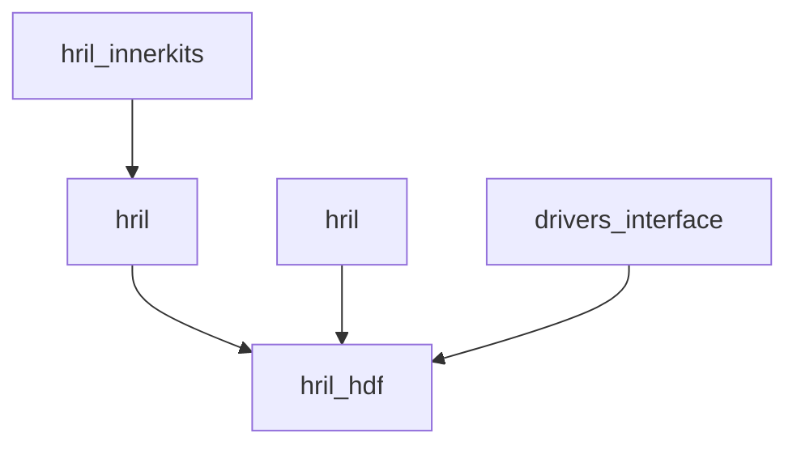

# 构建与产物

> RIL Adapter 的 GN 构建配置、编译产物和 Feature 开关

## 1. 构建系统

| 属性 | 值 |
|------|------|
| **构建系统** | GN (Generate Ninja) |
| **构建工具** | hb (OpenHarmony Build) |
| **编译工具链** | clang/LLVM |

## 2. 构建目标清单

### 2.1 目标总览

**证据来源**：`bundle.json:42-81`

| Target | 类型 | 依赖 | 产物 |
|--------|------|------|------|
| `//base/telephony/ril_adapter/interfaces/innerkits:hril_innerkits` | 静态库 | - | `libhril_innerkits.a` |
| `//base/telephony/ril_adapter/services/hril:hril` | 静态库 | hril_innerkits | `libhril.a` |
| `//base/telephony/ril_adapter/services/hril_hdf:hril_hdf` | 静态库 | hril, drivers_interface | `libhril_hdf.a` |
| `//base/telephony/ril_adapter/services/vendor:ril_vendor` | 静态库 | - | `libril_vendor.a` |

### 2.2 依赖关系



### 2.3 产物说明

| 产物 | 大小 | 说明 |
|------|------|------|
| `libhril_innerkits.a` | ~100KB | 接口定义、类型定义 |
| `libhril.a` | ~400KB | HRIL 业务逻辑 |
| `libhril_hdf.a` | ~50KB | HDF 服务适配 |
| `libril_vendor.a` | ~150KB | Vendor AT 命令层 |

## 3. 构建配置详情

### 3.1 interfaces/innerkits/BUILD.gn

```gn
# 头文件导出
headers = [
  "include/",
  "//base/telephony/ril_adapter/interfaces/innerkits/include",
]

# 静态库目标
static_library("hril_innerkits") {
  sources = [
    "include/hril.h",
    "include/hril_enum.h",
    "include/hril_types.h",
    "include/hril_request.h",
    "include/hril_notification.h",
    "include/hril_public_struct.h",
    "include/hril_vendor_call_defs.h",
    "include/hril_vendor_data_defs.h",
    "include/hril_vendor_modem_defs.h",
    "include/hril_vendor_network_defs.h",
    "include/hril_vendor_sim_defs.h",
    "include/hril_vendor_sms_defs.h",
  ]

  include_dirs = [
    "//base/telephony/ril_adapter/interfaces/innerkits/include",
  ]

  deps = []
}
```

### 3.2 services/hril/BUILD.gn

```gn
static_library("hril") {
  sources = [
    "src/hril_base.cpp",
    "src/hril_manager.cpp",
    "src/hril_call.cpp",
    "src/hril_data.cpp",
    "src/hril_modem.cpp",
    "src/hril_network.cpp",
    "src/hril_sim.cpp",
    "src/hril_sms.cpp",
    "src/hril_event.cpp",
    "src/hril_timer_callback.cpp",
  ]

  include_dirs = [
    "include/",
  ]

  deps = [
    "//base/telephony/ril_adapter/interfaces/innerkits:hril_innerkits",
    "//foundation/systemability para/samgr/frameworks/samgr_lite:samgr",
    "//kernel/linux/linux_5.10/frameworks/ability_runtime/ability_info:ability_info",
  ]

  cflags = [
    "-Wall",
    "-Wextra",
    "-Werror",
  ]
}
```

### 3.3 services/hril_hdf/BUILD.gn

```gn
static_library("hril_hdf") {
  sources = [
    "src/hril_hdf.c",
  ]

  include_dirs = [
    "include/",
  ]

  deps = [
    ":hril_hdf_headers",
    "//base/telephony/ril_adapter/services/hril:hril",
    "//drivers/interface/ril/v1_5:hdi_ril_stub",
  ]

  defines = [
    "RIL_ADAPTER_IMPL",
  ]
}
```

### 3.4 services/vendor/BUILD.gn

```gn
static_library("ril_vendor") {
  sources = [
    "src/vendor_adapter.c",
    "src/vendor_channel.c",
    "src/vendor_report.c",
    "src/vendor_util.c",
    "src/at_call.c",
    "src/at_data.c",
    "src/at_modem.c",
    "src/at_network.c",
    "src/at_sim.c",
    "src/at_sms.c",
    "src/at_support.c",
  ]

  include_dirs = [
    "include/",
  ]

  deps = [
    "//base/telephony/ril_adapter/utils/native:telephony_log",
  ]

  # C 语言编译
  cflags = [
    "-Wall",
    "-Wextra",
  ]
}
```

## 4. Feature 开关

### 4.1 编译宏定义

| 宏 | 定义位置 | 用途 |
|----|----------|------|
| `RIL_ADAPTER_IMPL` | `hril_hdf/BUILD.gn` | 标记 HDF 实现 |
| `RIL_LOG_ENABLED` | 未定义 | 日志开关 (可配置) |

### 4.2 条件编译

```cpp
#ifdef RIL_ADAPTER_IMPL
// HDF 实现代码
void HRilInit() {
    // ...
}
#endif
```

## 5. 依赖组件

### 5.1 系统依赖

**证据来源**：`bundle.json:29-39`

| 组件 | 用途 | 必需 |
|------|------|------|
| `bounds_checking_function` | 安全字符串函数 | 是 |
| `c_utils` | C 工具库 | 是 |
| `drivers_interface_power` | 电源管理接口 | 是 |
| `drivers_interface_ril` | RIL HDI 接口 | 是 |
| `hdf_core` | HDF 核心框架 | 是 |
| `hilog` | 日志系统 | 是 |
| `init` | 初始化框架 | 是 |
| `ipc` | IPC 机制 | 是 |
| `samgr` | 服务管理 | 是 |

### 5.2 内部依赖

| 依赖 | 类型 | 说明 |
|------|------|------|
| `hril_innerkits` | 内部接口 | 所有模块依赖 |
| `telephony_log` | 日志工具 | Vendor 层依赖 |

## 6. 编译产物安装路径

### 6.1 系统镜像位置

| 产物 | 目标路径 | 说明 |
|------|----------|------|
| 静态库 | `out/.../obj/base/telephony/ril_adapter/` | 编译中间产物 |
| 符号表 | `out/.../.svd/` | 调试符号 |
| 头文件 | `prebuilts/.../include/` | SDK 头文件 |

### 6.2 运行时加载

```
# Vendor 库加载路径 (可配置)
/system/lib/vendor/ril/
/vendor/lib/
```

## 7. 构建命令

### 7.1 全量构建

```bash
# 使用 hb 构建整个 telephony 子系统
hb build -p telephony_ril_adapter

# 或指定单个目标
hb build -p //base/telephony/ril_adapter/services/hril:hril
```

### 7.2 增量构建

```bash
# 修改后增量编译
hb build -p telephony_ril_adapter -T
```

### 7.3 清理构建

```bash
# 清理并重新构建
hb build -p telephony_ril_adapter -c
```

## 8. 构建产物验证

### 8.1 检查静态库

```bash
# 查看库信息
nm -C libhril.a | grep HRilManager
ar -t libhril.a

# 查看符号表
readelf -s libhril.a
```

### 8.2 静态分析

```bash
# 使用 clang-analyzer
scan-build --use-analyzer=clang make

# 使用 cppcheck
cppcheck --enable=all --force services/hril/
```

## 9. 资源占用

### 9.1 编译资源

| 指标 | 值 |
|------|-----|
| **编译时间** | ~2-5 分钟 (增量) |
| **内存占用** | ~2-4 GB |
| **磁盘占用** | ~50 MB |

### 9.2 运行时资源

| 指标 | 值 |
|------|-----|
| **ROM** | ~700KB |
| **RAM** | ~1MB |
| **线程数** | 2-3 (主线程 + 事件线程) |

---

**相关文档**：
- [架构与数据流](02_Architecture.md) - 理解架构
- [代码地图](03_CodeMap.md) - 定位源文件
