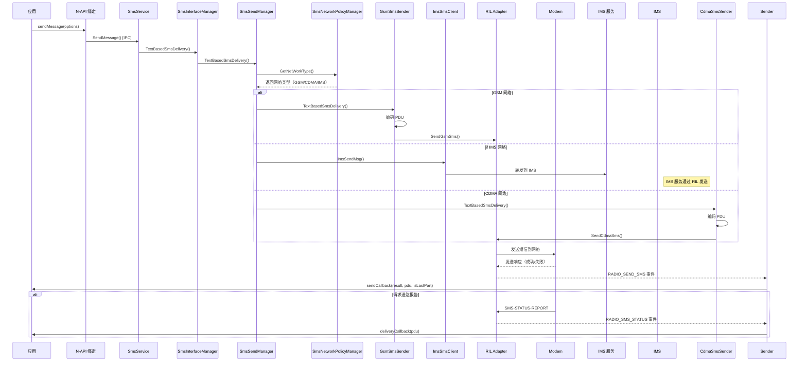
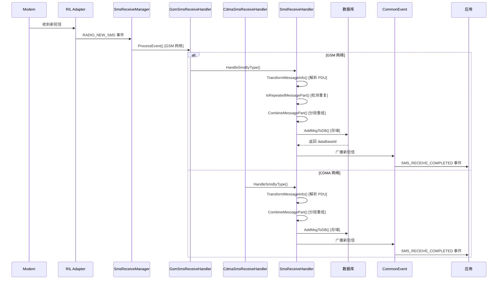

# 架构说明

## 目的

本文档详细说明短彩信模块的架构设计，包括组件图、数据流、线程模型和关键时序，帮助架构师和高级开发者理解系统内部工作机制。

## 适用范围

本文档覆盖：
- 核心组件职责和交互关系
- 发送/接收短信的数据流
- 线程模型和事件处理机制
- 关键时序图（发送/接收/MMS）

不包含：
- 具体实现细节（见目录结构文档）
- API 使用方法（见 N-API 接口文档）

## 架构概览

### 分层架构

短彩信模块采用典型的分层架构设计：

```
┌─────────────────────────────────────────────────────────────────┐
│                  应用层 (Application Layer)          │
│  - JS/ArkTS/Cangjie Apps                           │
└─────────────────────────────────────────────────────────────────┘
                              │
                              ▼
┌─────────────────────────────────────────────────────────────────┐
│                  N-API 绑定层 (Binding Layer)        │
│  - frameworks/js/napi/                              │
│  - frameworks/ets/taihe/                             │
│  - frameworks/cj/                                   │
└─────────────────────────────────────────────────────────────────┘
                              │
                              ▼
┌─────────────────────────────────────────────────────────────────┐
│              IPC 通信层 (IPC Layer)                   │
│  - interfaces/innerkits/                             │
│  - SmsServiceProxy / SmsInterfaceStub               │
└─────────────────────────────────────────────────────────────────┘
                              │
                              ▼
┌─────────────────────────────────────────────────────────────────┐
│             服务管理层 (Service Manager Layer)          │
│  - SmsInterfaceManager                                │
│  - SmsSendManager / SmsReceiveManager             │
│  - SmsMiscManager / SmsNetworkPolicyManager         │
└─────────────────────────────────────────────────────────────────┘
                              │
                              ▼
┌─────────────────────────────────────────────────────────────────┐
│            协议处理层 (Protocol Layer)               │
│  - GsmSmsSender / GsmSmsReceiveHandler          │
│  - CdmaSmsSender / CdmaSmsReceiveHandler        │
│  - SmsWapPushHandler / GsmSmsCbHandler          │
│  - ImsSmsClient / SatelliteSmsClient            │
└─────────────────────────────────────────────────────────────────┘
                              │
                              ▼
┌─────────────────────────────────────────────────────────────────┐
│           数据库/存储层 (Data Layer)                   │
│  - 数据共享 (data_share)                             │
│  - SIM 卡存储                                        │
└─────────────────────────────────────────────────────────────────┘
                              │
                              ▼
┌─────────────────────────────────────────────────────────────────┐
│            硬件抽象层 (HAL Layer)                    │
│  - RIL Adapter (core_service)                     │
│  - Modem                                             │
└─────────────────────────────────────────────────────────────────┘
```

## 核心组件详解

### 1. SmsService - 系统能力入口

**文件位置**: `services/sms/sms_service.h:30`

**职责**：
- 作为 SystemAbility (SA 4008) 的实现类
- 服务生命周期管理（OnStart/OnStop）
- 等待 core_service 初始化完成
- 创建并发布 SmsInterfaceStub

**关键方法**：

```cpp
class SmsService : public SystemAbility, public SmsInterfaceStub {
public:
    static const int32_t TELEPHONY_SMS_MMS_SYS_ABILITY_ID = 4008;

    // SA 生命周期
    void OnStart() override;  // 启动服务
    void OnStop() override;   // 停止服务

    // 等待核心服务
    void WaitCoreServiceToInit();

    // 短信发送（通过 SmsInterfaceManager）
    int32_t SendMessage(const std::string &desAddr, const std::string &scAddr,
                     const std::string &text, const sptr<ISendShortMessageCallback> &sendCallback,
                     const sptr<IDeliveryShortMessageCallback> &deliveryCallback);

    // SIM 卡操作（通过 SmsMiscManager）
    int32_t AddSimMessage(const std::u16string &desAddr, ...);
    int32_t DelSimMessage(const int32_t index, ...);
    int32_t UpdateSimMessage(...);
    int32_t GetAllSimMessages(...);

    // 配置操作（通过 SmsMiscManager）
    int32_t SetSmscAddr(const int32_t slotId, const std::string &scAddr);
    int32_t GetSmscAddr(const int32_t slotId, std::string &scAddr);
};
```

### 2. SmsInterfaceManager - 接口管理器

**文件位置**: `services/sms/sms_interface_manager.h:36`

**职责**：
- 持有每个卡槽的管理器实例
- 分发 IPC 请求到对应管理器
- 管理器生命周期（创建/销毁）

**数据结构**：

```cpp
class SmsInterfaceManager {
private:
    int32_t slotId_;  // 卡槽 ID

    // 管理器实例
    std::unique_ptr<SmsSendManager> smsSendManager_;
    std::unique_ptr<SmsReceiveManager> smsReceiveManager_;
    std::shared_ptr<SmsMiscManager> smsMiscManager_;

    // MMS 管理器（可选特性）
    std::unique_ptr<MmsSendManager> mmsSendManager_;
    std::unique_ptr<MmsReceiveManager> mmsReceiverManager_;
};
```

### 3. SmsSendManager - 发送管理器

**文件位置**: `services/sms/sms_send_manager.h:31`

**职责**：
- 根据网络制式（GSM/CDMA/IMS）路由发送请求
- 管理发送重试机制
- 注册网络状态回调

**关键方法**：

```cpp
class SmsSendManager {
public:
    // 文本短信发送
    void TextBasedSmsDelivery(const std::string &desAddr, const std::string &scAddr,
                           const std::string &text, const sptr<...> &sendCallback,
                           const sptr<...> &deliveryCallback, int32_t slotId);

    // 数据短信发送
    void DataBasedSmsDelivery(const std::string &desAddr, const std::string &scAddr,
                          const std::vector<uint8_t> &data, int16_t destPort,
                          const sptr<...> &sendCallback, int32_t slotId);

    // 重试发送（网络切换后）
    void RetriedSmsDelivery(std::shared_ptr<SmsSendIndexer> &smsIndexer);

private:
    // 网络制式发送器
    std::shared_ptr<SmsSender> gsmSmsSender_;
    std::shared_ptr<SmsSender> cdmaSmsSender_;

    // 网络策略管理器
    std::shared_ptr<SmsNetworkPolicyManager> networkManager_;

    // 短信码匹配器
    std::shared_ptr<SmsShortCodeMatcher> smsShortCodeMatcher_;
};
```

### 4. SmsReceiveManager - 接收管理器

**文件位置**: `services/sms/sms_receive_manager.h:28`

**职责**：
- 监听 RIL 新短信事件
- 创建 GSM/CDMA 接收处理器
- 分发接收的短信到对应处理器
- 管理分段短信重组

**关键方法**：

```cpp
class SmsReceiveManager : public TelEventHandler {
public:
    void Init(int32_t slotId);  // 初始化处理器

    // 设置 CDMA 发送器（用于 ACK 回复）
    void SetCdmaSender(std::shared_ptr<SmsSender> sender);

private:
    // 接收处理器
    std::shared_ptr<SmsReceiveHandler> gsmSmsReceiveHandler_;
    std::shared_ptr<SmsReceiveHandler> cdmaSmsReceiveHandler_;

    // 卡槽 ID
    int32_t slotId_;
};
```

### 5. SmsSender - 发送器基类

**文件位置**: `services/sms/sms_sender.h:40`

**职责**：
- 定义发送器接口
- 处理 RIL 响应事件
- 调用发送/送达回调

**关键接口**：

```cpp
class SmsSender : public TelEventHandler {
public:
    // 纯虚接口，由子类实现
    virtual void TextBasedSmsDelivery(...) = 0;
    virtual void DataBasedSmsDelivery(...) = 0;
    virtual void SendSmsToRil(...) = 0;

    // 发送结果回调
    virtual void SendResultCallBack(const sptr<ISendShortMessageCallback> &callback,
                              ISendShortMessageCallback::SendSmsResult result,
                              const std::string &pdu, bool isLastPart);

    // 事件处理（来自 RIL）
    void ProcessEvent(const AppExecFwk::InnerEvent::Pointer &event) override;
    void HandleMessageResponse(const TelEventState &state);
};
```

## 发送短信数据流

### 流程图



### 关键调用链

**文件位置**: `services/sms/sms_send_manager.cpp`

```
SmsInterfaceManager::TextBasedSmsDelivery()
  ↓
SmsSendManager::TextBasedSmsDelivery()
  ↓
SmsNetworkPolicyManager::GetNetWorkType()
  ↓
├─► GSM 网络
│     ↓
│   GsmSmsSender::TextBasedSmsDelivery()
│     ↓
│   GsmSmsSender::EncodeTextSms() [services/sms/gsm/gsm_sms_message.cpp]
│     ↓
│   GsmSmsSender::SendCsSms()
│     ↓
│   RIL Adapter: SendGsmSms()
│
└─► IMS 网络
      ↓
      ImsSmsClient::ImsSendMsg() [services/sms/ims_service_interaction/src/ims_sms_client.cpp]
        ↓
        ImsSmsProxy::SendImsSms() [转发到 IMS 服务]
```

## 接收短信数据流

### 流程图



### 关键调用链

**文件位置**: `services/sms/sms_receive_handler.cpp`

```
SmsReceiveManager::ProcessEvent()
  ↓
GsmSmsReceiveHandler::ProcessEvent() [或 CdmaSmsReceiveHandler]
  ↓
GsmSmsReceiveHandler::HandleSmsByType()
  ↓
SmsBaseMessage::GetMessageContent() [解析 PDU]
  ↓
SmsReceiveHandler::CombineMessagePart()
  ├─► 已存在分段 → 重组
  │   ↓
  │   SmsReceiveHandler::BuildConcatenatedSms()
  └─► 新短信 → 直接存储
      ↓
      SmsReceiveHandler::AddMsgToDB()
        ↓
        DataShare: InsertSMS()
          ↓
        CommonEvent: PublishCommonEvent()
```

## 线程模型

### 事件驱动架构

短彩信模块采用事件驱动架构，所有组件都继承自 `TelEventHandler`。

**基类位置**: `services/sms/sms_sender.h:40` / `services/sms/sms_receive_handler.h:39`

**事件处理流程**：

```cpp
class TelEventHandler {
public:
    virtual void ProcessEvent(const AppExecFwk::InnerEvent::Pointer &event) = 0;

    // RIL 事件类型（RadioEvent）
    enum {
        RADIO_SEND_SMS = 1,
        RADIO_SMS_STATUS = 2,
        RADIO_NEW_SMS = 3,
        RADIO_GET_IMS_SMS = 4,
        // ... 更多事件
    };
};
```

### 线程划分

| 组件 | 线程模型 | 说明 |
|------|---------|------|
| **SmsService** | 主线程（SA 线程） | SystemAbility 运行线程 |
| **SmsInterfaceStub** | 主线程 | IPC 调度在 SA 网程中 |
| **N-API 绑定** | 工作线程池 | 使用 napi_threadsafe_function |
| **RIL 事件处理** | Handler 线程 | 每个 Handler 有独立线程 |
| **异步操作** | 线程池 | 数据库、网络操作 |

### 同步机制

**保护变量**: `mutex_`, `condVar_` 用于线程同步。

**证据**: `services/sms/sms_misc_manager.h:50-60` 定义同步原语。

## MMS 架构（可选特性）

### MMS 组件图

```
┌─────────────────────────────────────────────────────────┐
│           MmsSendManager                          │
│  services/mms/mms_send_manager.cpp               │
└─────────────────────────────────────────────────────────┘
                    │
                    ▼
        ┌───────────────┴───────────────┐
        ▼                               ▼
┌───────────────┐         ┌───────────────┐
│  MmsSender    │         │MmsNetworkClient │
└───────┬───────┘         └───────────────┘
        │
        ▼
┌───────────────┐
│  HTTP Client │
└───────┬───────┘
        │
        ▼
┌───────────────┐
│   MMSC       │
└───────────────┘
```

### MMS 发送流程

1. App → `NapiSendRecvMms::SendMms()` [N-API]
2. N-API → `SmsService::SendMms()` [IPC]
3. Service → `MmsSendManager::SendMms()`
4. SendMgr → `MmsSender::SendMms()`
5. Sender → `MmsNetworkClient::SendData()` [HTTP POST]
6. NetworkClient → MMSC（彩信中心）
7. MMSC → 接收方手机

## 网络策略管理

### SmsNetworkPolicyManager

**文件位置**: `services/sms/sms_network_policy_manager.h:34`

**职责**：
- 检测网络类型（GSM/CDMA/IMS）
- 监听 IMS 注册状态
- 跟踪语音服务状态
- 注册网络状态回调给发送器

**关键方法**：

```cpp
class SmsNetworkPolicyManager : public TelEventHandler {
public:
    NetWorkType GetNetWorkType();
    bool IsImsNetDomain();
    void NetworkRegister(std::function<void(bool, int32_t)> callback);

private:
    std::map<std::string, std::function<void(bool, int32_t)>> callbackMap_;
};
```

## 依赖关系总结

### 水平依赖

```
SmsInterfaceManager
  ├── SmsSendManager
  ├── SmsReceiveManager
  ├── SmsMiscManager
  ├── MmsSendManager (可选）
  └── MmsReceiveManager (可选）

SmsSendManager
  ├── SmsNetworkPolicyManager
  ├── GsmSmsSender
  ├── CdmaSmsSender
  └── ImsSmsClient (间接）
```

### 垂直依赖

```
应用层
  ↓
N-API 层
  ↓
IPC 层
  ↓
服务管理层
  ↓
协议处理层
  ↓
数据/存储层
  ↓
硬件抽象层 (RIL)
```

## 回调机制

### 发送回调

**接口定义**: `interfaces/innerkits/i_send_short_message_callback.h`

```cpp
interface ISendShortMessageCallback {
    void OnSmsSendResult(SendSmsResult result,
                      const std::string &pdu,
                      bool isLastPart);

    enum SendSmsResult {
        SEND_SMS_SUCCESS = 0,
        SEND_SMS_FAILURE_UNKNOWN = 1,
        SEND_SMS_FAILURE_RADIO_OFF = 2,
        SEND_SMS_FAILURE_SERVICE_UNAVAILABLE = 3,
    };
};
```

### 送达回调

**接口定义**: `interfaces/innerkits/i_delivery_short_message_callback.h`

```cpp
interface IDeliveryShortMessageCallback {
    void OnSmsDeliveryResult(const std::vector<uint8_t> &pdu);
};
```

## 相关跳转链接

- [目录结构](01_Directory_Structure.md) - 了解文件组织
- [内部 API](04_Internal_API.md) - 深入了解接口定义
- [N-API 接口](03_NAPI_Interface.md) - 学习如何调用这些组件
