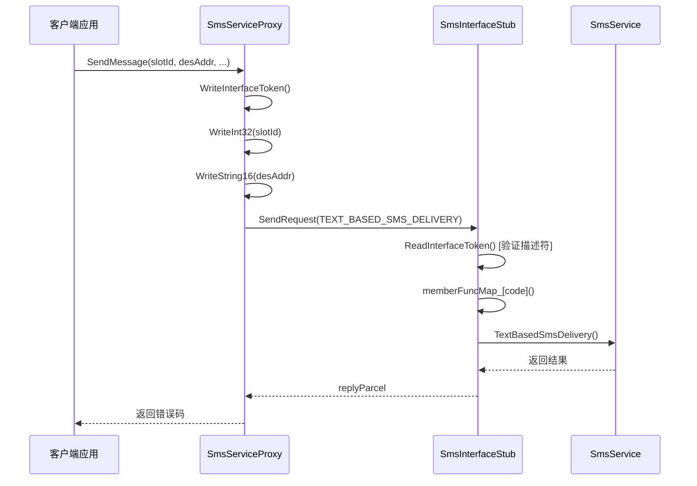

# 内部 API 文档

## 目的

本文档详细说明短彩信模块的内部 IPC 接口定义，包括服务接口、回调接口、IMS 接口和卫星短信接口，帮助系统开发者理解模块间通信契约。

## 适用范围

本文档覆盖：
- 主服务 IPC 接口 (ISmsServiceInterface)
- 回调 IPC 接口 (Send/Delivery)
- IMS SMS 接口
- IPC 接口码完整清单
- 接口参数和返回值定义

不包含：
- N-API JS 接口（见 03_NAPI_Interface.md）
- 具体实现逻辑（见 02_Architecture.md）

## IPC 架构概览

### 分层架构

```
┌─────────────────────────────────────────────────────────┐
│  应用层 (JS/ArkTS)                                      │
│  - @ohos.telephony.sms                                  │
└─────────────────────────────────────────────────────────┘
                           │
                           ▼
┌─────────────────────────────────────────────────────────┐
│  N-API 绑定层                                           │
│  - SmsServiceManagerClient                              │
│  - SmsServiceProxy                                      │
└─────────────────────────────────────────────────────────┘
                           │ IPC (Binder)
                           ▼
┌─────────────────────────────────────────────────────────┐
│  服务层 (SA 4008)                                       │
│  - SmsInterfaceStub                                     │
│  - SmsService                                           │
└─────────────────────────────────────────────────────────┘
```

### IPC 通信流程



## System Ability 信息

| 属性 | 值 |
|------|-----|
| **SA ID** | 4008 (TELEPHONY_SMS_MMS_SYS_ABILITY_ID) |
| **进程名** | telephony |
| **库文件** | libtel_sms_mms.z.so |
| **类名** | SmsService |
| **启动方式** | run-on-create: true (系统启动时自动启动) |
| **依赖 SA** | 4010 (core_service) |

**证据**: `services/sms/sms_service.h:35` 和 `sa_profile/4008.json`

```cpp
// services/sms/sms_service.h:35
static const int32_t TELEPHONY_SMS_MMS_SYS_ABILITY_ID = 4008;

// sa_profile/4008.json
{
    "name": 4008,
    "libpath": "libtel_sms_mms.z.so",
    "run-on-create": true,
    "depend": [4010],
    "depend_time_out": 60000
}
```

## 主服务接口 (ISmsServiceInterface)

### 接口定义

**文件**: `interfaces/innerkits/i_sms_service_interface.h`

```cpp
class ISmsServiceInterface : public IRemoteBroker {
public:
    DECLARE_INTERFACE_DESCRIPTOR(u"OHOS.Telephony.ISmsServiceInterface");
    
    // 短信发送
    virtual int32_t SendMessage(int32_t slotId, const std::u16string &desAddr,
        const std::u16string &scAddr, const std::u16string &text,
        const sptr<ISendShortMessageCallback> &sendCallback,
        const sptr<IDeliveryShortMessageCallback> &deliveryCallback, bool isMmsApp = false) = 0;
    
    // 数据短信发送
    virtual int32_t SendMessage(int32_t slotId, const std::u16string &desAddr,
        const std::u16string &scAddr, uint16_t port, const uint8_t *data,
        uint16_t dataLen, const sptr<ISendShortMessageCallback> &sendCallback,
        const sptr<IDeliveryShortMessageCallback> &deliveryCallback) = 0;
    
    // SIM 卡短信管理
    virtual int32_t AddSimMessage(int32_t slotId, const std::u16string &smsc,
        const std::u16string &pdu, SimMessageStatus status) = 0;
    virtual int32_t DelSimMessage(int32_t slotId, uint32_t msgIndex) = 0;
    virtual int32_t UpdateSimMessage(int32_t slotId, uint32_t msgIndex,
        SimMessageStatus newStatus, const std::u16string &pdu,
        const std::u16string &smsc) = 0;
    virtual int32_t GetAllSimMessages(int32_t slotId,
        std::vector<ShortMessage> &message) = 0;
    
    // SMSC 配置
    virtual int32_t SetSmscAddr(int32_t slotId, const std::u16string &scAddr) = 0;
    virtual int32_t GetSmscAddr(int32_t slotId, std::u16string &smscAddress) = 0;
    
    // 小区广播配置
    virtual int32_t SetCBConfig(int32_t slotId, bool enable, uint32_t fromMsgId,
        uint32_t toMsgId, uint8_t netType) = 0;
    
    // 默认卡槽配置
    virtual int32_t SetDefaultSmsSlotId(int32_t slotId) = 0;
    virtual int32_t GetDefaultSmsSlotId() = 0;
    
    // MMS 相关
    virtual int32_t SendMms(int32_t slotId, const std::u16string &mmsc,
        const std::u16string &data, const std::u16string &ua,
        const std::u16string &uaprof, int64_t &time, bool isMmsApp) = 0;
    virtual int32_t DownloadMms(int32_t slotId, const std::u16string &mmsc,
        std::u16string &data, const std::u16string &ua,
        const std::u16string &uaprof) = 0;
    
    // ... 其他方法
};
```

### IPC 接口码 (SmsServiceInterfaceCode)

**文件**: `interfaces/innerkits/sms_service_ipc_interface_code.h`

| Code | 名称 | 功能 | 权限要求 |
|------|------|------|----------|
| 0 | TEXT_BASED_SMS_DELIVERY | 发送文本短信 | SEND_MESSAGES |
| 1 | SEND_SMS_TEXT_WITHOUT_SAVE | 发送文本短信(不保存) | SEND_MESSAGES |
| 2 | DATA_BASED_SMS_DELIVERY | 发送数据短信 | SEND_MESSAGES |
| 3 | SET_SMSC_ADDRESS | 设置短信中心地址 | SET_TELEPHONY_STATE |
| 4 | GET_SMSC_ADDRESS | 获取短信中心地址 | GET_TELEPHONY_STATE |
| 5 | ADD_SIM_MESSAGE | 添加SIM卡短信 | SEND_MESSAGES + RECEIVE_MESSAGES |
| 6 | DEL_SIM_MESSAGE | 删除SIM卡短信 | SEND_MESSAGES + RECEIVE_MESSAGES |
| 7 | UPDATE_SIM_MESSAGE | 更新SIM卡短信 | SEND_MESSAGES + RECEIVE_MESSAGES |
| 8 | GET_ALL_SIM_MESSAGES | 获取所有SIM卡短信 | RECEIVE_MESSAGES |
| 9 | SET_CB_CONFIG | 设置小区广播配置 | RECEIVE_MESSAGES |
| 10 | SET_CB_CONFIG_LIST | 设置小区广播列表 | RECEIVE_MESSAGES |
| 11 | SET_IMS_SMS_CONFIG | 设置IMS短信配置 | - |
| 12 | SET_DEFAULT_SMS_SLOT_ID | 设置默认短信卡槽 | - |
| 13 | GET_DEFAULT_SMS_SLOT_ID | 获取默认短信卡槽 | - |
| 14 | GET_DEFAULT_SMS_SIM_ID | 获取默认短信SIM ID | - |
| 15 | SPLIT_MESSAGE | 分割长短信 | SEND_MESSAGES |
| 16 | GET_SMS_SEGMENTS_INFO | 获取短信分段信息 | GET_TELEPHONY_STATE |
| 17 | GET_IMS_SHORT_MESSAGE_FORMAT | 获取IMS短信格式 | GET_TELEPHONY_STATE |
| 18 | IS_IMS_SMS_SUPPORTED | 是否支持IMS短信 | - |
| 19 | HAS_SMS_CAPABILITY | 是否有短信能力 | - |
| 20 | SEND_MMS | 发送MMS | SET_TELEPHONY_STATE + 系统应用 |
| 21 | DOWNLOAD_MMS | 下载MMS | RECEIVE_MMS + 系统应用 |
| 22 | CREATE_MESSAGE | 创建短信对象 | - |
| 23 | MMS_BASE64_ENCODE | MMS Base64编码 | - |
| 24 | MMS_BASE64_DECODE | MMS Base64解码 | - |
| 25 | GET_ENCODE_STRING | 获取编码字符串 | - |
| 26 | GET_SMS_SHORT_CODE_TYPE | 获取短信短码类型 | - |

### Stub 实现

**文件**: `services/sms/sms_interface_stub.cpp`

```cpp
// 构造函数中注册处理函数映射
SmsInterfaceStub::SmsInterfaceStub()
{
    memberFuncMap_[SmsServiceInterfaceCode::TEXT_BASED_SMS_DELIVERY] = 
        [this](MessageParcel &data, MessageParcel &reply, MessageOption &option) {
            OnSendSmsTextRequest(data, reply, option);
        };
    memberFuncMap_[SmsServiceInterfaceCode::SET_SMSC_ADDRESS] = 
        [this](MessageParcel &data, MessageParcel &reply, MessageOption &option) {
            OnSetSmscAddrRequest(data, reply, option);
        };
    // ... 其他接口映射
}

// OnRemoteRequest 分发入口
int SmsInterfaceStub::OnRemoteRequest(uint32_t code, MessageParcel &data,
    MessageParcel &reply, MessageOption &option)
{
    // 验证接口描述符
    std::u16string myDescripter = SmsInterfaceStub::GetDescriptor();
    std::u16string remoteDescripter = data.ReadInterfaceToken();
    if (myDescripter != remoteDescripter) {
        TELEPHONY_LOGE("descriptor checked fail");
        return TELEPHONY_ERR_DESCRIPTOR_MISMATCH;
    }
    
    // 查找并调用对应处理函数
    auto itFunc = memberFuncMap_.find(static_cast<SmsServiceInterfaceCode>(code));
    if (itFunc != memberFuncMap_.end()) {
        auto memberFunc = itFunc->second;
        if (memberFunc != nullptr) {
            memberFunc(data, reply, option);
            return TELEPHONY_ERR_SUCCESS;
        }
    }
    return IPCObjectStub::OnRemoteRequest(code, data, reply, option);
}
```

### Proxy 实现

**文件**: `frameworks/native/sms/src/sms_service_proxy.cpp`

```cpp
int32_t SmsServiceProxy::SendMessage(int32_t slotId, const std::u16string desAddr,
    const std::u16string scAddr, const std::u16string text,
    const sptr<ISendShortMessageCallback> &sendCallback,
    const sptr<IDeliveryShortMessageCallback> &deliverCallback, bool isMmsApp)
{
    MessageParcel dataParcel;
    MessageParcel replyParcel;
    MessageOption option(MessageOption::TF_SYNC);
    
    // 写入接口描述符
    dataParcel.WriteInterfaceToken(SmsServiceProxy::GetDescriptor());
    
    // 写入参数
    dataParcel.WriteInt32(slotId);
    dataParcel.WriteString16(desAddr);
    dataParcel.WriteString16(scAddr);
    dataParcel.WriteString16(text);
    
    // 写入回调对象
    if (sendCallback != nullptr) {
        dataParcel.WriteRemoteObject(sendCallback->AsObject().GetRefPtr());
    }
    if (deliverCallback != nullptr) {
        dataParcel.WriteRemoteObject(deliverCallback->AsObject().GetRefPtr());
    }
    
    // 发送 IPC 请求
    sptr<IRemoteObject> remote = Remote();
    int32_t errCode = remote->SendRequest(
        static_cast<int32_t>(SmsServiceInterfaceCode::TEXT_BASED_SMS_DELIVERY),
        dataParcel, replyParcel, option);
    
    return replyParcel.ReadInt32();
}
```

## 回调接口

### 发送回调 (ISendShortMessageCallback)

**文件**: `interfaces/innerkits/i_send_short_message_callback.h`

```cpp
class ISendShortMessageCallback : public IRemoteBroker {
public:
    DECLARE_INTERFACE_DESCRIPTOR(u"OHOS.Telephony.ISendShortMessageCallback");
    
    enum SendSmsResult {
        SEND_SMS_SUCCESS = 0,
        SEND_SMS_FAILURE_UNKNOWN = 1,
        SEND_SMS_FAILURE_RADIO_OFF = 2,
        SEND_SMS_FAILURE_SERVICE_UNAVAILABLE = 3,
    };
    
    virtual void OnSmsSendResult(SendSmsResult result,
        const std::string &pdu, bool isLastPart) = 0;
};
```

**IPC Code**: `interfaces/innerkits/send_short_message_callback_ipc_interface_code.h`

| Code | 名称 | 功能 |
|------|------|------|
| 0 | ON_SMS_SEND_RESULT | 短信发送结果回调 |

### 送达回调 (IDeliveryShortMessageCallback)

**文件**: `interfaces/innerkits/i_delivery_short_message_callback.h`

```cpp
class IDeliveryShortMessageCallback : public IRemoteBroker {
public:
    DECLARE_INTERFACE_DESCRIPTOR(u"OHOS.Telephony.IDeliveryShortMessageCallback");
    
    virtual void OnSmsDeliveryResult(const std::vector<uint8_t> &pdu) = 0;
};
```

**IPC Code**: `interfaces/innerkits/delivery_short_message_callback_ipc_interface_code.h`

| Code | 名称 | 功能 |
|------|------|------|
| 0 | ON_SMS_DELIVERY_RESULT | 短信送达报告回调 |

## IMS SMS 接口

### 客户端接口

**文件**: `interfaces/innerkits/ims/ims_sms_interface.h`

```cpp
class ImsSmsInterface : public IRemoteBroker {
public:
    DECLARE_INTERFACE_DESCRIPTOR(u"OHOS.Telephony.ImsSmsInterface");
    
    // IMS 短信发送
    virtual int32_t ImsSendMessage(int32_t slotId, const ImsMessageInfo &imsMessageInfo) = 0;
    
    // 设置 IMS 短信配置
    virtual int32_t ImsSetSmsConfig(int32_t slotId, int32_t imsSmsConfig) = 0;
    
    // 获取 IMS 短信配置
    virtual int32_t ImsGetSmsConfig(int32_t slotId) = 0;
    
    // 注册 IMS 短信回调
    virtual int32_t RegisterImsSmsCallback(const sptr<ImsSmsCallbackInterface> &callback) = 0;
};
```

**IPC Code**: `interfaces/innerkits/ims/ims_sms_ipc_interface_code.h`

| Code | 名称 | 功能 |
|------|------|------|
| 6000 | IMS_SEND_MESSAGE | IMS 发送短信 |
| 6100 | IMS_SET_SMS_CONFIG | 设置 IMS 短信配置 |
| 6101 | IMS_GET_SMS_CONFIG | 获取 IMS 短信配置 |
| 6500 | IMS_SMS_REGISTER_CALLBACK | 注册 IMS 短信回调 |

### 回调接口

**文件**: `interfaces/innerkits/ims/ims_sms_callback_interface.h`

```cpp
class ImsSmsCallbackInterface : public IRemoteBroker {
public:
    DECLARE_INTERFACE_DESCRIPTOR(u"OHOS.Telephony.ImsSmsCallbackInterface");
    
    virtual int32_t ImsSendMessageResponse(const ImsResponseInfo &info) = 0;
    virtual int32_t ImsSetSmsConfigResponse(const ImsResponseInfo &info) = 0;
    virtual int32_t ImsGetSmsConfigResponse(int32_t imsSmsConfig, const ImsResponseInfo &info) = 0;
};
```

**IPC Code**: `interfaces/innerkits/ims/ims_sms_callback_ipc_interface_code.h`

| Code | 名称 | 功能 |
|------|------|------|
| 0 | IMS_SEND_MESSAGE | IMS 发送响应 |
| 1 | IMS_SET_SMS_CONFIG | IMS 设置配置响应 |
| 2 | IMS_GET_SMS_CONFIG | IMS 获取配置响应 |

## 卫星短信接口

### 服务接口

**文件**: `interfaces/innerkits/satellite/i_satellite_sms_service.h`

```cpp
class ISatelliteSmsService : public IRemoteBroker {
public:
    DECLARE_INTERFACE_DESCRIPTOR(u"OHOS.Telephony.ISatelliteSmsService");
    
    // 卫星短信发送
    virtual int32_t SendSatelliteSms(int32_t slotId, const SatelliteMessageInfo &messageInfo) = 0;
    
    // 注册卫星短信回调
    virtual int32_t RegisterSatelliteSmsCallback(
        const sptr<ISatelliteSmsCallback> &callback) = 0;
};
```

## 接口稳定性

| 接口类别 | 稳定性 | 说明 |
|----------|--------|------|
| ISmsServiceInterface | 稳定 | 核心接口，向后兼容 |
| ISendShortMessageCallback | 稳定 | 回调接口，向后兼容 |
| IDeliveryShortMessageCallback | 稳定 | 回调接口，向后兼容 |
| ImsSmsInterface | 实验性 | IMS 功能可选，可能变更 |
| ISatelliteSmsService | 实验性 | 卫星功能可选，可能变更 |

## 调用示例

### 客户端调用流程

```cpp
// 1. 获取服务实例
auto smsServiceManager = DelayedSingleton<SmsServiceManagerClient>::GetInstance();
auto smsService = smsServiceManager->GetSmsServiceProxy(slotId);

// 2. 创建回调对象
auto sendCallback = sptr<MySendCallback>::MakeSptr();
auto deliveryCallback = sptr<MyDeliveryCallback>::MakeSptr();

// 3. 调用 IPC 接口
int32_t result = smsService->SendMessage(
    slotId,
    u"+8613800138000",  // 目标地址
    u"+8613012345678",  // 短信中心
    u"Hello World",      // 内容
    sendCallback,
    deliveryCallback
);

// 4. 处理结果
if (result != TELEPHONY_ERR_SUCCESS) {
    TELEPHONY_LOGE("SendMessage failed: %{public}d", result);
}
```

## 错误码

| 错误码 | 值 | 说明 |
|--------|----|------|
| TELEPHONY_ERR_SUCCESS | 0 | 成功 |
| TELEPHONY_ERR_PERMISSION_ERR | 201 | 权限错误 |
| TELEPHONY_ERR_ILLEGAL_USE_OF_SYSTEM_API | 202 | 非法使用系统 API |
| TELEPHONY_ERR_SLOTID_INVALID | 401 | 卡槽 ID 无效 |
| TELEPHONY_ERR_DESCRIPTOR_MISMATCH | 206 | 接口描述符不匹配 |
| TELEPHONY_ERR_RPC | 204 | RPC 错误 |

**证据**: `interfaces/innerkits/sms_mms_errors.h`

## 相关跳转链接

- [项目概览](00_Overview.md) - 了解项目定位
- [架构说明](02_Architecture.md) - 了解组件交互
- [N-API 接口](03_NAPI_Interface.md) - 了解 JS 层调用
- [安全评审](06_Security_Review.md) - 了解权限检查机制
