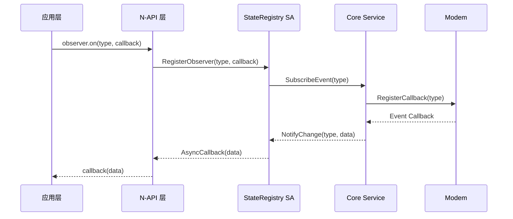
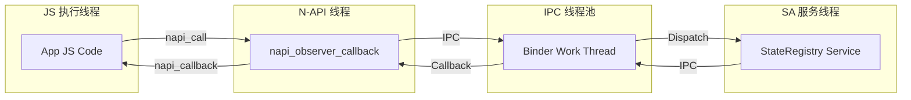
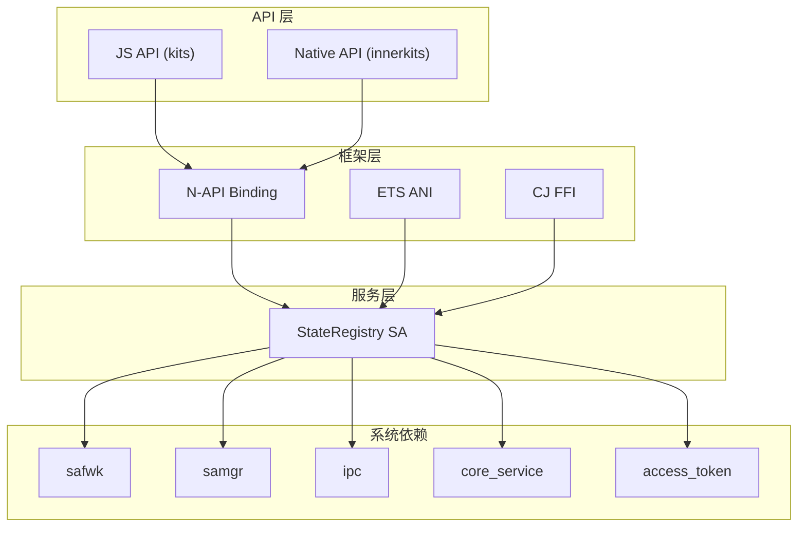

# 架构设计

## 整体架构

State Registry 模块采用分层架构设计，从上到下依次为：JS API 层、N-API 绑定层、框架层、服务层和系统依赖层。

```
┌─────────────────────────────────────────────────────────────┐
│                      Application Layer                      │
│                     (三方应用/系统应用)                       │
├─────────────────────────────────────────────────────────────┤
│                     JS API Layer                             │
│          interfaces/kits/js/@ohos.telephony.observer         │
├─────────────────────────────────────────────────────────────┤
│                   N-API Binding Layer                        │
│              frameworks/js/napi/observer/                     │
│                    (Node-API 绑定)                            │
├─────────────────────────────────────────────────────────────┤
│                   Framework Layer                            │
│     frameworks/native/observer/  │  frameworks/ets/          │
│     frameworks/cj/               │                          │
├────────────────────────┬────────────────────────────────────┤
│   Service Layer        │         IPC/Binder                 │
│   services/            │                                    │
├────────────────────────┴────────────────────────────────────┤
│                   System Dependency Layer                    │
│   safwk │ samgr │ ipc │ core_service │ access_token        │
└─────────────────────────────────────────────────────────────┘
```

**证据来源**：`bundle.json` 中 `build.inner_kits` 和 `build.group_type` 配置的模块划分。

## 组件交互图

### JS API 调用链

```mermaid
flowchart TD
    A[Application JS] --> B[@ohos.telephony.observer.on]
    B --> C[napi_observer_xxx 函数]
    C --> D[telephony_state_registry_service]
    D --> E[core_service]
    E --> F[Modem]
    
    G[Event Occurred] --> F
    F --> E
    E --> D
    D --> C
    C --> B
    B --> A
```

### 观察者注册流程



**证据来源**：`services/src/telephony_state_registry_service.cpp` 服务实现逻辑。

## 数据流分析

### 事件通知数据流

```
┌──────────────┐    IPC     ┌──────────────┐    Inner API    ┌──────────────┐
│  Core Service │ ─────────> │ StateRegistry│ <────────────── │ Core Service │
│   (事件源)    │            │     SA       │    (订阅请求)   │  (观察者)     │
└──────────────┘            └──────────────┘                 └──────────────┘
                                      │
                                      v
                              ┌──────────────┐
                              │  N-API Layer  │
                              └──────────────┘
                                      │
                                      v
                              ┌──────────────┐
                              │   App JS     │
                              │  (回调触发)   │
                              └──────────────┘
```

### 关键数据结构

| 结构名 | 用途 | 定义位置 |
|--------|------|----------|
| TelephonyObserver | 观察者接口 | `interfaces/innerkits/observer/telephony_observer.h` |
| TelephonyObserverClient | 观察者客户端 | `interfaces/innerkits/observer/telephony_observer_client.h` |
| TelephonyStateRegistryRecord | 状态记录 | `services/include/telephony_state_registry_record.h` |

## 线程模型

### 线程划分

| 线程 | 职责 | 运行位置 |
|------|------|----------|
| Main Thread | JS 执行环境 | napi 线程 |
| Binder Thread | IPC 通信线程 | ipc 框架 |
| Service Main Thread | SA 业务主线程 | safwk |
| Modem Thread | 调制解调器线程 | 硬件 |

### 线程通信模式



## IPC 机制

### Binder IPC 通信

State Registry SA 通过 Binder 与客户端进行 IPC 通信，采用 Stub-Proxy 模式。

```
┌─────────────────────────────────────────────────────────────┐
│                        IPC Communication                      │
├─────────────────────────────────────────────────────────────┤
│                                                              │
│  Client                    Binder                     Server │
│  ──────                    ──────                     ────── │
│                           ┌─────────┐                    │
│  Stub ──────────────────> │  Binder │ <───────────────── Proxy│
│                           │  Driver │                     │
│                           └─────────┘                    │
│                                                              │
└─────────────────────────────────────────────────────────────┘
```

**证据来源**：`services/src/telephony_state_registry_stub.cpp` IPC Stub 实现。

### 接口方法

| 方法名 | 功能 | 方向 |
|--------|------|------|
| RegisterObserver | 注册观察者 | Client → Server |
| UnregisterObserver | 注销观察者 | Client → Server |
| Dump | 调试信息输出 | Client ↔ Server |

## 模块依赖关系

### 依赖方向图



### 依赖组件清单

| 组件名 | 类型 | 用途 |
|--------|------|------|
| ability_base | external_deps | Want 能力支持 |
| access_token | external_deps | 权限校验 |
| c_utils | external_deps | C 工具库 |
| common_event_service | external_deps | 公共事件 |
| core_service | external_deps | 核心电信能力 |
| ipc | external_deps | IPC 框架 |
| safwk | external_deps | 系统能力框架 |
| samgr | external_deps | 服务管理 |
| hilog | external_deps | 日志输出 |

**证据来源**：`BUILD.gn` 中 `external_deps` 配置。

## 相关文档

- [目录结构](01_Directory_Structure.md)
- [JS API](03_JS_API.md)
- [Native API](04_Native_API.md)
- [编译产物](06_Build_Artifacts.md)
