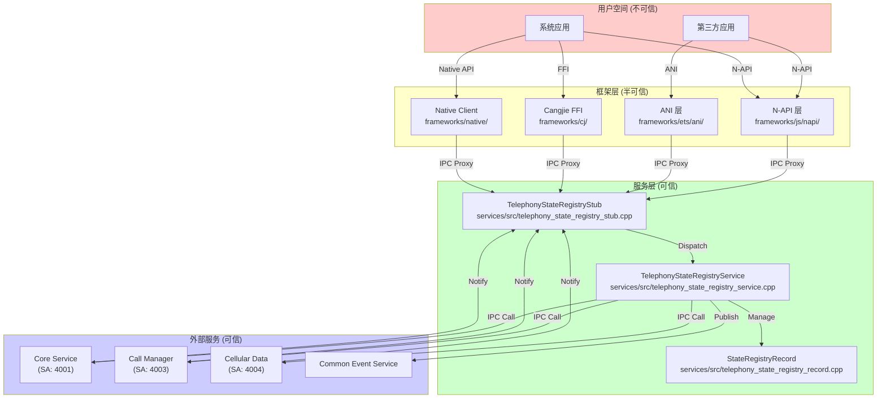

# 攻击面分析 (Attack Surface Analysis)

## 分析概述

本文档系统梳理 State Registry 模块的所有外部输入入口、敏感操作点和信任边界，为安全研究提供完整的攻击面视图。

**分析范围**:
- N-API 接口 (JS/ETS/Cangjie)
- IPC 接口 (Native/System Services)
- 内部 API 调用链
- 敏感数据流

**文档版本**: 1.0  
**最后更新**: 2026-02-07

---

## 1. 信任边界图



---

## 2. 外部输入入口清单

### 2.1 N-API 输入 (JS/ETS/Cangjie)

| 入口函数 | 文件位置 | 输入参数 | 风险等级 |
|----------|----------|----------|----------|
| `NativeOn` | `frameworks/js/napi/src/napi_state_registry.cpp:75` | `eventType`, `slotId`, `callbackRef` | 中 |
| `NativeOff` | `frameworks/js/napi/src/napi_state_registry.cpp:240` | `eventType`, `callbackRef` | 低 |
| `MatchParametersWithObject` | `frameworks/js/napi/src/napi_state_registry.cpp:140` | `parameters[]`, `eventType` | 中 |
| `RegisterEventListener` | `frameworks/js/napi/src/event_listener_manager.cpp:22` | `EventListener` 结构 | 中 |
| `UnregisterEventListener` | `frameworks/js/napi/src/event_listener_manager.cpp:32` | `env`, `eventType`, `ref` | 低 |

**输入验证点**:
```cpp
// 文件: frameworks/js/napi/src/napi_state_registry.cpp:62-73
static inline bool IsValidSlotIdEx(TelephonyUpdateEventType eventType, int32_t slotId) {
    int32_t defaultSlotId = DEFAULT_SIM_SLOT_ID;
    if (eventType == TelephonyUpdateEventType::EVENT_CALL_STATE_UPDATE ||
        eventType == TelephonyUpdateEventType::EVENT_CALL_STATE_EX_UPDATE ||
        eventType == TelephonyUpdateEventType::EVENT_CCALL_STATE_UPDATE) {
        defaultSlotId = -1;
    }
    // slotId 范围验证
    return (((slotId >= defaultSlotId) && (slotId < SIM_SLOT_COUNT + 1)) ||
        (slotId == SIM_SLOT_ID_FOR_DEFAULT_CONN_EVENT));
}
```

### 2.2 IPC 输入 (来自系统服务)

| IPC 接口码 | 处理函数 | 文件位置 | 输入数据 | 风险等级 |
|------------|----------|----------|----------|----------|
| `CELL_INFO` | `OnUpdateCellInfo` | `services/src/telephony_state_registry_stub.cpp:36` | `slotId`, `CellInformation[]` | 低 |
| `SIM_STATE` | `OnUpdateSimState` | `services/src/telephony_state_registry_stub.cpp:38` | `slotId`, `CardType`, `SimState`, `LockReason` | 低 |
| `SIGNAL_INFO` | `OnUpdateSignalInfo` | `services/src/telephony_state_registry_stub.cpp:40` | `slotId`, `SignalInformation[]` | 低 |
| `NET_WORK_STATE` | `OnUpdateNetworkState` | `services/src/telephony_state_registry_stub.cpp:42` | `slotId`, `NetworkState` | 低 |
| `CALL_STATE` | `OnUpdateCallState` | `services/src/telephony_state_registry_stub.cpp:44` | `callState`, `phoneNumber` | **高** |
| `CALL_STATE_FOR_ID` | `OnUpdateCallStateForSlotId` | `services/src/telephony_state_registry_stub.cpp:46` | `slotId`, `callState`, `incomingNumber` | **高** |
| `CELLULAR_DATA_STATE` | `OnUpdateCellularDataConnectState` | `services/src/telephony_state_registry_stub.cpp:48` | `slotId`, `dataState`, `networkType` | 低 |
| `CELLULAR_DATA_FLOW` | `OnUpdateCellularDataFlow` | `services/src/telephony_state_registry_stub.cpp:50` | `slotId`, `flowData` | 低 |
| `ADD_OBSERVER` | `OnRegisterStateChange` | `services/src/telephony_state_registry_stub.cpp:52` | `callback`, `slotId`, `mask` | 中 |
| `REMOVE_OBSERVER` | `OnUnregisterStateChange` | `services/src/telephony_state_registry_stub.cpp:54` | `slotId`, `mask` | 低 |
| `CFU_INDICATOR` | `OnUpdateCfuIndicator` | `services/src/telephony_state_registry_stub.cpp:56` | `slotId`, `cfuResult` | 低 |
| `VOICE_MAIL_MSG_INDICATOR` | `OnUpdateVoiceMailMsgIndicator` | `services/src/telephony_state_registry_stub.cpp:58` | `slotId`, `voiceMailResult` | 低 |
| `ICC_ACCOUNT_CHANGE` | `OnIccAccountUpdated` | `services/src/telephony_state_registry_stub.cpp:60` | (无参数) | 低 |

**IPC 输入验证示例**:
```cpp
// 文件: services/src/telephony_state_registry_stub.cpp:130-138
int32_t TelephonyStateRegistryStub::OnUpdateCallState(MessageParcel &data, MessageParcel &reply) {
    int32_t callState = data.ReadInt32();           // 读取通话状态
    std::u16string phoneNumber = data.ReadString16(); // 读取电话号码
    int32_t ret = UpdateCallState(callState, phoneNumber);
    reply.WriteInt32(ret);
    return NO_ERROR;
}
```

### 2.3 权限检查点

| 检查位置 | 权限常量 | 文件位置 | 说明 |
|----------|----------|----------|------|
| `CheckPermission` | `Permission::SET_TELEPHONY_STATE` | `services/src/telephony_state_registry_service.cpp:131` | 更新状态需要 |
| `CheckPermission` | `Permission::SET_TELEPHONY_STATE` | `services/src/telephony_state_registry_service.cpp:167` | 更新数据流需要 |
| `CheckPermission` | `Permission::SET_TELEPHONY_STATE` | `services/src/telephony_state_registry_service.cpp:191` | 更新通话状态需要 |
| `CheckPermission` | `Permission::SET_TELEPHONY_STATE` | `services/src/telephony_state_registry_service.cpp:238` | 更新通话状态(带slotId)需要 |
| `CheckPermission` | `Permission::SET_TELEPHONY_STATE` | `services/src/telephony_state_registry_service.cpp:278` | 更新SIM状态需要 |
| `CheckPermission` | `Permission::SET_TELEPHONY_STATE` | `services/src/telephony_state_registry_service.cpp:308` | 更新信号信息需要 |
| `CheckPermission` | `Permission::SET_TELEPHONY_STATE` 或 `CELL_LOCATION` | `services/src/telephony_state_registry_service.cpp:342` | 更新小区信息需要 |
| `CheckCallerIsSystemApp` | 系统应用检查 | `services/include/telephony_state_registry_service.h:80` | 某些事件的额外检查 |

---

## 3. 敏感操作清单

### 3.1 敏感数据访问

| 操作 | 数据类型 | 位置 | 权限要求 | 脱敏处理 |
|------|----------|------|----------|----------|
| 获取通话号码 | `callIncomingNumber_` | `services/src/telephony_state_registry_service.cpp:206-211` | `READ_CALL_LOG` | ✅ 空字符串替换 |
| 获取小区信息 | `cellInfos_` | `services/src/telephony_state_registry_service.cpp:336-369` | `LOCATION` | ❌ 无脱敏 |
| 获取信号信息 | `signalInfos_` | `services/src/telephony_state_registry_service.cpp:301-332` | 无 | ❌ 无脱敏 |
| 获取网络状态 | `searchNetworkState_` | `services/src/telephony_state_registry_service.cpp:372-417` | 无 | ❌ 无脱敏 |
| 获取SIM状态 | `simState_` | `services/src/telephony_state_registry_service.cpp:272-299` | 无 | ❌ 无脱敏 |

**通话号码脱敏逻辑**:
```cpp
// 文件: services/src/telephony_state_registry_service.cpp:206-212
std::u16string phoneNumber;
if (record.IsCanReadCallHistory()) {
    phoneNumber = number;  // 有权限：返回完整号码
} else {
    phoneNumber = Str8ToStr16("");  // 无权限：返回空字符串
}
```

### 3.2 状态更新操作

| 操作 | 位置 | 调用来源 | 权限要求 |
|------|------|----------|----------|
| `UpdateCellularDataConnectState` | `services/src/telephony_state_registry_service.cpp:124` | Cellular Data | `SET_TELEPHONY_STATE` |
| `UpdateCellularDataFlow` | `services/src/telephony_state_registry_service.cpp:161` | Cellular Data | `SET_TELEPHONY_STATE` |
| `UpdateCallState` | `services/src/telephony_state_registry_service.cpp:189` | Call Manager | `SET_TELEPHONY_STATE` |
| `UpdateCallStateForSlotId` | `services/src/telephony_state_registry_service.cpp:231` | Call Manager | `SET_TELEPHONY_STATE` |
| `UpdateSignalInfo` | `services/src/telephony_state_registry_service.cpp:301` | Core Service | `SET_TELEPHONY_STATE` |
| `UpdateNetworkState` | `services/src/telephony_state_registry_service.cpp:372` | Core Service | `SET_TELEPHONY_STATE` |
| `UpdateSimState` | `services/src/telephony_state_registry_service.cpp:272` | Core Service | `SET_TELEPHONY_STATE` |
| `UpdateCellInfo` | `services/src/telephony_state_registry_service.cpp:336` | Core Service | `SET_TELEPHONY_STATE` + `CELL_LOCATION` |

### 3.3 公共事件发布

| 事件 | 位置 | 触发条件 | 敏感数据 |
|------|------|----------|----------|
| `COMMON_EVENT_CALL_STATE_CHANGED` | `services/src/telephony_state_registry_service.cpp:579` | 通话状态变化 | 号码(已脱敏) |
| `COMMON_EVENT_SIGNAL_INFO_CHANGED` | `services/src/telephony_state_registry_service.cpp:608` | 信号变化 | 无 |
| `COMMON_EVENT_SIM_STATE_CHANGED` | `services/src/telephony_state_registry_service.cpp:620` | SIM状态变化 | 无 |
| `COMMON_EVENT_CELLULAR_DATA_STATE_CHANGED` | `services/src/telephony_state_registry_service.cpp:652` | 数据连接变化 | 无 |

---

## 4. 攻击路径分析

### 4.1 攻击路径 1: 权限绕过尝试

```
攻击者目标: 获取通话号码

攻击路径:
1. 注册 observer.on('callStateChange', callback)
   └─> frameworks/js/napi/src/napi_state_registry.cpp:75 NativeOn

2. N-API 层验证 slotId
   └─> frameworks/js/napi/src/napi_state_registry.cpp:62 IsValidSlotIdEx

3. 注册到 EventListenerHandler
   └─> frameworks/js/napi/src/event_listener_handler.cpp:???

4. 等待 Call Manager 推送通话状态
   └─> services/src/telephony_state_registry_stub.cpp:130 OnUpdateCallState

5. 服务层检查观察者权限
   └─> services/src/telephony_state_registry_service.cpp:206 IsCanReadCallHistory

6. 返回脱敏数据(无权限时)
   └─> services/src/telephony_state_registry_service.cpp:210 phoneNumber = ""

结果: 失败，号码被脱敏
```

### 4.2 攻击路径 2: DoS 攻击 (观察者耗尽)

```
攻击者目标: 耗尽系统资源

攻击路径:
1. 循环注册大量观察者
   for (i = 0; i < 100000; i++) {
       observer.on('signalInfoChange', callback);
   }

2. 每次注册调用链:
   NativeOn → EventListenerManager::RegisterEventListener 
   → EventListenerHandler::RegisterEventListener
   → TelephonyObserverClient::RegisterObserver
   → IPC 调用到 SA

3. 检查: 是否有注册数量限制?
   TODO(证据不足): 未找到明确的观察者数量上限检查

潜在风险: 如果没有限制，可能导致内存耗尽
```

### 4.3 攻击路径 3: IPC 接口伪造

```
攻击者目标: 伪造状态更新

攻击路径:
1. 尝试直接 IPC 调用 TelephonyStateRegistryStub
   接口: OnUpdateCallState (code = CALL_STATE)

2. Stub 层检查接口 Token
   └─> services/src/telephony_state_registry_stub.cpp:73-78
   
   if (myToken != remoteToken) {
       return TELEPHONY_ERR_DESCRIPTOR_MISMATCH;
   }

3. 权限检查
   └─> services/src/telephony_state_registry_service.cpp:191
   if (!TelephonyPermission::CheckPermission(Permission::SET_TELEPHONY_STATE))

结果: 失败，需要系统权限
```

---

## 5. 安全控制措施

### 5.1 已实施的控制

| 控制措施 | 实施位置 | 有效性 |
|----------|----------|--------|
| 接口描述符校验 | `services/src/telephony_state_registry_stub.cpp:73` | ✅ 高 |
| slotId 范围验证 | `services/src/telephony_state_registry_service.cpp:127` VerifySlotId | ✅ 高 |
| 权限检查 | 所有 Update* 方法 | ✅ 高 |
| 通话号码脱敏 | `services/src/telephony_state_registry_service.cpp:206` | ✅ 高 |
| 信号数量限制 | `services/src/telephony_state_registry_stub.cpp:194` MAX_SIGNAL_NUM | ✅ 中 |
| CFI 保护 | `BUILD.gn:34` cfi = true | ✅ 高 |
| FORTIFY_SOURCE | `BUILD.gn:74` -D_FORTIFY_SOURCE=2 | ✅ 中 |

### 5.2 待确认的控制

| 控制措施 | 期望位置 | 状态 |
|----------|----------|------|
| 观察者数量限制 | EventListenerHandler | ❓ 未确认 |
| 回调频率限制 | TelephonyStateRegistryService | ❓ 未确认 |
| 日志脱敏 | 所有日志输出 | ⚠️ 部分实现 |

---

## 6. 攻击面汇总

| 攻击面 | 暴露程度 | 风险等级 | 主要威胁 |
|--------|----------|----------|----------|
| N-API (JS/ETS/CJ) | 高 (所有应用) | 中 | 参数伪造、DoS |
| IPC 回调接口 | 低 (仅系统服务) | 低 | 权限绕过 |
| 公共事件 | 中 (已订阅应用) | 低 | 信息泄露 |
| Dump 接口 | 低 (需 shell 权限) | 低 | 信息收集 |

---

## 7. 安全测试建议

### 7.1 模糊测试 (Fuzzing)

| 目标 | 输入 | 预期行为 |
|------|------|----------|
| `OnUpdateCallState` | 超长 phoneNumber | 截断或拒绝 |
| `RegisterStateChange` | 无效 slotId (9999) | 返回错误码 |
| `OnUpdateSignalInfo` | size > MAX_SIGNAL_NUM | 置为 0 |

### 7.2 权限测试

| 测试场景 | 权限配置 | 预期结果 |
|----------|----------|----------|
| 无权限获取通话号码 | 无 READ_CALL_LOG | 返回空字符串 |
| 无权限获取小区信息 | 无 LOCATION | 拒绝注册 |
| 伪造 IPC 调用 | 非系统 UID | 权限拒绝 |

---

## 相关文档

- [安全风险评估](07_Security_Review.md) - 详细风险分析
- [架构设计](02_Architecture.md) - 组件交互图
- [接口文档](04_Interface.md) - API 详细规范
- [内部实现](08_Internals.md) - 实现细节
