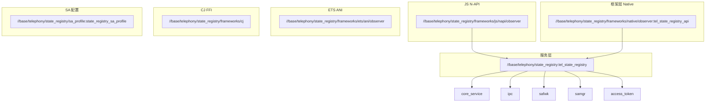

# GN 构建配置

## 根构建文件

**文件位置**：`BUILD.gn`

**入口文件路径**：`//base/telephony/state_registry/BUILD.gn`

### 根级配置参数

```gn
declare_args() {
  telephony_state_registry_hicollie_able = true
}

telephony_extra_defines = []

if (defined(global_parts_info) &&
    defined(global_parts_info.telephony_telephony_enhanced)) {
  telephony_extra_defines += [ "OHOS_BUILD_ENABLE_TELEPHONY_EXT" ]
  telephony_extra_defes += [ "OHOS_BUILD_ENABLE_TELEPHONY_VSIM" ]
}
```

**证据来源**：`BUILD.gn` 根构建文件。

### 构建变量

| 变量名 | 类型 | 默认值 | 说明 |
|--------|------|--------|------|
| telephony_state_registry_hicollie_able | bool | true | 是否启用 Hicollie 性能分析 |
| telephony_extra_defines | list | [] | 额外编译宏定义 |

## Targets 清单

### 服务层 Targets

#### tel_state_registry

**目标路径**：`//base/telephony/state_registry`

| 属性 | 值 |
|------|-----|
| 类型 | ohos_shared_library |
| 输出 | libtel_state_registry.z.so |
| part_name | state_registry |
| subsystem_name | telephony |

**Sources**：
```gn
sources = [
    "frameworks/native/observer/src/telephony_observer_proxy.cpp",
    "services/src/telephony_state_registry_dump_helper.cpp",
    "services/src/telephony_state_registry_record.cpp",
    "services/src/telephony_state_registry_service.cpp",
    "services/src/telephony_state_registry_stub.cpp",
    "services/telephony_ext_wrapper/src/telephony_ext_wrapper.cpp",
]
```

**Include Dirs**：
```gn
include_dirs = [
    "frameworks/native/observer/include",
    "frameworks/native/common/include",
    "services/include",
    "services/telephony_ext_wrapper/include",
]
```

**External Deps**：
```gn
external_deps = [
    "ability_base:want",
    "access_token:libaccesstoken_sdk",
    "c_utils:utils",
    "common_event_service:cesfwk_innerkits",
    "core_service:libtel_common",
    "core_service:tel_core_service_api",
    "hilog:libhilog",
    "init:libbegetutil",
    "ipc:ipc_core",
    "safwk:system_ability_fwk",
    "samgr:samgr_proxy",
]
```

**Defines**：
```gn
defines = [
    "TELEPHONY_LOG_TAG = \"StateRegistry\"",
    "LOG_DOMAIN = 0xD001F07",
]
```

**Conditional Config**：
```gn
if (telephony_state_registry_hicollie_able) {
  external_deps += [ "hicollie:libhicollie" ]
  defines += [ "HICOLLIE_ENABLE" ]
}
```

#### state_registry_sa_profile

**目标路径**：`//base/telephony/state_registry/sa_profile`

**产物**：`state_registry_sa_profile.xml`

### 框架层 Targets

#### tel_state_registry_api

**目标路径**：`//base/telephony/state_registry/frameworks/native/observer`

| 属性 | 值 |
|------|-----|
| 类型 | ohos_shared_library |
| 输出 | libtel_state_registry_api.z.so |
| part_name | state_registry |

**证据来源**：`bundle.json` 中 `build.inner_kits` 配置。

#### observer (JS N-API)

**目标路径**：`//base/telephony/state_registry/frameworks/js/napi/observer`

| 属性 | 值 |
|------|-----|
| 类型 | ohos_shared_library |
| 输出 | libobserver.z.so |
| part_name | state_registry |

**证据来源**：`bundle.json` 中 `build.group_type.fwk_group`。

#### observer_ani_group (ETS ANI)

**目标路径**：`//base/telephony/state_registry/frameworks/ets/ani/observer`

| 属性 | 值 |
|------|-----|
| 类型 | ohos_group |
| 包含 | observer_ani |

**证据来源**：`bundle.json` 中 `build.group_type.fwk_group`。

#### cj_observer_ffi (CJ FFI)

**目标路径**：`//base/telephony/state_registry/frameworks/cj`

| 属性 | 值 |
|------|-----|
| 类型 | ohos_shared_library |
| 输出 | libcj_observer_ffi.z.so |

**证据来源**：`bundle.json` 中 `build.inner_kits`。

## Target 依赖关系图



## 构建产物映射

| Target | 产物 | 安装路径 |
|--------|------|----------|
| tel_state_registry | libtel_state_registry.z.so | /system/lib64/module/ |
| tel_state_registry_api | libtel_state_registry_api.z.so | /system/lib64/module/ |
| observer | libobserver.z.so | /system/lib64/module/ |
| state_registry_sa_profile | state_registry_sa_profile.xml | /system/etc/sa_config/ |
| observer_ani_group | .ani 文件 | /system/etc/ |

## 编译配置开关

### 全局开关

| 开关 | 默认值 | 作用 |
|------|--------|------|
| telephony_state_registry_hicollie_able | true | 启用 Hicollie 性能追踪 |
| global_parts_info.telephony_telephony_enhanced | - | 启用增强电信特性 |

### 条件编译宏

| 宏名 | 条件 | 作用 |
|------|------|------|
| OHOS_BUILD_ENABLE_TELEPHONY_EXT | telephony_enhanced | 启用电信扩展 |
| OHOS_BUILD_ENABLE_TELEPHONY_VSIM | telephony_enhanced | 启用虚拟 SIM |
| HICOLLIE_ENABLE | hicollie_able | 启用性能分析 |

## 构建命令

### 完整构建

```bash
./build.sh --product-name <product> --parts state_registry
```

### 模块构建

```bash
hb build -p <product> -f //base/telephony/state_registry
```

### 单文件编译验证

```bash
# 编译指定 target
gn gen out/<product>
ninja -C out/<product> //base/telephony/state_registry:tel_state_registry
```

## 构建产物验证

```bash
# 验证 so 文件
ls -la out/<product>/packages/system/lib64/module/libtel_state_registry*

# 验证 SA 配置
cat out/<product>/packages/system/etc/sa_config/state_registry_sa_profile.xml
```

## 相关文档

- [目录结构](01_Directory_Structure.md)
- [编译产物](06_Build_Artifacts.md)
- [架构设计](02_Architecture.md)
