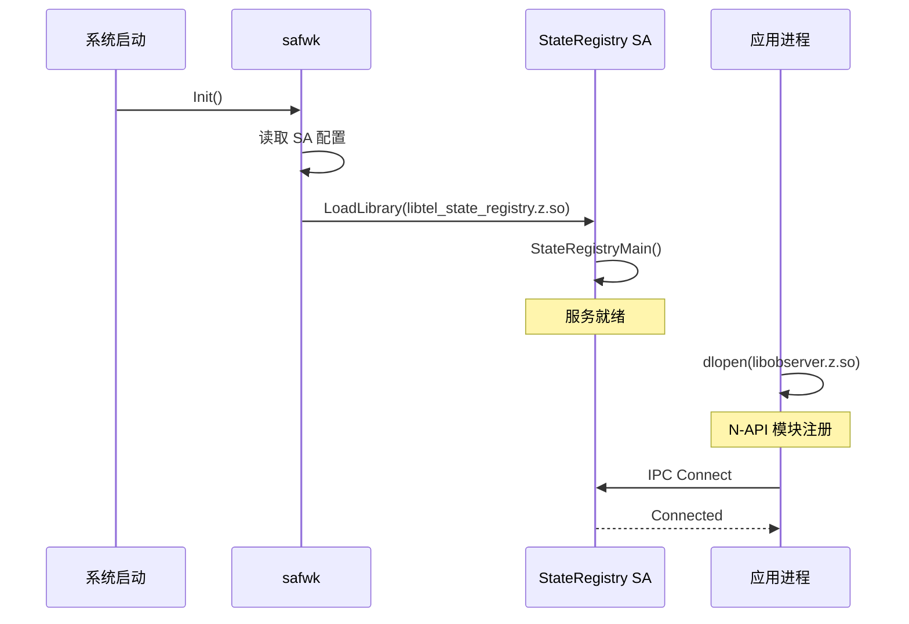

# 编译产物清单

## 产物总览

State Registry 模块编译后产生以下产物，涵盖 Native 库、JS N-API 库、配置文件等多种类型。

| 产物类型 | 文件名 | 描述 |
|----------|--------|------|
| Shared Library | libtel_state_registry.z.so | State Registry 系统服务主库 |
| Shared Library | libtel_state_registry_api.z.so | Native API 库 |
| Shared Library | libobserver.z.so | JS N-API 库 |
| Shared Library | libcj_observer_ffi.z.so | CJ FFI 库 |
| ANI Bundle | observer_ani_group | ETS ANI 组件包 |
| SA Profile | state_registry_sa_profile.xml | SA 配置文件 |

**证据来源**：`bundle.json` 中 `build.group_type` 和 `build.inner_kits` 配置。

## 产物详情

### libtel_state_registry.z.so

| 属性 | 值 |
|------|-----|
| 全路径 | out/\<product\>/packages/system/lib64/module/libtel_state_registry.z.so |
| 大小 | ~550KB（ROM） |
| 类型 | 系统服务动态库 |
| 加载方式 | 进程启动时由 safwk 加载 |

**导出的符号**：
- `StateRegistryMain`：服务入口函数
- `CreateStateRegistryService`：工厂函数

**依赖的库**：
```
libc.so
libhilog.so
libipc_core.so
libsystem_ability_fwk.so
libsamgr_proxy.so
libaccess_token.so
libtel_common.so
libtel_core_service_api.so
```

### libtel_state_registry_api.z.so

| 属性 | 值 |
|------|-----|
| 全路径 | out/\<product\>/packages/system/lib64/module/libtel_state_registry_api.z.so |
| 类型 | Native 内部 API 库 |
| 加载方式 | 被 libtel_state_registry.z.so 静态链接 |

**头文件位置**：`//base/telephony/core_service/interfaces/innerkits/include/`

### libobserver.z.so

| 属性 | 值 |
|------|-----|
| 全路径 | out/\<product\>/packages/system/lib64/module/libobserver.z.so |
| 类型 | JS N-API 库 |
| 加载方式 | 按需加载（首次调用 @ohos.telephony.observer 时） |

**注册到模块**：`@ohos.telephony.observer`

**API 入口**：
```cpp
// napi_module_register 在模块加载时调用
extern "C" __attribute__((visibility("default"))) void NAPI_module_observer_register(napi_env env)
```

### libcj_observer_ffi.z.so

| 属性 | 值 |
|------|-----|
| 全路径 | out/\<product\>/packages/system/lib64/module/libcj_observer_ffi.z.so |
| 类型 | CJ FFI 库 |
| 加载方式 | 按需加载 |

**头文件位置**：`//base/telephony/state_registry/frameworks/cj/src/`

### state_registry_sa_profile.xml

| 属性 | 值 |
|------|-----|
| 全路径 | out/\<product\>/packages/system/etc/sa_config/state_registry_sa_profile.xml |
| 格式 | XML |
| 作用 | SA 启动配置 |

**配置文件示例**：
```xml
<?xml version="1.0" encoding="utf-8"?>
<service name="StateRegistrySA">
    <path>/system/lib64/module/libtel_state_registry.z.so</path>
    <ondemand:ondemand>true</ondemand>
    <process>telephony</process>
    <permission:type>ohos.permission.TELEPHONY_STATE_REGISTRY</permission:type>
</service>
```

## 产物安装路径

### 系统镜像目录结构

```
system/
├── lib64/
│   └── module/
│       ├── libtel_state_registry.z.so        # 主服务库
│       ├── libtel_state_registry_api.z.so    # Native API
│       ├── libobserver.z.so                   # JS N-API
│       └── libcj_observer_ffi.z.so          # CJ FFI
├── etc/
│   └── sa_config/
│       └── state_registry_sa_profile.xml    # SA 配置
└── ability/
    └── profile/
        └── ...
```

### 运行时加载顺序



## 产物依赖关系

```
┌─────────────────────────────────────────────────────────────┐
│                        应用进程                              │
├─────────────────────────────────────────────────────────────┤
│  libobserver.z.so (按需加载)                                 │
│       ↓                                                      │
│       └──▶ libtel_state_registry.z.so (IPC 客户端依赖)       │
└─────────────────────────────────────────────────────────────┘
                              ↓
┌─────────────────────────────────────────────────────────────┐
│                      telephony 进程                          │
├─────────────────────────────────────────────────────────────┤
│  libtel_state_registry.z.so (SA 进程加载)                    │
│       ├──▶ libipc_core.so                                   │
│       ├──▶ libsystem_ability_fwk.so                          │
│       ├──▶ libsamgr_proxy.so                                │
│       ├──▶ libaccess_token.so                                │
│       ├──▶ libtel_core_service_api.so                        │
│       └──▶ libhilog.so                                      │
└─────────────────────────────────────────────────────────────┘
```

## 产物验证方法

### 1. 验证 SO 文件存在

```bash
# 检查产物文件
ls -la out/<product>/packages/system/lib64/module/libtel_state_registry*
ls -la out/<product>/packages/system/lib64/module/libobserver*

# 检查符号表
nm -D out/<product>/packages/system/lib64/module/libtel_state_registry.z.so | grep StateRegistry
```

### 2. 验证 SA 配置

```bash
cat out/<product>/packages/system/etc/sa_config/state_registry_sa_profile.xml
```

### 3. 验证依赖关系

```bash
# 检查动态链接
ldd out/<product>/packages/system/lib64/module/libtel_state_registry.z.so
```

### 4. 运行时验证

```bash
# 查看已加载的模块
hilog | grep -i "StateRegistry"
```

## 相关文档

- [GN 构建](05_GN_Build.md)
- [架构设计](02_Architecture.md)
- [JS API](03_JS_API.md)
