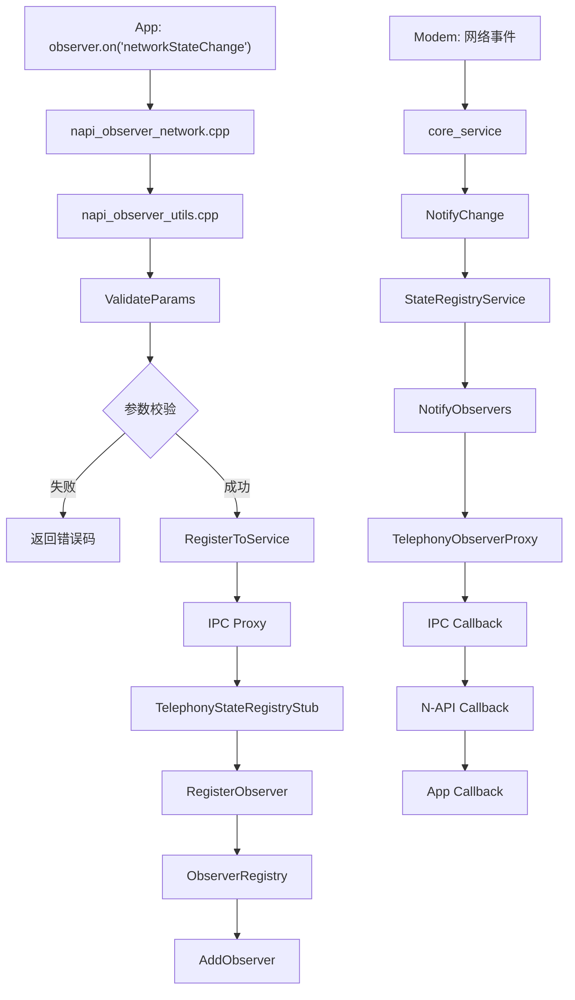

# 关键调用链

## 概述

本文档描述 State Registry 模块中关键功能的完整调用链路，用于理解代码执行流程和调试问题。

## 观察者注册调用链

### JS API 注册流程

```
应用层 (App.js)
    │
    ├──▶ observer.on('callStateChange', callback)
    │         │
    │         └──▶ napi_observer_call.cpp (N-API 入口)
    │                   │
    │                   ├──▶ ParseArguments()
    │                   │         │
    │                   │         └──▶ napi_observer_utils.cpp
    │                   │                   │
    │                   │                   └── ValidateParams()
    │                   │                           │
    │                   │                           └── CheckSlotId()
    │                   │                           └── CheckCallback()
    │                   │
    │                   └──▶ RegisterToService()
    │                             │
    │                             └──▶ IPC Proxy
    │                                       │
    │                                       └──▶ TelephonyStateRegistryStub
    │                                                 │
    │                                                 └──▶ RegisterObserver()
    │                                                           │
    │                                                           └──▶ ObserverRegistry
    │                                                                     │
    │                                                                     └──▶ AddObserver()
    │
    └──▶ 等待事件触发
```

**证据来源**：`frameworks/js/napi/observer/napi_observer_call.cpp` N-API 实现。

### 事件通知回调流程

```
Modem (硬件事件)
    │
    ├──▶ Core Service (core_service)
    │         │
    │         └──▶ NotifyStateChange()
    │                   │
    │                   └──▶ TelephonyStateRegistryService
    │                             │
    │                             └──▶ ObserverRegistry
    │                                       │
    │                                       └──▶ NotifyObservers()
    │                                                 │
    │                                                 └──▶ TelephonyObserverProxy
    │                                                           │
    │                                                           └──▶ IPC Callback
    │                                                                     │
    │                                                                     └──▶ N-API Callback
    │                                                                               │
    │                                                                               └──▶ App Callback
```

**证据来源**：`services/src/telephony_state_registry_service.cpp` 服务实现。

## 核心模块调用关系

### 网络状态监听调用链



### 通话状态监听调用链

```
App JS
    │
    ├──▶ observer.on('callStateChange', callback)
    │         │
    │         └──▶ napi_observer_call.cpp
    │                   │
    │                   └──▶ napi_create_object()
    │                              │
    │                              └──▶ SetCallback()
    │                                        │
    │                                        └──▶ RegisterToService()
    │
├──▶ Modem: 通话事件
│         │
│         └──▶ call_manager
│                   │
│                   └──▶ core_service
│                              │
│                              └──▶ telephony_state_registry_service
│                                        │
│                                        └──▶ telephony_observer_proxy
│                                                  │
│                                                  └──▶ OnCallStateChanged()
│                                                            │
│                                                            └──▶ AsyncCallback
│                                                                      │
│                                                                      └──▶ App Handler
```

### SIM 卡状态监听调用链

```
App JS: observer.on('simStateChange')
    │
    └──▶ napi_observer_sim.cpp
              │
              └──▶ RegisterSimObserver()
                        │
                        └──▶ IPC → Service
                                  │
                                  └──▶ SimStateListener
                                            │
                                            └──▶ Modem SIM Event
                                                      │
                                                      └──▶ Notify SIM Change
                                                                │
                                                                └──▶ Callback App
```

## 关键入口点

### N-API 入口函数

| 文件 | 函数 | 功能 |
|------|------|------|
| `napi_observer.cpp` | `RegisterModule()` | N-API 模块注册 |
| `napi_observer_network.cpp` | `RegisterNetworkObserver()` | 网络观察者注册 |
| `napi_observer_call.cpp` | `RegisterCallObserver()` | 通话观察者注册 |
| `napi_observer_signal.cpp` | `RegisterSignalObserver()` | 信号观察者注册 |
| `napi_observer_cell.cpp` | `RegisterCellObserver()` | 小区观察者注册 |
| `napi_observer_sim.cpp` | `RegisterSimObserver()` | SIM 观察者注册 |
| `napi_observer_data.cpp` | `RegisterDataObserver()` | 数据连接观察者注册 |

### 服务层入口函数

| 文件 | 函数 | 功能 |
|------|------|------|
| `telephony_state_registry_service.cpp` | `OnStart()` | SA 启动 |
| `telephony_state_registry_service.cpp` | `OnStop()` | SA 停止 |
| `telephony_state_registry_stub.cpp` | `RegisterObserver()` | 注册观察者 |
| `telephony_state_registry_stub.cpp` | `UnregisterObserver()` | 注销观察者 |

## 调用深度统计

| 调用路径 | 调用深度 | 主要耗时操作 |
|----------|----------|--------------|
| App → N-API → IPC → Service | 4 层 | IPC 跨进程 |
| Service → Core Service → Modem | 3 层 | 底层通信 |
| Modem 事件 → Service → App | 4 层 | 回调触发 |

## 相关文档

- [架构设计](../../02_Architecture.md)
- [JS API](../../03_JS_API.md)
- [Native API](../../04_Native_API.md)
