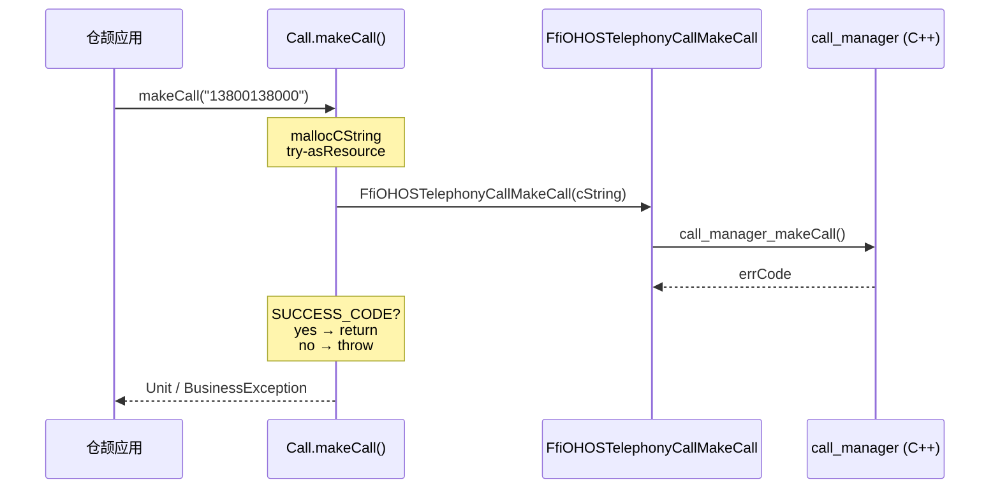
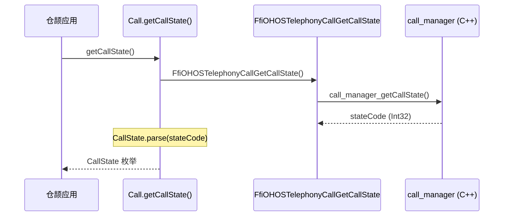

# 内部架构

## 模块职责

| 模块 | 路径 | 职责 | 稳定性 |
|------|------|------|--------|
| kit.TelephonyKit | kit/TelephonyKit/ | 公共 API 重新导出 | Stable |
| ohos.telephony.call | ohos/telephony/call/ | API 实现与 FFI 桥接 | Stable |
| ohos.telephony | ohos/telephony/ | 命名空间包 | Stable |
| mock/ | mock/ | 主机构建存根 | N/A |

## 核心组件

### Call 类 (call.cj)

**路径**：`ohos/telephony/call/call.cj:35`

**职责**：
- 提供静态方法封装电话功能
- 错误码映射与 BusinessException 抛出
- C 字符串内存管理

**关键模式**：

```cj
// 1. FFI 调用
public static func hasCall(): Bool {
    return unsafe { FfiOHOSTelephonyCallHasCall() }
}

// 2. 错误处理 + 内存管理
public static func makeCall(phoneNumber: String): Unit {
    unsafe {
        try (cNumber = LibC.mallocCString(phoneNumber).asResource()) {
            let errCode = FfiOHOSTelephonyCallMakeCall(cNumber.value)
            if (errCode != SUCCESS_CODE) {
                throw BusinessException(getErrorCode(errCode), getErrorMsg(errCode))
            }
        }
    }
}
```

---

### telephony_call_ffi.cj (FFI 边界)

**路径**：`ohos/telephony/call/telephony_call_ffi.cj:20`

**职责**：声明供仓颉调用的外部 C 函数

```cj
foreign {
    func FfiOHOSTelephonyCallInit(): Unit
    func FfiOHOSTelephonyCallMakeCall(phoneNumber: CString): Int32
    func FfiOHOSTelephonyCallGetCallState(): Int32
    func FfiOHOSTelephonyCallHasCall(): Bool
    func FfiOHOSTelephonyCallHasVoiceCapability(): Bool
    func FfiOHOSTelephonyCallIsEmergencyPhoneNumber(phoneNumber: CString, slotId: Int32, errCode: CPointer<Int32>): Bool
    func FfiOHOSTelephonyCallFormatPhoneNumber(phoneNumber: CString, countryCode: CString, errCode: CPointer<Int32>): CString
    func FfiOHOSTelephonyCallFormatPhoneNumberToE164(phoneNumber: CString, countryCode: CString, errCode: CPointer<Int32>): CString
}
```

**说明**：
- `foreign` 块声明 C 函数原型
- `CString` 对应 `char*`
- `CPointer<Int32>` 对应 `int32_t*`
- 实现由 `call_manager:cj_telephony_call_ffi` 提供

---

### number_format_options.cj (数据类型)

**路径**：`ohos/telephony/call/number_format_options.cj`

**组件**：
1. **CallState 枚举** - 通话状态常量
2. **EmergencyNumberOptions** - 紧急号码选项
3. **NumberFormatOptions** - 号码格式化选项
4. **错误码映射** - ERROR_CODE_MAP HashMap

**稳定性标注**：所有公共类型使用 `@!APILevel` 注解

---

## 线程模型

| API | 执行线程 | 说明 |
|-----|---------|------|
| makeCall(phoneNumber) | workerthread | 后台线程执行 FFI |
| makeCall(context, phoneNumber) | 主线程 | 直接启动 Ability |
| getCallState() | 主线程 | 同步返回 |
| hasCall() | 主线程 | 同步返回 |
| hasVoiceCapability() | 主线程 | 同步返回 |
| isEmergencyPhoneNumber | workerthread | 后台线程执行 FFI |
| formatPhoneNumber | workerthread | 后台线程执行 FFI |
| formatPhoneNumberToE164 | workerthread | 后台线程执行 FFI |

**设计考量**：
- 阻塞型 FFI 调用在 workerthread 执行，避免阻塞 UI
- 简单查询在主线程执行，减少线程切换开销

---

## 错误传播机制

```
C++ 层 (call_manager)
    │
    ▼ 返回错误码 (int32)
FFI 边界 (telephony_call_ffi.cj)
    │
    ▼ 传入 errCode 参数
Cangjie 层 (call.cj)
    │
    ├── errCode == SUCCESS_CODE ──► 正常返回
    │
    ▼ errCode != SUCCESS_CODE
getErrorCode() ──► 映射错误码
getErrorMsg() ──► 获取错误信息
    │
    ▼
throw BusinessException(code, message)
```

**错误码映射示例** (`number_format_options.cj:45`)：

```cj
func getErrorCode(code: Int32): Int32 {
    const ERROR_CELLUAR_DATA_SERVICE_UNAVAILABLE: Int32 = -2
    const ERROR_INVALID_CALLER: Int32 = 2097205
    if (code == ERROR_CELLUAR_DATA_SERVICE_UNAVAILABLE) {
        8300003  // System internal error
    } else if (code == ERROR_INVALID_CALLER) {
        8300001  // Invalid parameter value
    } else {
        code  // 直接透传
    }
}
```

---

## 内存管理

### C 字符串处理

**路径**：`call.cj:59`

```cj
try (cNumber = LibC.mallocCString(phoneNumber).asResource()) {
    // 使用 cNumber.value 进行 FFI 调用
    let errCode = FfiOHOSTelephonyCallMakeCall(cNumber.value)
}
// try 块退出时自动释放 Resource
```

**模式**：
- `LibC.mallocCString()` - 分配 C 字符串内存
- `.asResource()` - 转换为 Resource 实现
- `try-asResource` - 自动释放

### 字符串返回值处理

```cj
let formatNumber = FfiOHOSTelephonyCallFormatPhoneNumber(...)
result = formatNumber.toString()
LibC.free(formatNumber)  // 手动释放 C 字符串
```

---

## 稳定性标注

### API 注解使用

| 注解 | 位置 | 说明 |
|------|------|------|
| `@!APILevel[since: "22"]` | 类/枚举/方法 | API 起始版本 |
| `@!APILevel[syscap: "..."]` | 类/方法 | System Capability 要求 |
| `@!APILevel[throwexception: true]` | 方法 | 可能抛出 BusinessException |
| `@!APILevel[workerthread: true]` | 方法 | 在 workerthread 执行 |

### 公共接口层级

```
kit.TelephonyKit (最外层，重新导出)
    │
    ▼ import
ohos.telephony.call (API 层)
    │
    ▼ foreign import
外部 C++ FFI (call_manager)
```

**稳定性**：
- Kit 层和 API 层标记为 Stable
- FFI 边界由 call_manager 维护

---

## 可替换点

| 可替换点 | 当前实现 | 可替换方案 |
|---------|---------|-----------|
| 日志后端 | hiviewdfx_cangjie_wrapper | 其他日志框架 |
| 异常类型 | BusinessException | 自定义异常类 |
| 号码格式化 | call_manager FFI | 本地格式化库 |
| 上下文跳转 | ability_cangjie_wrapper | 直接 Want 跳转 |

---

## 调用时序图

### makeCall (workerthread 版本)



### getCallState


