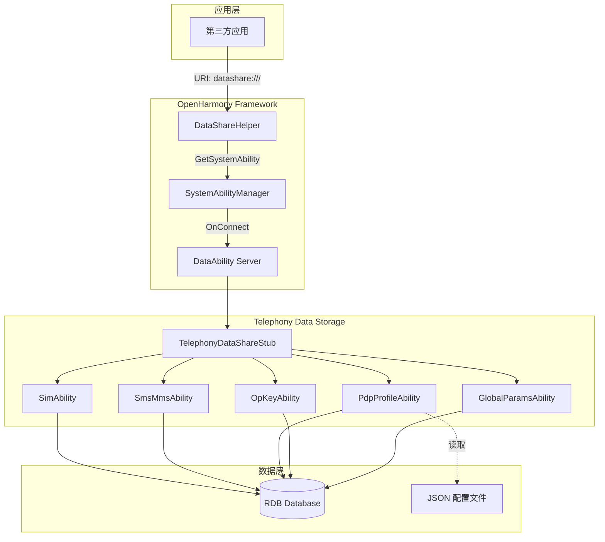
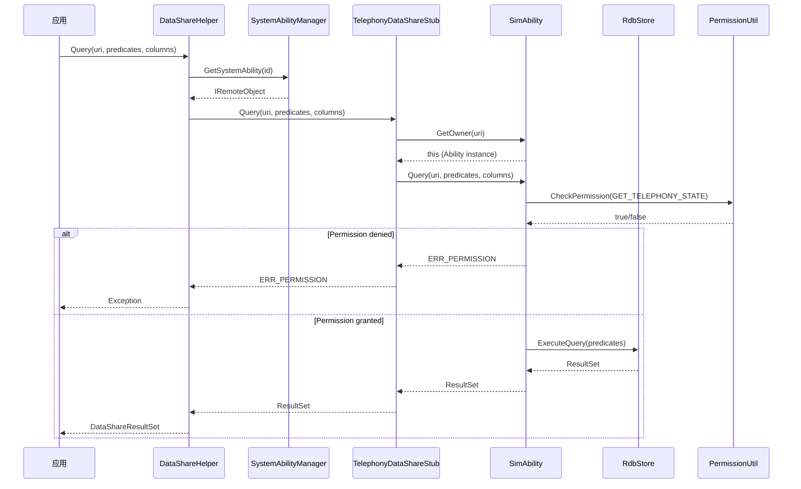

# 架构说明

## 3.1 整体架构图



---

## 3.2 组件职责

### 3.2.1 DataShareHelper (客户端)

**职责**: 为应用提供 DataShare 访问入口

**关键方法**:

| 方法 | 描述 |
|------|------|
| `Creator(remoteObj, uri)` | 创建 DataShareHelper 实例 |
| `Insert(uri, value)` | 插入数据 |
| `Query(uri, predicates, columns)` | 查询数据 |
| `Update(uri, predicates, value)` | 更新数据 |
| `Delete(uri, predicates)` | 删除数据 |
| `BatchInsert(uri, values)` | 批量插入 |

**代码证据**: `test/unittest/data_gtest/data_storage_gtest.cpp`

```cpp
std::shared_ptr<DataShare::DataShareHelper> DataStorageGtest::CreateDataShareHelper(
    int32_t systemAbilityId, std::string &uri) {
    auto saManager = SystemAbilityManagerClient::GetInstance().GetSystemAbilityManager();
    auto remoteObj = saManager->GetSystemAbility(systemAbilityId);
    return DataShare::DataShareHelper::Creator(remoteObj, uri);
}
```

### 3.2.2 TelephonyDataShareStub (IPC 存根)

**职责**: 处理服务端 IPC 请求，路由到对应 Ability

**关键方法**:

| 方法 | 描述 |
|------|------|
| `Insert(uri, value)` | 路由 Insert 请求 |
| `Query(uri, predicates, columns)` | 路由 Query 请求 |
| `Update(uri, predicates, value)` | 路由 Update 请求 |
| `Delete(uri, predicates)` | 路由 Delete 请求 |
| `RegisterObserver(uri, observer)` | 注册数据变更监听 |
| `NotifyChange(uri)` | 通知数据变更 |

**代码证据**: `common/include/telephony_datashare_stub_impl.h`

```cpp
class TelephonyDataShareStubImpl : public DataShareStub {
public:
    int32_t Insert(const Uri &uri, const DataShareValuesBucket &value) override;
    std::shared_ptr<DataShareResultSet> Query(const Uri &uri,
        const DataSharePredicates &predicates, std::vector<std::string> &columns) override;
    // ... 其他方法
};
```

### 3.2.3 DataAbility 实现类

| 类 | 职责 |
|------|------|
| `SimAbility` | SIM 卡数据 CRUD |
| `SmsMmsAbility` | 短信/多媒体消息 CRUD |
| `PdpProfileAbility` | PDP/APN 配置 CRUD（含加密） |
| `OpKeyAbility` | 运营商密钥 CRUD |
| `GlobalParamsAbility` | 全局参数 CRUD |

---

## 3.3 数据流

### 3.3.1 写操作数据流

```
应用 (DataShareHelper.Insert)
    │
    ▼
SystemAbilityManager.GetSystemAbility()
    │
    ▼
TelephonyDataShareStub.Insert()
    │
    ▼
    ├─► GetOwner(uri) ──► [判断 URI 归属]
    │
    ▼
对应 Ability.Insert()
    │
    ├──► PermissionUtil.CheckPermission()
    │       │
    │       └──► IPCSkeleton.GetCallingTokenID()
    │               │
    │               └──► AccessTokenKit.VerifyAccessToken()
    │
    ├──► RdbHelper.ExecuteInsert()
    │
    └──► 返回行 ID 或错误码
```

### 3.3.2 读操作数据流

```
应用 (DataShareHelper.Query)
    │
    ▼
SystemAbilityManager.GetSystemAbility()
    │
    ▼
TelephonyDataShareStub.Query()
    │
    ▼
    ├─► GetOwner(uri) ──► [判断 URI 归属]
    │
    ▼
对应 Ability.Query()
    │
    ├──► PermissionUtil.CheckPermission()
    │       │
    │       └──► IPCSkeleton.GetCallingTokenID()
    │               │
    │               └──► AccessTokenKit.VerifyAccessToken()
    │
    ├──► RdbHelper.ExecuteQuery()
    │
    └──► 返回 DataShareResultSet
```

---

## 3.4 线程模型

### 3.4.1 线程使用规则

| 线程 | 用途 | 说明 |
|------|------|------|
| **主线程 (UI 线程)** | 客户端调用 | DataShareHelper 操作会阻塞直到完成 |
| **IPC 线程** | 服务端接收请求 | SystemAbility 管理器分配 |
| **业务线程** | 实际数据库操作 | RDB 操作可能耗时 |

### 3.4.2 线程安全机制

| 机制 | 实现 | 保护范围 |
|------|------|----------|
| **互斥锁** | `std::mutex` | RDB 操作同步 |
| **原子操作** | `std::atomic` | 计数器、标志位 |
| **RAII** | `std::shared_ptr` | 资源自动释放 |

**代码证据**: `common/include/rdb_base_helper.h`

```cpp
class RdbBaseHelper {
public:
    int32_t ExecuteInsert(const RdbPredicates &predicates, DataShareValuesBucket &value);
    std::shared_ptr<NativeRdb::ResultSet> ExecuteQuery(
        const RdbPredicates &predicates, std::vector<std::string> &columns);
    // ...
};
```

---

## 3.5 关键时序图

### 3.5.1 DataShare Query 时序



---

## 3.6 错误处理机制

### 3.6.1 错误码定义

| 错误码 | 定义 | 描述 |
|--------|------|------|
| `0` | SUCCESS | 操作成功 |
| `-1` | ERR_UNKNOWN | 未知错误 |
| `-2` | ERR_PERMISSION | 权限错误 |
| `-3` | ERR_INVALID_PARAM | 参数无效 |
| `-4` | ERR_DATABASE | 数据库错误 |

**代码证据**: `common/include/data_storage_errors.h`

```cpp
class DataStorageErrors {
public:
    static constexpr int32_t ERR_OK = 0;
    static constexpr int32_t ERR_PERMISSION = -2;
    static constexpr int32_t ERR_INVALID_PARAM = -3;
    // ...
};
```

### 3.6.2 错误传播路径

```
RDB Layer
    │
    ▼ 返回错误码
Ability Layer
    │
    ├──► 记录日志
    │
    ▼ 返回错误码
Stub Layer
    │
    ▼ 返回错误码
DataShareHelper
    │
    ▼ 抛出异常或返回错误
Application
```

---

## 相关文档

| 文档 | 链接 |
|------|------|
| 目录结构 | [02_Directory_Structure](02_Directory_Structure.md) |
| 对外 API | [04_DataShare_API](04_DataShare_API.md) |
| 内部 API | [05_Inner_API](05_Inner_API.md) |
| 安全评审 | [07_Security](07_Security.md) |
| 调用链图 | [appendix/Callgraphs](appendix/Callgraphs.md) |

---

*最后更新: 2024-02-06*
