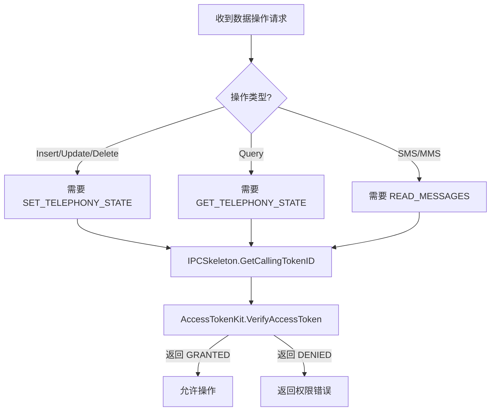

# 对外 DataShare API

## 4.1 API 概述

Telephony Data Storage 模块通过 **DataShare 框架** 对外提供数据访问能力，使用 **URI** 标识不同的数据源，支持标准的 **CRUD** 操作。

### 4.1.1 DataShare URIs

| 模块 | URI | 文件 |
|------|-----|------|
| SIM 卡 | `datashare:///com.ohos.simability` | `sim/include/sim_ability.h` |
| SMS/MMS | `datashare:///com.ohos.smsmmsability` | `sms_mms/include/sms_mms_ability.h` |
| PDP/APN | `datashare:///com.ohos.pdpprofileability` | `pdp_profile/include/pdp_profile_ability.h` |
| OpKey | `datashare:///com.ohos.opkeyability` | `opkey/include/opkey_ability.h` |
| 全局参数 | `datashare:///com.ohos.globalparamsability` | `global_params/include/global_params_ability.h` |

### 4.1.2 访问模式

```cpp
// 1. 获取 SystemAbilityManager
auto saManager = SystemAbilityManagerClient::GetInstance().GetSystemAbilityManager();

// 2. 获取远程对象
auto remoteObj = saManager->GetSystemAbility(systemAbilityId);

// 3. 创建 DataShareHelper
auto helper = DataShare::DataShareHelper::Creator(remoteObj, uri);

// 4. 执行数据操作
int result = helper->Insert(uri, value);
// ...
```

**代码证据**: `test/unittest/data_gtest/data_storage_gtest.cpp`

---

## 4.2 SIM 卡 API

### 4.2.1 URI

```
datashare:///com.ohos.simability
```

### 4.2.2 权限要求

| 操作 | 权限 | 保护级别 |
|------|------|----------|
| Insert/Update/Delete | `ohos.permission.SET_TELEPHONY_STATE` | system_basic |
| Query | `ohos.permission.GET_TELEPHONY_STATE` | system_basic |

### 4.2.3 数据结构

**文件**: `interfaces/innerkits/include/sim_data.h`

| 字段 | 类型 | 描述 |
|------|------|------|
| SIM_ID | int64_t | SIM 卡唯一标识 |
| ICC_ID | string | SIM 卡集成电路卡标识 |
| CARD_ID | int64_t | 卡槽标识 |
| SLOT_INDEX | int | 卡槽索引 |
| SHOW_NAME | string | 显示名称 |
| PHONE_NUMBER | string | 电话号码 |
| AREA_CODE | string | 区域代码 |
| EMAIL | string | 邮箱 |
| EMAIL_NAME | string | 邮箱名称 |

### 4.2.4 API 方法

| 方法 | 参数 | 返回值 | 同步/异步 |
|------|------|--------|----------|
| Insert | `Uri`, `DataShareValuesBucket` | `int` (行 ID) | 同步 |
| Update | `Uri`, `DataSharePredicates`, `DataShareValuesBucket` | `int` (影响行数) | 同步 |
| Delete | `Uri`, `DataSharePredicates` | `int` (影响行数) | 同步 |
| Query | `Uri`, `DataSharePredicates`, `vector<string>` | `DataShareResultSet` | 同步 |
| BatchInsert | `Uri`, `vector<DataShareValuesBucket>` | `int` (影响行数) | 同步 |

### 4.2.5 使用示例

```cpp
// 创建 Helper
Uri simUri("datashare:///com.ohos.simability");
auto helper = DataShare::DataShareHelper::Creator(remoteObj, simUri);

// 查询
DataSharePredicates predicates;
predicates.EqualTo(SIM_ID, "1");
std::vector<std::string> columns = {"SIM_ID", "PHONE_NUMBER"};
auto resultSet = helper->Query(simUri, predicates, columns);

// 插入
DataShareValuesBucket value;
value.Put(SIM_ID, 1);
value.Put(PHONE_NUMBER, "13800138000");
helper->Insert(simUri, value);
```

---

## 4.3 SMS/MMS API

### 4.3.1 URI

```
datashare:///com.ohos.smsmmsability
```

### 4.3.2 权限要求

| 操作 | 权限 | 保护级别 |
|------|------|----------|
| 所有操作 | `ohos.permission.READ_MESSAGES` | system_basic |

### 4.3.3 数据结构

**文件**: `interfaces/innerkits/include/sms_mms_data.h`

| 字段 | 类型 | 描述 |
|------|------|------|
| MSG_ID | int64_t | 消息唯一标识 |
| SENDER_NUMBER | string | 发送方号码 |
| RECEIVER_NUMBER | string | 接收方号码 |
| MSG_CONTENT | string | 消息内容 |
| MSG_TITLE | string | 消息标题 |
| GROUP_ID | int | 会话组 ID |
| MSG_TYPE | int | 消息类型 (SMS/MMS) |
| SMS_SORT_TIME | int64_t | 排序时间 |
| IS_READ | int | 是否已读 |
| IS_LOCKED | int | 是否锁定 |

### 4.3.4 API 方法

| 方法 | 参数 | 返回值 | 同步/异步 |
|------|------|--------|----------|
| Insert | `Uri`, `DataShareValuesBucket` | `int` (行 ID) | 同步 |
| Update | `Uri`, `DataSharePredicates`, `DataShareValuesBucket` | `int` (影响行数) | 同步 |
| Delete | `Uri`, `DataSharePredicates` | `int` (影响行数) | 同步 |
| Query | `Uri`, `DataSharePredicates`, `vector<string>` | `DataShareResultSet` | 同步 |
| BatchInsert | `Uri`, `vector<DataShareValuesBucket>` | `int` (影响行数) | 同步 |

---

## 4.4 PDP/APN API

### 4.4.1 URI

```
datashare:///com.ohos.pdpprofileability
```

### 4.4.2 权限要求

| 操作 | 权限 | 保护级别 |
|------|------|----------|
| Insert/Update/Delete/BatchInsert | `ohos.permission.SET_TELEPHONY_STATE` | system_basic |
| Query | `ohos.permission.GET_TELEPHONY_STATE` | system_basic |

### 4.4.3 数据结构

**文件**: `interfaces/innerkits/include/pdp_profile_data.h`

| 字段 | 类型 | 描述 |
|------|------|------|
| PROFILE_ID | int64_t | 配置文件唯一标识 |
| APN | string | 接入点名称 |
| AUTH_TYPE | int | 认证类型 (0-3) |
| MCC | string | 移动国家代码 (3位) |
| MNC | string | 移动网络代码 (2-3位) |
| USER_NAME | string | 用户名 (加密存储) |
| PASSWORD | string | 密码 (加密存储) |
| APN_NETWORK_TYPE | string | 网络类型 |
| ROAMING_APN | string | 漫游 APN |

### 4.4.4 API 方法

| 方法 | 参数 | 返回值 | 同步/异步 |
|------|------|--------|----------|
| Insert | `Uri`, `DataShareValuesBucket` | `int` (行 ID) | 同步 |
| Update | `Uri`, `DataSharePredicates`, `DataShareValuesBucket` | `int` (影响行数) | 同步 |
| Delete | `Uri`, `DataSharePredicates` | `int` (影响行数) | 同步 |
| Query | `Uri`, `DataSharePredicates`, `vector<string>` | `DataShareResultSet` | 同步 |
| BatchInsert | `Uri`, `vector<DataShareValuesBucket>` | `int` (影响行数) | 同步 |

### 4.4.5 APN 加密机制

**代码证据**: `pdp_profile/include/apn_encryption_util.h`, `pdp_profile/src/apn_encryption_util.cpp`

```cpp
class ApnEncryptionUtil {
public:
    // 加密 APN 敏感数据 (用户名/密码)
    static std::string EncryptApnData(const std::string &rawData);
    
    // 解密 APN 敏感数据
    static std::string DecryptApnData(const std::string &encryptedData);
};
```

---

## 4.5 OpKey API

### 4.5.1 URI

```
datashare:///com.ohos.opkeyability
```

### 4.5.2 权限要求

| 操作 | 权限 | 保护级别 |
|------|------|----------|
| Insert/Update/Delete/BatchInsert | `ohos.permission.SET_TELEPHONY_STATE` | system_basic |
| Query | `ohos.permission.GET_TELEPHONY_STATE` | system_basic |

### 4.5.3 数据结构

**文件**: `interfaces/innerkits/include/opkey_data.h`

| 字段 | 类型 | 描述 |
|------|------|------|
| MCCMNC | string | 运营商代码 |
| GID1 | string | 组 ID 1 |
| GID2 | string | 组 ID 2 |
| OPERATOR_KEY | string | 运营商密钥 |

---

## 4.6 全局参数 API

### 4.6.1 URI

```
datashare:///com.ohos.globalparamsability
```

### 4.6.2 权限要求

| 操作 | 权限 | 保护级别 |
|------|------|----------|
| Insert/Update/Delete | `ohos.permission.SET_TELEPHONY_STATE` | system_basic |
| Query | `ohos.permission.GET_TELEPHONY_STATE` | system_basic |

### 4.6.3 数据结构

**文件**: `interfaces/innerkits/include/global_params_data.h`

| 字段 | 类型 | 描述 |
|------|------|------|
| ECC_NUMBER | string | 紧急呼叫号码 |
| MCC | string | 移动国家代码 |
| NUM_MATCH_RULE | string | 号码匹配规则 |

---

## 4.7 错误码参考

| 错误码 | 常量定义 | 描述 |
|--------|----------|------|
| `0` | `ERR_OK` | 操作成功 |
| `-1` | `ERR_UNKNOWN` | 未知错误 |
| `-2` | `ERR_PERMISSION` | 权限不足 |
| `-3` | `ERR_INVALID_PARAM` | 参数无效 |
| `-4` | `ERR_DATABASE` | 数据库错误 |
| `-5` | `ERR_NOT_FOUND` | 数据不存在 |

**代码证据**: `common/include/data_storage_errors.h`

---

## 4.8 权限检查流程



**代码证据**: `common/src/permission_util.cpp`

```cpp
bool PermissionUtil::CheckPermission(const std::string &permissionName) {
    auto callerToken = IPCSkeleton::GetCallingTokenID();
    int result = AccessTokenKit::VerifyAccessToken(callerToken, permissionName);
    return result == PermissionState::PERMISSION_GRANTED;
}
```

---

## 相关文档

| 文档 | 链接 |
|------|------|
| 项目概览 | [01_Overview](01_Overview.md) |
| 架构说明 | [03_Architecture](03_Architecture.md) |
| 内部 API | [05_Inner_API](05_Inner_API.md) |
| 安全评审 | [07_Security](07_Security.md) |

---

*最后更新: 2024-02-06*
