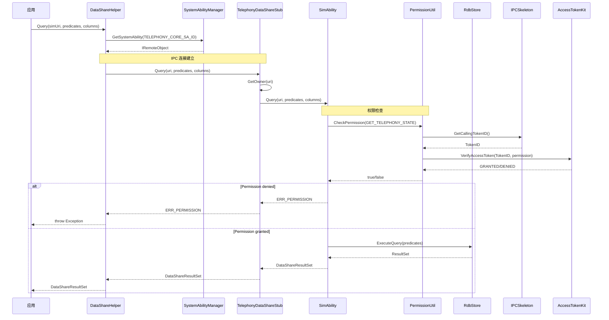
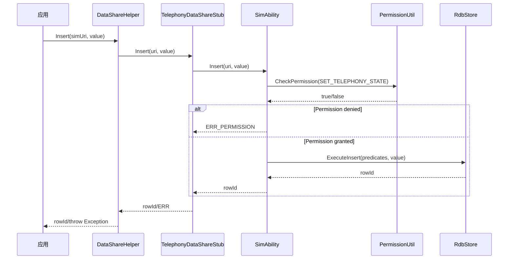
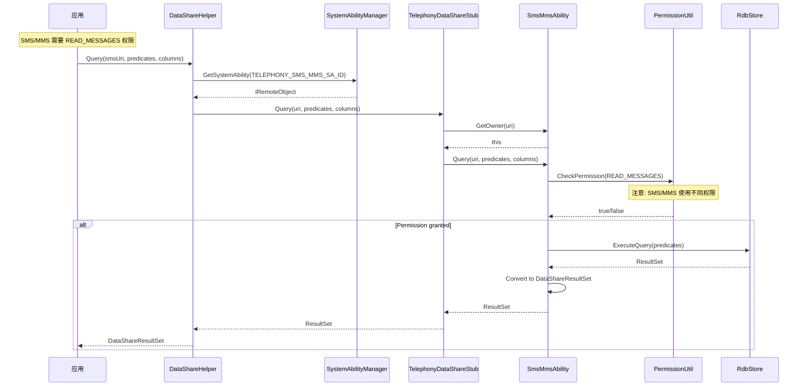
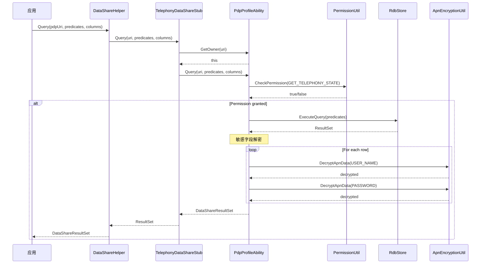
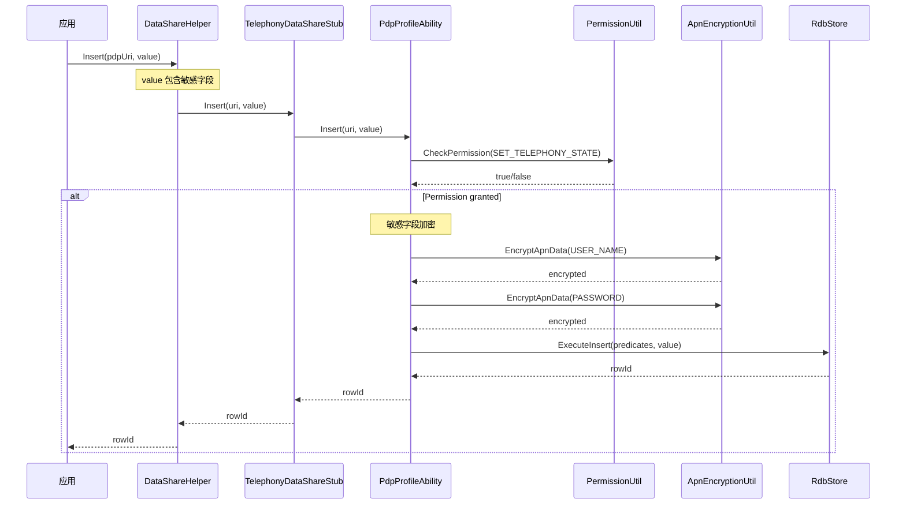
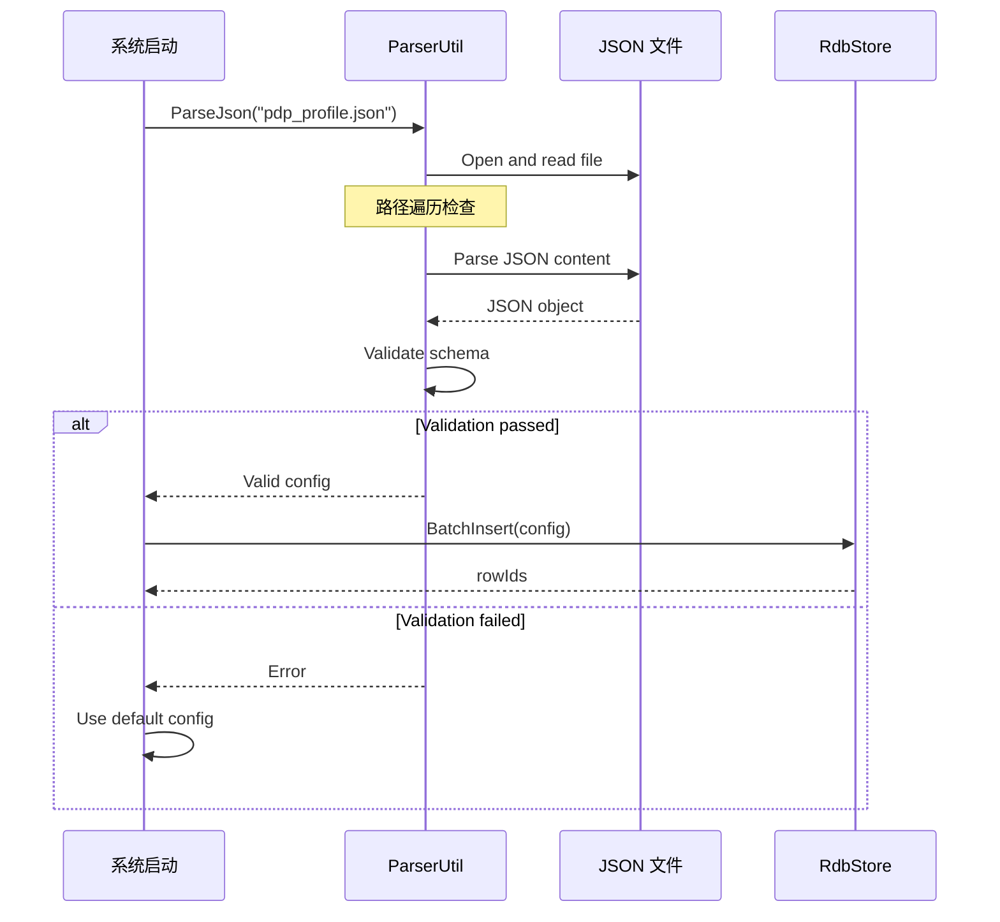
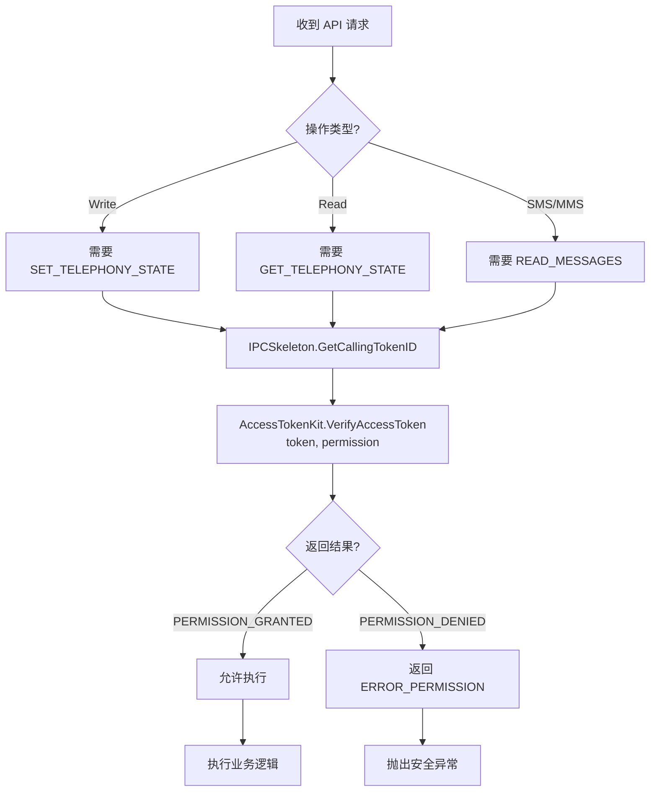
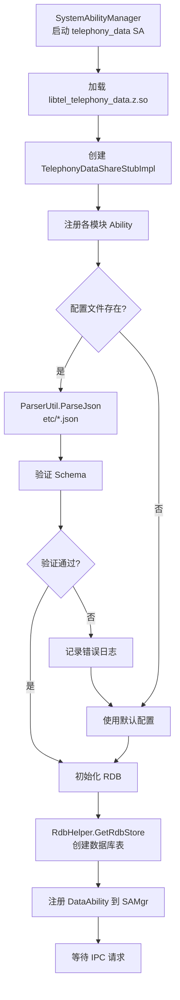

# 关键调用链图

## A.1 SIM 卡查询调用链

### A.1.1 数据查询完整调用链

### A.1.2 SIM 卡插入调用链

---

## A.2 SMS/MMS 查询调用链

---

## A.3 PDP/APN 配置调用链

### A.3.1 PDP 查询调用链

### A.3.2 PDP 插入调用链

---

## A.4 配置文件加载调用链

---

## A.5 权限检查调用链

---

## A.6 完整启动流程

---

## 相关文档

| 文档 | 链接 |
|------|------|
| 架构说明 | [03_Architecture](03_Architecture.md) |
| 对外 API | [04_DataShare_API](04_DataShare_API.md) |
| 安全评审 | [07_Security](07_Security.md) |

---

*最后更新: 2024-02-06*
