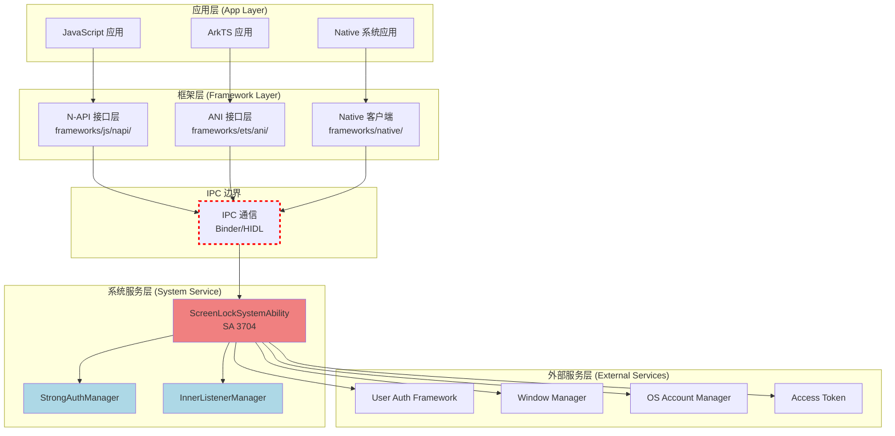
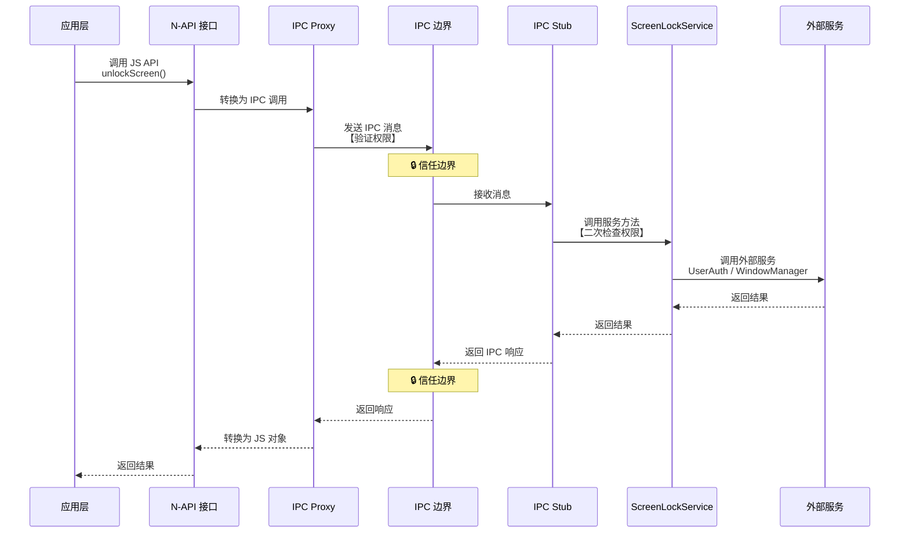

# 05_AttackSurface - 攻击面分析

## 文档说明

**目的**：识别和分析 ScreenLock Manager 服务的外部攻击入口点和敏感操作，为安全评估提供基础

**适用范围**：OpenHarmony ScreenLock Manager (SA 3704)

**关键结论**：
- 攻击面主要集中在 N-API 层和 IPC 接口层
- 关键风险包括：绕过锁屏、权限提升、信息泄露
- Dump 命令可能泄露敏感信息

**相关链接**：
- [06_SecurityReview](06_SecurityReview.md) - 深度安全风险评估
- [01_NAPI_Reference](01_NAPI_Reference.md) - N-API 接口参考

---

## 1. 外部输入清单

### 1.1 N-API JavaScript 接口（主要攻击面）

#### N-API 模块注册点

**文件**：`frameworks/js/napi/src/napi_screenlock_ability.cpp:808-816`

**证据**：
```cpp
static napi_module module = {
    .nm_version = 1,
    .nm_flags = 0,
    .nm_filename = nullptr,
    .nm_register_func = ScreenlockInit,
    .nm_modname = "screenlock",  // JS 模块名
    .nm_priv = nullptr,
    .reserved = { 0 }
};
napi_module_register(&module);
```

**说明**：
- 模块名：`screenlock`
- JS 导入：`import screenlock from '@ohos.screenlock'`
- **攻击面**：所有 JavaScript 应用都可以调用这些 API

#### 暴露的 N-API 接口列表

| JS API | 参数类型 | 同步/异步 | 对应 C++ 函数 | 权限要求 | 风险等级 |
|---------|----------|-----------|--------------|----------|----------|
| `isScreenLocked()` | 无 | 同步 | `IsScreenLocked()` | ACCESS_SCREEN_LOCK | 低 |
| `lock()` | LockParam | 异步 | `Lock()` | ACCESS_SCREEN_LOCK | **中** |
| `unlock()` | 无 | 同步 | `Unlock()` | ACCESS_SCREEN_LOCK | **高** |
| `unlockScreen()` | callback | 异步 | `UnlockScreen()` | ACCESS_SCREEN_LOCK | **高** |
| `isSecureMode()` | 无 | 同步 | `IsSecureMode()` | 无 | 低 |
| `onSystemEvent()` | eventType, callback | 异步 | `OnSystemEvent()` | ACCESS_SCREEN_LOCK | 中 |
| `sendScreenLockEvent()` | eventType | 同步 | `SendScreenLockEvent()` | ACCESS_SCREEN_LOCK_INNER | **高** |
| `isScreenLockDisabled()` | 无 | 同步 | `IsScreenLockDisabled()` | ACCESS_SCREEN_LOCK | 低 |
| `setScreenLockDisabled()` | boolean | 同步 | `SetScreenLockDisabled()` | ACCESS_SCREEN_LOCK | **高** |
| `setScreenLockAuthState()` | authState | 同步 | `SetScreenLockAuthState()` | ACCESS_SCREEN_LOCK_INNER | **高** |
| `getScreenLockAuthState()` | 无 | 同步 | `GetScreenLockAuthState()` | ACCESS_SCREEN_LOCK | 低 |
| `requestStrongAuth()` | StrongAuthParam | 同步 | `RequestStrongAuth()` | ACCESS_SCREEN_LOCK | 中 |
| `getStrongAuth()` | 无 | 同步 | `GetStrongAuth()` | ACCESS_SCREEN_LOCK | 低 |
| `isDeviceLocked()` | 无 | 同步 | `IsDeviceLocked()` | ACCESS_SCREEN_LOCK | 低 |

**证据来源**：`frameworks/js/napi/src/napi_screenlock_ability.cpp` - `Init()` 函数注册

#### 高风险接口说明

1. **`unlockScreen()` - 请求解锁屏幕**
   - **风险**：允许绕过锁屏认证
   - **触发路径**：JavaScript 应用 → N-API → IPC → 服务端
   - **影响**：设备可能被恶意应用解锁

2. **`setScreenLockDisabled()` - 设置锁屏禁用状态**
   - **风险**：可永久禁用设备锁屏
   - **触发路径**：JavaScript 应用 → N-API → IPC → 服务端
   - **影响**：设备失去锁屏保护

3. **`setScreenLockAuthState()` - 设置认证状态**
   - **风险**：可伪造认证状态
   - **触发路径**：JavaScript 应用 → N-API → IPC → 服务端
   - **影响**：绕过认证机制

4. **`sendScreenLockEvent()` - 发送锁屏事件**
   - **风险**：可伪造锁屏相关事件
   - **触发路径**：JavaScript 应用 → N-API → IPC → 服务端
   - **影响**：干扰系统锁屏行为

---

### 1.2 IPC 接口（系统服务攻击面）

#### IPC 接口定义

**文件**：`services/include/screenlock_server_ipc_interface_code.h`

**证据**：
```cpp
constexpr int32_t SAID = 3704;

enum ScreenLockServerIpcInterfaceCode {
    // API 9+ 接口
    ONSYSTEMEVENT = 1,
    LOCK = 2,
    SEND_SCREENLOCK_EVENT = 3,
    IS_SCREEN_LOCK_DISABLED = 4,
    SET_SCREEN_LOCK_DISABLED = 5,
    SET_SCREEN_LOCK_AUTH_STATE = 6,
    GET_SCREEN_LOCK_AUTH_STATE = 7,
    REQUEST_STRONG_AUTH = 8,
    GET_STRONG_AUTH = 9,
    // ... 更多接口代码
};
```

#### IPC 调用链

```
[Client Application]
    ↓ (JavaScript)
[N-API Layer: napi_screenlock_ability.cpp]
    ↓ (C++ IPC Call)
[ScreenLockManagerProxy: frameworks/native/src/screenlock_manager_proxy.cpp]
    ↓ (IPC - Binder/HIDL)
[ScreenLockManagerStub: services/src/screenlock_manager_stub.cpp]
    ↓ (Internal Call)
[ScreenLockSystemAbility: services/src/screenlock_system_ability.cpp]
```

**关键文件**：
- **IPC Proxy**：`frameworks/native/src/screenlock_manager_proxy.cpp`
- **IPC Stub**：`services/src/screenlock_manager_stub.cpp`

**攻击面**：
- 任何具有 `ACCESS_SCREEN_LOCK` 权限的应用都可以发起 IPC 调用
- IPC 消息可能被篡改或重放
- 缺少消息完整性校验（TODO: 需确认）

---

### 1.3 事件监听器注册

#### 系统事件监听接口

**文件**：`interfaces/inner_api/include/screenlock_inner_listener_interface.h`

**支持的事件类型**：
- `beginWakeUp` / `endWakeUp` - 唤醒事件
- `beginScreenOn` / `endScreenOn` - 屏幕开启事件
- `beginScreenOff` / `endScreenOff` - 屏幕关闭事件
- `beginSleep` / `endSleep` - 休眠事件
- `userSwitching` / `userSwitched` - 用户切换事件
- `serviceStart` - 服务启动事件

**证据来源**：`interfaces/inner_api/include/screenlock_common.h`

**攻击面**：
- 恶意应用可监听系统事件，获取用户行为信息
- 可能通过事件回调注入恶意代码（TODO: 需确认回调实现）

---

### 1.4 Dump 命令接口（调试接口）

#### Dump 命令实现

**文件**：`services/src/dump_helper.cpp`

**证据**：
```cpp
class DumpHelper {
public:
    void RegisterCommand(std::shared_ptr<Command> &cmd);
    bool Dispatch(int fd, const std::vector<std::string> &args);
};
```

**使用方式**：
```bash
hidumper -s 3704  # Dump 锁屏服务状态
hidumper -s 3704 -a <command>  # 执行特定命令
```

**攻击面**：
- **信息泄露**：可能暴露锁屏状态、认证状态、注册的监听器等敏感信息
- **权限要求**：需要 `ohos.permission.DUMP` 权限
- **风险等级**：中（如果有权限的话）

---

## 2. 敏感操作清单

### 2.1 屏幕锁定/解锁操作

| 操作 | C++ 函数 | 文件 | 权限检查 | 风险 |
|------|----------|------|----------|------|
| 锁定屏幕 | `ScreenLockSystemAbility::Lock()` | `services/src/screenlock_system_ability.cpp` | `CheckPermission()` | 中 |
| 解锁屏幕 | `ScreenLockSystemAbility::UnlockScreen()` | `services/src/screenlock_system_ability.cpp` | `CheckPermission()` | **高** |
| 请求解锁 | `ScreenLockSystemAbility::Unlock()` | `services/src/screenlock_system_ability.cpp` | `CheckPermission()` | **高** |

**关键代码**（示例）：
**文件**：`services/src/screenlock_system_ability.cpp`
```cpp
// TODO: 需要读取具体实现代码
// 查找 Lock/Unlock/UnlockScreen 方法的实现
```

---

### 2.2 认证状态管理操作

| 操作 | C++ 函数 | 文件 | 权限检查 | 风险 |
|------|----------|------|----------|------|
| 设置认证状态 | `ScreenLockSystemAbility::SetScreenLockAuthState()` | `services/src/screenlock_system_ability.cpp` | `CheckPermission()` | **高** |
| 获取认证状态 | `ScreenLockSystemAbility::GetScreenLockAuthState()` | `services/src/screenlock_system_ability.cpp` | `CheckPermission()` | 低 |
| 请求强认证 | `ScreenLockSystemAbility::RequestStrongAuth()` | `services/src/screenlock_system_ability.cpp` | `CheckPermission()` | 中 |

**风险说明**：
- 伪造认证状态可绕过锁屏机制
- 认证状态可能被用于后续权限提升

---

### 2.3 权限检查点

#### 权限定义

**文件**：`interfaces/inner_api/include/screenlock_common.h`

**证据**：
```cpp
enum ScreenLockError {
    E_SCREENLOCK_OK = 0,
    E_SCREENLOCK_SA_DIED = 1,
    E_SCREENLOCK_FAILED = 2,
    E_SCREENLOCK_NO_PERMISSION = 201,  // 无权限
    E_SCREENLOCK_NOT_SYSTEM_APP = 202,  // 非系统应用
    // ... 更多错误码
};
```

#### 权限检查实现

**文件**：`services/src/screenlock_system_ability.cpp`

**方法**：`ScreenLockSystemAbility::CheckPermission()`

**检查的权限**：
- `ohos.permission.ACCESS_SCREEN_LOCK` - 访问锁屏权限
- `ohos.permission.ACCESS_SCREEN_LOCK_INNER` - 内部访问锁屏权限
- `ohos.permission.DUMP` - 转储权限

**风险点**：
- 权限检查逻辑可能存在缺陷
- 非系统应用可能绕过权限检查
- 权限提升攻击（TODO: 需要深入分析 CheckPermission 实现）

---

### 2.4 与其他系统服务的交互

| 外部服务 | 交互方式 | 用途 | 风险 |
|----------|----------|------|------|
| **User Auth Framework** | `userauth_client` | 用户认证（PIN/指纹/人脸） | 认证绕过 |
| **Window Manager** | `libwm` | 窗口管理、屏幕控制 | 屏幕状态篡改 |
| **OS Account Manager** | `os_account_innerkits` | 用户账户管理 | 用户切换劫持 |
| **Access Token** | `libaccesstoken_sdk` | 访问令牌/权限管理 | 权限伪造 |
| **Common Event Service** | `cesfwk_innerkits` | 公共事件订阅/发布 | 事件劫持 |
| **Preferences** | `native_preferences` | 数据存储 | 配置篡改 |

**证据来源**：`services/BUILD.gn:74-95`

**攻击面**：
- 通过这些服务调用可能实现权限提升
- 依赖服务的安全漏洞可能影响锁屏服务
- 服务间的信任关系可能被利用

---

### 2.5 文件系统操作

#### Preferences 存储实现

**文件**：
- `services/include/preferences_util.h`
- `services/src/preferences_util.cpp`

**用途**：
- 存储锁屏状态配置
- 存储用户偏好设置
- 存储认证状态（TODO: 需确认）

**操作**：
- 读取配置
- 写入配置
- 删除配置

**风险**：
- 文件路径遍历（TODO: 需要检查路径处理）
- 配置文件篡改
- 敏感信息泄露（配置文件权限）

**存储路径**：
```
/data/service/el1/public/screenlock/
```

**证据来源**：`screenlock.cfg` 配置文件创建此目录

---

## 3. 信任边界图

### 3.1 系统层次架构



**说明**：
- **红色虚线**：信任边界（IPC 通信点）
- **系统服务层**：高权限域，需要严格访问控制
- **外部服务层**：依赖的其他系统服务

---

### 3.2 权限域跨越点

| 跨越点 | 源域 | 目标域 | 检查机制 |
|--------|-------|---------|----------|
| **N-API → IPC** | 应用进程 | 系统服务 | `CheckPermission()` |
| **Native → IPC** | 系统应用 | 系统服务 | `CheckPermission()` |
| **IPC → User Auth** | 锁屏服务 | 认证服务 | 依赖服务权限检查 |
| **IPC → Window Manager** | 锁屏服务 | 窗口服务 | 依赖服务权限检查 |

**风险点**：
- 权限检查可能绕过
- IPC 消息可能被篡改
- 依赖服务的安全漏洞

---

### 3.3 数据流与信任边界



**说明**：
- IPC 边界是主要的安全检查点
- 需要在多个层面进行权限验证
- 外部服务调用也需要权限检查

---

## 4. 攻击面总结

### 4.1 高风险攻击向量

| 攻击向量 | 入口点 | 触发条件 | 影响范围 | 利用难度 |
|----------|---------|----------|----------|----------|
| **绕过锁屏认证** | `unlockScreen()`, `setScreenLockAuthState()` | 获取 ACCESS_SCREEN_LOCK 权限 | 设备解锁 | 中 |
| **禁用锁屏** | `setScreenLockDisabled()` | 获取 ACCESS_SCREEN_LOCK 权限 | 锁屏永久禁用 | 中 |
| **权限提升** | IPC 接口 | 权限检查缺陷 | 获取系统权限 | 高 |
| **信息泄露** | `getScreenLockAuthState()`, Dump 命令 | 获取相关权限 | 敏感信息泄露 | 低 |

### 4.2 需要进一步分析的风险点

| 风险点 | 文件位置 | 需要确认 |
|--------|----------|----------|
| **权限检查逻辑** | `services/src/screenlock_system_ability.cpp:CheckPermission()` | 检查是否存在绕过 |
| **输入验证** | N-API 参数处理 | 检查类型/长度/范围验证 |
| **IPC 消息完整性** | `services/src/screenlock_manager_stub.cpp` | 检查消息签名/验证 |
| **文件路径处理** | `services/src/preferences_util.cpp` | 检查路径遍历漏洞 |
| **监听器注入** | `services/src/innerlistenermanager.cpp` | 检查回调安全性 |
| **并发安全** | `services/src/strongauthmanager.cpp` | 检查竞态条件 |

---

## 5. 防御建议

### 5.1 输入验证

- 对所有 N-API 参数进行严格类型检查
- 验证参数范围和长度
- 拒绝 null/undefined 输入

### 5.2 权限检查强化

- 在 N-API 层和 IPC Stub 层双重检查
- 限制 `setScreenLockDisabled()` 和 `setScreenLockAuthState()` 仅系统应用调用
- 定期审计权限检查逻辑

### 5.3 IPC 安全

- 实现 IPC 消息完整性校验
- 防止消息重放攻击
- 记录所有 IPC 调用日志

### 5.4 Dump 命令限制

- 限制 Dump 命令输出敏感信息
- 增强 Dump 权限检查
- 记录 Dump 调用日志

---

## 相关文档

- [06_SecurityReview](06_SecurityReview.md) - 深度安全风险评估
- [01_NAPI_Reference](01_NAPI_Reference.md) - N-API 接口参考
- [02_Architecture](02_Architecture.md) - 系统架构

---

**更新日期**：2026-02-07
**文档状态**：初稿完成，待代码级验证
