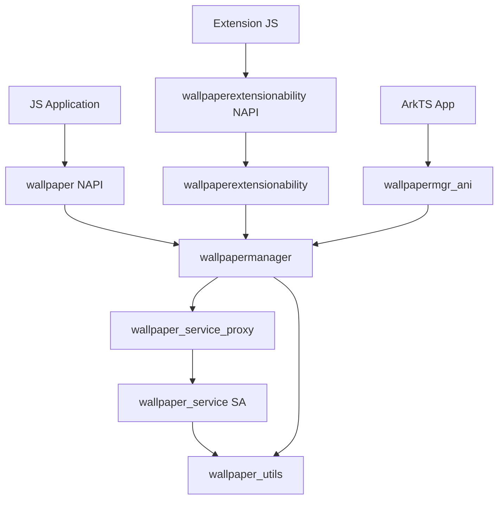

# 目录结构与模块职责

> 代码组织与模块边界说明

## 顶层目录

```bash
/base/theme/wallpaper_mgr
├── figures/                    # 架构图资源
├── frameworks/                  # 框架层实现
│   ├── js/napi/               # JS/NAPI 绑定
│   ├── kits/extension/         # Extension 组件
│   └── native/                 # Native 接口
├── services/                   # 服务层实现
│   ├── src/                   # 服务核心代码
│   ├── include/               # 服务头文件
│   ├── profile/               # SA 配置文件
│   └── etc/                   # 初始化配置
├── interfaces/                 # 对外接口
│   └── inner_api/             # 内部 API
├── utils/                     # 工具模块
│   ├── include/              # 工具头文件
│   ├── src/                  # 工具实现
│   └── dfx/                  # DFX 工具
├── test/                      # 测试代码（本文档不涉及）
├── BUILD.gn                   # 根构建文件
├── wallpaper.gni              # 构建配置
├── bundle.json                # 组件配置
└── hisysevent.yaml            # 事件配置
```

## 模块职责详解

### frameworks/js/napi/

**职责**: JS 到 Native 的绑定层

```
frameworks/js/napi/
├── native_module.cpp          # 主 NAPI 入口 [证据: native_module.cpp:95-157]
│   ├── Init()                 # 模块初始化函数
│   ├── InitWallpaperType()    # 导出 WallpaperType 枚举
│   └── 导出 24 个 JS 方法
├── napi_wallpaper_ability.h   # NAPI 函数声明 [证据: napi_wallpaper_ability.h:234-260]
├── napi_wallpaper_ability.cpp # NAPI 函数实现
├── wallpaper_extension_context/  # Extension Context NAPI
│   └── wallpaper_extension_context_module.cpp
├── wallpaperextensionability/    # Extension Ability NAPI
│   └── wallpaper_extension_ability_module.cpp
└── wallpaper_js_util.cpp      # JS 工具函数
```

### frameworks/kits/extension/

**职责**: Extension 组件框架层

```
frameworks/kits/extension/
├── include/
│   ├── wallpaper_extension_ability.h      # Extension Ability 接口
│   ├── wallpaper_extension_context.h     # Extension Context 接口
│   ├── js_wallpaper_extension_ability.h  # JS 绑定接口
│   └── i_wallpaper_extension_ability.h  # 内部接口
└── src/
    ├── wallpaper_extension_ability.cpp   # Extension Ability 实现
    ├── wallpaper_extension_context.cpp    # Extension Context 实现
    ├── js_wallpaper_extension_ability.cpp # JS 绑定实现
    └── wallpaper_extension_module_loader.cpp
```

### frameworks/native/

**职责**: Native 客户端接口与 IPC 代理

```
frameworks/native/
├── include/
│   ├── wallpaper_manager.h        # 客户端主接口 [证据: wallpaper_manager.h:40-211]
│   ├── iwallpaper_service.h      # IPC 服务接口（IDL 生成）
│   ├── iwallpaper_callback.h     # 回调接口
│   ├── iwallpaper_event_listener.h # 事件监听接口
│   ├── wallpaper_service_cb_stub.h  # 回调存根
│   ├── wallpaper_event_listener_stub.h # 事件监听存根
│   └── wallpaper_rawdata.h       # 数据结构
├── src/
│   ├── wallpaper_manager.cpp           # 客户端实现 [证据: wallpaper_manager.cpp]
│   ├── wallpaper_manager_client.cpp    # 客户端 IPC 代理
│   ├── wallpaper_service_cb_stub.cpp  # 回调处理
│   ├── wallpaper_event_listener_stub.cpp  # 事件监听处理
│   └── wallpaper_event_listener_client.cpp
└── IWallpaperService.idl         # IPC 接口定义
```

### services/

**职责**: System Ability 服务端实现

```
services/
├── src/
│   ├── wallpaper_service.cpp     # 主服务实现 [证据: wallpaper_service.cpp]
│   ├── wallpaper_data.cpp        # 壁纸数据管理
│   ├── wallpaper_common_event_manager.cpp  # 公共事件管理
│   ├── wallpaper_service_cb_proxy.cpp  # 回调代理
│   ├── wallpaper_event_listener_proxy.cpp  # 事件监听代理
│   ├── wallpaper_extension_ability_connection.cpp  # Extension 连接
│   └── wallpaper_extension_ability_death_recipient.cpp
├── include/
│   ├── wallpaper_service.h       # 服务头文件 [证据: wallpaper_service.h]
│   ├── wallpaper_data.h          # 数据结构
│   ├── i_wallpaper_manager_callback.h  # 回调接口
│   ├── wallpaper_common_event_subscriber.h
│   └── wallpaper_service_cb_proxy.h
├── profile/
│   └── 3705.json               # SA 配置文件
└── etc/
    ├── wallpaperservice.cfg     # 初始化配置
    └── wallpaperservice.rc      # rc 脚本
```

### utils/

**职责**: 公共工具模块

```
utils/
├── include/
│   ├── wallpaper_common.h        # 公共常量与错误码 [证据: wallpaper_common.h]
│   ├── wallpaper_manager_common_info.h  # 枚举定义
│   ├── hilog_wrapper.h          # 日志封装
│   └── file_deal.h              # 文件操作工具
├── src/
│   ├── file_deal.cpp            # 文件操作实现 [证据: file_deal.cpp]
│   └── memory_guard.cpp         # 内存保护
└── dfx/
    ├── hidumper_adapter/        # dump 适配
    └── hisysevent_adapter/       # 事件上报适配
```

### interfaces/inner_api/

**职责**: 内部 API 头文件导出

```
interfaces/inner_api/
└── include/
    └── (来自 frameworks/native/include 的导出)
```

## 模块依赖关系



## 稳定性标注

| 模块 | 稳定性 | 说明 |
|------|--------|------|
| wallpaper NAPI | 稳定 | 对外公开 API |
| wallpapermanager | 稳定 | Inner API，需声明依赖 |
| wallpaper_service | 稳定 | 系统服务 |
| wallpaper_utils | 稳定 | 内部工具 |
| Extension 组件 | 较稳定 | 系统能力扩展 |
