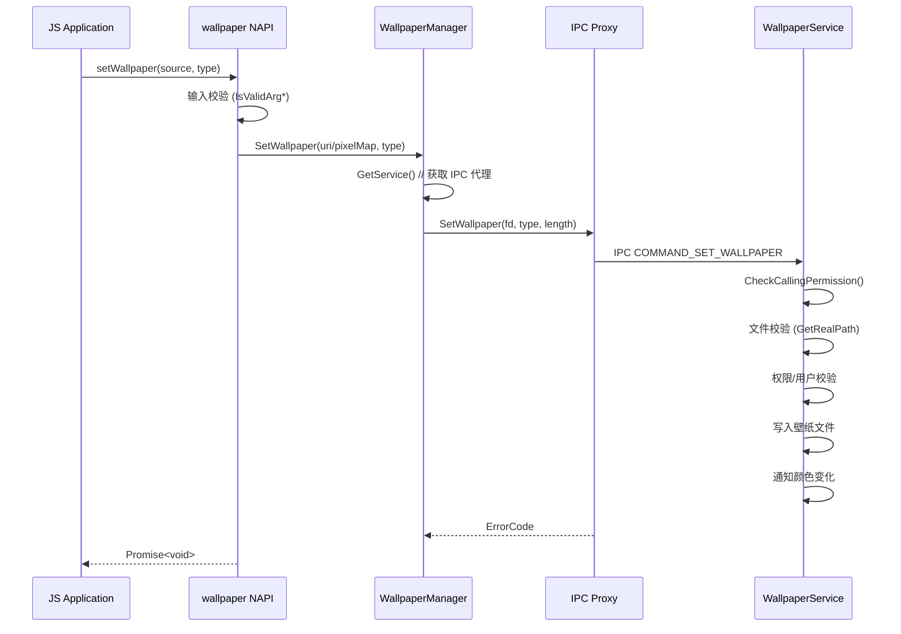

# N-API 接口参考

> JS 接口清单、绑定位置与参数说明

## 模块注册信息

### 主模块 (wallpaper)

| 属性 | 值 |
|------|-----|
| **模块名** | `"wallpaper"` |
| **注册文件** | `frameworks/js/napi/native_module.cpp` |
| **注册函数** | `Init()` (line 95-137) |
| **模块注册** | `napi_module_register()` (line 156) |
| **输出产物** | `libwallpaper.so` |

### 导出常量

#### WallpaperType
```javascript
WallpaperType.WALLPAPER_SYSTEM   // 值: 0, 系统壁纸
WallpaperType.WALLPAPER_LOCKSCREEN // 值: 1, 锁屏壁纸
```

**绑定位置**: `native_module.cpp:30-41` (`InitWallpaperType()`)

#### WallpaperResourceType
```javascript
WallpaperResourceType.DEFAULT  // 值: 0, 默认壁纸
WallpaperResourceType.PICTURE  // 值: 1, 图片壁纸
WallpaperResourceType.VIDEO   // 值: 2, 视频壁纸
WallpaperResourceType.PACKAGE // 值: 3, 壁纸包
```

**绑定位置**: `native_module.cpp:43-60` (`InitWallpaperResourceType()`)

#### RotateState
```javascript
RotateState.PORT     // 值: 0, 竖屏
RotateState.LAND    // 值: 1, 横屏
// 别名: PORTRAIT = PORT, LANDSCAPE = LAND
```

**绑定位置**: `native_module.cpp:62-75` (`InitRotateState()`)

#### FoldState
```javascript
FoldState.NORMAL   // 值: 0, 折叠态
FoldState.UNFOLD_1   // 值: 1, 一次展开态
FoldState.UNFOLD_2   // 值: 2, 二次展开态
// 别名: UNFOLD_ONCE_STATE = UNFOLD_1, UNFOLD_TWICE_STATE = UNFOLD_2
```

**绑定位置**: `native_module.cpp:77-93` (`InitFoldState()`)

---

## API 清单表

### 查询类 API

| JS API | C++ 实现 | 参数 | 返回值 | 权限 | 同步/异步 |
|--------|----------|------|--------|------|----------|
| `getColors` | `NAPI_GetColors` | wallpaperType | `Promise<Array<RgbaColor>>` | 无 | Async |
| `getColorsSync` | `NAPI_GetColorsSync` | wallpaperType | `Array<RgbaColor>` | 无 | Sync |
| `getId` | `NAPI_GetId` | wallpaperType | `Promise<number>` | 无 | Async |
| `getFile` | `NAPI_GetFile` | wallpaperType | `Promise<number>` | GET_WALLPAPER | Async |
| `getMinHeight` | `NAPI_GetMinHeight` | - | `Promise<number>` | 无 | Async |
| `getMinHeightSync` | `NAPI_GetMinHeightSync` | - | `number` | 无 | Sync |
| `getMinWidth` | `NAPI_GetMinWidth` | - | `Promise<number>` | 无 | Async |
| `getMinWidthSync` | `NAPI_GetMinWidthSync` | - | `number` | 无 | Sync |
| `getPixelMap` | `NAPI_GetPixelMap` | wallpaperType | `Promise<PixelMap>` | 无 | Async |
| `getImage` | `NAPI_GetImage` | wallpaperType | `Promise<PixelMap>` | 无 | Async |
| `getCorrespondWallpaper` | `NAPI_GetCorrespondWallpaper` | wallpaperType, foldState, rotateState | `Promise<PixelMap>` | 无 | Async |
| `isChangePermitted` | `NAPI_IsChangePermitted` | - | `Promise<boolean>` | 无 | Async |
| `isOperationAllowed` | `NAPI_IsOperationAllowed` | - | `Promise<boolean>` | 无 | Async |

### 设置类 API

| JS API | C++ 实现 | 参数 | 返回值 | 权限 | 同步/异步 |
|--------|----------|------|--------|------|----------|
| `setWallpaper` | `NAPI_SetWallpaper` | source, wallpaperType | `Promise<void>` | SET_WALLPAPER | Async |
| `setImage` | `NAPI_SetImage` | source, wallpaperType | `Promise<void>` | SET_WALLPAPER | Async |
| `setVideo` | `NAPI_SetVideo` | uri, wallpaperType | `Promise<void>` | SET_WALLPAPER | Async |
| `setCustomWallpaper` | `NAPI_SetCustomWallpaper` | uri, wallpaperType | `Promise<void>` | SET_WALLPAPER (系统API) | Async |
| `setAllWallpapers` | `NAPI_SetAllWallpapers` | wallpaperInfos, wallpaperType | `Promise<void>` | SET_WALLPAPER (系统API) | Async |
| `reset` | `NAPI_Reset` | wallpaperType | `Promise<void>` | SET_WALLPAPER | Async |
| `restore` | `NAPI_Restore` | wallpaperType | `Promise<void>` | SET_WALLPAPER | Async |

### 事件订阅 API

| JS API | C++ 实现 | 参数 | 返回值 | 权限 | 同步/异步 |
|--------|----------|------|--------|------|----------|
| `on` | `NAPI_On` | type, callback | `void` | 无 | Sync |
| `off` | `NAPI_Off` | type, callback? | `void` | 无 | Sync |

### 其他 API

| JS API | C++ 实现 | 参数 | 返回值 | 权限 | 同步/异步 |
|--------|----------|------|--------|------|----------|
| `sendEvent` | `NAPI_SendEvent` | eventType | `Promise<void>` | SET_WALLPAPER | Async |

---

## 详细 API 说明

### getColors / getColorsSync

**功能**: 获取壁纸颜色

**参数**:
- `wallpaperType`: `WallpaperType` - 壁纸类型 (0=系统, 1=锁屏)

**返回值**:
- `Promise<Array<RgbaColor>>` / `Array<RgbaColor>`
- `RgbaColor`: `{ r: number, g: number, b: number, a: number }`

**C++ 入口**: `NAPI_GetColors()` / `NAPI_GetColorsSync()`
**绑定位置**: `napi_wallpaper_ability.cpp` (实现)

**错误码**:
- `E_OK` - 成功
- `E_PARAMETERS_INVALID` - 无效参数

---

### getId

**功能**: 获取壁纸 ID

**参数**:
- `wallpaperType`: `WallpaperType` - 壁纸类型

**返回值**:
- `Promise<number>` - 壁纸 ID

**权限**: 无

---

### getFile

**功能**: 获取壁纸文件描述符

**参数**:
- `wallpaperType`: `WallpaperType` - 壁纸类型

**返回值**:
- `Promise<number>` - 文件描述符

**权限**: `ohos.permission.GET_WALLPAPER`

**错误码**:
- `E_NO_PERMISSION` - 无权限

---

### getPixelMap

**功能**: 获取壁纸 PixelMap

**参数**:
- `wallpaperType`: `WallpaperType` - 壁纸类型

**返回值**:
- `Promise<image.PixelMap>` - 壁纸图片

**C++ 入口**: `NAPI_GetPixelMap()`
**调用链**: JS → NAPI → WallpaperManager::GetPixelMap() → IPC → WallpaperService::GetPixelMap()

---

### setWallpaper

**功能**: 设置壁纸

**参数**:
- `source`: `string | image.PixelMap` - 壁纸源路径或 PixelMap
- `wallpaperType`: `WallpaperType` - 壁纸类型

**返回值**:
- `Promise<void>`

**权限**: `ohos.permission.SET_WALLPAPER`

**输入校验** (napi_wallpaper_ability.cpp:1103-1133):
- 参数数量校验
- 参数类型校验
- wallpaperType 范围校验 (0 或 1)

**文件大小限制**:
- 图片: 最大 50MB (`FOO_MAX_LEN`)
- 视频: 最大 100MB (`MAX_VIDEO_SIZE`)

**错误码**:
- `E_NO_PERMISSION` - 无 SET_WALLPAPER 权限
- `E_PARAMETERS_INVALID` - 无效参数
- `E_PICTURE_OVERSIZED` - 文件过大
- `E_USER_IDENTITY_ERROR` - 访客用户

---

### setVideo

**功能**: 设置视频壁纸

**参数**:
- `uri`: `string` - MP4 文件路径
- `wallpaperType`: `WallpaperType` - 壁纸类型

**返回值**:
- `Promise<void>`

**权限**: `ohos.permission.SET_WALLPAPER`

**校验**:
- 文件路径 realpath 校验 (file_deal.cpp:155-172)
- 视频格式校验
- 文件大小限制 (100MB)

---

### setCustomWallpaper / setAllWallpapers

**功能**: 设置自定义壁纸 / 设置多态壁纸

**权限**: 系统 API，需 `IsSystemApp()` 校验

**参数**:
- `setCustomWallpaper`: uri, wallpaperType
- `setAllWallpapers`: wallpaperInfos (数组), wallpaperType

**WallpaperInfo 结构**:
```typescript
interface WallpaperInfo {
    uri: string;
    foldState: FoldState;
    rotateState: RotateState;
}
```

---

### on / off

**功能**: 订阅/取消订阅壁纸颜色变化事件

**参数**:
- `type`: `'colorChange'` - 事件类型
- `callback`: `(colors: Array<RgbaColor>, wallpaperType: WallpaperType) => void`

**返回值**: `void`

**C++ 入口**: `NAPI_On()` / `NAPI_Off()`

---

## 调用链示例

### setWallpaper 调用链



---

## 错误码对照表

| 错误码 | 值 | 说明 |
|--------|-----|------|
| `NO_ERROR` / `E_OK` | 0 | 成功 |
| `E_PARAMETERS_INVALID` | -1 | 无效参数 |
| `E_NO_PERMISSION` | -2 | 无权限 |
| `E_NOT_SYSTEM_APP` | -3 | 非系统应用 |
| `E_USER_IDENTITY_ERROR` | -4 | 用户身份错误 |
| `E_CHECK_DESCRIPTOR_ERROR` | -5 | IPC 描述符错误 |
| `E_PICTURE_OVERSIZED` | -6 | 图片过大 |
| `E_DEAD_OBJECT` | -7 | 服务对象已死亡 |
| `E_GET_WALLPAPER_FAILED` | -8 | 获取壁纸失败 |
| `E_SET_WALLPAPER_FAILED` | -9 | 设置壁纸失败 |

**完整错误码定义**: `utils/include/wallpaper_common.h:45-66`

---

## 相关文档

- 架构设计: [04_Architecture.md](04_Architecture.md)
- 安全机制: [06_Security.md](06_Security.md)
- Native 内部接口: [07_InnerAPI.md](07_InnerAPI.md)
