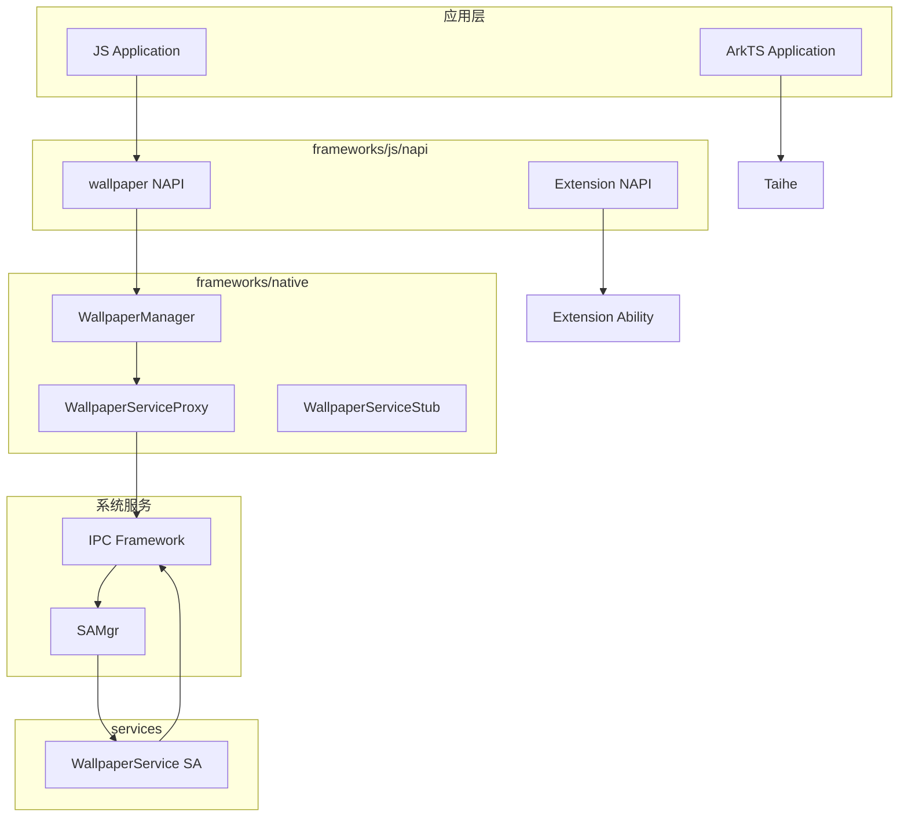
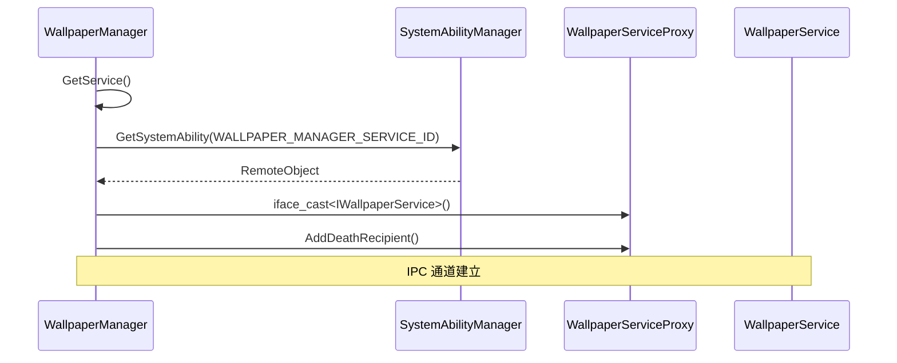
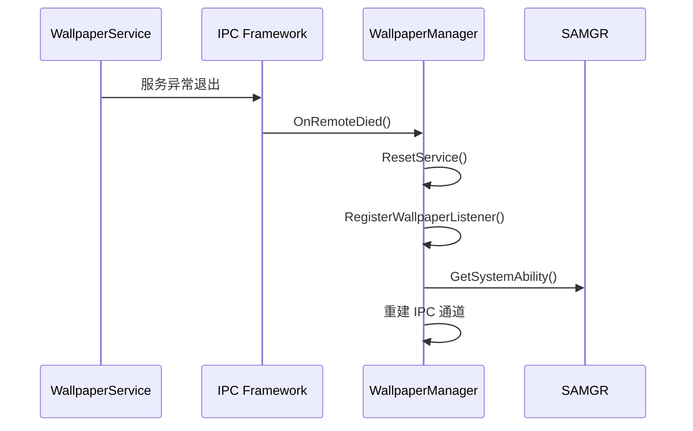
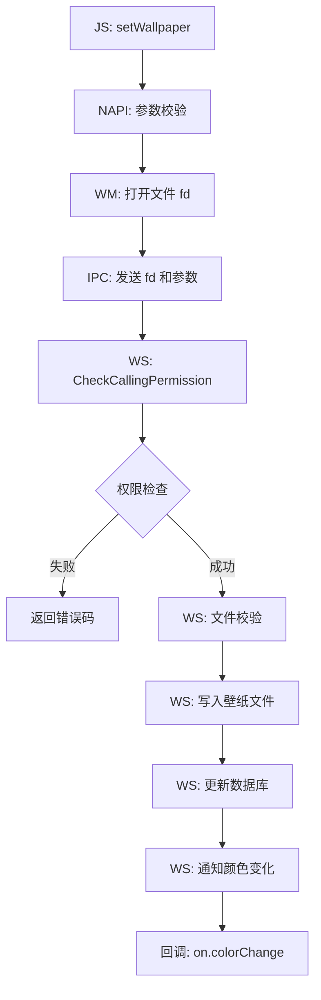
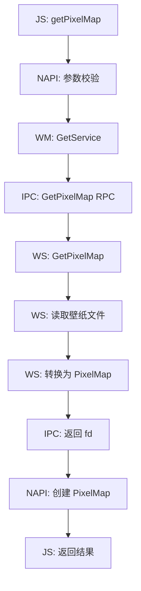
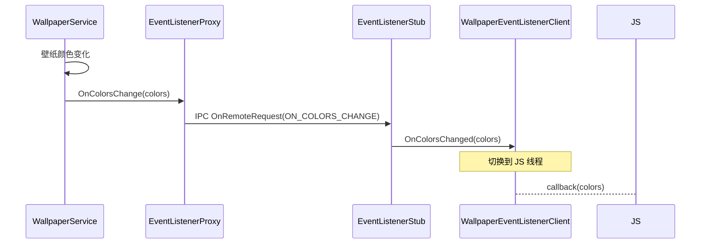
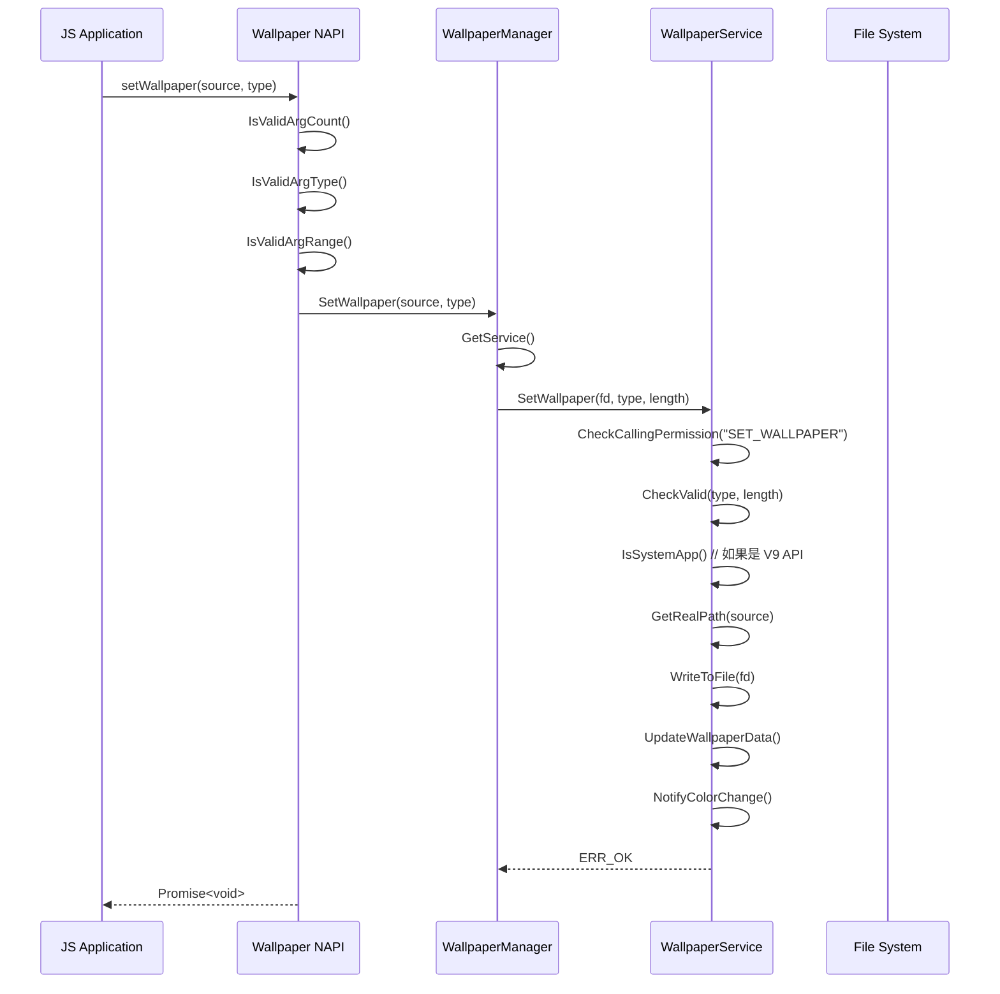
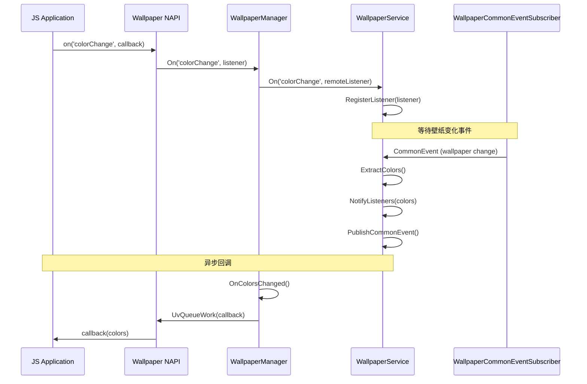

# 架构设计

> 组件图、数据流、线程模型与关键时序

## 整体架构



## 模块职责

### JS/NAPI 层
- **入口**: `native_module.cpp:Init()` [证据: native_module.cpp:95-137]
- **职责**: JS 到 Native 的绑定
- **输出**: `libwallpaper.so`

### Native 客户端层
- **入口**: `wallpaper_manager.h:WallpaperManager` [证据: wallpaper_manager.h:40-211]
- **职责**: 客户端接口封装、IPC 代理管理
- **输出**: `libwallpapermanager.so`

### 服务层
- **入口**: `wallpaper_service.h:WallpaperService` [证据: wallpaper_service.h:53-222]
- **职责**: 壁纸业务逻辑、文件管理、事件通知
- **输出**: `libwallpaper_service.so`

## IPC 架构

### System Ability 配置

| 属性 | 值 |
|------|-----|
| **SA ID** | `WALLPAPER_MANAGER_SERVICE_ID` |
| **注册位置** | `services/src/wallpaper_service.cpp:66` |
| **注册宏** | `REGISTER_SYSTEM_ABILITY_BY_ID(WallpaperService, WALLPAPER_MANAGER_SERVICE_ID, true);` |
| **配置文件** | `services/profile/3705.json` |

### IPC 命令码

| 命令 | 值 | 说明 |
|------|-----|------|
| `COMMAND_SET_WALLPAPER` | - | 设置壁纸 |
| `COMMAND_SET_ALL_WALLPAPERS` | - | 设置多态壁纸 |
| `COMMAND_SET_WALLPAPER_BY_PIXEL_MAP` | - | PixelMap 设置 |
| `COMMAND_GET_PIXEL_MAP` | - | 获取壁纸图片 |
| `COMMAND_GET_PIXEL_MAP_V9` | - | V9 获取图片 |
| `COMMAND_GET_COLORS` | - | 获取颜色 |
| `COMMAND_GET_COLORS_V9` | - | V9 获取颜色 |
| `COMMAND_ON` | - | 订阅事件 |
| `COMMAND_OFF` | - | 取消订阅 |
| `COMMAND_RESET_WALLPAPER` | - | 重置壁纸 |

**完整命令码定义**: 见 `IWallpaperService.idl`

### 客户端连接流程



**代码位置**: `wallpaper_manager.cpp:97-128` [证据: wallpaper_manager.cpp:97-128]

### 死亡通知与重连



**代码位置**: `wallpaper_manager.cpp:130-143`

## 数据流

### 设置壁纸数据流



### 获取壁纸数据流



## 线程模型

### 服务端线程

| 线程 | 职责 | 绑定 |
|------|------|------|
| **Main Thread** | SA 生命周期、OnStart/OnStop | SystemAbility |
| **Event Handler** | 异步任务处理 | `WallpaperService::serviceHandler_` |
| **IPC Thread** | IPC 请求处理 | IPC Framework |

**服务初始化** (services/src/wallpaper_service.cpp:106-150):
```cpp
void WallpaperService::OnStart()
{
    InitData();           // 初始化数据
    InitServiceHandler(); // 创建 EventHandler
    Publish(this);        // 发布服务
}
```

### 客户端线程

| 场景 | 线程 |
|------|------|
| 同步 API | 调用线程（JS 线程） |
| 异步 API | ThreadPool 工作线程 |
| IPC 回调 | JS 线程（通过 napi 队列） |

### 回调机制



**事件类型**:
- `ON_COLORS_CHANGE` - 颜色变化
- `ON_WALLPAPER_CHANGE` - 壁纸变化

## 关键时序

### 时序图 1: 设置壁纸完整流程



### 时序图 2: 订阅颜色变化事件



## 文件存储结构

### 壁纸文件路径

```bash
/data/service/el1/public/wallpaper/
├── {userId}/
│   ├── system/
│   │   ├── wallpaper_system_orig  # 原始系统壁纸
│   │   ├── wallpaper_home        # 主页壁纸
│   │   └── live/                 # 动态壁纸
│   └── lockscreen/
│       ├── wallpaper_lock_orig   # 原始锁屏壁纸
│       └── wallpaper_lock        # 锁屏壁纸
```

**代码位置**: `services/src/wallpaper_service.cpp:90-108`

### 配置文件
- **默认壁纸**: `/system/etc/wallpaperdefault.jpeg`
- **默认锁屏壁纸**: `/system/etc/wallpaperlockdefault.jpeg`

---

## 相关文档

- API 参考: [03_API.md](03_API.md)
- 构建配置: [05_Build.md](05_Build.md)
- 安全评估: [06_Security.md](06_Security.md)
