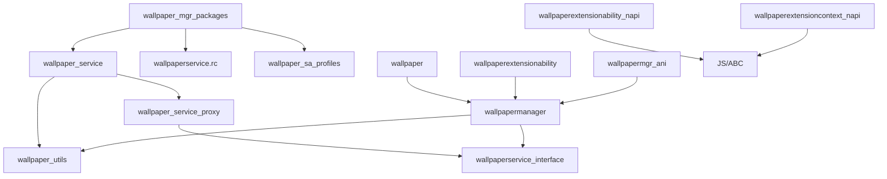

# GN 构建配置

> Targets 清单、依赖关系与编译产物

## 根构建文件

**文件**: `BUILD.gn` [证据: BUILD.gn:17-25]

```gn
group("wallpaper_mgr_packages") {
  if (is_standard_system) {
    deps = [
      "services:wallpaper_service",
      "services/etc/init:wallpaperservice.rc",
      "services/profile:wallpaper_sa_profiles",
    ]
  }
}
```

## 核心 Targets

### 1. wallpaper_service

| 属性 | 值 |
|------|-----|
| **类型** | ohos_shared_library |
| **输出** | `libwallpaper_service.so` |
| **Sources** | `component_name.cpp`, `wallpaper_common_event_manager.cpp`, `wallpaper_common_event_subscriber.cpp`, `wallpaper_data.cpp`, `wallpaper_event_listener_proxy.cpp`, `wallpaper_service.cpp`, `wallpaper_service_cb_proxy.cpp`, (+ conditional: `wallpaper_extension_ability_connection.cpp`, `wallpaper_extension_ability_death_recipient.cpp`) |
| **Configs** | `:wallpaper_service_config` |
| **Include Dirs** | `${wallpaper_path}/frameworks/native/include`, `${wallpaper_path}/utils/include` |
| **Deps** | `${utils_path}:wallpaper_utils`, `${wallpaper_path}/frameworks/native:wallpaper_service_proxy` |
| **External Deps** | `ability_connect_callback_stub`, `libaccesstoken_sdk`, `libtokenid_sdk`, `utils`, `cesfwk_innerkits`, `configpolicy_util`, `libeventhandler`, `color_manager`, `color_picker`, `libhilog`, `hitrace_meter`, `image_native`, `libbegetutil`, `ipc_single`, `cjson`, `memmgrclient`, `os_account_innerkits`, `system_ability_fwk`, `samgr_proxy`, `libwsutils` |
| **Defines** | `THEME_SERVICE` (if theme_service=true) |
| **Sanitize** | `cfi`, `cfi_cross_dso`, `cfi_vcall_icall_only`, `integer_overflow`, `boundary_sanitize`, `ubsan` |
| **Subsystem** | theme |
| **Part** | wallpaper_mgr |

**文件位置**: `services/BUILD.gn`

### 2. wallpapermanager

| 属性 | 值 |
|------|-----|
| **类型** | ohos_shared_library |
| **输出** | `libwallpapermanager.so` |
| **Sources** | `wallpaper_event_listener_client.cpp`, `wallpaper_event_listener_stub.cpp`, `wallpaper_manager.cpp`, `wallpaper_manager_client.cpp`, `wallpaper_picture_info_by_parcel.cpp`, `wallpaper_rawdata.cpp`, `wallpaper_service_cb_stub.cpp`, + generated files |
| **Public Configs** | `:wallpaper_manager_config` |
| **Deps** | `:wallpaperservice_interface`, `${utils_path}:wallpaper_utils` |
| **External Deps** | `utils`, `libhilog`, `hitrace_meter`, `image_native`, `ipc_single`, `ace_napi`, `media_client`, `samgr_proxy`, `libdm` |
| **Inner API Tags** | `platformsdk` |
| **Subsystem/Part** | `theme/wallpaper_mgr` |

**文件位置**: `frameworks/native/BUILD.gn`

### 3. wallpaper

| 属性 | 值 |
|------|-----|
| **类型** | ohos_shared_library |
| **输出** | `libwallpaper.so` (in `module/`) |
| **Sources** | `call.cpp`, `js_error.cpp`, `napi_wallpaper_ability.cpp`, `native_module.cpp`, `wallpaper_js_util.cpp` |
| **Include Dirs** | `${wallpaper_path}/frameworks/js/napi`, `${wallpaper_path}/frameworks/native/include`, `${wallpaper_path}/utils/include` |
| **Deps** | `${wallpaper_path}/frameworks/native:wallpapermanager` |
| **External Deps** | `utils`, `libgraphic_utils`, `libhilog`, `image`, `image_native`, `ipc_single`, `ace_napi`, `media_client` |
| **Relative Install Dir** | `module` |

**文件位置**: `frameworks/js/napi/BUILD.gn`

### 4. wallpaper_utils

| 属性 | 值 |
|------|-----|
| **类型** | ohos_shared_library |
| **输出** | `libwallpaper_utils.so` |
| **Sources** | `command.cpp`, `dump_helper.cpp`, `fault_reporter.cpp`, `file_deal.cpp`, `memory_guard.cpp` |
| **Include Dirs** | `dfx/hidumper_adapter`, `dfx/hisysevent_adapter`, `include` |
| **External Deps** | `libhilog`, `libhisysevent` |
| **Inner API Tags** | `platformsdk_indirect` |

**文件位置**: `utils/BUILD.gn`

### 5. wallpaperextensionability

| 属性 | 值 |
|------|-----|
| **类型** | ohos_shared_library |
| **输出** | `libwallpaperextensionability.so` |
| **Sources** | `js_wallpaper_extension_ability.cpp`, `js_wallpaper_extension_context.cpp`, `wallpaper_extension_ability.cpp`, `wallpaper_extension_context.cpp` |
| **Configs** | `:ability_config` |
| **Deps** | `${wallpaper_path}/frameworks/native:wallpapermanager` |
| **External Deps** | `want`, `ability_context_native`, `ability_manager`, `ability_start_options`, `abilitykit_utils`, `app_context`, `extensionkit_native`, `napi_common`, `runtime`, `utils`, `libeventhandler`, `libhilog`, `hitrace_meter`, `ipc_napi`, `ipc_single`, `ace_napi`, `media_client`, `libwm` |

**文件位置**: `frameworks/kits/extension/BUILD.gn`

## ArkTS/Taihe Targets

### wallpapermgr_ani

| 属性 | 值 |
|------|-----|
| **类型** | taihe_shared_library |
| **Sources** | Generated files + `ani_constructor.cpp`, `ohos.wallpaper.impl.cpp`, `ani_wallpaper.cpp` |
| **Include Dirs** | `${wallpaper_path}/frameworks/js/napi`, `${wallpaper_path}/frameworks/native/include`, `${wallpaper_path}/utils/include`, `${wallpaper_path}/utils/dfx/hisysevent_adapter`, `${wallpaper_path}/frameworks/ets/taihe/wallpapermgr/include` |
| **Deps** | `:run_taihe`, `${wallpaper_path}/frameworks/native:wallpapermanager` |
| **External Deps** | `abilitykit_native`, `ani_base_context`, `app_context`, `extensionkit_native`, `napi_base_context`, `libhilog`, `media_client`, `image_taihe`, `image_native` |

**文件位置**: `frameworks/ets/taihe/wallpapermgr/BUILD.gn`

## 服务配置 Targets

### wallpaperservice.rc

| 属性 | 值 |
|------|-----|
| **类型** | ohos_prebuilt_etc |
| **Source** | `wallpaperservice.cfg` |
| **Install Dir** | `init/` |
| **Subsystem/Part** | `theme/wallpaper_mgr` |

### wallpaper_sa_profiles

| 属性 | 值 |
|------|-----|
| **类型** | ohos_sa_profile |
| **Sources** | `3705.json` |
| **Part** | wallpaper_mgr |

## 产物清单

| 产物 | 路径 | 说明 |
|------|------|------|
| `libwallpaper_service.so` | `system/lib/` | 服务端库 |
| `libwallpapermanager.so` | `system/lib/` | 客户端库 |
| `libwallpaper.so` | `system/lib/module/` | NAPI 库 |
| `libwallpaper_utils.so` | `system/lib/` | 工具库 |
| `libwallpaperextensionability.so` | `system/lib/` | Extension 库 |
| `wallpaperservice.cfg` | `system/etc/init/` | 服务配置 |
| `wallpaperservice.rc` | `system/etc/` | rc 脚本 |
| `3705.json` | `system/profile/` | SA 配置 |

## 依赖关系图



## 构建命令

```bash
# 完整构建
hb set
hb build -f

# 只构建 wallpaper_mgr
ninja -C out wallpaper_service
ninja -C out wallpapermgr

# 运行测试
ninja -C out wallpaper_mgr_unittest
```

## 条件编译

### theme_service 标志

**配置文件**: `wallpaper.gni:32-38`

```gn
declare_args() {
  theme_service = false
  if (defined(global_parts_info) &&
      defined(global_parts_info.theme_theme_mgr)) {
    theme_service = true
  }
}
```

**影响**:
- `THEME_SERVICE` 宏定义
- Extension ability 相关代码编译

---

## 相关文档

- 目录结构: [02_Directory_Structure.md](02_Directory_Structure.md)
- 架构设计: [04_Architecture.md](04_Architecture.md)
