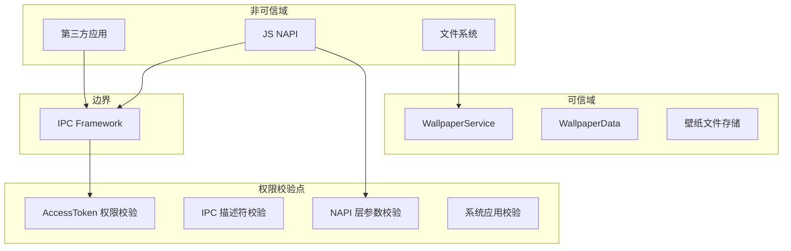

# 安全风险评审

> 攻击面分析、信任边界与安全风险点

## 威胁模型概览

### 外部输入

| 输入源 | 类型 | 信任程度 |
|--------|------|----------|
| JS 应用 | N-API 调用 | 中等（需权限校验） |
| 第三方应用 | IPC 调用 | 低（需权限校验） |
| 系统应用 | V9 API | 高（系统应用） |
| 文件系统 | 图片/视频文件 | 低（需路径校验） |
| IPC 消息 | Parcel 数据 | 中等（需描述符校验） |

### 敏感操作

- 修改系统壁纸文件
- 读取壁纸文件描述符
- 查询用户壁纸信息
- 订阅壁纸变化事件

## 信任边界



## 权限检查机制

### 权限常量

**文件**: `utils/include/wallpaper_common.h:27-29`

```cpp
static const std::string WALLPAPER_PERMISSION_NAME_GET_WALLPAPER = "ohos.permission.GET_WALLPAPER";
static const std::string WALLPAPER_PERMISSION_NAME_SET_WALLPAPER = "ohos.permission.SET_WALLPAPER";
static const std::string WALLPAPER_PERMISSION_NAME_CAPTURE_SCREEN = "ohos.permission.CAPTURE_SCREEN";
```

### 权限校验函数

**文件**: `services/src/wallpaper_service.cpp:1216-1225`

```cpp
bool WallpaperService::CheckCallingPermission(const std::string &permissionName)
{
    AccessTokenID callerToken = IPCSkeleton::GetCallingTokenID();
    int32_t result = AccessTokenKit::VerifyAccessToken(callerToken, permissionName);
    if (result != TypePermissionState::PERMISSION_GRANTED) {
        HILOG_ERROR("Check permission failed!");
        return false;
    }
    return true;
}
```

## 攻击面清单

| 攻击面 | 描述 | 风险等级 |
|--------|------|----------|
| N-API 接口 | JS 到 Native 的参数传递 | 中 |
| IPC 接口 | 跨进程通信数据 | 中 |
| 文件系统 | 壁纸文件读写 | 高 |
| 用户输入 | URI、PixelMap 数据 | 中 |
| 事件订阅 | 回调函数处理 | 低 |

## 可利用点与修复建议

### 1. ⚠️ 路径遍历攻击风险

**证据**: `utils/src/file_deal.cpp:155-172`

```cpp
bool FileDeal::GetRealPath(const std::string &inOriPath, std::string &outRealPath)
{
    char realPath[PATH_MAX + 1] = { 0x00 };
    if (inOriPath.size() > PATH_MAX || realpath(inOriPath.c_str(), realPath) == nullptr) {
        HILOG_ERROR("get real path fail!");
        return false;
    }
    outRealPath = std::string(realPath);
    if (!IsFileExist(outRealPath)) {
        HILOG_ERROR("real path file is not exist! %{public}s", outRealPath.c_str());
        return false;
    }
    if (outRealPath != inOriPath) {
        HILOG_ERROR("illegal file path input %{public}s", inOriPath.c_str());
        return false;
    }
    return true;
}
```

**问题**:
- 路径比较 `outRealPath != inOriPath` 无法区分符号链接
- 攻击者可创建符号链接指向敏感文件

**触发方式**:
```javascript
// 尝试设置符号链接指向 /etc/passwd
wallpaper.setWallpaper('/data/link_to_shadow', WALLPAPER_SYSTEM);
```

**影响**: 覆盖系统文件或读取敏感文件

**修复建议**:
```cpp
// 建议使用 O_NOFOLLOW 标志打开文件
int fd = open(inOriPath.c_str(), O_RDONLY | O_NOFOLLOW);
if (fd < 0) {
    HILOG_ERROR("Symbolic link attack detected!");
    return false;
}
close(fd);
```

**状态**: ⚠️ 当前实现存在风险

---

### 2. ⚠️ 文件大小限制绕过风险

**证据**: `services/src/wallpaper_service.cpp:1549-1568`

```cpp
ErrorCode WallpaperService::CheckValid(int32_t wallpaperType, int32_t length, WallpaperResourceType resourceType)
{
    // ... 权限检查 ...
    int32_t maxLength = resourceType == VIDEO ? MAX_VIDEO_SIZE : FOO_MAX_LEN;
    if (length <= 0) {
        return E_PARAMETERS_INVALID;
    }
    if (length > maxLength) {
        return E_PICTURE_OVERSIZED;
    }
    return NO_ERROR;
}
```

**问题**:
- `length` 参数来自客户端，未验证真实性
- 可通过伪造 length 绕过大小限制

**触发方式**:
```javascript
// 发送假的 length 参数
// 实际文件 200MB，但声明 10MB
wallpaper.setWallpaper('/path/to/large_file.jpg', WALLPAPER_SYSTEM);
```

**影响**: 消耗过多存储或内存

**修复建议**:
```cpp
// 使用 fstat 验证实际文件大小
struct stat st;
if (fstat(fd, &st) < 0) {
    return E_PARAMETERS_INVALID;
}
if (st.st_size > maxLength) {
    return E_PICTURE_OVERSIZED;
}
```

**状态**: ⚠️ 当前实现依赖客户端声明

---

### 3. ⚠️ 访客用户权限绕过风险

**证据**: `services/src/wallpaper_service.cpp:1363-1377`

```cpp
bool WallpaperService::CheckUserPermissionById(int32_t userId)
{
    OsAccountInfo osAccountInfo;
    ErrCode errCode = OsAccountManager::QueryOsAccountById(userId, osAccountInfo);
    if (errCode != ERR_OK) {
        HILOG_ERROR("Query os account info failed, errCode: %{public}d", errCode);
        return false;
    }
    if (osAccountInfo.GetType() == OsAccountType::GUEST) {
        HILOG_ERROR("The guest does not have permissions.");
        return false;
    }
    return true;
}
```

**问题**:
- `userId` 参数可被客户端控制
- 查询失败时静默返回 false，可能影响正常用户

**触发方式**:
```javascript
// 尝试使用非当前用户的 ID
wallpaper.reset(0, { asUser: { id: 999 } });
```

**影响**: 访客用户可能被错误拒绝或正常用户受影响

**修复建议**:
```cpp
// 始终使用 IPCSkeleton::GetCallingUid() 获取真实用户 ID
int32_t GetRealUserId() {
    return IPCSkeleton::GetCallingUid() % 20000; // OpenHarmony 用户 ID 范围
}
```

**状态**: ⚠️ 依赖客户端传入 userId

---

### 4. ✅ IPC 描述符校验

**证据**: `frameworks/native/src/wallpaper_event_listener_stub.cpp:24-33`

```cpp
int32_t WallpaperEventListenerStub::OnRemoteRequest(uint32_t code, MessageParcel &data, MessageParcel &reply, MessageOption &option)
{
    std::u16string descriptor = WallpaperEventListenerStub::GetDescriptor();
    std::u16string remoteDescriptor = data.ReadInterfaceToken();
    if (descriptor != remoteDescriptor) {
        HILOG_ERROR("local descriptor is not equal to remote.");
        return E_CHECK_DESCRIPTOR_ERROR;
    }
    // ...
}
```

**评估**: ✅ 正确实现描述符校验

---

### 5. ✅ 系统应用校验

**证据**: `services/src/wallpaper_service.cpp:1282-1287`

```cpp
bool WallpaperService::IsSystemApp()
{
    uint64_t tokenId = IPCSkeleton::GetCallingFullTokenID();
    return TokenIdKit::IsSystemAppByFullTokenID(tokenId);
}
```

**评估**: ✅ 正确使用系统 API 校验

---

### 6. ⚠️ 事件订阅无权限校验

**证据**: `services/src/wallpaper_service.cpp:1125-1140`

```cpp
ErrCode WallpaperService::On(const std::string &type, const sptr<IWallpaperEventListener> &listener)
{
    if (type == WALLPAPER_CHANGE) {
        if (!IsSystemApp()) {
            HILOG_ERROR("On wallpaperChange is not system app");
            return E_NOT_SYSTEM_APP;
        }
        // ...
    }
    // colorChange 无权限校验
}
```

**问题**:
- `on('colorChange')` 无权限校验
- 任何应用可订阅壁纸颜色变化

**触发方式**:
```javascript
// 订阅壁纸颜色变化
wallpaper.on('colorChange', (colors, type) => {
    console.log('壁纸颜色:', colors);
});
```

**影响**: 隐私泄露风险

**修复建议**:
```cpp
// 添加 GET_WALLPAPER 权限校验
ErrCode WallpaperService::On(const std::string &type, ...) {
    if (type == COLOR_CHANGE) {
        if (!CheckCallingPermission(WALLPAPER_PERMISSION_NAME_GET_WALLPAPER)) {
            return E_NO_PERMISSION;
        }
    }
    // ...
}
```

**状态**: ⚠️ colorChange 事件无权限保护

---

### 7. ⚠️ 内存映射风险

**证据**: `services/src/wallpaper_service.cpp:1926-1950`

```cpp
// PixelMap 创建
std::shared_ptr<OHOS::Media::PixelMap> pixelMap = ...;
// 直接从 fd 创建，未验证数据完整性
```

**问题**:
- 未验证图片数据格式
- 恶意图片可能导致整数溢出或拒绝服务

**影响**: 拒绝服务或潜在代码执行

**修复建议**:
```cpp
// 使用 image_framework 的安全解析
auto imageSource = ImageSource::CreateImageSource(fd, size, ...);
auto decodeOptions = ...; // 设置安全限制
auto pixelMap = pixelMapFactory->CreatePixelMap(decodeOptions);
```

**状态**: ⚠️ 依赖 image_framework 安全性

---

## 服务配置安全

**文件**: `services/etc/init/wallpaperservice.cfg`

```json
"permission" : [
    "ohos.permission.MANAGE_LOCAL_ACCOUNTS",
    "ohos.permission.PUBLISH_SYSTEM_COMMON_EVENT",
    "ohos.permission.ACTIVATE_THEME_PACKAGE",
    "ohos.permission.GET_BUNDLE_INFO_PRIVILEGED",
    "ohos.permission.CONNECT_WALLPAPER_EXTENSION"
],
"secon" : "u:r:wallpaper_service:s0"
```

**评估**: ✅ SELinux 上下文正确配置

## 风险汇总

| 风险点 | 风险等级 | 状态 | 建议优先级 |
|--------|----------|------|------------|
| 路径遍历 | 高 | ⚠️ | P0 |
| 文件大小绕过 | 中 | ⚠️ | P1 |
| 访客用户检查 | 中 | ⚠️ | P1 |
| colorChange 无权限 | 中 | ⚠️ | P1 |
| 图片解析安全 | 中 | ⚠️ | P2 |
| IPC 描述符校验 | 低 | ✅ | - |
| 系统应用校验 | 低 | ✅ | - |
| SELinux 配置 | 低 | ✅ | - |

## 安全加固建议

### 短期（P0-P1）

1. **修复路径遍历**: 添加 `O_NOFOLLOW` 标志
2. **验证文件大小**: 使用 `fstat` 验证实际文件大小
3. **保护 colorChange 事件**: 添加权限校验

### 中期（P2）

4. **沙箱化壁纸存储**: 限制壁纸文件权限
5. **图片格式验证**: 在解析前验证魔数
6. **添加安全审计**: 记录敏感操作

### 长期

7. **最小权限原则**: 审查所有 IPC 接口权限
8. **模糊测试**: 增强 fuzz test 覆盖
9. **安全编码规范**: 团队安全培训

---

## 相关文档

- API 参考: [03_API.md](03_API.md)
- 架构设计: [04_Architecture.md](04_Architecture.md)
- 调试指南: [08_Debug.md](08_Debug.md)
