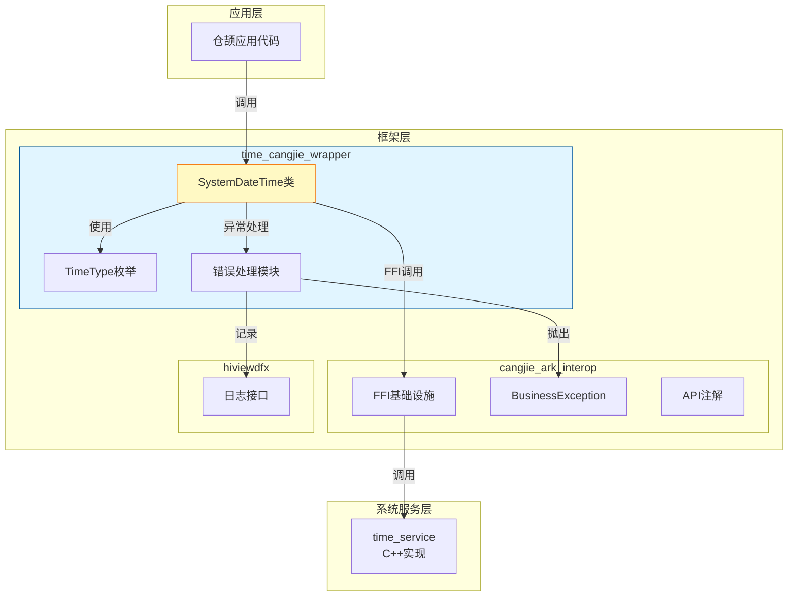
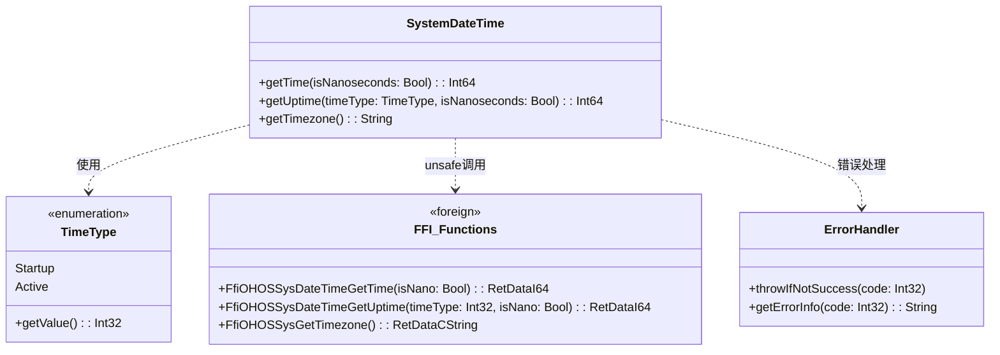
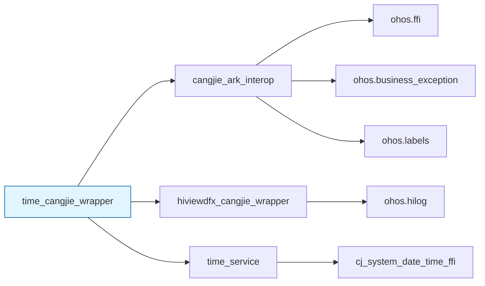
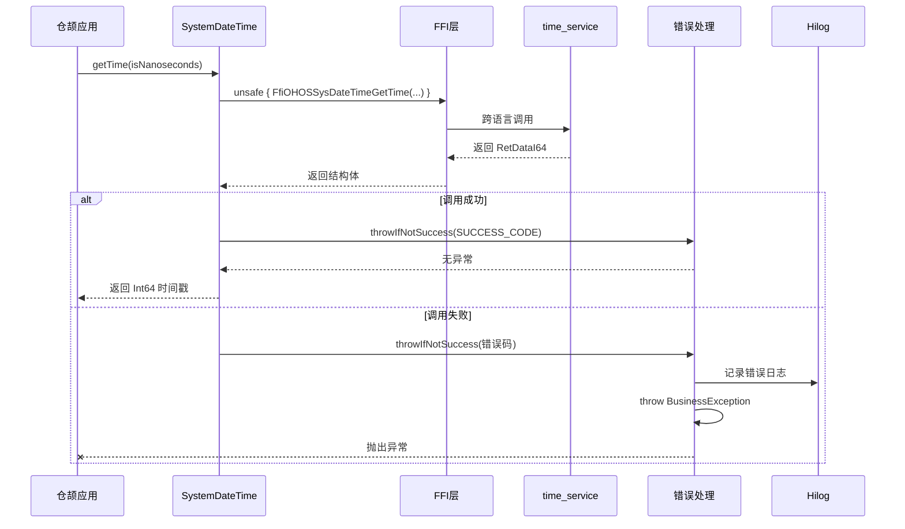
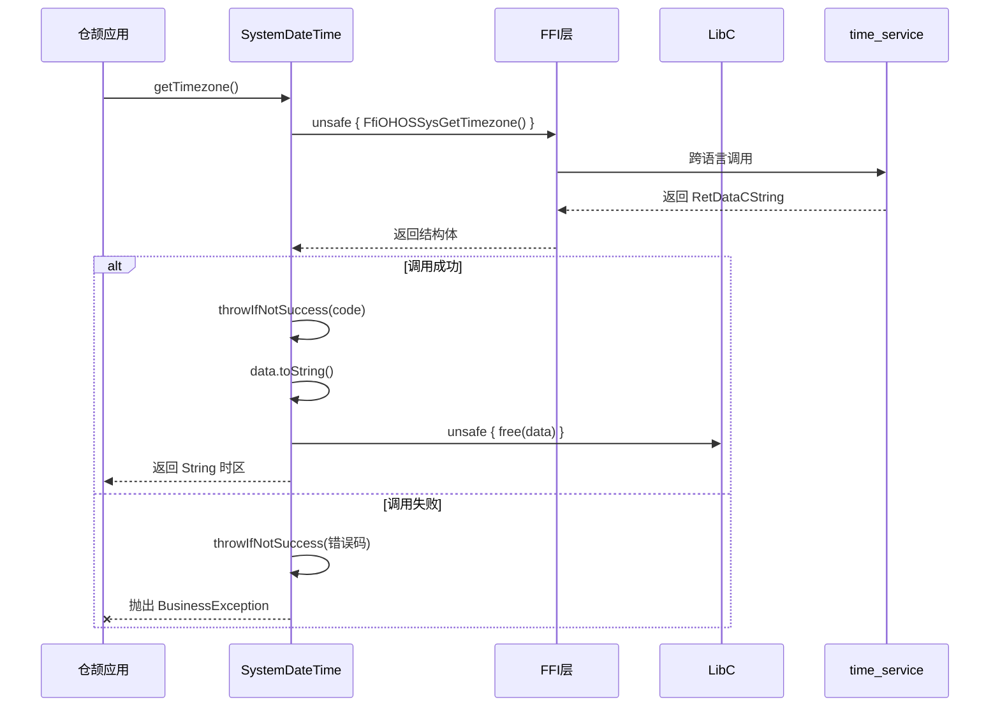
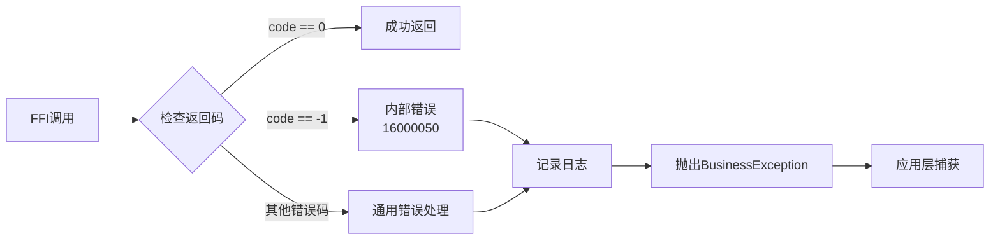

# 02 - 架构分析

**目的**: 深入理解FFI架构设计、组件依赖和数据流  
**适用范围**: 架构师、高级开发者、安全研究员  
**前置知识**: 阅读 [01_Overview.md](./01_Overview.md)

---

## 架构概述

### 架构定位

本项目采用 **Wrapper/Facade模式 + FFI桥接模式**，在OpenHarmony架构中定位为：

| 层级 | 组件 | 本项目位置 |
|------|------|-----------|
| 应用层 (Application) | 仓颉应用 | ❌ 不在这里 |
| 框架层 (Framework) | 本封装层 | ✅ **在这里** |
| 系统服务层 (System Service) | time_service | ❌ 调用目标 |
| 内核层 (Kernel) | Linux时间子系统 | ❌ 间接依赖 |

### 架构设计目标

1. **语言桥接**: 让仓颉应用能够访问系统时间服务
2. **接口封装**: 提供类型安全、异常友好的Cangjie API
3. **跨平台支持**: 通过Mock实现支持Windows/Mac开发环境

---

## 组件架构图

### 分层组件图



### 核心类图



---

## 依赖关系详解

### 外部依赖组件

#### 1. cangjie_ark_interop (必需)

**作用**: 提供仓颉与OpenHarmony生态的互操作基础设施

| 子模块 | 用途 | 本项目使用位置 |
|--------|------|---------------|
| `ohos.ffi` | FFI类型定义 (RetCode, RetDataI64, RetDataCString) | `system_date_time.cj:20` |
| `ohos.business_exception` | 业务异常基类 | `cj_date_time_error.cj:20` |
| `ohos.labels` | API级别注解 (@APILevel) | 所有公共API |

**证据**: `ohos/system_date_time/BUILD.gn:30-34`

#### 2. hiviewdfx_cangjie_wrapper (必需)

**作用**: 提供日志记录能力

| 子模块 | 用途 | 本项目使用位置 |
|--------|------|---------------|
| `ohos.hilog` | 日志输出接口 | `cj_date_time_error.cj:39` |

**日志域ID**: `0xD001C04`

**证据**: `ohos/system_date_time/cj_date_time_error.cj:24`

#### 3. time_service (必需)

**作用**: 提供底层时间/时区功能的C++实现

| FFI接口 | 对应功能 | C++实现位置 |
|---------|----------|-------------|
| `cj_system_date_time_ffi` | 时间服务FFI层 | time_service仓库 |

**证据**: `ohos/system_date_time/BUILD.gn:37`

### 依赖关系图



---

## 数据流分析

### 调用链: getTime()



### 调用链: getTimezone()



**关键注意**: `getTimezone()` 涉及手动内存管理 (`LibC.free`)，需确保内存正确释放。

**证据**: `ohos/system_date_time/system_date_time.cj:96-100`

---

## FFI机制详解

### FFI声明

**位置**: `ohos/system_date_time/system_date_time.cj:23-39`

```cangjie
foreign {
    // 实际使用的函数
    func FfiOHOSSysDateTimeGetTime(isNano: Bool): RetDataI64
    func FfiOHOSSysDateTimeGetUptime(timeType: Int32, isNano: Bool): RetDataI64
    func FfiOHOSSysGetTimezone(): RetDataCString
    
    // 声明但未使用的函数
    func FfiOHOSSysDateTimeSetTime(time: Int64): RetCode
    func FfiOHOSSysDateTimegetCurrentTime(isNano: Bool): RetDataI64
    func FfiOHOSSysDateTimegetRealActiveTime(isNano: Bool): RetDataI64
    func FfiOHOSSysDateTimegetRealTime(isNano: Bool): RetDataI64
    func FfiOHOSSysSetTimezone(Timezone: CString): RetCode
}
```

### FFI数据类型

| 类型 | 定义位置 | 用途 |
|------|----------|------|
| `RetCode` | ohos.ffi | 返回码 (Int32包装) |
| `RetDataI64` | ohos.ffi | 64位整数返回结构体 |
| `RetDataCString` | ohos.ffi | C字符串返回结构体 |

**结构体推测** (基于使用方式):

```c
// RetDataI64 可能结构
typedef struct {
    int32_t code;      // 返回码
    int64_t data;      // 实际数据
} RetDataI64;

// RetDataCString 可能结构
typedef struct {
    int32_t code;      // 返回码
    char* data;        // C字符串指针，需手动释放
} RetDataCString;
```

### unsafe代码块

所有FFI调用都必须包装在 `unsafe {}` 块中：

```cangjie
// 正确用法
let cValue = unsafe { FfiOHOSSysDateTimeGetTime(isNanoseconds) }

// 使用后立即检查
throwIfNotSuccess(cValue.code)
```

**注意**: `unsafe` 关键字表示以下操作不受编译器安全检查：
- 跨语言边界调用
- 内存操作
- 指针解引用

---

## 跨平台支持

### 条件编译

**位置**: `ohos/system_date_time/BUILD.gn:20-28`

```gn
ohos_cangjie_shared_library("ohos.system_date_time") {
  if (is_mingw || is_mac){
    sources = [ "../../mock/ohos.system_date_time.cj" ]
  } else {
    sources = [
      "cj_date_time_common.cj",
      "cj_date_time_error.cj",
      "system_date_time.cj",
    ]
  }
}
```

### Mock实现

**位置**: `mock/ohos.system_date_time.cj`

当在Windows或macOS上开发时，使用Mock实现：

```cangjie
public class SystemDateTime {
    public static func getTime(isNanoseconds!: Bool = false): Int64 {
        return 0  // Mock返回值
    }
    
    public static func getTimezone(): String {
        return String()  // Mock返回值
    }
}
```

**用途**: 允许开发者在非OpenHarmony环境进行编译和基础测试。

---

## 错误处理架构

### 错误处理流程



### 错误处理代码

**位置**: `ohos/system_date_time/cj_date_time_error.cj:34-42`

```cangjie
func throwIfNotSuccess(code: Int32): Unit {
    if (code != SUCCESS_CODE) {
        if (code == -1) {
            // 内部错误码映射
            throw BusinessException(16000050, "Internal error.")
        }
        // 记录错误日志
        Hilog.error(SYSTEM_DATE_TIME_DOMAIN_ID, "Date-Time", getErrorInfo(code))
        // 抛出业务异常
        throw BusinessException(code, getErrorInfo(code))
    }
}
```

### 日志记录

| 属性 | 值 |
|------|-----|
| **日志域** | 0xD001C04 |
| **标签** | "Date-Time" |
| **级别** | Error (仅在出错时记录) |

---

## 线程模型

### 当前实现

本项目为**无状态静态方法封装**，不涉及复杂线程模型：

| 特性 | 说明 |
|------|------|
| **线程安全** | 依赖底层time_service保证 |
| **异步支持** | 无，所有API同步执行 |
| **回调机制** | 无 |

### 时区API的特殊标记

**位置**: `mock/ohos.system_date_time.cj:60-67`

```cangjie
@!APILevel[
    since: "22",
    syscap: "SystemCapability.MiscServices.Time",
    workerthread: true  // 可能在工作者线程执行
]
public static func getTimezone(): String
```

`workerthread: true` 表示该方法可能在后台线程执行，调用者需注意线程上下文。

---

## 架构优缺点分析

### 优点 ✅

1. **职责清晰**: 只做一件事 - FFI桥接
2. **类型安全**: Cangjie静态类型系统提供编译期检查
3. **异常友好**: 将C错误码转换为Cangjie异常
4. **跨平台**: Mock实现支持开发环境

### 局限 ⚠️

1. **unsafe代码**: 3处unsafe块需要谨慎维护
2. **手动内存**: getTimezone()需要手动释放内存
3. **Beta阶段**: API可能在未来调整
4. **功能受限**: 仅支持读取，不支持设置

---

## 相关文档

- [01_Overview.md](./01_Overview.md) - 项目概览和快速开始
- [04_Interface.md](./04_Interface.md) - API详细文档
- [05_AttackSurface.md](./05_AttackSurface.md) - 攻击面分析

---

**更新记录**

| 日期 | 版本 | 更新内容 |
|------|------|----------|
| 2026-02-07 | v1.0 | 初始版本，基于代码分析创建 |
