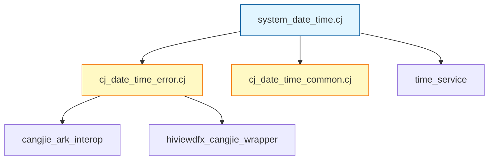

# 03 - 代码地图

**目的**: 提供快速代码导航，帮助开发者在15分钟内找到核心代码  
**适用范围**: 新加入的开发者、代码审查人员  
**使用方式**: 按需查阅，配合IDE使用

---

## 目录结构总览

```
base/time/time_cangjie_wrapper
├── figures/                     # 架构图资源
├── mock/                        # 跨平台Mock实现
├── ohos/                        # 核心源码
│   └── system_date_time/        # 时间时区接口实现
├── test/                        # 测试代码 (忽略)
├── BUILD.gn                     # 根构建配置
├── bundle.json                  # 组件元信息
├── OAT.xml                      # 开源合规配置
├── README.md                    # 英文说明
└── README_zh.md                 # 中文说明
```

---

## 顶层目录职责

| 目录/文件 | 职责 |  Wiki相关 |
|-----------|------|----------|
| `figures/` | 存放README中的架构图 | 非代码 |
| `mock/` | Windows/Mac平台的Mock实现 | [Mock实现](#mock实现) |
| `ohos/system_date_time/` | 核心Cangjie源码 | [核心源码](#核心源码目录) |
| `test/` | 测试代码 | 已忽略 |
| `BUILD.gn` | GN构建配置 | [构建配置](#构建配置) |
| `bundle.json` | OpenHarmony组件定义 | [组件配置](#组件配置) |
| `wiki/` | 本文档 | - |

---

## 核心源码目录

### ohos/system_date_time/ 结构

```
ohos/system_date_time/
├── BUILD.gn                     # 模块构建配置
├── cj_date_time_common.cj       # TimeType枚举定义
├── cj_date_time_error.cj        # 错误处理和日志
└── system_date_time.cj          # 主API类实现
```

### 源文件导航

#### system_date_time.cj

**位置**: `ohos/system_date_time/system_date_time.cj`

| 行号范围 | 内容 | 说明 |
|----------|------|------|
| 1-18 | 版权声明 | Apache License 2.0 |
| 19-21 | 包声明和导入 | `package ohos.system_date_time` |
| 23-39 | FFI声明块 | 8个外部函数声明 |
| 41-47 | SystemDateTime类注解 | @APILevel标注 |
| 48-102 | SystemDateTime类 | 3个静态方法实现 |
| 56-65 | getTime()方法 | 获取系统时间 |
| 74-82 | getUptime()方法 | 获取运行时间 |
| 90-101 | getTimezone()方法 | 获取系统时区 |

**关键符号定位**:
- `SystemDateTime` 类: **第48行**
- `getTime()` 方法: **第61行**
- `getUptime()` 方法: **第78行**
- `getTimezone()` 方法: **第95行**

#### cj_date_time_common.cj

**位置**: `ohos/system_date_time/cj_date_time_common.cj`

| 行号范围 | 内容 | 说明 |
|----------|------|------|
| 1-18 | 版权声明 | Apache License 2.0 |
| 19-21 | 包声明和导入 | `package ohos.system_date_time` |
| 26-29 | TimeType枚举注解 | @APILevel标注 |
| 30-57 | TimeType枚举 | Startup \| Active |
| 50-56 | getValue()方法 | 枚举值转换 |

**关键符号定位**:
- `TimeType` 枚举: **第30行**
- `getValue()` 方法: **第50行**

#### cj_date_time_error.cj

**位置**: `ohos/system_date_time/cj_date_time_error.cj`

| 行号范围 | 内容 | 说明 |
|----------|------|------|
| 1-18 | 版权声明 | Apache License 2.0 |
| 19-21 | 包声明和导入 | `package ohos.system_date_time` |
| 24 | 日志域ID | `0xD001C04` |
| 26-32 | getErrorInfo() | 错误消息转换 |
| 34-42 | throwIfNotSuccess() | 错误码检查与抛出 |

**关键符号定位**:
- `throwIfNotSuccess()`: **第34行**
- `SYSTEM_DATE_TIME_DOMAIN_ID`: **第24行**

---

## Mock实现

### mock/ohos.system_date_time.cj

**位置**: `mock/ohos.system_date_time.cj`

**用途**: Windows和macOS平台上的桩实现，用于开发环境编译。

| 行号范围 | 内容 | 说明 |
|----------|------|------|
| 1-18 | 版权声明 | Apache License 2.0 |
| 19-21 | 包声明和导入 | `package ohos.system_date_time` |
| 24-37 | TimeType枚举 | Mock枚举（简化版） |
| 39-72 | SystemDateTime类 | Mock实现 |

**注意**: Mock实现只返回空值，不做实际功能。

---

## 构建配置

### 根构建配置

**位置**: `BUILD.gn`

| 行号范围 | 内容 | 说明 |
|----------|------|------|
| 1-13 | 版权声明 | Apache License 2.0 |
| 14 | 导入模板 | `cjc.gni` |
| 16-18 | 包列表 | 定义要构建的包 |
| 19-21 | copy目标 | SDK库复制配置 |

**关键目标**:
- `copy_sdk_time_cangjie_libs`: **第19行**

### 模块构建配置

**位置**: `ohos/system_date_time/BUILD.gn`

| 行号范围 | 内容 | 说明 |
|----------|------|------|
| 1-13 | 版权声明 | Apache License 2.0 |
| 14 | 导入模板 | `cjc.gni` |
| 16-17 | Beta特性说明 | 注释 |
| 18 | 目标定义 | `ohos.system_date_time` |
| 20-28 | 条件源文件 | Windows/Mac使用mock |
| 30-34 | 仓颉外部依赖 | cangjie_ark_interop等 |
| 37 | C++外部依赖 | time_service |
| 39-40 | 组件元数据 | subsystem_name, part_name |

**关键目标**:
- `ohos.system_date_time`: **第18行**

---

## 组件配置

### bundle.json

**位置**: `bundle.json`

| 行号范围 | 内容 | 说明 |
|----------|------|------|
| 1-6 | 基本信息 | 名称、描述、版本 |
| 7-9 | 发布配置 | code-segment |
| 12-14 | 组件定义 | 名称、子系统 |
| 16-17 | 系统能力 | 空列表 |
| 20-22 | 适配系统 | standard |
| 23-24 | 资源占用 | ROM/RAM |
| 25-31 | 依赖组件 | 3个外部依赖 |
| 32-46 | 构建配置 | sub_component, inner_kits |

**关键配置**:
- 组件名: **第13行**
- 依赖列表: **第26-30行**
- 构建入口: **第34行**

---

## 功能到代码映射

### API到代码位置

| API | 功能 | 代码位置 | 行号 |
|-----|------|----------|------|
| `SystemDateTime.getTime()` | 获取系统时间 | `system_date_time.cj` | 61-65 |
| `SystemDateTime.getUptime()` | 获取运行时间 | `system_date_time.cj` | 78-82 |
| `SystemDateTime.getTimezone()` | 获取系统时区 | `system_date_time.cj` | 95-101 |
| `TimeType.Startup` | 启动时间类型 | `cj_date_time_common.cj` | 38 |
| `TimeType.Active` | 活跃时间类型 | `cj_date_time_common.cj` | 47 |
| `TimeType.getValue()` | 枚举值转换 | `cj_date_time_common.cj` | 50-56 |

### FFI函数声明到实现

| FFI函数 | 用途 | 声明位置 | 行号 |
|---------|------|----------|------|
| `FfiOHOSSysDateTimeGetTime` | 获取系统时间 | `system_date_time.cj` | 32 |
| `FfiOHOSSysDateTimeGetUptime` | 获取运行时间 | `system_date_time.cj` | 34 |
| `FfiOHOSSysGetTimezone` | 获取时区 | `system_date_time.cj` | 38 |

### 错误处理到代码

| 功能 | 代码位置 | 行号 |
|------|----------|------|
| 错误码检查 | `cj_date_time_error.cj` | 34-42 |
| 错误消息获取 | `cj_date_time_error.cj` | 26-32 |
| 日志域定义 | `cj_date_time_error.cj` | 24 |

---

## 快速导航指南

### 场景1: 我想修改API行为

**目标**: 修改 `getTime()` 的行为

**步骤**:
1. 打开 `ohos/system_date_time/system_date_time.cj`
2. 跳转到 **第61行**
3. 修改 `getTime()` 方法实现

### 场景2: 我想添加新的时间类型

**目标**: 在 `TimeType` 中添加新枚举值

**步骤**:
1. 打开 `ohos/system_date_time/cj_date_time_common.cj`
2. 跳转到 **第30行**（TimeType枚举定义）
3. 在 `Active` 后添加新的枚举值
4. 在 `getValue()` 方法（**第50行**）中添加对应分支

### 场景3: 我想修改错误处理

**目标**: 修改错误码映射

**步骤**:
1. 打开 `ohos/system_date_time/cj_date_time_error.cj`
2. 跳转到 **第34行**（`throwIfNotSuccess`函数）
3. 修改错误码处理逻辑

### 场景4: 我想了解构建配置

**目标**: 查看如何添加新的依赖

**步骤**:
1. 打开 `ohos/system_date_time/BUILD.gn`
2. 查看 **第30-34行**（`cj_external_deps`）
3. 在列表中添加新依赖

---

## 文件依赖关系



---

## 代码统计

| 指标 | 数值 |
|------|------|
| **核心源文件数** | 3个 |
| **总代码行数** | ~200行 |
| **公共API数** | 3个方法 + 1个枚举 |
| **FFI函数数** | 8个（使用3个） |
| **外部依赖** | 3个组件 |

---

## 相关文档

- [01_Overview.md](./01_Overview.md) - 项目概览
- [02_Architecture.md](./02_Architecture.md) - 架构分析
- [07_Build.md](./07_Build.md) - 构建与产物

---

**更新记录**

| 日期 | 版本 | 更新内容 |
|------|------|----------|
| 2026-02-07 | v1.0 | 初始版本，基于代码分析创建 |
