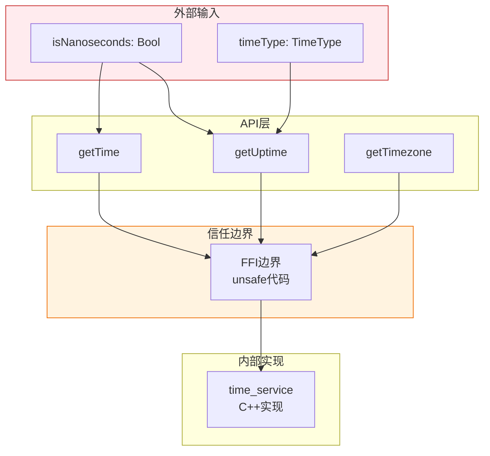
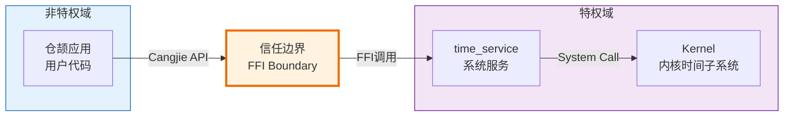

# 05 - 攻击面分析

**目的**: 识别所有外部输入入口和信任边界，服务安全研究  
**适用范围**: 安全研究员、安全审计人员  
**前置知识**: 阅读 [02_Architecture.md](./02_Architecture.md)

---

## 执行摘要

### 风险评级

| 维度 | 评估结果 |
|------|----------|
| **整体风险等级** | 🟢 **低风险** |
| **攻击面大小** | 极小 |
| **可利用性** | 低 |
| **潜在影响** | 低 |

### 核心结论

1. **本项目仅提供读取操作**，无写入/修改系统时间的能力
2. **无用户可控输入**，所有参数为简单的布尔/枚举类型
3. **攻击面极小**，仅3个API入口
4. **主要风险在FFI边界**，需关注内存安全和错误处理

---

## 攻击面概览

### 攻击面分布图



---

## 外部输入清单

### 输入点汇总

| # | 输入点 | 类型 | 来源 | 风险等级 | 验证方式 |
|----|--------|------|------|----------|----------|
| 1 | `isNanoseconds` | `Bool` | getTime()参数 | 🟢 低 | 无需验证（布尔类型） |
| 2 | `isNanoseconds` | `Bool` | getUptime()参数 | 🟢 低 | 无需验证（布尔类型） |
| 3 | `timeType` | `TimeType` | getUptime()参数 | 🟢 低 | 枚举匹配验证 |

### 输入点详细分析

#### 输入点1: isNanoseconds (getTime)

**位置**: `ohos/system_date_time/system_date_time.cj:61`

```cangjie
public static func getTime(isNanoseconds!: Bool = false): Int64
```

| 属性 | 分析 |
|------|------|
| **数据类型** | Bool |
| **用户可控性** | 完全可控 |
| **取值范围** | `true` 或 `false` |
| **验证逻辑** | 无需验证，布尔类型天然安全 |
| **攻击可能性** | 无 |

**处理流程**:
```
isNanoseconds (Bool) 
  ↓
直接传递给FFI (类型转换)
  ↓
FfiOHOSSysDateTimeGetTime(isNano: Bool)
```

#### 输入点2: isNanoseconds (getUptime)

**位置**: `ohos/system_date_time/system_date_time.cj:78`

与输入点1相同分析，无额外风险。

#### 输入点3: timeType

**位置**: `ohos/system_date_time/cj_date_time_common.cj:50-56`

```cangjie
func getValue(): Int32 {
    match (this) {
        case Startup => 0
        case Active => 1
        case _ => throw BusinessException(401, "Parameter error.")
    }
}
```

| 属性 | 分析 |
|------|------|
| **数据类型** | TimeType 枚举 |
| **用户可控性** | 可控，但受限 |
| **取值范围** | `Startup` 或 `Active` |
| **验证逻辑** | match语句 exhaustive check |
| **攻击可能性** | 极低 |

**注意**: 仓颉语言的枚举是类型安全的，`case _` 分支实际上不可达，但编译器要求保留以处理所有情况。

---

## 敏感操作清单

### 敏感操作汇总

| # | 操作类型 | 操作描述 | 位置 | 风险等级 |
|----|----------|----------|------|----------|
| 1 | FFI调用 | 调用外部C函数 | system_date_time.cj:62,79,96 | 🟡 中 |
| 2 | 内存释放 | 手动释放FFI返回内存 | system_date_time.cj:99 | 🟡 中 |
| 3 | 异常抛出 | 转换错误码为异常 | cj_date_time_error.cj:34-42 | 🟢 低 |
| 4 | 日志记录 | 记录错误日志 | cj_date_time_error.cj:39 | 🟢 低 |

### 敏感操作详细分析

#### 操作1: FFI调用

**位置**: 
- `ohos/system_date_time/system_date_time.cj:62`
- `ohos/system_date_time/system_date_time.cj:79`
- `ohos/system_date_time/system_date_time.cj:96`

**代码片段**:
```cangjie
// getTime
let cValue = unsafe { FfiOHOSSysDateTimeGetTime(isNanoseconds) }

// getUptime
let cValue = unsafe { FfiOHOSSysDateTimeGetUptime(timeType.getValue(), isNanoseconds) }

// getTimezone
let ret = unsafe { FfiOHOSSysGetTimezone() }
```

**风险分析**:

| 风险 | 说明 | 缓解措施 |
|------|------|----------|
| **类型不匹配** | FFI边界类型转换错误 | 使用标准FFI类型，参数类型一致 |
| **内存损坏** | C代码写入无效内存 | 依赖底层time_service的正确性 |
| **返回值未检查** | 忽略错误码 | 立即调用 `throwIfNotSuccess()` 检查 |

**缓解状态**: ✅ 已缓解

#### 操作2: 手动内存释放

**位置**: `ohos/system_date_time/system_date_time.cj:99`

**代码片段**:
```cangjie
public static func getTimezone(): String {
    let ret = unsafe { FfiOHOSSysGetTimezone() }
    throwIfNotSuccess(ret.code)
    let time = ret.data.toString()
    unsafe { LibC.free(ret.data) }  // <-- 手动释放
    return time
}
```

**风险分析**:

| 风险 | 说明 | 可能性 | 影响 |
|------|------|--------|------|
| **Use-After-Free** | 释放后使用 | 低 | 高 |
| **Double-Free** | 重复释放 | 低 | 高 |
| **Memory Leak** | 未释放内存 | 无（已释放） | 中 |

**当前实现分析**:
```cangjie
let time = ret.data.toString()  // 1. 复制数据到String
unsafe { LibC.free(ret.data) }  // 2. 释放C内存
return time                     // 3. 返回复制的String
```

✅ **安全**: 数据已复制到托管String后才释放，无Use-After-Free风险。

#### 操作3: 异常抛出

**位置**: `ohos/system_date_time/cj_date_time_error.cj:34-42`

**风险**: 信息泄露

**分析**:
- 错误码 -1 被映射为通用错误消息 "Internal error."
- 其他错误码通过 `getUniversalErrorMsg` 转换为通用消息
- 不会泄露内部实现细节

✅ **安全**: 已实现错误消息抽象。

---

## 信任边界分析

### 信任边界图



### 信任边界跨越点

#### 跨越点1: FFI边界

**位置**: 
- `ohos/system_date_time/system_date_time.cj:62`
- `ohos/system_date_time/system_date_time.cj:79`
- `ohos/system_date_time/system_date_time.cj:96`

**跨越方向**: 应用代码 → 系统服务

**数据流向**:
```
[输入] Bool/Int32 参数
  ↓
[序列化] 转换为C兼容格式
  ↓
[跨越] FFI调用
  ↓
[反序列化] C代码处理
  ↓
[输出] RetCode + 数据
```

**安全控制**:
1. 类型系统保证基础类型安全
2. 返回码检查确保操作成功
3. 异常机制隔离错误处理

---

## 攻击向量分析

### 潜在攻击向量

#### 向量1: FFI参数操纵

**假设**: 攻击者能够控制传入的布尔参数

**分析**: 
- 布尔类型只有两种值，无溢出/越界风险
- 参数直接传递给底层，无需复杂解析
- **风险**: 🟢 极低

**PoC** (伪代码):
```cangjie
// 无论传入true还是false，都是合法值
let t1 = SystemDateTime.getTime(isNanoseconds: true)
let t2 = SystemDateTime.getTime(isNanoseconds: false)
// 无崩溃、无异常行为
```

#### 向量2: 枚举值绕过

**假设**: 攻击者尝试传入无效枚举值

**分析**:
- 仓颉枚举是类型安全的
- 无法构造枚举定义之外的值
- 编译器会拒绝无效枚举值
- **风险**: 🟢 无

#### 向量3: 时区缓冲区溢出

**假设**: 底层返回超长时区字符串

**分析**:
```cangjie
let ret = unsafe { FfiOHOSSysGetTimezone() }
let time = ret.data.toString()  // 转换为String
```

- `toString()` 方法由运行时实现
- 仓颉String动态分配，无固定缓冲区
- 即使返回超长字符串，也只会消耗内存
- **风险**: 🟢 低

#### 向量4: 错误码注入

**假设**: 攻击者通过某种方式影响返回码

**分析**:
- 返回码来自底层time_service
- 错误码处理已做映射转换
- 最坏情况：抛出异常，无安全影响
- **风险**: 🟢 低

### 攻击向量汇总

| 向量 | 类型 | 可行性 | 影响 | 风险等级 |
|------|------|--------|------|----------|
| FFI参数操纵 | 输入验证绕过 | 极低 | 低 | 🟢 低 |
| 枚举值绕过 | 类型系统绕过 | 无 | 无 | 🟢 无 |
| 缓冲区溢出 | 内存损坏 | 低 | 中 | 🟢 低 |
| 错误码注入 | 逻辑错误 | 低 | 低 | 🟢 低 |

---

## 安全假设与依赖

### 安全假设

1. **假设1**: 底层 `time_service` FFI实现是正确的
   - 本项目仅做封装，不验证底层逻辑
   - 依赖 `time_service` 的安全实现

2. **假设2**: 仓颉语言运行时正确实现FFI边界
   - `unsafe` 块的行为符合预期
   - FFI类型映射正确

3. **假设3**: OpenHarmony系统服务隔离有效
   - time_service运行在受保护的系统服务域
   - 应用无法直接攻击time_service

### 外部依赖安全

| 依赖组件 | 信任级别 | 说明 |
|----------|----------|------|
| `cangjie_ark_interop` | 高 | OpenHarmony官方框架 |
| `hiviewdfx_cangjie_wrapper` | 高 | OpenHarmony官方框架 |
| `time_service` | 高 | OpenHarmony系统服务 |

---

## 审计建议

### 对安全研究员的建议

1. **重点审计底层**
   - 本封装层风险极低
   - 如需深度安全分析，应审计 `time_service` C++实现

2. **关注FFI边界**
   - 检查 `cj_system_date_time_ffi` 的内存处理
   - 验证C字符串返回和释放机制

3. **fuzzing建议**
   - 本项目参数空间极小，fuzzing价值有限
   - 如需fuzzing，应针对底层FFI实现

### 对开发者的建议

1. **保持封装层简单**
   - 当前设计良好，避免增加复杂输入
   - 如需新功能，优先考虑在time_service实现

2. **监控底层变更**
   - time_service更新可能影响安全假设
   - 关注底层FFI接口变更

---

## 结论

### 攻击面总结

| 类别 | 数量 | 风险等级 |
|------|------|----------|
| 外部输入点 | 3个 | 全部低风险 |
| 敏感操作 | 4处 | FFI调用需关注 |
| 信任边界 | 1处 | FFI边界 |

### 最终评估

**本项目攻击面极小，风险等级为低。**

主要因为：
1. 仅提供读取操作，无状态修改
2. 输入参数类型简单，无复杂解析
3. FFI边界处理规范，有错误检查
4. 依赖的底层服务可信

**建议**: 无需额外的安全措施，当前实现已足够安全。

---

## 相关文档

- [02_Architecture.md](./02_Architecture.md) - 架构分析
- [06_SecurityReview.md](./06_SecurityReview.md) - 深度安全风险评估
- [04_Interface.md](./04_Interface.md) - API接口文档

---

**更新记录**

| 日期 | 版本 | 更新内容 |
|------|------|----------|
| 2026-02-07 | v1.0 | 初始版本，基于代码分析创建 |
