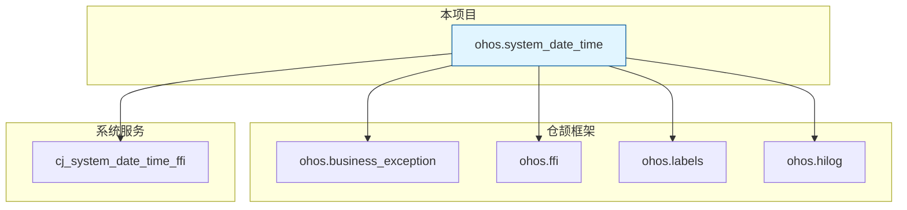

# 07 - 构建与产物

**目的**: 说明构建系统配置、编译产物和依赖关系  
**适用范围**: 构建工程师、集成人员  
**前置知识**: GN构建系统基础

---

## 构建系统概述

### 构建工具链

| 工具 | 版本 | 用途 |
|------|------|------|
| **GN** | OpenHarmony内置 | 生成Ninja构建文件 |
| **Ninja** | OpenHarmony内置 | 执行构建 |
| **CJC** | OpenHarmony内置 | 仓颉语言编译器 |

### 构建配置层级

```
OpenHarmony构建系统
├── 全局模板 (//build/templates/)
│   └── cangjie/cjc.gni          # 仓颉构建模板
├── 项目根配置
│   └── BUILD.gn                  # 根构建目标
└── 模块配置
    └── ohos/system_date_time/
        └── BUILD.gn              # 模块构建目标
```

---

## GN目标清单

### 根级目标

**文件**: `BUILD.gn`

#### copy_sdk_time_cangjie_libs

| 属性 | 值 |
|------|-----|
| **目标名称** | `copy_sdk_time_cangjie_libs` |
| **目标类型** | `copy_ohos_cangjie_sdk_api_lib` |
| **产物** | SDK库文件（复制） |

**配置**:
```gn
copy_ohos_cangjie_sdk_api_lib("copy_sdk_time_cangjie_libs") {
  ohos_inputs = [
    "//base/time/time_cangjie_wrapper/ohos/system_date_time:ohos.system_date_time"
  ]
}
```

**说明**: 将构建好的库复制到仓颉SDK API目录，供应用开发者使用。

**证据**: `BUILD.gn:19-21`

---

### 模块级目标

**文件**: `ohos/system_date_time/BUILD.gn`

#### ohos.system_date_time

| 属性 | 值 |
|------|-----|
| **目标名称** | `ohos.system_date_time` |
| **目标类型** | `ohos_cangjie_shared_library` |
| **产物类型** | 共享库 (.so) |
| **子系统** | time |
| **组件名** | time_cangjie_wrapper |

**源文件配置**:

| 平台 | 源文件 |
|------|--------|
| Windows (`is_mingw`) | `mock/ohos.system_date_time.cj` |
| macOS (`is_mac`) | `mock/ohos.system_date_time.cj` |
| OpenHarmony | `cj_date_time_common.cj`, `cj_date_time_error.cj`, `system_date_time.cj` |

**代码**:
```gn
ohos_cangjie_shared_library("ohos.system_date_time") {
  if (is_mingw || is_mac){
    sources = [ "../../mock/ohos.system_date_time.cj" ]
  } else {
    sources = [
      "cj_date_time_common.cj",
      "cj_date_time_error.cj",
      "system_date_time.cj",
    ]
  }
  // ...
}
```

**证据**: `ohos/system_date_time/BUILD.gn:18-28`

---

## 依赖关系

### 仓颉外部依赖 (cj_external_deps)

| 依赖 | 组件 | 用途 | 必须 |
|------|------|------|------|
| `cangjie_ark_interop:ohos.business_exception` | cangjie_ark_interop | 业务异常定义 | ✅ |
| `cangjie_ark_interop:ohos.ffi` | cangjie_ark_interop | FFI基础设施 | ✅ |
| `cangjie_ark_interop:ohos.labels` | cangjie_ark_interop | API注解 | ✅ |
| `hiviewdfx_cangjie_wrapper:ohos.hilog` | hiviewdfx_cangjie_wrapper | 日志接口 | ✅ |

**配置**:
```gn
cj_external_deps = [
    "cangjie_ark_interop:ohos.business_exception",
    "cangjie_ark_interop:ohos.ffi",
    "cangjie_ark_interop:ohos.labels",
    "hiviewdfx_cangjie_wrapper:ohos.hilog",
]
```

**证据**: `ohos/system_date_time/BUILD.gn:30-35`

### C++外部依赖 (external_deps)

| 依赖 | 组件 | 用途 | 必须 |
|------|------|------|------|
| `time_service:cj_system_date_time_ffi` | time_service | 底层时间服务FFI | ✅ |

**配置**:
```gn
external_deps = [ "time_service:cj_system_date_time_ffi" ]
```

**证据**: `ohos/system_date_time/BUILD.gn:37`

### 依赖关系图



---

## 编译产物

### 产物清单

| 产物 | 类型 | 来源目标 | 说明 |
|------|------|----------|------|
| `libohos.system_date_time.so` | 共享库 | `ohos.system_date_time` | 主库文件 |
| SDK库文件 | 复制 | `copy_sdk_time_cangjie_libs` | SDK分发 |

### 产物路径

```
out/
├── system/
│   └── lib/
│       └── libohos.system_date_time.so     # 运行时库
└── sdk/
    └── cangjie/
        └── api/
            └── ohos.system_date_time/       # SDK API目录
```

### 产物特性

| 特性 | 说明 |
|------|------|
| **目标架构** | ARM64 (标准设备) |
| **运行时依赖** | time_service, cangjie_ark_interop |
| **安装位置** | /system/lib/ |
| **版本信息** | 6.1 (来自bundle.json) |

---

## 构建流程

### 完整构建命令

```bash
# 1. 进入OpenHarmony源码根目录
cd /path/to/openharmony

# 2. 执行GN生成
./build.sh --product {product_name} --gn-args build_type=release

# 3. 执行Ninja构建
ninja -C out/{product_name} ohos.system_date_time

# 4. 构建SDK库
ninja -C out/{product_name} copy_sdk_time_cangjie_libs
```

### 单独构建模块

```bash
# 仅构建time_cangjie_wrapper
ninja -C out/{product_name} //base/time/time_cangjie_wrapper/ohos/system_date_time:ohos.system_date_time
```

### 条件编译说明

| 条件 | 行为 | 用途 |
|------|------|------|
| `is_mingw` | 使用mock源文件 | Windows开发环境 |
| `is_mac` | 使用mock源文件 | macOS开发环境 |
| 其他 | 使用完整实现 | OpenHarmony设备 |

---

## Feature开关

### 当前配置

**状态**: 本项目**无Feature开关**。

```json
// bundle.json
"features": []
```

### 可能的未来扩展

如需添加Feature开关，可在 `bundle.json` 中配置：

```json
{
  "features": [
    "enable_time_debug_log",
    "enable_timezone_cache"
  ]
}
```

并在 `BUILD.gn` 中使用：

```gn
if (defined(features) && features.enable_time_debug_log) {
  defines += [ "TIME_DEBUG_LOG" ]
}
```

---

## 组件元数据

### bundle.json 关键字段

| 字段 | 值 | 说明 |
|------|-----|------|
| `name` | `@ohos/time_cangjie_wrapper` | NPM包名 |
| `version` | `6.1` | 组件版本 |
| `subsystem` | `time` | 所属子系统 |
| `adapted_system_type` | `["standard"]` | 支持设备类型 |
| `rom` | `120KB` | ROM占用 |
| `ram` | `88KB` | RAM占用 |

### 系统能力声明

| 能力 | 声明位置 | 状态 |
|------|----------|------|
| `SystemCapability.MiscServices.Time` | API注解 | 隐式声明 |

---

## 集成指南

### 作为依赖集成

在其他组件中依赖本项目：

```gn
# 其他组件的BUILD.gn
cj_external_deps = [
    "//base/time/time_cangjie_wrapper/ohos/system_date_time:ohos.system_date_time"
]
```

### 在仓颉应用中使用

```toml
# cjpm.toml
[dependencies]
ohos.system_date_time = "*"
```

```cangjie
# 应用代码
import ohos.system_date_time.*

main(): Int64 {
    let time = SystemDateTime.getTime()
    println("当前时间: ${time}")
    return 0
}
```

---

## 调试构建

### 开启调试信息

```bash
# 使用debug构建类型
./build.sh --product {product_name} --gn-args build_type=debug
```

### 查看构建日志

```bash
# 详细日志
ninja -C out/{product_name} -v //base/time/time_cangjie_wrapper/ohos/system_date_time:ohos.system_date_time

# 查看依赖关系
gn desc out/{product_name} //base/time/time_cangjie_wrapper/ohos/system_date_time:ohos.system_date_time --tree
```

---

## 相关文档

- [02_Architecture.md](./02_Architecture.md) - 架构分析
- [03_CodeMap.md](./03_CodeMap.md) - 代码地图
- [01_Overview.md](./01_Overview.md) - 项目概览

---

**更新记录**

| 日期 | 版本 | 更新内容 |
|------|------|----------|
| 2026-02-07 | v1.0 | 初始版本，基于代码分析创建 |
