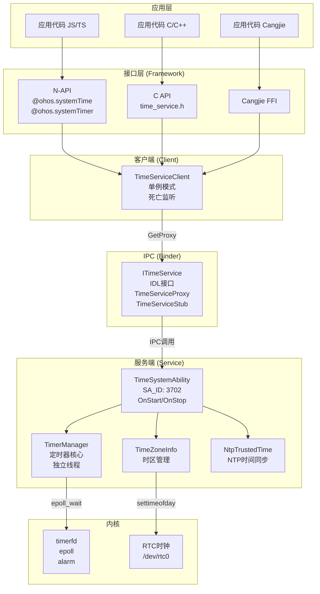
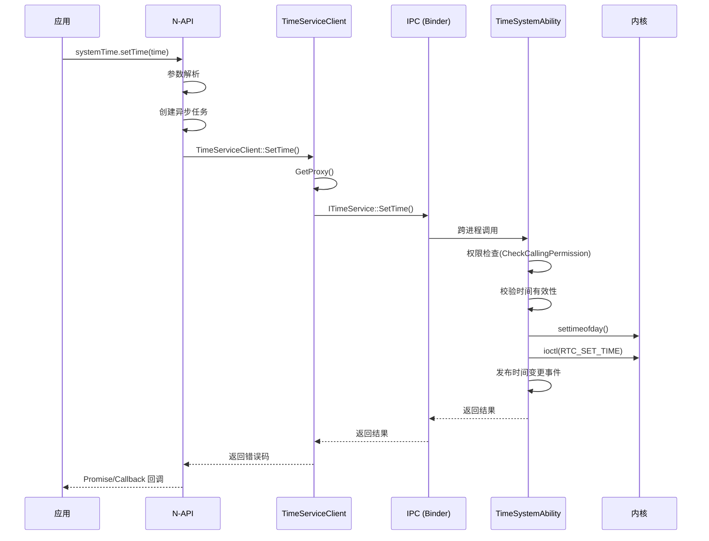
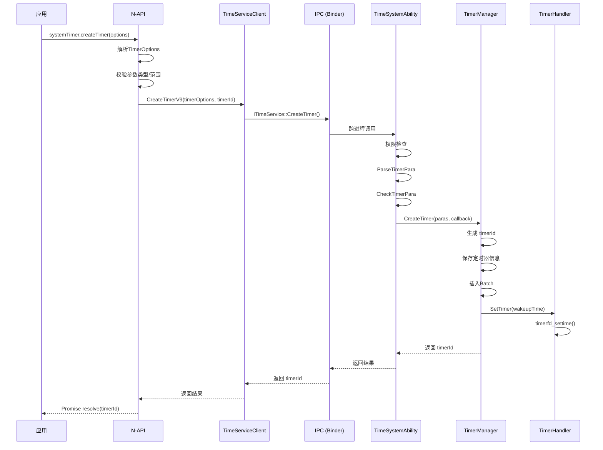
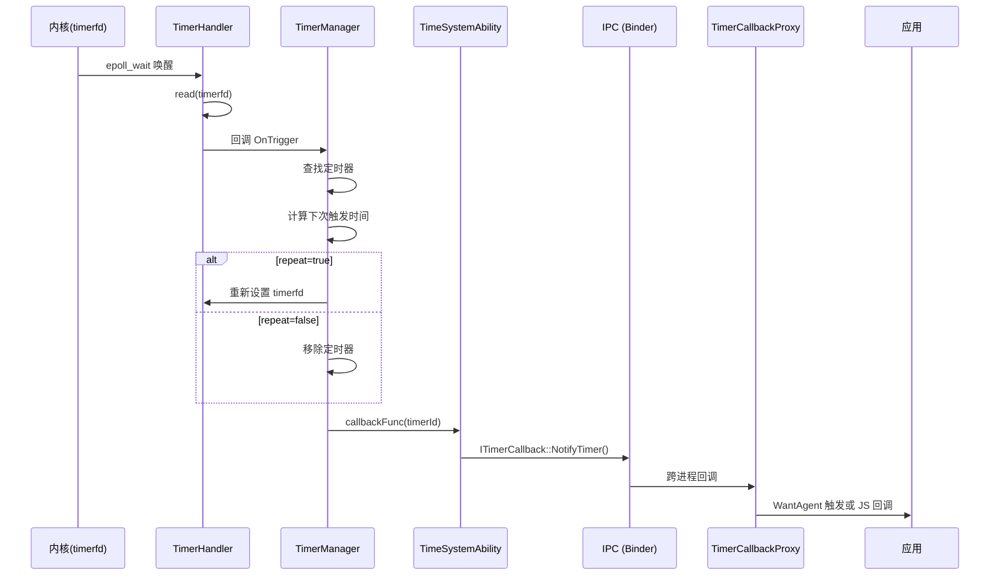
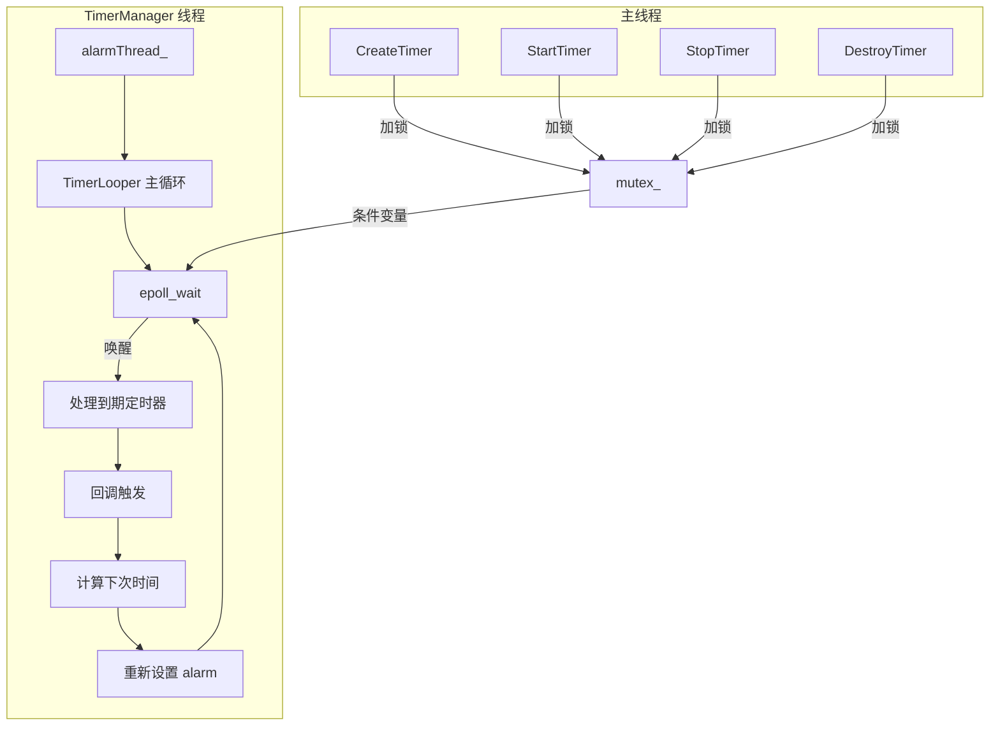
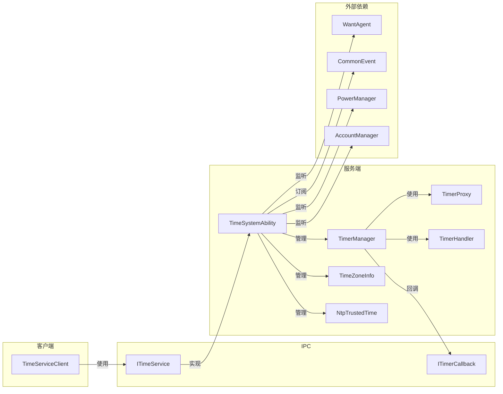

# 架构说明

> 组件图、数据流、线程模型、关键时序

---

## 整体架构



---

## 组件职责

### 1. 接口层 (Framework)

| 组件 | 路径 | 职责 |
|------|------|------|
| **N-API 模块** | `framework/js/napi/` | JS/TS API 到 C++ 的绑定 |
| **C API** | `interfaces/kits/c/` | C/C++ 原生 API |
| **Inner API** | `interfaces/inner_api/` | C++ 内部客户端接口 |

### 2. 客户端 (Client)

**TimeServiceClient**
- 位置：`interfaces/inner_api/include/time_service_client.h`
- 模式：单例（线程安全）
- 职责：
  - 获取 `ITimeService` 代理
  - 监听服务端死亡
  - SA 状态变更监听
  - 定时器恢复信息管理

### 3. 服务端 (Service)

**TimeSystemAbility**
- 位置：`services/time_system_ability.cpp`
- SA_ID：3702（定义在 `services/profile/3702.json`）
- 继承：`SystemAbility` + `TimeServiceStub`
- 生命周期：`OnStart()` → `OnStop()`

**核心管理器**：

| 管理器 | 模式 | 职责 |
|--------|------|------|
| TimerManager | 单例 | 定时器生命周期管理 |
| TimerProxy | 单例 | 应用后台冻结时代理 |
| TimeZoneInfo | 单例 | 时区设置/查询 |
| NtpTrustedTime | 单例 | NTP 时间同步 |
| TimeServiceNotify | 单例 | 时间变更事件广播 |

---

## 数据流

### 场景 1: 设置系统时间



### 场景 2: 创建定时器



### 场景 3: 定时器触发回调



---

## 线程模型

### TimerManager 线程结构



**关键实现**（`services/timer/src/timer_manager.cpp`）：

```cpp
// TimerManager 使用独立的线程运行定时器主循环
std::unique_ptr<std::thread> alarmThread_;  // 在 Init() 中创建
std::atomic_bool runFlag_;                  // 控制线程退出
std::mutex mutex_;                          // 保护定时器数据结构
std::condition_variable cv_;                // 唤醒 epoll_wait

// 线程入口
void TimerManager::TimerLooper() {
    while (runFlag_) {
        // 1. 计算最近到期时间
        // 2. 设置 timerfd
        // 3. epoll_wait 等待
        // 4. 处理到期定时器
        // 5. 回调触发
    }
}
```

### 其他线程

| 线程 | 触发条件 | 职责 |
|------|----------|------|
| Init 重试线程 | OnStart 失败 | 延迟重试初始化 |
| 事件重试线程 | 订阅事件失败 | 延迟重试订阅 |
| SNTP 线程 | NTP 同步 | 网络时间查询（异步） |
| HIDumper 线程 | 命令执行 | 诊断信息输出 |

---

## IPC 接口定义

### IDL 文件

**ITimeService.idl** (`services/ITimeService.idl`):

```idl
interface ITimeService {
    // 时间设置
    int32 SetTime([in] int64_t time, [in] int8_t apiVersion);
    int32 SetTimeZone([in] String timeZoneId, [in] int8_t apiVersion);
    int32 GetTimeZone([out] String timeZoneId);

    // 定时器管理
    int32 CreateTimer([in] String name, [in] int type, ...);
    int32 StartTimer([in] uint64_t timerId, [in] uint64_t triggerTime);
    int32 StopTimer([in] uint64_t timerId);
    int32 DestroyTimer([in] uint64_t timerId);

    // 定时器代理
    int32 ProxyTimer([in] int32 uid, [in] List<int> pidList, ...);
    int32 AdjustTimer([in] bool isAdjust, [in] uint32 interval, ...);

    // 时间获取
    int32 GetNtpTimeMs([out] int64_t time);
    int32 GetRealTimeMs([out] int64_t time);
};
```

**ITimerCallback.idl** (`services/ITimerCallback.idl`):

```idl
[callback] interface ITimerCallback {
    [oneway] int32 NotifyTimer([in] uint64_t timerId);
};
```

### IPC 通信流程

```
客户端进程                          服务端进程 (timeservice)
------------                        ------------------------
TimeServiceClient                           |
      |                                     |
GetProxy()                                  |
      |                                     |
      v                                     v
SystemAbilityManagerClient  ---->  SystemAbilityManager
      |                                     |
      |  GetSystemAbility(3702)             |
      |                                     |
      <------------------------ sptr<IRemoteObject>
      |                                     |
      v                                     v
TimeServiceProxy                  TimeServiceStub
      |                                     |
      |-------- IPC (Binder) -------------->|
      |                                     |
      |                                     v
      |                            TimeSystemAbility
      |                                     |
      <-------- 返回结果 ------------------|
```

---

## 模块依赖关系



---

## 相关链接

- [目录结构](./01_Directory_Structure.md) - 源码组织
- [内部 API](./04_Inner_API.md) - C++ 接口详情
- [N-API 参考](./03_NAPI_Reference.md) - JS 接口详情
