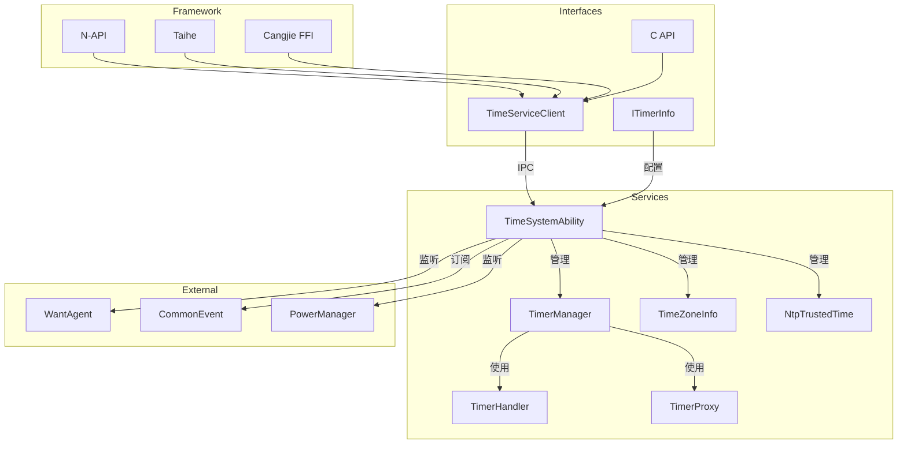

# 内部 API

> C++ 客户端接口与模块职责

---

## TimeServiceClient

**位置**: `interfaces/inner_api/include/time_service_client.h`

**模式**: 单例（线程安全）

### 类图

```
TimeServiceClient
├── GetInstance() : sptr<TimeServiceClient>
├── SetTime(int64_t ms) : bool
├── SetTimeZone(string tz) : bool
├── GetWallTimeMs() : int64_t
├── GetBootTimeMs() : int64_t
├── GetMonotonicTimeMs() : int64_t
├── CreateTimer(shared_ptr<ITimerInfo>) : uint64_t
├── StartTimer(uint64_t id, uint64_t trigger) : bool
├── StopTimer(uint64_t id) : bool
├── DestroyTimer(uint64_t id) : bool
├── ProxyTimer(...) : bool
└── ...
```

### 接口清单

#### 时间管理

| 方法 | 返回值 | 说明 |
|------|--------|------|
| `SetTime(int64_t ms)` | bool | 设置系统时间（毫秒） |
| `SetTime(int64_t ms, int32_t &code)` | bool | 带错误码的版本 |
| `SetTimeV9(int64_t time)` | int32_t | API9 版本 |
| `SetAutoTime(bool autoTime)` | int32_t | 设置自动时间同步 |
| `SetTimeZone(const string &tz)` | bool | 设置时区 |
| `SetTimeZoneV9(const string &tz)` | int32_t | API9 版本 |
| `GetTimeZone()` | string | 获取时区 |

#### 时间获取

| 方法 | 返回值 | 说明 |
|------|--------|------|
| `GetWallTimeMs()` | int64_t | UTC 时间（毫秒） |
| `GetWallTimeNs()` | int64_t | UTC 时间（纳秒） |
| `GetBootTimeMs()` | int64_t | 开机时间（毫秒，含休眠） |
| `GetBootTimeNs()` | int64_t | 开机时间（纳秒，含休眠） |
| `GetMonotonicTimeMs()` | int64_t | 单调时间（毫秒，不含休眠） |
| `GetMonotonicTimeNs()` | int64_t | 单调时间（纳秒，不含休眠） |
| `GetThreadTimeMs()` | int64_t | 线程 CPU 时间（毫秒） |
| `GetThreadTimeNs()` | int64_t | 线程 CPU 时间（纳秒） |

#### 定时器管理

| 方法 | 返回值 | 说明 |
|------|--------|------|
| `CreateTimer(shared_ptr<ITimerInfo> info)` | uint64_t | 创建定时器 |
| `CreateTimerV9(..., uint64_t &id)` | int32_t | API9 版本 |
| `StartTimer(uint64_t id, uint64_t trigger)` | bool | 启动定时器 |
| `StartTimerV9(uint64_t id, uint64_t trigger)` | int32_t | API9 版本 |
| `StopTimer(uint64_t id)` | bool | 停止定时器 |
| `StopTimerV9(uint64_t id)` | int32_t | API9 版本 |
| `DestroyTimer(uint64_t id)` | bool | 销毁定时器 |
| `DestroyTimerV9(uint64_t id)` | int32_t | API9 版本 |

#### 定时器代理

| 方法 | 返回值 | 说明 |
|------|--------|------|
| `ProxyTimer(int32_t uid, set<int> pids, bool isProxy, bool needRetrigger)` | bool | 代理定时器 |
| `AdjustTimer(bool isAdjust, uint32_t interval, uint32_t delta)` | int32_t | 调整定时器 |
| `SetTimerExemption(unordered_set<string> names, bool isExemption)` | int32_t | 设置豁免 |
| `ResetAllProxy()` | bool | 重置所有代理 |

### 使用示例

```cpp
#include "time_service_client.h"

using namespace OHOS::MiscServices;

// 获取客户端实例
auto client = TimeServiceClient::GetInstance();

// 设置系统时间
int64_t timeMs = 1611081385000;
bool result = client->SetTime(timeMs);

// 获取当前时间
int64_t now = client->GetWallTimeMs();

// 创建定时器
auto timerInfo = std::make_shared<ITimerInfo>();
timerInfo->SetType(ITimerInfo::TIMER_TYPE_WAKEUP);
timerInfo->SetRepeat(true);
timerInfo->SetInterval(60000);  // 60秒
uint64_t timerId = client->CreateTimer(timerInfo);

// 启动定时器
int64_t triggerTime = now + 60000;  // 1分钟后触发
client->StartTimer(timerId, triggerTime);
```

---

## ITimerInfo

**位置**: `interfaces/inner_api/include/itimer_info.h`

**说明**: 定时器配置接口，用户需要继承此类并实现 `OnTrigger()` 回调。

### 类定义

```cpp
class ITimerInfo {
public:
    // 定时器类型常量
    const int TIMER_TYPE_REALTIME = 1 << 0;
    const int TIMER_TYPE_WAKEUP = 1 << 1;
    const int TIMER_TYPE_EXACT = 1 << 2;
    const int TIMER_TYPE_IDLE = 1 << 3;
    const int TIMER_TYPE_INEXACT_REMINDER = 1 << 4;

    // 成员变量
    int type;                    // 类型（位掩码组合）
    bool repeat;                 // 是否重复
    bool disposable = false;     // 是否一次性
    bool autoRestore = false;    // 重启是否恢复
    uint64_t interval;           // 重复间隔（毫秒）
    std::string name;            // 名称（<=64字符）
    std::shared_ptr<WantAgent> wantAgent;  // 触发通知

    // 纯虚函数
    virtual void SetType(const int &type) = 0;
    virtual void SetRepeat(bool repeat) = 0;
    virtual void SetInterval(const uint64_t &interval) = 0;
    virtual void SetWantAgent(std::shared_ptr<WantAgent> wantAgent) = 0;
    virtual void OnTrigger() = 0;  // 触发回调
};
```

### 使用示例

```cpp
class MyTimerInfo : public ITimerInfo {
public:
    void SetType(const int &t) override { type = t; }
    void SetRepeat(bool r) override { repeat = r; }
    void SetInterval(const uint64_t &i) override { interval = i; }
    void SetWantAgent(std::shared_ptr<WantAgent> wa) override { wantAgent = wa; }
    
    void OnTrigger() override {
        // 定时器触发时的处理
        printf("Timer triggered!\\n");
    }
};

// 创建并配置定时器
auto timerInfo = std::make_shared<MyTimerInfo>();
timerInfo->SetType(ITimerInfo::TIMER_TYPE_REALTIME | ITimerInfo::TIMER_TYPE_WAKEUP);
timerInfo->SetRepeat(true);
timerInfo->SetInterval(5000);  // 5秒间隔

uint64_t timerId = TimeServiceClient::GetInstance()->CreateTimer(timerInfo);
```

---

## 模块职责

### Framework 层

| 模块 | 职责 | 稳定性 |
|------|------|--------|
| N-API | JS/TS 绑定，参数解析 | 稳定 |
| Taihe | 新框架 JS 绑定 | 演化中 |
| Cangjie FFI | Cangjie 语言绑定 | 稳定 |
| ANI | ArkTS Native 绑定 | 演化中 |

### Interfaces 层

| 模块 | 职责 | 稳定性 |
|------|------|--------|
| TimeServiceClient | 客户端入口，IPC 代理管理 | 稳定 |
| ITimerInfo | 定时器配置接口 | 稳定 |
| C API | NDK 接口 | 稳定 |

### Services 层

| 模块 | 职责 | 依赖 |
|------|------|------|
| TimeSystemAbility | SystemAbility 实现，服务入口 | IPC, TimerManager |
| TimerManager | 定时器核心管理，批处理 | TimerHandler, Batch |
| TimerHandler | 底层定时器硬件抽象 | 内核 timerfd |
| TimerProxy | 应用后台冻结代理 | TimerManager |
| TimeZoneInfo | 时区管理 | 系统调用 |
| NtpTrustedTime | NTP 时间同步 | SNTPClient |

---

## 依赖关系



---

## 接口稳定性

| 接口 | 稳定性级别 | 说明 |
|------|-----------|------|
| `TimeServiceClient` | ⭐⭐⭐ 稳定 | 主要客户端接口 |
| `ITimerInfo` | ⭐⭐⭐ 稳定 | 定时器配置接口 |
| `ITimeService` (IDL) | ⭐⭐⭐ 稳定 | IPC 接口 |
| `ITimerCallback` (IDL) | ⭐⭐⭐ 稳定 | 回调接口 |
| C API | ⭐⭐⭐ 稳定 | NDK 接口 |
| N-API | ⭐⭐⭐ 稳定 | JS 接口 |

---

## 相关链接

- [N-API 参考](./03_NAPI_Reference.md) - JS 接口详情
- [架构说明](./02_Architecture.md) - 组件关系
- [目录结构](./01_Directory_Structure.md) - 源码组织
