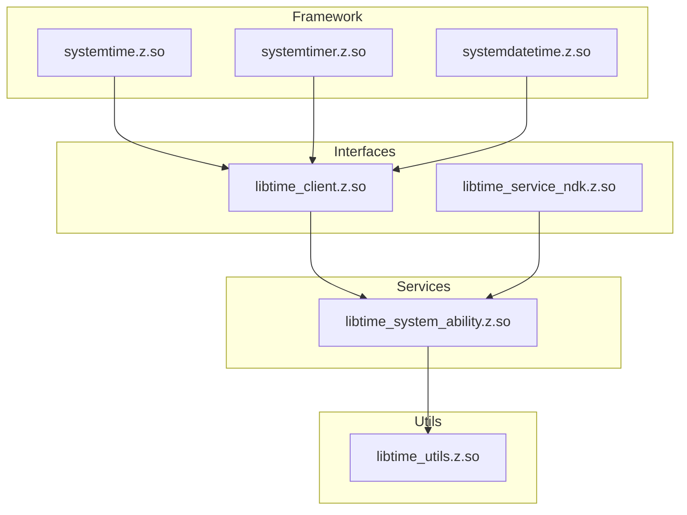

# GN 构建系统

> 构建目标、产物映射、Feature Flags

---

## 构建概述

**根配置文件**: `time.gni`

```gn
# 路径变量
time_root_path = "//base/time/time_service"
api_path = "${time_root_path}/interfaces/inner_api"
time_capi_path = "${time_root_path}/interfaces/kits/c"
time_service_path = "${time_root_path}/services"
time_utils_path = "${time_root_path}/utils"

# Feature flags
declare_args() {
  device_standby = true
  time_service_debug_able = true
  time_service_hicollie_able = true
  time_service_hidumper_able = true
  time_service_set_auto_reboot = false
  time_service_multi_account = true
  time_service_rdb_enable = true
}
```

---

## Feature Flags

| Flag | 默认值 | 说明 |
|------|--------|------|
| `device_standby` | true | 设备待机服务支持 |
| `time_service_debug_able` | true | 调试日志能力 |
| `time_service_hicollie_able` | true | HiCollie 监控 |
| `time_service_hidumper_able` | true | HIDumper 诊断支持 |
| `time_service_set_auto_reboot` | false | 自动重启设置 |
| `time_service_multi_account` | true | 多账号支持 |
| `time_service_rdb_enable` | true | RDB 数据库支持 |

---

## BUILD.gn 文件清单

```
base/time/time_service/
├── time.gni                          # 根配置
├── utils/BUILD.gn                    # 工具库
├── interfaces/inner_api/BUILD.gn     # 内部 API
├── interfaces/kits/c/BUILD.gn        # C API
├── services/BUILD.gn                 # 服务实现
├── services/etc/init/BUILD.gn        # 启动配置
├── services/etc/BUILD.gn             # 系统参数
├── services/profile/BUILD.gn         # SA 配置
├── framework/js/napi/system_time/BUILD.gn      # N-API systemTime
├── framework/js/napi/system_timer/BUILD.gn     # N-API systemTimer
├── framework/js/napi/system_date_time/BUILD.gn # N-API systemDateTime
├── framework/js/taihe/system_datetime/BUILD.gn # Taihe datetime
├── framework/js/taihe/system_timer/BUILD.gn    # Taihe timer
├── framework/js/ani/BUILD.gn         # ANI 接口
└── framework/cj/BUILD.gn             # Cangjie FFI
```

---

## 核心 Targets

### 1. 服务 Target

**Target**: `//base/time/time_service/services:time_system_ability`

**类型**: `ohos_shared_library`

**源码**:
```
sources = [
  "time_system_ability.cpp",
  "time_permission.cpp",
  "time/src/ntp_update_time.cpp",
  "time/src/ntp_trusted_time.cpp",
  "time/src/time_zone_info.cpp",
  "time/src/time_tick_notify.cpp",
  "time/src/time_service_notify.cpp",
  "time/src/event_manager.cpp",
  "timer/src/timer_manager.cpp",
  "timer/src/timer_handler.cpp",
  "timer/src/timer_proxy.cpp",
  "timer/src/timer_database.cpp",
  "timer/src/batch.cpp",
  "timer/src/cjson_helper.cpp",
  ...
]
```

**关键依赖**:
```
deps = [
  "//foundation/ability/ability_runtime:wantagent_innerkits",
  "//foundation/communication/ipc:ipc_single",
  "//foundation/distributedschedule/safwk:safwk",
  "//foundation/resourceschedule/device_standby:device_standby",
  "//foundation/systemabilitymgr/samgr:samgr_proxy",
  "//third_party/cJSON:cjson",
  ...
]
```

**产物**: `libtime_system_ability.z.so`

### 2. 内部 API Target

**Target**: `//base/time/time_service/interfaces/inner_api:time_client`

**类型**: `ohos_shared_library`

**源码**:
```
sources = [
  "src/time_service_client.cpp",
  "src/itimer_info.cpp",
]
```

**产物**: `libtime_client.z.so`

**头文件导出**:
```
include_dirs = [
  "${api_path}/include",
]
```

### 3. NDK Target

**Target**: `//base/time/time_service/interfaces/kits/c:time_service_ndk`

**类型**: `ohos_shared_library`

**产物**: `libtime_service_ndk.z.so`

### 4. N-API Targets

#### systemTime

**Target**: `//base/time/time_service/framework/js/napi/system_time:systemtime`

**类型**: `ohos_shared_library`

**源码**: `src/js_systemtime.cpp`

**产物**: `systemtime.z.so`

**安装路径**: `/system/lib/module/` (供 JS 加载)

#### systemTimer

**Target**: `//base/time/time_service/framework/js/napi/system_timer:systemtimer`

**类型**: `ohos_shared_library`

**产物**: `systemtimer.z.so`

#### systemDateTime

**Target**: `//base/time/time_service/framework/js/napi/system_date_time:systemdatetime`

**类型**: `ohos_shared_library`

**产物**: `systemdatetime.z.so`

---

## 编译产物映射

| Target | 产物 | 类型 | 安装路径 |
|--------|------|------|----------|
| `services:time_system_ability` | `libtime_system_ability.z.so` | 共享库 | `/system/lib/` |
| `interfaces/inner_api:time_client` | `libtime_client.z.so` | 共享库 | `/system/lib/` |
| `interfaces/kits/c:time_service_ndk` | `libtime_service_ndk.z.so` | 共享库 | `/system/lib/` |
| `framework/js/napi/system_time:systemtime` | `systemtime.z.so` | N-API模块 | `/system/lib/module/` |
| `framework/js/napi/system_timer:systemtimer` | `systemtimer.z.so` | N-API模块 | `/system/lib/module/` |
| `framework/js/napi/system_date_time:systemdatetime` | `systemdatetime.z.so` | N-API模块 | `/system/lib/module/` |
| `services/etc/init:timeservice.cfg` | `timeservice.cfg` | 配置文件 | `/system/etc/init/` |
| `services/profile:time_time_service_sa_profiles` | `3702.json` | SA配置 | `/system/profile/` |

---

## 依赖关系



---

## 构建命令示例

```bash
# 构建全部
gn gen out --args='...'
ninja -C out time_service

# 构建特定 target
ninja -C out //base/time/time_service/services:time_system_ability
ninja -C out //base/time/time_service/interfaces/inner_api:time_client
ninja -C out //base/time/time_service/framework/js/napi/system_time:systemtime

# 构建配置
ninja -C out //base/time/time_service/services/etc/init:timeservice.cfg
```

---

## 运行时加载关系

```
应用进程:
  ├─ systemtime.z.so (N-API 模块)
  │   └─ libtime_client.z.so
  │       └─ libipc_core.z.so
  │
  └─ 通过 IPC 连接到 TimeSystemAbility (SA_ID: 3702)

系统服务进程 (timeservice):
  └─ libtime_system_ability.z.so
      ├─ libtime_utils.z.so
      ├─ libwantagent_innerkits.z.so
      ├─ libcjson.z.so
      └─ 内核接口 (timerfd, settimeofday)
```

---

## 相关链接

- [编译产物](./06_Build_Artifacts.md) - 产物清单与路径
- [目录结构](./01_Directory_Structure.md) - 源码组织
- [项目概览](./00_Overview.md) - 功能介绍
