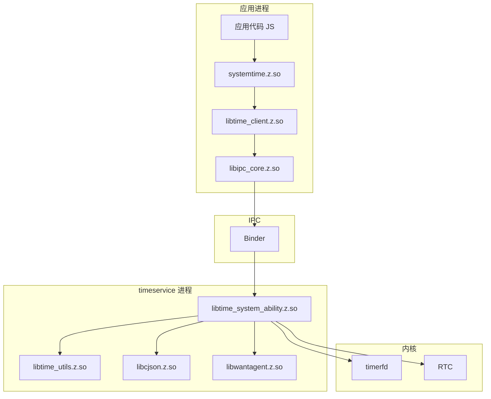

# 编译产物

> 产物清单、安装路径、运行时加载关系

---

## 产物清单

### 共享库 (.so)

| 产物名 | Target | 类型 | 说明 |
|--------|--------|------|------|
| `libtime_system_ability.z.so` | `services:time_system_ability` | 共享库 | 主服务实现 |
| `libtime_client.z.so` | `interfaces/inner_api:time_client` | 共享库 | 内部 API 客户端 |
| `libtime_service_ndk.z.so` | `interfaces/kits/c:time_service_ndk` | 共享库 | NDK 接口 |
| `libtime_utils.z.so` | `utils:time_utils` | 共享库 | 工具库 |
| `systemtime.z.so` | `framework/js/napi/system_time:systemtime` | N-API 模块 | @ohos.systemTime |
| `systemtimer.z.so` | `framework/js/napi/system_timer:systemtimer` | N-API 模块 | @ohos.systemTimer |
| `systemdatetime.z.so` | `framework/js/napi/system_date_time:systemdatetime` | N-API 模块 | @ohos.systemDateTime |

### 配置文件

| 产物名 | Target | 安装路径 | 说明 |
|--------|--------|----------|------|
| `timeservice.cfg` | `services/etc/init:timeservice.cfg` | `/system/etc/init/` | 服务启动配置 |
| `3702.json` | `services/profile:time_time_service_sa_profiles` | `/system/profile/` | SA 配置文件 |
| `time.para` | `services/etc:time.para` | `/system/etc/param/` | 系统参数 |
| `time.para.dac` | `services/etc:time.para.dac` | `/system/etc/param/` | 参数权限 |

---

## 安装路径

### 系统分区

```
/system/
├── lib/
│   ├── libtime_system_ability.z.so      # 服务实现
│   ├── libtime_client.z.so              # 内部 API
│   ├── libtime_service_ndk.z.so         # NDK 接口
│   ├── libtime_utils.z.so               # 工具库
│   └── module/                          # N-API 模块
│       ├── systemtime.z.so              # @ohos.systemTime
│       ├── systemtimer.z.so             # @ohos.systemTimer
│       └── systemdatetime.z.so          # @ohos.systemDateTime
├── etc/
│   ├── init/
│   │   └── timeservice.cfg              # 启动配置
│   └── param/
│       ├── time.para                    # 系统参数
│       └── time.para.dac                # 参数权限
└── profile/
    └── 3702.json                        # SA 配置
```

### 数据分区

```
/data/service/el1/public/
├── database/time/
│   └── time.json                        # 定时器数据库（JSON模式）
│   └── time.db                          # 定时器数据库（RDB模式）
├── time/
│   └── time_zone_config.json            # 时区配置
└── misc/zoneinfo/                       # 时区文件
```

---

## 运行时加载关系

### 应用进程

```
应用代码 (JS/TS)
    ↓
import systemTime from '@ohos.systemTime'
    ↓
加载 /system/lib/module/systemtime.z.so
    ↓
dlopen libtime_client.z.so
    ↓
通过 IPC 连接到 TimeSystemAbility (SA_ID: 3702)
```

### 服务进程 (timeservice)

```
init 进程
    ↓
启动 /system/bin/sa_main 3702
    ↓
加载 libtime_system_ability.z.so
    ↓
注册 SystemAbility (3702)
    ↓
初始化 TimerManager, TimeZoneInfo, NtpTrustedTime
    ↓
监听 IPC 请求
```

### 依赖关系图



---

## 产物大小估算

| 产物 | 预估大小 | 说明 |
|------|----------|------|
| `libtime_system_ability.z.so` | ~200KB | 主服务，含定时器、时区、NTP |
| `libtime_client.z.so` | ~50KB | 轻量客户端 |
| `libtime_service_ndk.z.so` | ~30KB | C API 封装 |
| `systemtime.z.so` | ~40KB | N-API 绑定 |
| `systemtimer.z.so` | ~60KB | N-API 绑定 |
| `systemdatetime.z.so` | ~30KB | N-API 绑定 |
| **总计** | **~410KB** | 符合 ROM 预算 (400KB) |

---

## 构建产物检查

```bash
# 检查产物是否存在
ls -la out/target/product/{product}/system/lib/libtime_*.z.so
ls -la out/target/product/{product}/system/lib/module/system*.z.so
ls -la out/target/product/{product}/system/etc/init/timeservice.cfg
ls -la out/target/product/{product}/system/profile/3702.json

# 检查符号表
nm -D out/.../libtime_system_ability.z.so | grep SetTime

# 检查依赖
readelf -d out/.../libtime_system_ability.z.so | grep NEEDED
```

---

## 相关链接

- [GN 构建系统](./05_GN_Targets.md) - 构建配置
- [目录结构](./01_Directory_Structure.md) - 源码组织
