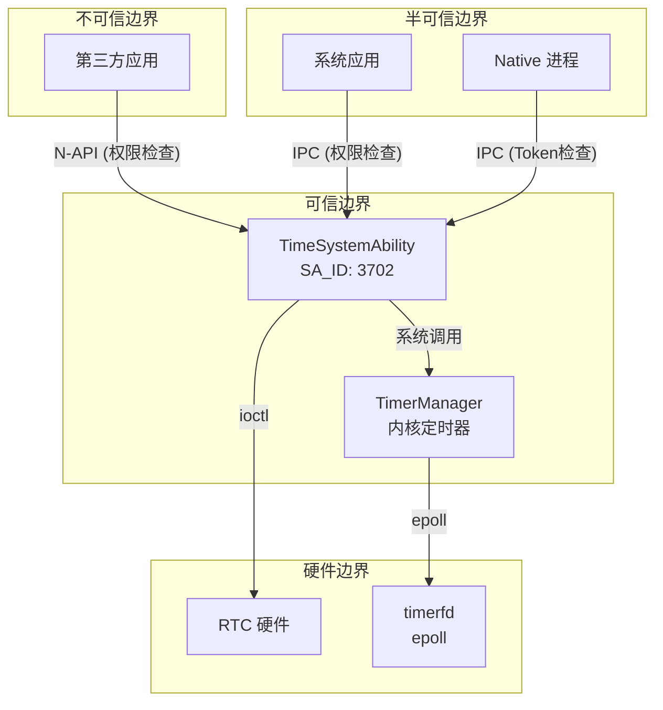

# 安全分析

> 攻击面、信任边界、可利用点、修复建议

---

## 攻击面清单

### 1. N-API 接口（JS/TS 应用）

| 接口 | 风险等级 | 说明 |
|------|----------|------|
| `systemTime.setTime()` | 高 | 修改系统时间，需权限校验 |
| `systemTime.setTimezone()` | 中 | 修改系统时区，需权限校验 |
| `systemTimer.createTimer()` | 中 | 创建定时器，参数复杂需校验 |
| `systemTimer.startTimer()` | 低 | 启动已创建的定时器 |

### 2. IPC 接口（IDL）

| 接口 | 风险等级 | 说明 |
|------|----------|------|
| `ITimeService::SetTime` | 高 | 系统时间设置 |
| `ITimeService::CreateTimer` | 中 | 定时器创建，涉及 WantAgent |
| `ITimeService::ProxyTimer` | 高 | 影响其他应用定时器 |

### 3. 文件系统

| 文件/目录 | 风险等级 | 说明 |
|-----------|----------|------|
| `/data/service/el1/public/database/time/` | 高 | 定时器数据库 |
| `/data/misc/zoneinfo/` | 中 | 时区配置文件 |
| `/dev/rtc0` | 高 | RTC 硬件时钟 |

### 4. 网络

| 功能 | 风险等级 | 说明 |
|------|----------|------|
| NTP 时间同步 | 中 | 网络请求可能被劫持 |

---

## 信任边界



---

## 权限校验点

### 1. 核心权限校验函数

| 函数 | 位置 | 功能 |
|------|------|------|
| `CheckCallingPermission()` | `services/time_permission.cpp:26` | 通用权限校验 |
| `CheckProxyCallingPermission()` | `services/time_permission.cpp:42` | Native/Shell 类型检查 |
| `CheckSystemUidCallingPermission()` | `services/time_permission.cpp:50` | 系统应用检查 |

### 2. 权限定义

```cpp
// services/time_permission.cpp:24-25
const std::string TimePermission::setTime = "ohos.permission.SET_TIME";
const std::string TimePermission::setTimeZone = "ohos.permission.SET_TIME_ZONE";
```

### 3. API 权限矩阵

| API | 系统应用检查 | 权限检查 | 错误码 |
|-----|-------------|----------|--------|
| SetTime (API9+) | ✅ `CheckSystemUidCallingPermission` | ✅ `SET_TIME` | `E_TIME_NOT_SYSTEM_APP` |
| SetTimeZone (API9+) | ✅ | ✅ `SET_TIME_ZONE` | `E_TIME_NOT_SYSTEM_APP` |
| CreateTimer | ✅ | - | `E_TIME_NOT_SYSTEM_APP` |
| StartTimer | ✅ | - | `E_TIME_NOT_SYSTEM_APP` |
| StopTimer | ✅ | - | `E_TIME_NOT_SYSTEM_APP` |
| DestroyTimer | ✅ | - | `E_TIME_NOT_SYSTEM_APP` |
| ProxyTimer | ✅ Native/Shell | - | `E_TIME_NO_PERMISSION` |
| AdjustTimer | ✅ Native/Shell | - | `E_TIME_NO_PERMISSION` |
| ResetAllProxy | ✅ Native/Shell | - | `E_TIME_NO_PERMISSION` |
| Idle Timer | ✅ Native/Shell | - | 自动清除 IDLE 标志 |

### 4. Token 类型检查

```cpp
// services/time_permission.cpp:44-47
auto tokenType = AccessTokenKit::GetTokenTypeFlag(callerToken);
return (tokenType == ATokenTypeEnum::TOKEN_NATIVE ||
        tokenType == ATokenTypeEnum::TOKEN_SHELL);
```

---

## 输入校验分析

### 1. N-API 入口校验

| 校验项 | 位置 | 实现 |
|--------|------|------|
| 参数类型 | `napi_system_timer.cpp:151` | `napi_typeof` + 映射表 |
| 字符串长度 | `napi_system_timer.cpp:188` | `<= STR_MAX_LENGTH(64)` |
| 数值范围 | `napi_system_timer.cpp:169` | `interval >= 0` |
| 非空检查 | `napi_system_timer.cpp:174` | `wantAgent != nullptr` |

### 2. 服务层校验

| 校验项 | 位置 | 限制 |
|--------|------|------|
| 定时器名称长度 | `time_system_ability.cpp:362` | `<= 64` |
| PID 列表大小 | `time_system_ability.cpp:948` | `<= 1024` |
| 豁免列表大小 | `time_system_ability.cpp:972` | `<= 1000` |
| 策略列表大小 | `time_system_ability.cpp:992` | `<= 1000` |

### 3. 路径遍历防护

**时区配置读取** (`services/time/src/time_zone_info.cpp:104`):

```cpp
// 使用 realpath 规范化路径
std::unique_ptr<char[]> resolvedPath(new (std::nothrow) char[PATH_MAX]);
if (realpath(CONVERT_TIMEZONE_LIST_PATH, resolvedPath.get()) == nullptr) {
    return false;
}
```

---

## 敏感操作清单

### 1. 系统调用

| 调用 | 位置 | 说明 |
|------|------|------|
| `settimeofday()` | `time_system_ability.cpp:559` | 设置系统时间 |
| `timerfd_create()` | `timer_handler.cpp:100` | 创建内核定时器 |
| `epoll_create/ctl` | `timer_handler.cpp:44` | 事件管理 |
| `ioctl(RTC_SET_TIME)` | `time_system_ability.cpp:752` | 设置 RTC 时钟 |

### 2. 网络操作

| 操作 | 位置 | 安全机制 |
|------|------|----------|
| `getaddrinfo()` | `sntp_client.cpp:65` | 5秒超时 |
| `socket()` | `sntp_client.cpp:72` | UDP socket |
| `setsockopt(SO_SNDTIMEO)` | `sntp_client.cpp:83` | 5秒发送超时 |
| `setsockopt(SO_RCVTIMEO)` | `sntp_client.cpp:84` | 5秒接收超时 |
| `fdsan_exchange_owner_tag()` | `sntp_client.cpp:79` | 跟踪 socket 生命周期 |

### 3. 文件操作

| 操作 | 位置 | 说明 |
|------|------|------|
| `fopen(/dev/rtcX)` | `time_system_ability.cpp:735` | RTC 设备访问 |
| `ifstream(timezone_config)` | `time_zone_info.cpp:108` | 时区配置读取 |
| `ifstream(timer_db.json)` | `cjson_helper.cpp:37` | 定时器数据库 |

---

## 可利用点分析

### 风险 1: 定时器参数注入

**位置**: `framework/js/napi/system_timer/src/napi_system_timer.cpp:143-192`

**描述**: `ParseTimerOptions` 函数解析用户传入的 `TimerOptions`，涉及多个参数类型转换。

**当前防护**:
- 类型检查：`napi_typeof` 校验
- 字符串长度：`name.size() <= 64`
- 数值范围：`interval >= 0`

**潜在风险**: WantAgent 对象通过 `napi_unwrap` 解包，需确保来源可信。

**修复建议**:
```cpp
// 建议增加 wantAgent 来源校验
CHECK_ARGS_RETURN_VOID(TIME_MODULE_JS_NAPI, context, 
    IsValidWantAgent(wantAgent), 
    "Invalid wantAgent source", 
    JsErrorCode::PARAMETER_ERROR);
```

---

### 风险 2: 时区配置篡改

**位置**: `services/time/src/time_zone_info.cpp:100-180`

**描述**: 时区配置从文件系统读取，路径通过拼接构造。

**当前防护**:
- 使用 `realpath` 规范化路径
- 固定路径前缀，不接受用户输入

**修复建议**: 
- 增加文件完整性校验（签名或哈希）
- 限制配置目录权限（只读）

---

### 风险 3: JSON 数据库注入

**位置**: `services/timer/src/cjson_helper.cpp`

**描述**: 使用 cJSON 解析定时器数据库文件。

**当前防护**:
- 文件路径固定（`/data/service/el1/public/database/time/time.json`）
- 使用 `std::lock_guard` 保护并发访问

**潜在风险**: 如果数据库文件被篡改，可能导致解析异常或数据污染。

**修复建议**:
- 定期校验数据库文件完整性
- 解析失败时清空并重建数据库

---

### 风险 4: NTP 欺骗攻击

**位置**: `services/time/src/sntp_client.cpp`

**描述**: NTP 客户端从网络获取时间，可能被中间人攻击。

**当前防护**:
- 5秒超时机制
- 仅使用可信 NTP 服务器

**潜在风险**: 网络劫持可能导致错误时间同步。

**修复建议**:
- 实施 NTP 认证机制（Autokey/NTPv4）
- 添加时间跳变检测（超过阈值告警）

---

### 风险 5: 整数溢出

**位置**: `services/time/src/time_file_utils.cpp:114`

**描述**: 字符串转整数操作。

**当前防护**:
```cpp
long long pid = strtoll(pidStr.c_str(), &endPtr, DECIMAL_NOTATION);
if (errno == ERANGE || endPtr == pidStr.c_str()) {
    continue;
}
```

**建议**: 确保所有数值转换都有范围检查。

---

## 资源安全

### 1. 锁/同步原语

| 资源 | 锁名称 | 说明 |
|------|--------|------|
| TimeServiceClient | `instanceLock_` | 单例实例保护 |
| TimerManager | `mutex_` | 定时器主数据结构 |
| TimerProxy | `proxyMutex_` | 代理定时器映射 |
| CjsonHelper | `mutex_` | JSON 文件访问 |

### 2. 单例实现

**双检查锁模式** (`services/timer/src/timer_manager.cpp:122-126`):

```cpp
if (instance_ == nullptr) {
    std::lock_guard<std::mutex> autoLock(instanceLock_);
    if (instance_ == nullptr) {
        instance_ = new TimerManager(impl);
    }
}
```

**分析**: 在 C++11 及以上标准中，此实现是线程安全的。

### 3. 内存管理

| 实践 | 位置 | 说明 |
|------|------|------|
| `new (std::nothrow)` | 多处 | 防止异常抛出 |
| `std::unique_ptr` | `time_zone_info.cpp:103` | RAII 自动释放 |
| `std::lock_guard` | 多处 | RAII 自动解锁 |

---

## 安全编码实践

### 1. 已采用的防护

- ✅ 权限分层设计（系统应用/普通应用）
- ✅ Token 类型检查（Native/Shell/HAP）
- ✅ 输入长度限制（字符串/列表大小）
- ✅ 空指针检查（广泛）
- ✅ 超时控制（NTP 5秒超时）
- ✅ fdsan 保护（socket 生命周期）
- ✅ 安全字符串函数（`memcpy_s`, `snprintf_s`）

### 2. 建议增强

| 建议 | 优先级 | 说明 |
|------|--------|------|
| Fuzz 测试 | 高 | 覆盖 NAPI 入口和 IDL 接口 |
| 数据库加密 | 中 | 定时器数据加密存储 |
| NTP 认证 | 中 | 实施 NTPv4 认证 |
| 完整性校验 | 中 | 配置文件签名验证 |
| 时间跳变检测 | 低 | 异常时间变化告警 |

---

## 相关链接

- [架构说明](./02_Architecture.md) - 组件关系
- [内部 API](./04_Inner_API.md) - 接口详情
- [GN 构建](./05_GN_Targets.md) - 产物分析
