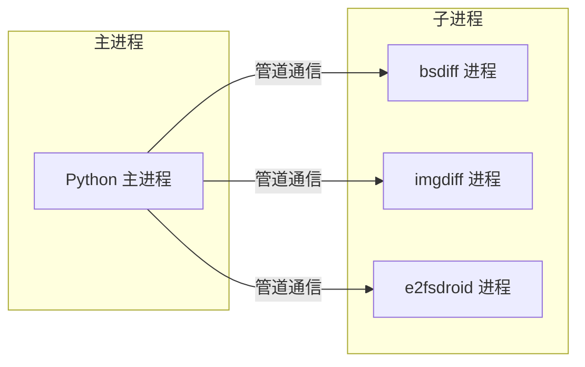
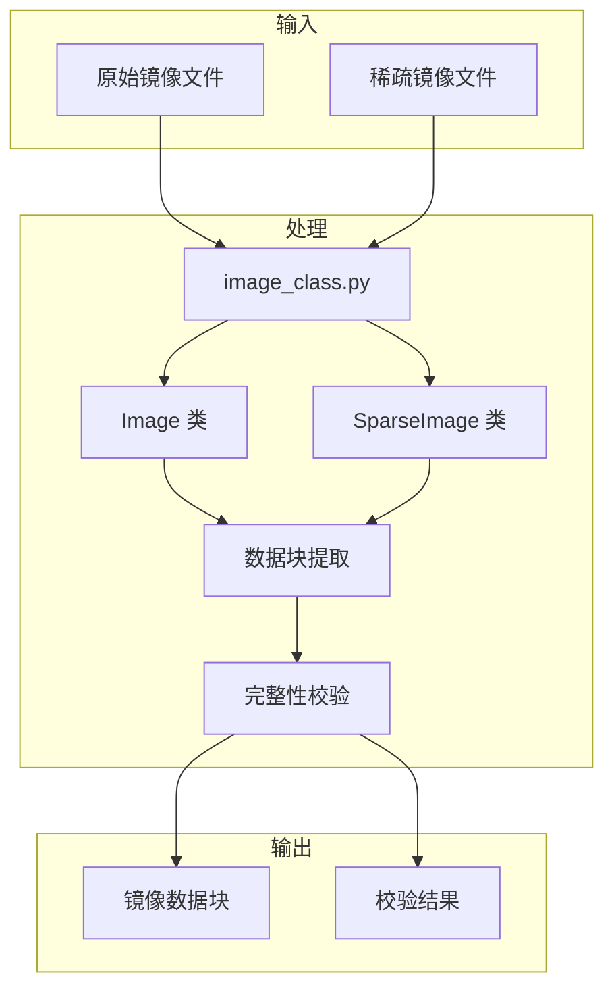
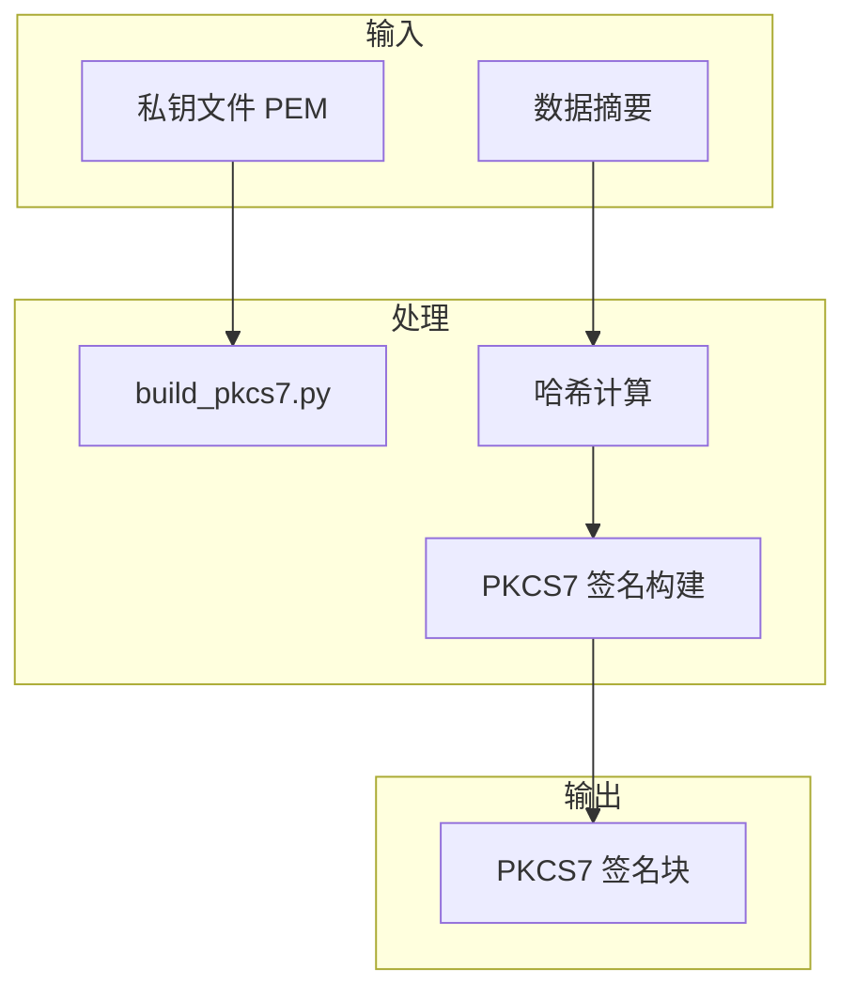

# 架构说明（Architecture）

> 本文档详细描述 OpenHarmony 升级包制作工具的系统架构、组件关系、数据流向和关键时序，帮助读者深入理解系统设计。

## 1 系统架构概览

### 1.1 架构分层

Packaging Tools 采用**分层架构**设计，从上到下分为四个层次：

```
┌─────────────────────────────────────────────────────────────────┐
│                        表示层（Presentation）                      │
│  ┌─────────────────────────────────────────────────────────┐    │
│  │              命令行接口（CLI）                            │    │
│  │              参数解析 / 帮助信息 / 使用示例                 │    │
│  └─────────────────────────────────────────────────────────┘    │
├─────────────────────────────────────────────────────────────────┤
│                        协调层（Coordination）                      │
│  ┌─────────────────────────────────────────────────────────┐    │
│  │              build_update.py                            │    │
│  │              流程控制 / 模块协调 / 选项管理                │    │
│  └─────────────────────────────────────────────────────────┘    │
├─────────────────────────────────────────────────────────────────┤
│                        业务层（Business）                         │
│  ┌──────────┐ ┌──────────┐ ┌──────────┐ ┌──────────┐            │
│  │镜像处理   │ │差分计算   │ │签名处理   │ │脚本生成   │            │
│  │image_    │ │patch_    │ │build_    │ │script_   │            │
│  │class.py  │ │package   │ │pkcs7.py  │ │generator │            │
│  └──────────┘ └──────────┘ └──────────┘ └──────────┘            │
│  ┌──────────┐ ┌──────────┐ ┌──────────┐ ┌──────────┐            │
│  │包格式管理  │ │Block管理  │ │传输管理   │ │厂商扩展   │            │
│  │update_   │ │blocks_   │ │transfers │ │vendor_   │            │
│  │package   │ │manager   │ │manager   │ │script    │            │
│  └──────────┘ └──────────┘ └──────────┘ └──────────┘            │
├─────────────────────────────────────────────────────────────────┤
│                        基础层（Foundation）                        │
│  ┌──────────┐ ┌──────────┐ ┌──────────┐ ┌──────────┐            │
│  │工具函数   │ │日志异常   │ │外部工具   │ │数据格式   │            │
│  │utils.py  │ │log_     │ │bsdiff    │ │ZIP/PKCS7│            │
│  │          │ │exception │ │imgdiff   │ │XML/JSON │            │
│  └──────────┘ └──────────┘ └──────────┘ └──────────┘            │
└─────────────────────────────────────────────────────────────────┘
```

### 1.2 架构特点

| 特点 | 说明 |
|-----|-----|
| 分层清晰 | 四层架构，各层职责明确 |
| 模块独立 | 各模块独立职责，耦合度低 |
| 可扩展 | 支持厂商自定义扩展（vendor_script.py） |
| 可测试 | 各模块可独立测试 |

## 2 组件关系

### 2.1 核心组件

| 组件名称 | 文件路径 | 主要职责 |
|---------|---------|---------|
| CLI 入口 | build_update.py | 命令行参数解析和流程控制 |
| 镜像处理 | image_class.py | 全量/稀疏镜像解析 |
| 包创建 | create_update_package.py | 协调各模块创建升级包 |
| 差分处理 | patch_package_process.py | Block 级差分计算 |
| 脚本生成 | script_generator.py | 生成升级操作脚本 |
| 签名 | build_pkcs7.py | PKCS7 数字签名 |
| 包格式 | update_package.py | 升级包格式管理 |
| Block 管理 | blocks_manager.py | 差分数据块管理 |

### 2.2 组件交互图

```mermaid
graph TB
    subgraph CLI
        CLI[命令行入口]
    end

    subgraph 协调层
        COORD[build_update.py]
    end

    subgraph 业务层
        IMAGE[image_class.py]
        PACKAGE[update_package.py]
        CREATE[create_update_package.py]
        PATCH[patch_package_process.py]
        SCRIPT[script_generator.py]
        SIGN[build_pkcs7.py]
        BLOCK[blocks_manager.py]
        TRANSFER[transfers_manager.py]
        GIGRAPH[gigraph_process.py]
    end

    subgraph 基础层
        UTILS[utils.py]
        LOG[log_exception.py]
    end

    CLI --> COORD
    COORD --> IMAGE
    COORD --> CREATE
    COORD --> UTILS
    COORD --> LOG

    CREATE --> PACKAGE
    CREATE --> SCRIPT
    CREATE --> SIGN

    PATCH --> BLOCK
    PATCH --> TRANSFER
    PATCH --> GIGRAPH

    IMAGE --> PACKAGE
```

## 3 数据流向分析

### 3.1 全量升级包制作数据流

```
┌─────────────────────────────────────────────────────────────────────┐
│                    全量升级包制作数据流                                │
├─────────────────────────────────────────────────────────────────────┤
│                                                                      │
│   1. 输入阶段                                                         │
│   ┌─────────┐     ┌─────────┐     ┌─────────┐                       │
│   │目标镜像  │     │分区配置  │     │私钥文件  │                       │
│   │(raw/    │     │(XML)    │     │(PEM)    │                       │
│   │sparse)  │     │         │     │         │                       │
│   └────┬────┘     └────┬────┘     └────┬────┘                       │
│        │                │                │                            │
│        ▼                ▼                ▼                            │
│   ┌─────────────────────────────────────────────────┐               │
│   │              image_class.py                     │               │
│   │         镜像解析 → 数据块提取 → 完整性验证          │               │
│   └─────────────────────┬───────────────────────────┘               │
│                         │                                           │
│                         ▼                                           │
│   ┌─────────────────────────────────────────────────┐               │
│   │              script_generator.py               │               │
│   │            生成升级操作指令（Action List）        │               │
│   └─────────────────────┬───────────────────────────┘               │
│                         │                                           │
│                         ▼                                           │
│   ┌─────────────────────────────────────────────────┐               │
│   │              build_pkcs7.py                    │               │
│   │              数字签名计算                        │               │
│   └─────────────────────┬───────────────────────────┘               │
│                         │                                           │
│                         ▼                                           │
│   ┌─────────────────────────────────────────────────┐               │
│   │           create_update_package.py             │               │
│   │         组装镜像数据 + 脚本 + 签名 → ZIP 包       │               │
│   └─────────────────────┬───────────────────────────┘               │
│                         │                                           │
│                         ▼                                           │
│   ┌─────────┐                                                          │
│   │升级包    │    最终产物：./target/package                            │
│   │(ZIP)    │                                                          │
│   └─────────┘                                                          │
│                                                                      │
└─────────────────────────────────────────────────────────────────────┘
```

### 3.2 差分升级包制作数据流

```
┌─────────────────────────────────────────────────────────────────────┐
│                    差分升级包制作数据流                                │
├─────────────────────────────────────────────────────────────────────┤
│                                                                      │
│   1. 输入阶段                                                         │
│   ┌─────────┐     ┌─────────┐     ┌─────────┐     ┌─────────┐     │
│   │源镜像   │     │目标镜像  │     │分区配置  │     │私钥文件  │     │
│   │(raw/   │     │(raw/    │     │(XML)    │     │(PEM)    │     │
│   │sparse) │     │sparse)  │     │         │     │         │     │
│   └────┬────┘     └────┬────┘     └────┬────┘     └────┬────┘     │
│        │                │                │                │          │
│        ▼                ▼                │                ▼          │
│   ┌─────────────────────────────────────────────────┐              │
│   │              image_class.py                     │              │
│   │         分别解析源镜像和目标镜像                  │              │
│   └─────────────────────┬───────────────────────────┘              │
│                         │                                           │
│                         ▼                                           │
│   ┌─────────────────────────────────────────────────┐               │
│   │            blocks_manager.py                   │               │
│   │              Block 划分和管理                    │               │
│   └─────────────────────┬───────────────────────────┘              │
│                         │                                           │
│                         ▼                                           │
│   ┌─────────────────────────────────────────────────┐               │
│   │           patch_package_process.py             │               │
│   │   调用 bsdiff/imgdiff 计算 Block 级差分数据      │               │
│   └─────────────────────┬───────────────────────────┘              │
│                         │                                           │
│                         ▼                                           │
│   ┌─────────────────────────────────────────────────┐               │
│   │              gigraph_process.py                │               │
│   │              Stash 生成和 Action 排序优化        │               │
│   └─────────────────────┬───────────────────────────┘              │
│                         │                                           │
│                         ▼                                           │
│   ┌─────────────────────────────────────────────────┐               │
│   │              transfers_manager.py               │               │
│   │              差分数据传输信息管理                 │               │
│   └─────────────────────┬───────────────────────────┘              │
│                         │                                           │
│                         ▼                                           │
│   ┌─────────────────────────────────────────────────┐               │
│   │              script_generator.py               │               │
│   │            生成差分升级操作指令                    │               │
│   └─────────────────────┬───────────────────────────┘              │
│                         │                                           │
│                         ▼                                           │
│   ┌─────────────────────────────────────────────────┐               │
│   │              build_pkcs7.py                    │               │
│   │              数字签名计算                        │               │
│   └─────────────────────┬───────────────────────────┘              │
│                         │                                           │
│                         ▼                                           │
│   ┌─────────────────────────────────────────────────┐               │
│   │           create_update_package.py             │               │
│   │   组装差分数据 + 脚本 + 签名 → ZIP 包            │               │
│   └─────────────────────┬───────────────────────────┘              │
│                         │                                           │
│                         ▼                                           │
│   ┌─────────┐                                                          │
│   │升级包    │    最终产物：./target/package                            │
│   │(ZIP)    │                                                          │
│   └─────────┘                                                          │
│                                                                      │
└─────────────────────────────────────────────────────────────────────┘
```

## 4 关键时序说明

### 4.1 全量升级包制作时序

```mermaid
sequenceDiagram
    participant User as 用户
    participant CLI as build_update.py
    participant Image as image_class.py
    participant Script as script_generator.py
    participant Sign as build_pkcs7.py
    participant Create as create_update_package.py
    participant Package as update_package.py

    User->>CLI: python build_update.py target/ output/ -pk key.pem
    CLI->>Image: 解析目标镜像
    Image-->>CLI: 镜像数据块
    CLI->>Script: 生成升级脚本
    Script-->>CLI: Action List
    CLI->>Sign: 计算签名
    Sign-->>CLI: PKCS7 签名数据
    CLI->>Create: 创建升级包
    Create->>Package: 组装包结构
    Package-->>Create: 包数据
    Create-->>CLI: 升级包文件
    CLI-->>User: 制作完成
```

### 4.2 差分升级包制作时序

```mermaid
sequenceDiagram
    participant User as 用户
    participant CLI as build_update.py
    participant Source as image_class.py (源镜像)
    participant Target as image_class.py (目标镜像)
    participant Block as blocks_manager.py
    participant Patch as patch_package_process.py
    participant Graph as gigraph_process.py
    participant Transfer as transfers_manager.py
    participant Script as script_generator.py
    participant Sign as build_pkcs7.py
    participant Create as create_update_package.py

    User->>CLI: python build_update.py -s source.zip target/ output/ -pk key.pem
    CLI->>Source: 解析源镜像
    Source-->>CLI: 源镜像数据块
    CLI->>Target: 解析目标镜像
    Target-->>CLI: 目标镜像数据块
    CLI->>Block: 划分 Block
    Block-->>CLI: Block 列表
    CLI->>Patch: 计算差分数据
    Patch-->>CLI: Patch 数据
    CLI->>Graph: 生成 Stash
    Graph-->>CLI: Stash 数据
    CLI->>Transfer: 创建传输信息
    Transfer-->>CLI: Transfer Info
    CLI->>Script: 生成差分升级脚本
    Script-->>CLI: Action List
    CLI->>Sign: 计算签名
    Sign-->>CLI: PKCS7 签名数据
    CLI->>Create: 创建升级包
    Create-->>CLI: 升级包文件
    CLI-->>User: 制作完成
```

## 5 线程模型与并发处理

### 5.1 线程模型概述

Packaging Tools 作为**命令行工具**，采用**单线程主循环**模式运行，不涉及复杂的并发场景。

**设计决策**：

| 决策 | 原因 |
|-----|-----|
| 单线程执行 | 简化逻辑，避免竞态 |
| 顺序处理 | 保证升级包制作的正确性 |
| 无共享状态 | 避免复杂的同步机制 |

### 5.2 外部工具调用



**外部工具调用方式**：

| 工具 | 调用方式 | 数据传输 |
|-----|---------|---------|
| bsdiff | 子进程（subprocess） | stdin/stdout 管道 |
| imgdiff | 子进程（subprocess） | stdin/stdout 管道 |
| e2fsdroid | 子进程（subprocess） | 命令行参数 + 文件 |

### 5.3 资源生命周期

```
┌─────────────────────────────────────────────────────────────────────┐
│                        资源生命周期管理                               │
├─────────────────────────────────────────────────────────────────────┤
│                                                                      │
│   1. 启动阶段                                                         │
│   - 解析命令行参数                                                    │
│   - 加载配置文件                                                      │
│   - 初始化日志系统                                                    │
│                                                                      │
│   2. 处理阶段                                                         │
│   - 分配内存缓存（镜像数据）                                          │
│   - 打开输入/输出文件                                                 │
│   - 创建临时文件（差分计算）                                           │
│                                                                      │
│   3. 清理阶段                                                         │
│   - 关闭所有文件句柄                                                   │
│   - 删除临时文件                                                      │
│   - 释放内存缓存                                                      │
│   - 终止子进程                                                        │
│                                                                      │
└─────────────────────────────────────────────────────────────────────┘
```

## 6 错误处理机制

### 6.1 异常分类

| 异常类型 | 基类 | 说明 |
|---------|-----|-----|
| 自定义异常 | `CustomException` | 项目特定的业务异常 |
| 系统异常 | `Exception` | Python 标准异常 |

**证据来源**：

```markdown
// README_zh.md:34
log_exception.py            # 全局log系统定义，自定义exception
```

### 6.2 错误传播流程

```
┌─────────────────────────────────────────────────────────────────────┐
│                        错误传播流程                                   │
├─────────────────────────────────────────────────────────────────────┤
│                                                                      │
│   异常发生层                                                         │
│   ↓                                                                  │
│   ┌─────────────────────────────────────────────────┐              │
│   │              log_exception.py                   │              │
│   │         记录错误日志 → 抛出异常信息              │              │
│   └─────────────────────┬───────────────────────────┘              │
│                         │                                           │
│                         ▼                                           │
│   ┌─────────────────────────────────────────────────┐              │
│   │              上层模块捕获                        │              │
│   │         处理或继续向上传递                       │              │
│   └─────────────────────┬───────────────────────────┘              │
│                         │                                           │
│                         ▼                                           │
│   ┌─────────────────────────────────────────────────┐              │
│   │              build_update.py                    │              │
│   │         统一错误处理 → 输出错误信息              │              │
│   └─────────────────────────────────────────────────┘              │
│                         │                                           │
│                         ▼                                           │
│   ┌─────────────────────────────────────────────────┐              │
│   │                  用户终端                       │              │
│   │            显示错误信息 → 退出程序              │              │
│   └─────────────────────────────────────────────────┘              │
│                                                                      │
└─────────────────────────────────────────────────────────────────────┘
```

## 7 关键数据流图

### 7.1 镜像处理数据流



### 7.2 签名处理数据流



## 8 架构决策记录

### 8.1 关键技术决策

| 决策编号 | 决策内容 | 决策原因 | 影响范围 |
|---------|---------|---------|---------|
| AR-001 | 采用 Python 脚本实现 | 开发效率、可维护性 | 整个项目 |
| AR-002 | 使用外部工具计算差分 | 差分算法复杂，性能要求高 | patch_package_process |
| AR-003 | 分层架构设计 | 职责清晰、可测试 | 整个项目 |
| AR-004 | 单线程执行 | 简化逻辑、避免竞态 | 整个项目 |

### 8.2 待架构评审项

| 项编号 | 内容 | 状态 | 建议 |
|-------|-----|------|-----|
| AR-WAIT-001 | 内存占用优化方案 | 待评审 | 考虑流式处理大镜像 |
| AR-WAIT-002 | 差分计算并行化 | 待评审 | 评估多进程方案 |

## 9 相关文档

| 文档 | 说明 |
|-----|-----|
| 00_Overview.md | 项目概览 |
| 01_Directory_Structure.md | 目录结构与模块 |
| 03_Usage.md | 使用说明 |
| 04_Security.md | 安全评审 |
| appendix/Callgraphs.md | 关键调用链 |
