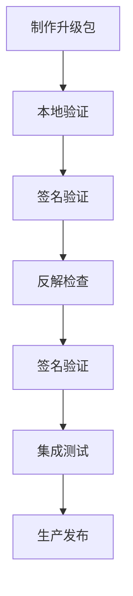

# 使用说明（Usage）

> 本文档详细介绍 OpenHarmony 升级包制作工具的命令行参数、使用示例和常见问题，帮助运维人员和开发人员快速上手使用。

## 1 命令行接口概述

### 1.1 工具调用方式

Packaging Tools 通过 `build_update.py` 脚本提供命令行接口。

**基本语法**：

```bash
python build_update.py [选项] <目标包目录> <输出升级包路径>
```

**证据来源**：

```markdown
// README_zh.md:80-84
全量升级包制作命令示例：
python build_update.py ./target/ ./target/package -pk ./target/updater_config/rsa_private_key2048.pem
```

### 1.2 参数分类

| 参数类型 | 说明 | 必需性 |
|---------|-----|-------|
| 位置参数 | 目标包目录、输出路径 | 必需 |
| 可选参数 | 功能开关、配置选项 | 可选 |

## 2 参数完整说明

### 2.1 位置参数

#### 2.1.1 目标包目录

| 属性 | 值 |
|-----|-----|
| 参数名 | `target_package` |
| 说明 | 目标包文件路径 |
| 必需 | 是 |
| 类型 | 目录路径 |

**示例**：

```bash
./target/
/path/to/target_package/
```

**说明**：该目录应包含以下内容：

- 目标镜像文件
- 分区配置文件（如需要）
- 升级脚本配置
- 签名密钥配置

#### 2.1.2 输出升级包路径

| 属性 | 值 |
|-----|-----|
| 参数名 | `update_package` |
| 说明 | 输出升级包文件路径 |
| 必需 | 是 |
| 类型 | 文件路径 |

**示例**：

```bash
./target/package
/path/to/output/update.zip
```

**说明**：工具将在此路径生成最终的升级包文件。

### 2.2 可选参数

#### 2.2.1 帮助信息

| 属性 | 值 |
|-----|-----|
| 短参数 | `-h` |
| 长参数 | `--help` |
| 说明 | 显示帮助信息并退出 |
| 必需 | 否 |

**示例**：

```bash
python build_update.py --help
```

**输出**：

```
usage: build_update.py [-h] [-s SOURCE_PACKAGE] [-nz] [-pf PARTITION_FILE]
                       [-sa {ECC,RSA}] [-ha {sha256,sha384}]
                       [-pk PRIVATE_KEY]
                       target_package update_package

positional arguments:
  target_package         Target package file path.
  update_package        Update package file path.

optional arguments:
  -h, --help                                                show this help message and exit
  -s SOURCE_PACKAGE, --source_package SOURCE_PACKAGE        Source package file path.
  -nz, --no_zip                                             No zip mode, Output update package without zip.
  -pf PARTITION_FILE, --partition_file PARTITION_FILE       Variable partition mode, Partition list file path.
  -sa {ECC,RSA}, --signing_algorithm {ECC,RSA}              The signing algorithm supported by the tool include['ECC', 'RSA'].
  -ha {sha256,sha384}, --hash_algorithm {sha256,sha384}     The hash algorithm  supported by the tool include ['sha256', 'sha384'].
  -pk PRIVATE_KEY, --private_key PRIVATE_KEY                Private key file path.
```

**证据来源**：

```markdown
// README_zh.md:67-78
参数配置说明：
positional arguments:
target_package         Target package file path.
update_package        Update package file path.
optional arguments:
-h, --help                                                show this help message and exit
-s SOURCE_PACKAGE, --source_package SOURCE_PACKAGE        Source package file path.
-nz, --no_zip                                             No zip mode, Output update package without zip.
-pf PARTITION_FILE, --partition_file PARTITION_FILE       Variable partition mode, Partition list file path.
-sa {ECC,RSA}, --signing_algorithm {ECC,RSA}              The signing algorithm supported by the tool include['ECC', 'RSA'].
-ha {sha256,sha384}, --hash_algorithm {sha256,sha384}     The hash algorithm  supported by the tool include ['sha256', 'sha384'].
-pk PRIVATE_KEY, --private_key PRIVATE_KEY                Private key file path.
```

#### 2.2.2 源包文件路径

| 属性 | 值 |
|-----|-----|
| 短参数 | `-s` |
| 长参数 | `--source_package` |
| 说明 | 源包文件路径，用于差分升级 |
| 必需 | 否 |
| 类型 | 文件路径 |

**用途**：制作差分升级包时，指定源镜像文件路径。

**示例**：

```bash
python build_update.py -s source.zip ./target/ ./output/package.zip
```

**证据来源**：

```markdown
// README_zh.md:72
-s SOURCE_PACKAGE, --source_package SOURCE_PACKAGE        Source package file path.
```

#### 2.2.3 不压缩模式

| 属性 | 值 |
|-----|-----|
| 短参数 | `-nz` |
| 长参数 | `--no_zip` |
| 说明 | 不压缩模式，输出不压缩的升级包 |
| 必需 | 否 |

**用途**：跳过 ZIP 压缩步骤，直接输出原始格式的升级包。

**示例**：

```bash
python build_update.py -nz ./target/ ./output/package.bin
```

**注意**：生成的升级包可能较大，但解压速度更快。

**证据来源**：

```markdown
// README_zh.md:73
-nz, --no_zip                                             No zip mode, Output update package without zip.
```

#### 2.2.4 变分区模式

| 属性 | 值 |
|-----|-----|
| 短参数 | `-pf` |
| 长参数 | `--partition_file` |
| 说明 | 变分区模式，分区列表文件路径 |
| 必需 | 否 |
| 类型 | 文件路径 |

**用途**：生成分区表可变的升级包，支持分区方案调整。

**示例**：

```bash
python build_update.py -pf partition_config.xml ./target/ ./output/package.zip
```

**说明**：`partition_config.xml` 应包含新的分区表定义。

**证据来源**：

```markdown
// README_zh.md:74
-pf PARTITION_FILE, --partition_file PARTITION_FILE       Variable partition mode, Partition list file path.
```

#### 2.2.5 签名算法

| 属性 | 值 |
|-----|-----|
| 短参数 | `-sa` |
| 长参数 | `--signing_algorithm` |
| 说明 | 签名算法，支持 ECC 或 RSA |
| 必需 | 否（默认 RSA） |
| 类型 | 枚举值 |
| 可选值 | `ECC`、`RSA` |

**用途**：指定升级包签名所使用的算法。

**示例**：

```bash
python build_update.py -sa ECC ./target/ ./output/package.zip
```

**算法对比**：

| 算法 | 密钥大小 | 特点 |
|-----|---------|-----|
| RSA | 2048/4096 位 | 兼容性更好，密钥较大 |
| ECC | 256/384 位 | 密钥小，速度快 |

**证据来源**：

```markdown
// README_zh.md:75
-sa {ECC,RSA}, --signing_algorithm {ECC,RSA}              The signing algorithm supported by the tool include['ECC', 'RSA'].
```

#### 2.2.6 哈希算法

| 属性 | 值 |
|-----|-----|
| 短参数 | `-ha` |
| 长参数 | `--hash_algorithm` |
| 说明 | 哈希算法，支持 sha256 或 sha384 |
| 必需 | 否（默认 sha256） |
| 类型 | 枚举值 |
| 可选值 | `sha256`、`sha384` |

**用途**：指定数据完整性校验所使用的哈希算法。

**示例**：

```bash
python build_update.py -ha sha384 ./target/ ./output/package.zip
```

**算法对比**：

| 算法 | 输出长度 | 安全性 | 性能 |
|-----|---------|-------|-----|
| SHA256 | 256 位 | 高 | 快 |
| SHA384 | 384 位 | 更高 | 中 |

**证据来源**：

```markdown
// README_zh.md:76
-ha {sha256,sha384}, --hash_algorithm {sha256,sha384}     The hash algorithm  supported by the tool include ['sha256', 'sha384'].
```

#### 2.2.7 私钥文件路径

| 属性 | 值 |
|-----|-----|
| 短参数 | `-pk` |
| 长参数 | `--private_key` |
| 说明 | 私钥文件路径（PEM 格式） |
| 必需 | 是（签名必需） |
| 类型 | 文件路径 |

**用途**：指定用于签名的私钥文件路径。

**示例**：

```bash
python build_update.py -pk ./keys/rsa_private_key.pem ./target/ ./output/package.zip
```

**说明**：私钥文件应为 PEM 格式，包含 RSA 或 ECC 私钥。

**证据来源**：

```markdown
// README_zh.md:77
-pk PRIVATE_KEY, --private_key PRIVATE_KEY                Private key file path.
```

## 3 使用示例

### 3.1 全量升级包制作

#### 3.1.1 基本命令

```bash
python build_update.py ./target/ ./target/package -pk ./target/updater_config/rsa_private_key2048.pem
```

**说明**：

- `./target/`：目标包目录
- `./target/package`：输出升级包路径
- `-pk ./target/updater_config/rsa_private_key2048.pem`：私钥文件路径

**证据来源**：

```markdown
// README_zh.md:80-84
全量升级包制作命令示例：
python build_update.py ./target/ ./target/package -pk ./target/updater_config/rsa_private_key2048.pem
```

#### 3.1.2 指定签名算法

```bash
python build_update.py \
    ./target/ \
    ./target/package \
    -pk ./target/updater_config/ecc_private_key.pem \
    -sa ECC \
    -ha sha384
```

### 3.2 差分升级包制作

#### 3.2.1 基本命令

```bash
python build_update.py -s source.zip ./target/ ./target/package -pk ./target/updater_config/rsa_private_key2048.pem
```

**参数说明**：

- `-s source.zip`：源包文件路径
- `./target/`：目标包目录
- `./target/package`：输出升级包路径
- `-pk ...`：私钥文件路径

**说明**：与全量升级相比，差分升级包只包含源镜像和目标镜像之间的差异数据。

**证据来源**：

```markdown
// README_zh.md:86-90
差分升级包制作命令示例：
python build_update.py -s source.zip ./target/ ./target/package -pk./target/updater_config/rsa_private_key2048.pem
```

#### 3.2.2 使用不同哈希算法

```bash
python build_update.py \
    -s source.zip \
    ./target/ \
    ./target/package \
    -pk ./target/updater_config/rsa_private_key.pem \
    -ha sha384
```

### 3.3 变分区升级包制作

#### 3.3.1 基本命令

```bash
python build_update.py \
    -pf partition_config.xml \
    ./target/ \
    ./target/package \
    -pk ./target/updater_config/rsa_private_key.pem
```

**参数说明**：

- `-pf partition_config.xml`：分区配置文件路径
- `./target/`：目标包目录（包含新分区镜像）
- `./target/package`：输出升级包路径

**说明**：变分区升级包包含新的分区表和完整的镜像数据，用于支持分区方案变更。

### 3.4 不压缩模式

```bash
python build_update.py \
    -nz \
    ./target/ \
    ./target/package.bin \
    -pk ./target/updater_config/rsa_private_key.pem
```

**说明**：使用 `-nz` 参数跳过 ZIP 压缩步骤。

## 4 目标包目录结构

### 4.1 全量升级目标包

```
./target/
├── system.img          # 系统镜像
├── vendor.img          # 厂商镜像
├── product.img         # 产品镜像
├── updater_config/     # 升级配置目录
│   └── rsa_private_key2048.pem  # 私钥文件
└── upgrade_scripts/    # 升级脚本配置（可选）
```

### 4.2 差分升级目标包

```
./target/
├── system.img          # 目标系统镜像
├── vendor.img          # 目标厂商镜像
├── product.img         # 目标产品镜像
├── updater_config/     # 升级配置目录
│   └── rsa_private_key2048.pem  # 私钥文件
└── upgrade_scripts/    # 升级脚本配置（可选）
```

## 5 环境准备

### 5.1 Python 环境

**版本要求**：Python 3.5 及以上

**依赖安装**：

```bash
pip install xmltodict
```

**证据来源**：

```markdown
// README_zh.md:50-52
- python3.5及以上版本；
- python库xmltodict， 解析xml文件，需要单独安装；
```

### 5.2 外部工具安装

#### 5.2.1 bsdiff

```bash
# Ubuntu/Debian
sudo apt-get install bsdiff

# macOS (Homebrew)
brew install bsdiff
```

**用途**：通用差分计算工具，用于生成 patch 数据。

#### 5.2.2 imgdiff

```bash
# imgdiff 通常随 Android SDK 提供
# 或从 AOSP 源码编译
```

**用途**：针对压缩文件（zip、gz、lz4）优化的差分计算工具。

#### 5.2.3 e2fsdroid

```bash
# e2fsdroid 通常随 Android SDK 提供
# 或从 AOSP 源码编译
```

**用途**：生成 ext4 镜像的 map 文件。

**证据来源**：

```markdown
// README_zh.md:58-62
- bsdiff可执行程序，差分计算，比较生成patch；
- imgdiff可执行程序，差分计算，针对zip、gz、lz4类型的文件，对比生成patch；
- e2fsdroid可执行程序，差分计算，用于生成镜像的map文件。
```

## 6 常见问题与解决方案

### 6.1 安装相关

#### Q1: xmltodict 安装失败

**问题**：`pip install xmltodict` 安装超时或失败

**解决方案**：

```bash
# 使用国内镜像源
pip install xmltodict -i https://pypi.tuna.tsinghua.edu.cn/simple

# 或使用豆瓣镜像
pip install xmltodict -i https://pypi.douban.com/simple
```

#### Q2: bsdiff 命令未找到

**问题**：`bsdiff: command not found`

**解决方案**：

```bash
# 确认已安装 bsdiff
which bsdiff

# 如果未安装，按 5.2.1 节安装
sudo apt-get install bsdiff
```

### 6.2 使用相关

#### Q3: 私钥文件权限错误

**问题**：`Permission denied: 'rsa_private_key.pem'`

**解决方案**：

```bash
# 检查文件权限
ls -la rsa_private_key.pem

# 设置正确权限（仅当前用户可读写）
chmod 600 rsa_private_key.pem
```

#### Q4: 差分升级包过大

**问题**：差分升级包 size 与预期不符

**可能原因**：

1. 源镜像和目标镜像差异过大
2. 使用了 imgdiff 但目标文件格式不适用

**解决方案**：

```bash
# 检查源镜像和目标镜像的差异
diff -qr source/ target/

# 确认文件格式是否适合 imgdiff
file source.img target.img
```

#### Q5: 签名验证失败

**问题**：升级包签名验证失败

**可能原因**：

1. 私钥和公钥不匹配
2. 签名算法配置错误
3. 私钥文件损坏

**解决方案**：

```bash
# 验证私钥文件
openssl rsa -in private_key.pem -check

# 确认签名算法
python build_update.py -sa ECC ./target/ ./output/
```

### 6.3 性能相关

#### Q6: 处理大镜像时内存不足

**问题**：处理数 GB 的镜像时内存占用过高

**解决方案**：

1. 使用 64 位 Python（支持更大内存）
2. 确保系统有足够可用内存（建议 8GB+）
3. 考虑使用交换空间

```bash
# 检查 Python 版本
python --version

# 确认是 64 位
python -c "import struct; print('64-bit' if struct.calcsize('P') * 8 == 64 else '32-bit')"
```

#### Q7: 差分计算耗时过长

**问题**：差分升级包制作时间过长

**可能原因**：

1. 镜像文件过大
2. bsdiff/imgdiff 算法特点
3. 系统资源不足

**解决方案**：

```bash
# 使用 imgdiff（针对压缩文件更快）
# 确认目标镜像是压缩格式（zip、gz、lz4）

# 监控资源使用
top -bn1 | head -20

# 增加临时空间
export TMPDIR=/path/to/large/tmp
```

### 6.4 调试相关

#### Q8: 如何开启调试日志

**问题**：需要查看详细的处理过程

**解决方案**：

```bash
# 检查日志配置
python build_update.py --help | grep -i log

# 设置日志级别
export LOG_LEVEL=DEBUG
python build_update.py ./target/ ./output/
```

#### Q9: 验证生成的升级包

**问题**：需要验证升级包的完整性

**解决方案**：

```bash
# 使用 unpack_updater_package.py 反解
python unpack_updater_package.py ./output/package.zip ./output/unpacked/

# 检查解包结果
ls -la ./output/unpacked/
```

## 7 最佳实践

### 7.1 签名密钥管理

| 实践 | 说明 |
|-----|-----|
| 离线存储 | 私钥应离线存储，仅在签名时使用 |
| 定期轮换 | 定期更换签名密钥 |
| 备份 | 安全备份私钥 |
| 权限控制 | 限制私钥文件的访问权限 |

### 7.2 升级包测试流程



### 7.3 性能优化建议

| 场景 | 建议 |
|-----|-----|
| 大镜像 | 使用 imgdiff（针对压缩文件） |
| 网络传输 | 使用差分升级，减少传输量 |
| 磁盘空间 | 使用不压缩模式（-nz），减少 CPU 开销 |
| 签名速度 | 使用 ECC 算法，签名验证更快 |

## 8 相关文档

| 文档 | 说明 |
|-----|-----|
| 00_Overview.md | 项目概览 |
| 01_Directory_Structure.md | 目录结构与模块 |
| 02_Architecture.md | 架构说明 |
| 04_Security.md | 安全评审 |
| appendix/Config_Flags.md | 完整参数列表 |
