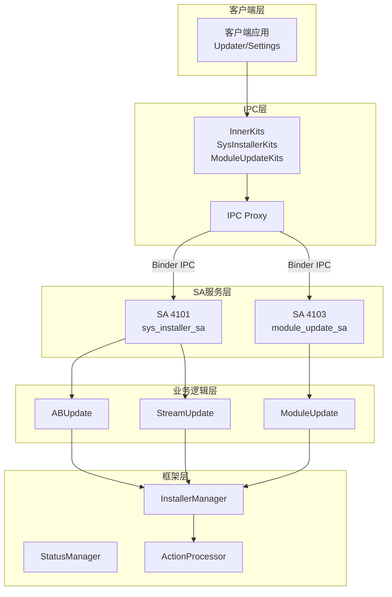

# 项目概览

## 目的

本文档介绍 OpenHarmony `sys_installer`（系统安装部件）的项目定位、核心能力和运行环境。

## 适用范围

- OpenHarmony 标准系统 (standard)
- 版本 3.2+
- 面向系统开发者和维护人员

## 项目定位

`sys_installer` 是 OpenHarmony **升级子系统**的核心部件，提供**系统安装能力**。主要作用是在设备正常使用的情况下，完成升级包的静默安装。

### 在升级子系统中的位置

```
升级子系统 (updater)
├── updater (升级器本体 - Recovery 模式)
├── sys_installer (系统安装部件 - 正常运行模式) ← 本项目
└── 其他辅助部件
```

**关键区别**:
- `updater`: 在 Recovery 模式下运行，负责完整系统升级
- `sys_installer`: 在系统正常运行时提供后台升级能力（模块更新、热补丁等）

## 核心能力

### 1. 系统包更新
- **全量 OTA 包安装**: 支持标准 OTA 包的后台安装
- **VAB (Virtual A/B) 更新**: 支持 Android 风格的虚拟 A/B 分区更新
- **流式更新**: 支持网络流式传输的增量更新

### 2. 模块更新 (HMP - Hot Module Package)
- **模块安装/卸载**: 动态安装和卸载功能模块
- **HMP 版本管理**: 查询和管理已安装模块版本
- **SA (System Ability) 热升级**: 支持系统能力的热更新

### 3. 安全验证
- **包签名验证**: 使用系统证书验证升级包签名
- **HVB (Verified Boot)**: 支持华为验证启动机制
- **完整性校验**: SHA-256 哈希校验

### 4. 云 ROM 支持
- **云端 ROM 安装**: 支持云侧 ROM 包的下载和安装
- **版本管理**: 云 ROM 版本追踪和回滚

## 运行环境

### 进程模型

sys_installer 包含两个独立的 System Ability (SA) 进程：

| SA ID | 进程名 | 库文件 | 用途 |
|-------|--------|--------|------|
| 4101 | `sys_installer_sa` | `libsys_installer.z.so` | 系统包更新服务 |
| 4103 | `module_update_sa` | `libmodule_update_service.z.so` | 模块更新服务 |

### 启动方式

两个 SA 均采用**按需启动**策略：
- `run-on-create: false`
- 通过 samgr (System Ability Manager) 在首次调用时启动
- 支持动态加载和卸载

### 权限要求

调用 sys_installer 接口需要以下权限：

- **`ohos.permission.UPDATE_SYSTEM`**: 系统更新权限
- **UID 限制**: 仅允许 root (0) 或 update 服务 UID (6666) 调用

### 依赖组件

```json
{
  "系统组件": [
    "c_utils",        // C 工具库
    "hilog",          // 日志系统
    "hvb",            // 哈希验证启动
    "ipc",            // IPC 机制
    "safwk",          // SA 框架
    "samgr",          // SA 管理器
    "updater",        // 升级器
    "access_token",   // 访问令牌
    "hisysevent",     // 系统事件
    "selinux_adapter", // SELinux 适配
    "init"            // 初始化进程
  ],
  "第三方库": [
    "cJSON", "curl", "lz4", "openssl", "zlib", "bzip2"
  ]
}
```

## 关键概念

### VAB (Virtual A/B)
虚拟 A/B 分区机制，允许在不影响当前系统运行的情况下进行后台更新，重启后自动切换到新版本。

### HMP (Hot Module Package)
热模块包，支持在系统运行时动态安装、卸载和更新功能模块，无需重启设备。

### SA (System Ability)
系统能力，OpenHarmony 的进程间服务框架。sys_installer 通过 SA 机制暴露服务接口。

### HVB (Huawei Verified Boot)
华为验证启动机制，确保系统镜像的完整性和可信度。

## 架构概览



## 相关链接

- [目录结构](01_Directory_Structure.md)
- [架构说明](02_Architecture.md)
- [对外 API](03_External_APIs.md)
- [安全风险分析](06_Security_Analysis.md)

---

*证据来源*:
- `README.md`: 项目简介
- `bundle.json`: 依赖组件、SA 配置
- `frameworks/ipc_server/sa_profile/4101.json`, `4103.json`: SA 定义
- `frameworks/ipc_server/src/sys_installer_server.cpp`: 权限检查实现
