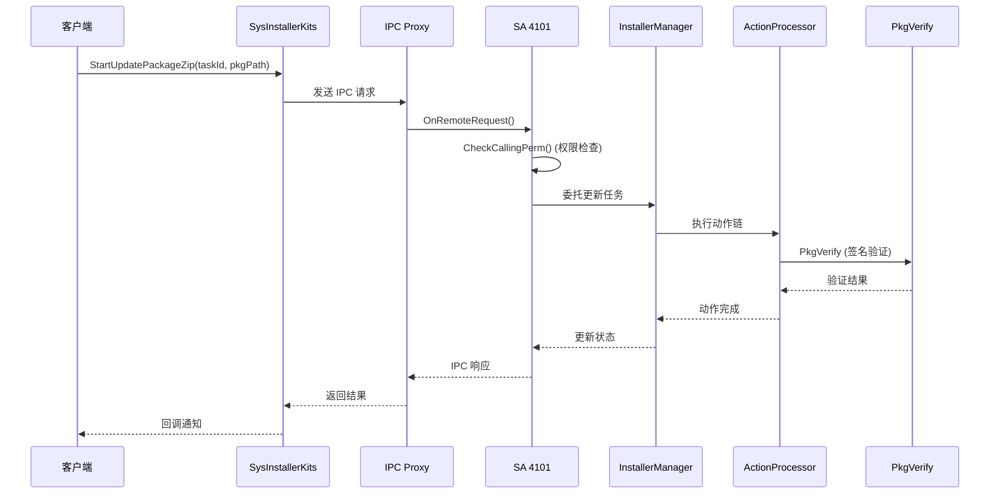
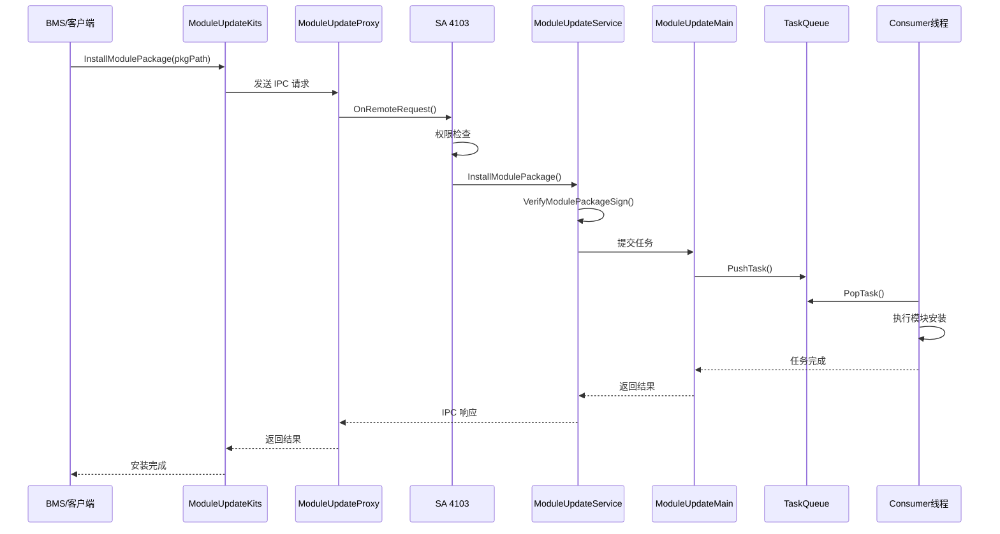
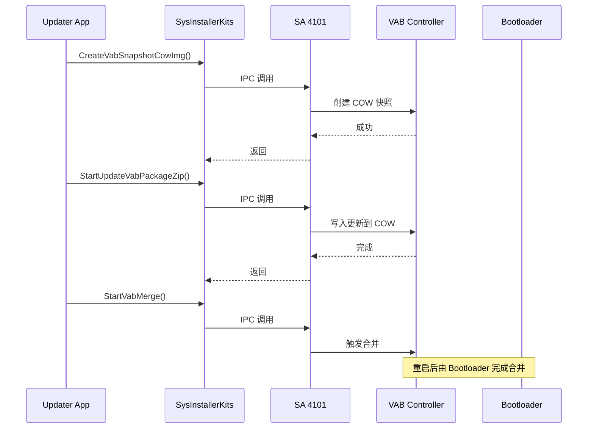
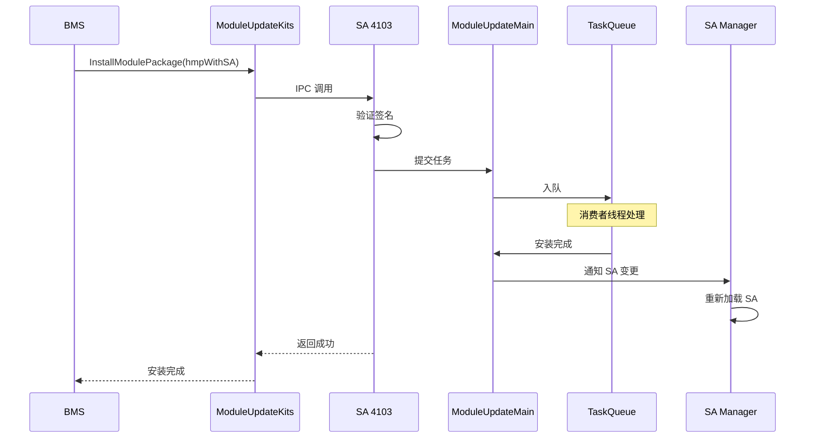

# 架构说明

## 目的

本文档详细说明 `sys_installer` 的系统架构、组件关系、数据流和线程模型。

## 适用范围

OpenHarmony sys_installer 架构设计与实现分析。

## 架构概览

sys_installer 采用**分层架构**设计，遵循 OpenHarmony 的 System Ability (SA) 框架规范：

```
┌─────────────────────────────────────────────────────────────────┐
│                        客户端层 (Client Layer)                   │
│         (Updater App, Settings, BMS, 其他系统服务)               │
└─────────────────────────────────────────────────────────────────┘
                              │
                              ▼ IPC 调用
┌─────────────────────────────────────────────────────────────────┐
│                      接口层 (Interface Layer)                    │
│  ┌─────────────────┐  ┌─────────────────┐  ┌─────────────────┐ │
│  │ SysInstallerKits│  │ModuleUpdateKits │  │  LoadCallbacks  │ │
│  │   (C++ API)     │  │   (C++ API)     │  │                 │ │
│  └─────────────────┘  └─────────────────┘  └─────────────────┘ │
└─────────────────────────────────────────────────────────────────┘
                              │
                              ▼ Binder IPC
┌─────────────────────────────────────────────────────────────────┐
│                      SA 服务层 (SA Service Layer)                │
│  ┌─────────────────────────┐  ┌─────────────────────────┐       │
│  │   SysInstallerServer    │  │   ModuleUpdateService   │       │
│  │      (SA 4101)          │  │      (SA 4103)          │       │
│  │  - 系统包更新            │  │  - HMP 模块更新          │       │
│  │  - VAB 操作             │  │  - SA 热升级             │       │
│  │  - 云 ROM 管理           │  │  - 热补丁               │       │
│  └─────────────────────────┘  └─────────────────────────┘       │
└─────────────────────────────────────────────────────────────────┘
                              │
                              ▼
┌─────────────────────────────────────────────────────────────────┐
│                     业务逻辑层 (Service Layer)                   │
│  ┌─────────────┐  ┌─────────────┐  ┌─────────────────────────┐ │
│  │  ABUpdate   │  │StreamUpdate │  │      ModuleUpdate       │ │
│  │  (AB OTA)   │  │ (流式更新)   │  │  - 模块文件管理          │ │
│  └─────────────┘  └─────────────┘  │  - HVB 验证             │ │
│                                     │  - DM/Loop 设备         │ │
│                                     │  - 挂载操作             │ │
│                                     └─────────────────────────┘ │
└─────────────────────────────────────────────────────────────────┘
                              │
                              ▼
┌─────────────────────────────────────────────────────────────────┐
│                     框架层 (Framework Layer)                     │
│  ┌─────────────────┐  ┌─────────────────┐  ┌─────────────────┐ │
│  │ InstallerManager│  │  StatusManager  │  │ ActionProcessor │ │
│  │   (安装管理)     │  │   (状态管理)     │  │   (动作处理)     │ │
│  └─────────────────┘  └─────────────────┘  └─────────────────┘ │
└─────────────────────────────────────────────────────────────────┘
```

## 组件详细说明

### 1. 客户端层

**职责**: 调用 sys_installer 提供的更新服务。

**典型客户端**:
- **Updater 应用**: 系统更新应用，发起 OTA 更新
- **BMS (Bundle Manager Service)**: 包管理服务，触发模块更新
- **Settings**: 系统设置，显示更新状态

**调用方式**:
```cpp
// 获取 Kit 实例并调用
SysInstallerKits::GetInstance().StartUpdatePackageZip(taskId, pkgPath);
```

### 2. 接口层 (InnerKits)

**职责**: 封装 IPC 调用，提供简洁的 C++ API。

#### 2.1 SysInstallerKits

**文件**: `interfaces/innerkits/ipc_client/include/sys_installer_kits.h`

**功能**:
- 系统包更新 (OTA)
- VAB (Virtual A/B) 操作
- 云 ROM 管理
- 流式更新

**关键方法**:
```cpp
int32_t StartUpdatePackageZip(const std::string &taskId, const std::string &pkgPath);
int32_t StartUpdateVabPackageZip(const std::string &taskId, const std::vector<std::string> &pkgPath);
int32_t SetUpdateCallback(const std::string &taskId, const sptr<ISysInstallerCallback> &cb);
```

#### 2.2 ModuleUpdateKits

**文件**: `interfaces/innerkits/ipc_client/include/module_update_kits.h`

**功能**:
- HMP (Hot Module Package) 安装/卸载
- 模块版本查询
- SA 热升级

**关键方法**:
```cpp
int32_t InstallModulePackage(const std::string &pkgPath);
int32_t UninstallModulePackage(const std::string &hmpName);
std::vector<HmpVersionInfo> GetHmpVersionInfo();
```

#### 2.3 LoadCallbacks

**职责**: 处理 SA 服务的动态加载和死亡通知。

**文件**:
- `sys_installer_load_callback.h/cpp`: SA 4101 加载回调
- `module_update_load_callback.h/cpp`: SA 4103 加载回调

### 3. SA 服务层

#### 3.1 SA 4101 - SysInstallerServer

**文件**: `frameworks/ipc_server/src/sys_installer_server.cpp`

**SA 配置**: `frameworks/ipc_server/sa_profile/4101.json`

**职责**:
- 处理系统包更新请求
- 管理 VAB 快照和合并
- 处理云 ROM 安装

**安全机制**:
```cpp
// 权限检查 (sys_installer_server.cpp:329-350)
bool CheckCallingPerm() {
    int32_t callingUid = OHOS::IPCSkeleton::GetCallingUid();
    if (callingUid == 0) return true;  // Root 绕过
    return callingUid == USER_UPDATE_AUTHORITY && IsPermissionGranted();
}
```

#### 3.2 SA 4103 - ModuleUpdateService

**文件**: `frameworks/ipc_server/src/module_update_service.cpp`

**SA 配置**: `frameworks/ipc_server/sa_profile/4103.json`

**职责**:
- 处理 HMP 模块更新
- 管理模块生命周期
- SA 热升级协调

**启动触发条件**:
```json
{
  "start-on-demand": {
    "persist.samgr.moduleupdate.start": "true",
    "persist.moduleupdate.bms.scan": "revert"
  }
}
```

### 4. 业务逻辑层

#### 4.1 ABUpdate

**文件**: `services/ab_update/src/ab_update.cpp`

**职责**: 处理 A/B 分区更新逻辑，支持无缝切换。

#### 4.2 StreamUpdate

**文件**: `services/stream_update/src/stream_update.cpp`

**职责**: 处理网络流式增量更新，支持断点续传。

#### 4.3 ModuleUpdate

**文件**: `services/module_update/src/module_update.cpp` (489 行)

**职责**:
- 模块包解析和验证
- 模块文件管理
- HVB 验证集成
- Device Mapper 和 Loop 设备管理

**核心类**:
- `ModuleUpdate`: 主更新逻辑
- `ModuleFile`: 模块文件操作 (576 行)
- `ModuleLoop`: Loop 设备管理 (454 行)
- `ModuleDm`: Device Mapper 操作

### 5. 框架层

#### 5.1 InstallerManager

**文件**: `frameworks/installer_manager/src/sys_installer_manager.cpp` (308 行)

**职责**:
- 协调更新流程
- 管理更新状态机
- 调用 ActionProcessor 执行具体动作

#### 5.2 StatusManager

**文件**: `frameworks/status_manager/src/status_manager.cpp`

**职责**:
- 跟踪更新进度
- 管理更新状态持久化
- 提供状态查询接口

#### 5.3 ActionProcessor

**文件**: `frameworks/action_processer/src/action_processer.cpp`

**职责**:
- 动作链执行框架
- 支持动作回滚
- 错误处理和恢复

## 数据流

### 系统包更新流程



### 模块更新流程



## 线程模型

### SA 4101 线程模型

```
主线程 (Binder 线程池)
    │
    ├── 处理 IPC 请求
    │   └── OnRemoteRequest()
    │
    ├── 权限检查
    │   └── CheckCallingPerm()
    │
    └── 委托工作线程
        └── 执行具体更新任务
```

**特点**:
- 使用 OpenHarmony 标准 Binder 线程池
- 同步 IPC 调用，阻塞等待结果
- 回调通过 IPC 异步通知

### SA 4103 线程模型

```
主线程 (Binder 线程池)
    │
    ├── 处理 IPC 请求
    │   └── OnRemoteRequest()
    │
    └── 提交任务到队列

生产者线程 (Producer)
    │
    └── 接收任务并放入队列

消费者线程 (Consumer)
    │
    ├── 从队列获取任务
    ├── 执行模块安装
    └── 发送完成通知
```

**文件**: `services/module_update/service/src/module_update_*.cpp`

**特点**:
- 生产者-消费者模式
- 任务队列解耦 IPC 处理和实际工作
- 支持并发任务处理

## IPC 通信机制

### IPC 接口定义

**IDL 文件**: `interfaces/innerkits/ipc_client/*.idl`

```idl
// ISysInstaller.idl
interface OHOS.SysInstaller.ISysInstaller {
    StartUpdatePackageZip([in] String taskId, [in] String pkgPath);
    SetUpdateCallback([in] String taskId, [in] ISysInstallerCallback cb);
    // ... 其他方法
}

// IModuleUpdate.idl (imodule_update.h)
interface IModuleUpdate {
    InstallModulePackage([in] String pkgPath);
    UninstallModulePackage([in] String hmpName);
    // ... 其他方法
}
```

### IPC 命令码

**文件**: `interfaces/inner_api/include/sys_installer_sa_ipc_interface_code.h`

```cpp
enum ModuleUpdateInterfaceCode {
    INSTALL_MODULE_PACKAGE = 1,      // 安装模块包
    UNINSTALL_MODULE_PACKAGE,        // 卸载模块包
    GET_MODULE_PACKAGE_INFO,         // 获取模块信息
    REPORT_MODULE_UPDATE_STATUS,     // 报告更新状态
    EXIT_MODULE_UPDATE,              // 退出模块更新
    GET_HMP_VERSION_INFO,            // 获取 HMP 版本
    START_UPDATE_HMP_PACKAGE,        // 开始 HMP 更新
    GET_HMP_UPDATE_RESULT            // 获取 HMP 结果
};
```

### Stub/Proxy 模式

```
客户端调用
    │
    ▼
ModuleUpdateProxy (代理)
    │  序列化参数
    ▼
Binder 驱动
    │
    ▼
ModuleUpdateStub (存根)
    │  反序列化参数
    ▼
ModuleUpdateService (服务实现)
```

## 关键时序

### VAB 更新时序



### SA 热升级时序



## 相关链接

- [项目概览](00_Overview.md)
- [目录结构](01_Directory_Structure.md)
- [对外 API](03_External_APIs.md)
- [内部 API](04_Internal_APIs.md)
- [附录 - 调用链](appendix/Callgraphs.md)

---

*证据来源*:
- `frameworks/ipc_server/src/sys_installer_server.cpp`: SA 4101 实现
- `frameworks/ipc_server/src/module_update_service.cpp`: SA 4103 实现
- `interfaces/inner_api/include/sys_installer_sa_ipc_interface_code.h`: IPC 命令码
- `services/module_update/service/src/module_update_main.cpp`: 线程模型
