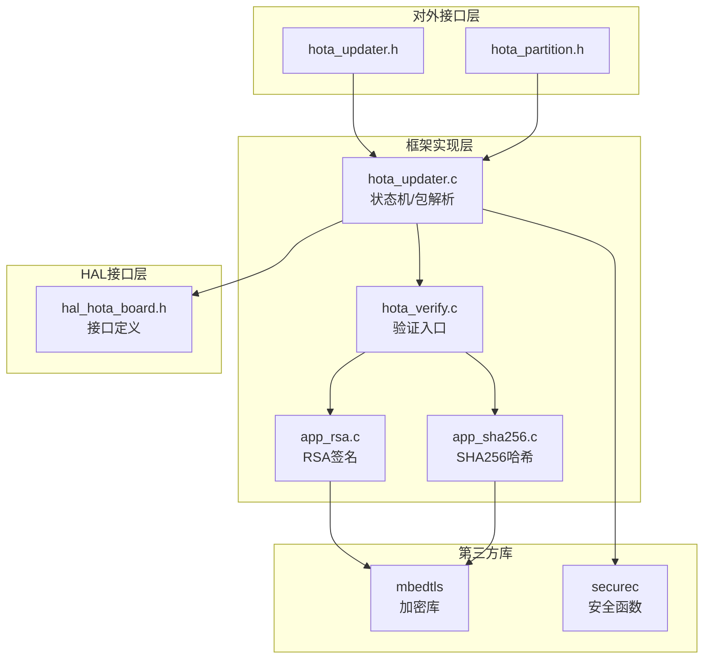
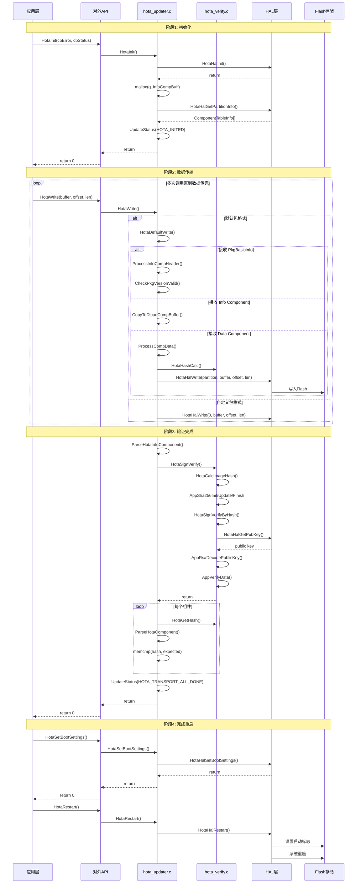
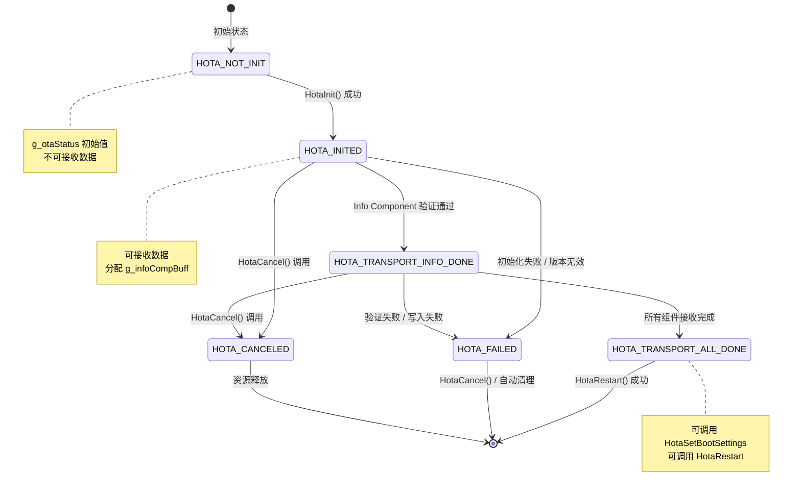

# 01 - 架构说明

## 目的与适用范围

**目的**: 详细说明 `sys_installer_lite` 的架构设计、组件关系、数据流和关键时序。

**适用范围**: 架构师、需要深度理解系统或进行芯片适配的开发者。

---

## 架构概览

### 分层架构图

```
┌─────────────────────────────────────────────────────────────────┐
│                     应用层 (Application)                        │
│                    OTA应用 / 系统服务                            │
└───────────────────────┬─────────────────────────────────────────┘
                        │ 调用 C API
┌───────────────────────▼─────────────────────────────────────────┐
│                   对外接口层 (Interfaces)                        │
│           hota_updater.h / hota_partition.h                     │
│         HotaInit / HotaWrite / HotaRestart ...                  │
└───────────────────────┬─────────────────────────────────────────┘
                        │ 调用框架实现
┌───────────────────────▼─────────────────────────────────────────┐
│                  框架实现层 (Framework)                         │
│  ┌─────────────────┐  ┌──────────────────┐                     │
│  │  Updater 模块   │  │   Verify 模块     │                    │
│  │ hota_updater.c  │  │ hota_verify.c    │                    │
│  │ • 状态机管理    │  │ • RSA签名验证    │                    │
│  │ • 包解析        │  │ • SHA256哈希     │                    │
│  │ • 分区写入调度  │  │ app_rsa.c        │                    │
│  │ • 版本校验      │  │ app_sha256.c     │                    │
│  └────────┬────────┘  └────────┬─────────┘                    │
│           │                    │                               │
│           └────────┬───────────┘                               │
│                    │ 调用 HAL                                  │
└────────────────────┼───────────────────────────────────────────┘
                     │
┌────────────────────▼───────────────────────────────────────────┐
│                  HAL 层 (硬件抽象层)                            │
│              hal_hota_board.h (接口定义)                        │
│  ┌──────────────┬──────────────┬──────────────┐              │
│  │ 分区操作     │ 启动控制     │ 密钥管理     │              │
│  │ HotaHalWrite │HotaHalRestart│HotaHalGetPubKey│             │
│  │ HotaHalRead  │HotaHalSetBootSettings│      │              │
│  └──────────────┴──────────────┴──────────────┘              │
│                    │                                            │
└────────────────────┼────────────────────────────────────────────┘
                     │ 厂商实现
┌────────────────────▼───────────────────────────────────────────┐
│                  Board 层 (芯片适配)                           │
│         由芯片厂商实现（不在本仓库）                            │
│  • Flash 驱动     • Bootloader 交互    • 安全存储              │
└─────────────────────────────────────────────────────────────────┘
```

---

## 组件关系

### 模块依赖图



---

## 数据流分析

### 升级包处理流程

```
升级包数据流:

┌───────────────────────────────────────────────────────────────┐
│  升级包文件 (OTA Package)                                      │
│  ┌─────────────┬────────────────┬─────────────┐               │
│  │ PkgBasicInfo│  Info Component │  Data Comp  │               │
│  │  (176B)     │  + Signature    │  (N parts)  │               │
│  └─────────────┴────────────────┴─────────────┘               │
└──────────────────────┬────────────────────────────────────────┘
                       │ HotaWrite 接收
┌──────────────────────▼────────────────────────────────────────┐
│  1. 解析 PkgBasicInfo (hota_updater.c:348-386)                 │
│     • 验证类型 (RSA2048/RSA3072)                               │
│     • 版本检查 (CheckPkgVersionValid)                          │
│     • 确定签名长度                                             │
└──────────────────────┬────────────────────────────────────────┘
                       │
┌──────────────────────▼────────────────────────────────────────┐
│  2. 累积 Info Component (hota_updater.c:422-437)               │
│     • g_infoCompBuff 缓冲区 (MAX_BUFFER_SIZE=1500)             │
│     • CopyToDloadCompBuffer                                    │
└──────────────────────┬────────────────────────────────────────┘
                       │ Info Component 完整
┌──────────────────────▼────────────────────────────────────────┐
│  3. 验证 Info Component (hota_verify.c:132-153)                │
│     • HotaSignVerify                                           │
│     • HotaCalcImageHash (SHA256)                               │
│     • AppVerifyData (RSA-PKCS1-v2.1)                           │
└──────────────────────┬────────────────────────────────────────┘
                       │ 验证通过
┌──────────────────────▼────────────────────────────────────────┐
│  4. 解析 Component Table (hota_updater.c:227-283)              │
│     • 读取组件数量 (g_allComponentNum)                         │
│     • 填充 g_componentInfos 表                                 │
│     • 写入 PARTITION_INFO_COMP                                 │
└──────────────────────┬────────────────────────────────────────┘
                       │
┌──────────────────────▼────────────────────────────────────────┐
│  5. 处理数据组件 (hota_updater.c:399-506)                      │
│     • 按组件分包写入                                           │
│     • 每包计算 SHA256 (HotaHashCalc)                           │
│     • 写入对应分区 (HotaHalWrite)                              │
└──────────────────────┬────────────────────────────────────────┘
                       │ 组件完成
┌──────────────────────▼────────────────────────────────────────┐
│  6. 验证组件哈希 (hota_updater.c:310-331)                      │
│     • ParseHotaComponent                                       │
│     • 对比 g_componentInfos.table[i].shaData                   │
└──────────────────────┬────────────────────────────────────────┘
                       │ 所有组件完成
┌──────────────────────▼────────────────────────────────────────┐
│  7. 状态更新为 HOTA_TRANSPORT_ALL_DONE                         │
│     • 允许 HotaSetBootSettings                                 │
│     • 允许 HotaRestart                                         │
└───────────────────────────────────────────────────────────────┘
```

### 内存数据结构

```c
// 全局状态变量 (hota_updater.c:90-103)
static HotaStatus g_otaStatus = HOTA_NOT_INIT;          // 当前状态
static unsigned short g_allComponentNum = 0;            // 总组件数
static unsigned short g_allComponentSize = 0;           // 组件表大小
static unsigned short g_recvComponentNum = 0;           // 已接收组件数
static CurrentDloadComp g_currentDloadComp = { 0 };     // 当前下载组件
static ComponentInfos g_componentInfos = { 0 };         // 组件信息表
static HotaNotifier g_otaNotifier = { 0 };              // 回调通知器
static unsigned char *g_infoCompBuff = NULL;            // Info组件缓冲区(1500B)
```

---

## 关键时序图

### 完整 OTA 流程时序



---

## 升级包格式详解

### 二进制结构

```
0                   176                 176+640              Variable
├───────────────────┼───────────────────┼────────────────────┼──────────┤
│   PkgBasicInfo    │   Signature       │   Component Table  │  Data    │
│    (176 bytes)    │   (640 bytes)     │   (Variable)       │ Sections │
└───────────────────┴───────────────────┴────────────────────┴──────────┘

PkgBasicInfo 结构 (hota_updater.c:55-63):
├─ type: unsigned short (2B) - 签名算法类型
│     SIGN_ARITHMETIC_RSA2048 = 0x0001
│     SIGN_ARITHMETIC_RSA3072 = 0x0011
├─ length: unsigned short (2B)
├─ infoCompSize: unsigned int (4B) - Info组件大小
├─ upgradePkgVersion: unsigned int (4B)
├─ productId[64]: char[64] - 产品ID
└─ version[64]: char[64] - 版本号

ComponentInfo 结构 (hota_updater.c:66-79):
├─ addr[16]: unsigned char[16] - 分区名
├─ id: unsigned short (2B) - 组件ID
├─ type: unsigned char (1B) - 组件类型
├─ operType: unsigned char (1B) - 0:升级 1:删除
├─ isDiff: unsigned char (1B) - 是否差分
├─ version[10]: unsigned char[10] - 版本
├─ length: unsigned int (4B) - 数据长度
├─ destLength: unsigned int (4B) - 目标长度
└─ shaData[32]: unsigned char[32] - SHA256哈希
```

---

## 状态机设计

### 状态转换图



---

## 线程模型

### 线程安全性说明

**注意**: 当前实现（hota_updater.c）使用全局静态变量，**非线程安全**：

```c
// hota_updater.c:90-103 - 全局状态
static HotaStatus g_otaStatus = HOTA_NOT_INIT;
static CurrentDloadComp g_currentDloadComp = { 0 };
static ComponentInfos g_componentInfos = { 0 };
// ... 其他全局变量
```

**使用约束**:
1. 同一时间只能有一个 OTA 会话
2. 建议在单线程环境或外部加锁使用
3. 状态检查 `HotaIsRejected()` 用于快速拒绝非法调用

---

## 关键调用链

### 1. 初始化调用链

```
HotaInit (hota_updater.h:115)
  └── HotaHalInit (hals/hal_hota_board.h:36)
      └── [厂商实现] 硬件初始化
```

### 2. 数据写入调用链（默认模式）

```
HotaWrite (hota_updater.h:129)
  └── HotaDefaultWrite (hota_updater.c:509)
      ├── CopyToDloadCompBuffer (hota_updater.c:421)
      ├── ProcessInfoCompHeader (hota_updater.c:338)
      │   └── CheckPkgVersionValid (hota_updater.c:210)
      │       └── GetIncrementalVersion (syspara)
      ├── ProcessCompData (hota_updater.c:486)
      │   ├── StashRecvDataToBuffer (hota_updater.c:460)
      │   │   └── HotaHalWrite (hals/hal_hota_board.h:74)
      │   └── HotaHashCalc (hota_verify.c:39)
      └── ParseHotaInfoComponent (hota_updater.c:227)
          └── HotaSignVerify (hota_verify.c:132)
```

### 3. 重启调用链

```
HotaRestart (hota_updater.h:182)
  └── HotaHalRestart (hals/hal_hota_board.h:112)
      └── [厂商实现] 系统重启
```

---

## 相关跳转

- [项目概览 → 00_Overview.md](00_Overview.md)
- [对外 API 详细说明 → 02_Public_API.md](02_Public_API.md)
- [HAL 接口定义 → 03_Inner_API.md](03_Inner_API.md)
- [安全风险分析 → 05_Security.md](05_Security.md)
