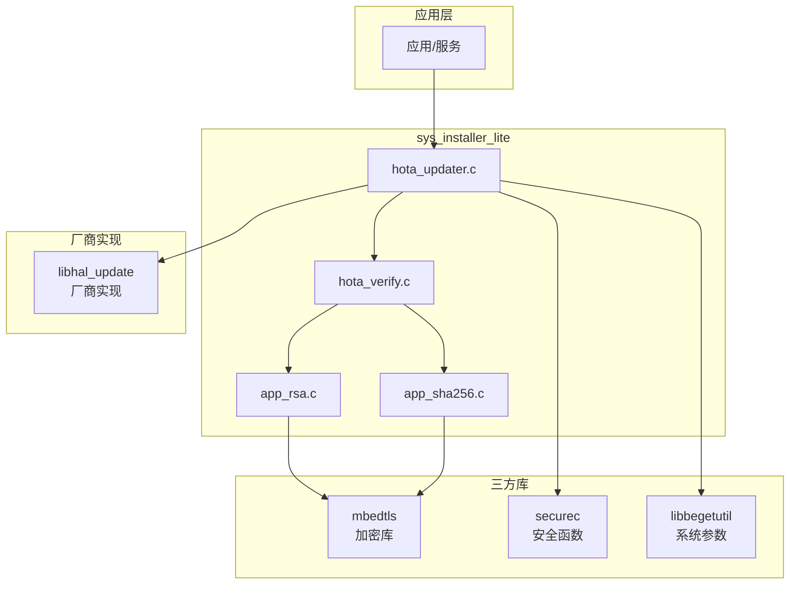

# 04 - GN 构建系统与编译产物

## 目的与适用范围

**目的**: 详细说明 `sys_installer_lite` 的 GN 构建配置、编译目标和产物。

**适用范围**: 需要定制构建、集成到系统的平台开发者。

---

## 构建系统概述

### 构建工具链

- **构建系统**: GN (Generate Ninja) + Ninja
- **编译器**: GCC / Clang（取决于 Board 配置）
- **目标系统**: OpenHarmony LiteOS-M / Linux / 其他

### 构建文件结构

```
sys_installer_lite/
├── sys_installer_lite_default_cfg.gni    # 全局参数定义
├── frameworks/
│   ├── BUILD.gn                          # 根构建文件
│   └── source/
│       └── BUILD.gn                      # 源码构建文件
└── bundle.json                           # OHOS 组件描述
```

---

## 构建目标详解

### 主构建目标

**目标路径**: `//base/update/sys_installer_lite/frameworks:sys_installer_lite`

```gn
# frameworks/BUILD.gn:18-20
lite_component("sys_installer_lite") {
  features = [ "//base/update/sys_installer_lite/frameworks/source:hota" ]
}
```

**说明**: 这是组件入口 target，依赖实际的 `hota` 库。

### 核心库目标

**目标路径**: `//base/update/sys_installer_lite/frameworks/source:hota`

```gn
# frameworks/source/BUILD.gn
if (ohos_kernel_type == "liteos_m") {
  static_library("hota") {
    # ... 配置
  }
} else {
  shared_library("hota") {
    # ... 配置
  }
}
```

#### 条件编译

| 内核类型 | 产物类型 | 输出名 | 链接方式 |
|----------|----------|--------|----------|
| `liteos_m` | static_library | `libhota.a` | 静态链接 |
| 其他 | shared_library | `libhota.so` | 动态链接 `-lhal_update` |

#### 源代码 (frameworks/source/BUILD.gn:16-21, 42-47)

```gn
sources = [
  "//base/update/sys_installer_lite/frameworks/source/updater/hota_updater.c",
  "//base/update/sys_installer_lite/frameworks/source/verify/app_rsa.c",
  "//base/update/sys_installer_lite/frameworks/source/verify/app_sha256.c",
  "//base/update/sys_installer_lite/frameworks/source/verify/hota_verify.c",
]
```

#### 头文件搜索路径

```gn
include_dirs = [
  "//base/update/sys_installer_lite/interfaces/kits",     # 对外头文件
  "//base/update/sys_installer_lite/hals",                # HAL 头文件
  "//base/update/sys_installer_lite/frameworks/test/dload", # 测试相关（TODO:需确认）
  "//base/update/sys_installer_lite/frameworks/source/verify", # 内部头文件
  "//commonlibrary/utils_lite/include",                   # OHOS 工具库
  "//kernel/liteos_m/kal/cmsis",                          # CMSIS
  "//base/startup/init/interfaces/innerkits/include/syspara", # 系统参数
  "//third_party/bounds_checking_function/include",       # 安全函数
  "//third_party/mbedtls/include",                        # 加密库
  "$ohos_third_party_dir/lwip_sack/include",              # 网络（可选）
]
```

#### 编译选项

**通用**:
```gn
cflags = [ "-Wno-unused-variable" ]
```

**非 liteos_m 特有**:
```gn
cflags = [
  "-Wno-unused-variable",
  "-DDYNAMIC_LOAD_HAL",  # 启用 HAL 动态加载
]
ldflags = [ "-lhal_update" ]
```

#### 依赖关系

```gn
deps = [
  "//base/startup/init/interfaces/innerkits:libbegetutil"  # 系统参数库
]

# liteos_m
deps += [ "$ohos_board_adapter_dir/hals/update:hal_update_static" ]

# 其他（动态库）
deps += [ "$ohos_board_adapter_dir/update:hal_update" ]
```

### NDK 库目标

**目标路径**: `//base/update/sys_installer_lite/frameworks:update_api`

```gn
# frameworks/BUILD.gn:22-25
ndk_lib("update_api") {
  deps = []
  head_files = [ "//base/update/sys_installer_lite/interfaces/kits/" ]
}
```

**用途**: 导出 NDK 头文件，供外部应用使用。

---

## 组件配置

### bundle.json 配置

**位置**: `bundle.json`

```json
{
  "name": "@ohos/sys_installer_lite",
  "version": "4.0.2",
  "component": {
    "name": "sys_installer_lite",
    "subsystem": "updater",
    "features": [
      "sys_installer_lite_security_huks_mbedtls_porting_path"
    ],
    "adapted_system_type": ["mini", "small", "standard"],
    "deps": {
      "components": ["init", "utils_lite"],
      "third_party": ["bounds_checking_function", "mbedtls"]
    },
    "build": {
      "sub_component": [
        "//base/update/sys_installer_lite/frameworks:sys_installer_lite"
      ],
      "inner_kits": [
        {
          "name": "//base/update/sys_installer_lite/frameworks:update_api",
          "header": {
            "header_files": ["hota_partition.h", "hota_updater.h"],
            "header_base": "//base/update/sys_installer_lite/interfaces/kits"
          }
        }
      ]
    }
  }
}
```

### 关键参数

**全局参数** (sys_installer_lite_default_cfg.gni:14-16):

```gn
declare_args() {
  sys_installer_lite_security_huks_mbedtls_porting_path = ""
}
```

**用途**: 指定 HUKS（HUawei KeyStore）mbedtls 移植路径（安全增强用）。

---

## 编译产物

### 产物清单

| 产物 | 类型 | 产物路径（推导） | 说明 |
|------|------|-----------------|------|
| `libhota.a` | 静态库 | `out/{board}/libs/libhota.a` | liteos_m 系统 |
| `libhota.so` | 动态库 | `out/{board}/system/lib/libhota.so` | 其他系统 |
| 头文件 | 头文件 | `out/{board}/sysroot/include/` | NDK 导出 |

### 安装路径（推导）

根据 OpenHarmony 标准构建规则：

```
out/{board}/
├── libs/
│   └── libhota.a                    # 静态库（liteos_m）
├── system/
│   └── lib/
│       └── libhota.so               # 动态库（其他系统）
└── sysroot/
    └── include/
        └── update/
            ├── hota_updater.h       # NDK 导出头文件
            └── hota_partition.h
```

### 运行时加载关系

**静态链接场景**（liteos_m）:
```
应用程序
    │
    ├──► libhota.a (sys_installer_lite)
    │       ├──► libhal_update_static.a (厂商实现，编译时链接)
    │       ├──► libmbedtls.a (签名验证)
    │       └──► libbegetutil.a (系统参数)
    │
    └──► 其他应用代码
```

**动态链接场景**（其他系统）:
```
应用程序
    │
    ├──► libhota.so (sys_installer_lite)
    │       ├──► libhal_update.so (厂商实现，运行时加载)
    │       ├──► libmbedtls.so (签名验证)
    │       └──► libbegetutil.so (系统参数)
    │
    └──► 其他应用代码
```

---

## 构建命令示例

### 完整构建

```bash
# 设置构建环境
hb set
# 选择需要构建的 board（如 hi3516dv300）

# 构建整个系统
hb build

# 仅构建 sys_installer_lite 组件
hb build //base/update/sys_installer_lite/frameworks:sys_installer_lite
```

### 集成到子系统

**步骤 1**: 在 board 配置中添加子系统

编辑 `vendor/{vendor}/{board}/config.json`:
```json
{
  "subsystem": "updater",
  "components": [
    { "component": "sys_installer_lite", "features": [] }
  ]
}
```

**步骤 2**: 确保依赖组件已配置

- `init` 子系统
- `utils_lite` 组件
- `mbedtls` 三方库
- `bounds_checking_function` 三方库

---

## 关键宏定义

### 编译期宏

| 宏 | 定义位置 | 说明 |
|----|----------|------|
| `DYNAMIC_LOAD_HAL` | frameworks/source/BUILD.gn:62 | 启用 HAL 动态加载 |
| `SIGN_RSA2048_LEN` | hota_partition.h:30 | RSA2048 签名长度（256） |
| `SIGN_RSA3072_LEN` | hota_partition.h:31 | RSA3072 签名长度（384） |
| `PARTITION_NAME_LENGTH` | hota_partition.h:27 | 分区名长度（16） |
| `OTA_MAX_PARTITION_NUM` | hota_updater.c:33 | 最大分区数（10） |

### 配置开关

**当前实现中无配置开关**，所有功能固定编译。

潜在可配置项（如需扩展）:
- 缓冲区大小（`MAX_BUFFER_SIZE`, `MAX_TRANSPORT_BUFF_SIZE`）
- 最大分区数（`OTA_MAX_PARTITION_NUM`）
- 签名算法选择（RSA2048/RSA3072）

---

## 依赖关系图



---

## 常见问题

### Q: 如何适配新的芯片平台？

A: 需要：
1. 实现 `hals/hal_hota_board.h` 中的 19 个 HAL 接口
2. 创建 `vendor/{vendor}/{board}/hals/update/BUILD.gn` 构建 HAL 库
3. 在 board 配置中添加 `updater` 子系统

### Q: 如何修改缓冲区大小？

A: 当前硬编码在代码中（hota_updater.c:38-39）:
```c
#define MAX_BUFFER_SIZE 1500
#define MAX_TRANSPORT_BUFF_SIZE (4 * 1024)
```
需修改源码后重新编译。

### Q: 如何调试构建问题？

A: 使用 GN 详细输出：
```bash
gn gen out/{board} --args='...' -v
ninja -C out/{board} -v //base/update/sys_installer_lite/frameworks:sys_installer_lite
```

---

## 相关跳转

- [项目架构详解 → 01_Architecture.md](01_Architecture.md)
- [对外 API 说明 → 02_Public_API.md](02_Public_API.md)
- [HAL 接口适配 → 03_Inner_API.md](03_Inner_API.md)
- [安全风险分析 → 05_Security.md](05_Security.md)
