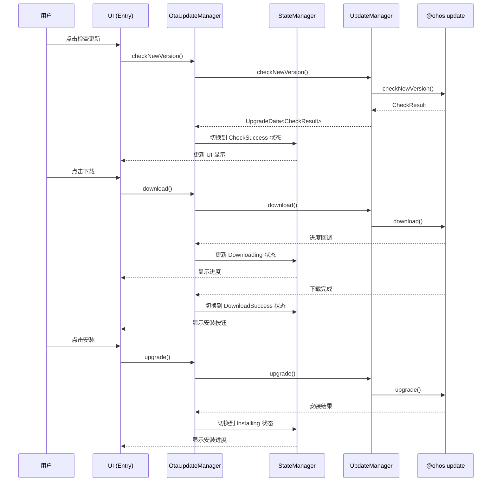

# 模块架构

> **本文档描述 update_app 的模块划分、依赖关系、代码地图和模块职责**

## 1 整体架构

### 1.1 三层模块化架构

update_app 采用 **三层模块化架构**，从上到下分为三层：

```
┌───────────────────────────────────────────────────────────┐
│              Entry 层 (product/oh/base)                │
│  ┌─────────────────────────────────────────────────┐   │
│  │  MainAbility         - 主 Ability，UI 入口      │   │
│  │  ServiceExtAbility  - 后台服务，IPC 接收       │   │
│  │  Pages              - 页面路由管理            │   │
│  └─────────────────────────────────────────────────┘   │
├───────────────────────────────────────────────────────────┤
│             OTA 功能层 (feature/ota)                    │
│  ┌─────────────────────────────────────────────────┐   │
│  │  OtaUpdateManager   - OTA 升级管理器         │   │
│  │  StateManager       - 状态机管理             │   │
│  │  OtaPage           - OTA 页面数据           │   │
│  │  DialogHelper       - 对话框管理             │   │
│  │  NotificationManager - 通知管理               │   │
│  └─────────────────────────────────────────────────┘   │
├───────────────────────────────────────────────────────────┤
│             Common 公共层 (common)                      │
│  ┌─────────────────────────────────────────────────┐   │
│  │  UpdateManager      - 更新管理器           │   │
│  │  LogUtils          - 日志工具             │   │
│  │  DeviceUtils       - 设备信息             │   │
│  │  FormatUtils       - 格式化工具           │   │
│  │  TitleBar/Views    - 公共组件             │   │
│  └─────────────────────────────────────────────────┘   │
└───────────────────────────────────────────────────────────┘
```

### 1.2 架构图

```mermaid
graph TB
    subgraph "Entry 模块 (HAP)"
        A[MainAbility]
        B[ServiceExtAbility]
        C[index.ets]
        D[newVersion.ets]
        E[currentVersion.ets]
    end

    subgraph "OTA 功能模块 (HAR)"
        F[OtaUpdateManager]
        G[StateManager]
        H[OtaPage]
        I[DialogHelper]
        J[NotificationManager]
    end

    subgraph "Common 公共模块 (HAR)"
        K[UpdateManager]
        L[LogUtils]
        M[DeviceUtils]
        N[FormatUtils]
        O[公共组件]
    end

    subgraph "系统服务"
        P[@ohos.update]
        Q[update_engine]
    end

    A --> C
    A --> D
    A --> E
    B --> Q

    H --> F
    F --> G
    I --> J

    F --> K
    G --> N
    H --> O
    J --> L
    I --> M

    K --> P
```

---

## 2 模块划分

### 2.1 Entry 模块 (product/oh/base)

| 属性 | 值 |
|------|-----|
| **目录** | `product/oh/base/` |
| **模块类型** | entry (HAP) |
| **模块名** | updateapp |
| **构建产物** | updateapp.hap |
| **主要职责** | 应用入口、页面路由、后台服务 |

**关键文件**：

| 文件 | 职责 |
|------|------|
| `src/main/ets/MainAbility/MainAbility.ets` | 主 Ability，处理生命周期和页面跳转 |
| `src/main/ets/ServiceExtAbility/service.ets` | ServiceExtensionAbility，接收系统更新服务推送 |
| `src/main/ets/pages/index.ets` | 首页（检查更新） |
| `src/main/ets/pages/newVersion.ets` | 新版本页面（下载/安装） |
| `src/main/ets/pages/currentVersion.ets` | 当前版本信息页 |
| `src/main/module.json5` | 模块配置（Ability、权限声明） |

**代码证据**：
```typescript
// product/oh/base/src/main/ets/MainAbility/MainAbility.ets
@Entry
@Component
struct MainAbility {
  // 主 Ability 入口
}

// product/oh/base/src/main/module.json5:2
{
  "module": {
    "name": "updateapp",
    "type": "entry"
  }
}
```

### 2.2 OTA 功能模块 (feature/ota)

| 属性 | 值 |
|------|-----|
| **目录** | `feature/ota/` |
| **模块类型** | har (HAR) |
| **模块名** | ota |
| **构建产物** | ota.har |
| **主要职责** | OTA 升级业务逻辑、状态机、UI 适配 |

**关键文件**：

| 文件 | 职责 |
|------|------|
| `src/main/ets/manager/OtaUpdateManager.ets` | OTA 升级管理器单例，核心业务逻辑 |
| `src/main/ets/manager/StateManager.ets` | 状态机管理，13 种状态类 |
| `src/main/ets/OtaPage.ets` | 实现 IPage 接口，提供 OTA 页面数据 |
| `src/main/ets/UpgradeAdapter.ets` | 升级适配器，统一管理 Page 和 Notify 实例 |
| `src/main/ets/dialog/DialogHelper.ets` | 对话框管理器（网络、失败、倒计时等） |
| `src/main/ets/notify/NotificationManager.ets` | 通知管理器，处理系统通知栏交互 |
| `src/main/ets/components/ProgressContent.ets` | 进度显示组件 |
| `src/main/ets/components/ChangelogContent.ets` | 更新日志展示组件 |
| `src/main/ets/util/VersionUtils.ets` | 版本信息工具 |
| `src/main/module.json5` | 模块配置 |

**代码证据**：
```typescript
// feature/ota/src/main/ets/manager/OtaUpdateManager.ets:60
export class OtaUpdateManager {
  static getInstance(): OtaUpdateManager {
    return globalThis.otaUpdateManager ?? new OtaUpdateManager();
  }

  private constructor() {
    this.updateManager = new UpdateManager(update.BusinessSubType.FIRMWARE);
    // ...
  }
}

// feature/ota/src/main/module.json5:3
{
  "module": {
    "name": "ota",
    "type": "har"
  }
}
```

### 2.3 Common 公共模块 (common)

| 属性 | 值 |
|------|-----|
| **目录** | `common/` |
| **模块类型** | har (HAR) |
| **模块名** | @ohos/common |
| **构建产物** | common.har |
| **主要职责** | 公共工具、常量定义、更新接口封装 |

**关键文件**：

| 文件 | 职责 |
|------|------|
| `src/main/ets/manager/UpdateManager.ts` | 封装 @ohos.update 系统接口 |
| `src/main/ets/manager/UpgradeInterface.ets` | 定义 IPage、INotify 接口规范 |
| `src/main/ets/const/update_const.ts` | 定义 UpdateState、ErrorCode、Action 等常量 |
| `src/main/ets/util/LogUtils.ts` | 日志工具 |
| `src/main/ets/util/FormatUtils.ets` | 格式化工具（文件大小、时间） |
| `src/main/ets/util/NetUtils.ets` | 网络状态检测 |
| `src/main/ets/util/DeviceUtils.ets` | 设备信息获取 |
| `src/main/ets/component/TitleBar.ets` | 公共标题栏组件 |
| `src/main/ets/component/HomeCardView.ets` | 首页卡片组件 |
| `src/main/module.json5` | 模块配置 |

**代码证据**：
```typescript
// common/src/main/ets/manager/UpdateManager.ts:88
export class UpdateManager implements IUpdate {
  private otaUpdater: update.Updater;

  public constructor(subType: number, upgradeDeviceId?: string, packageName?: string) {
    let upgradeInfo: update.UpgradeInfo = {
      upgradeApp: packageName ?? PACKAGE_NAME,
      businessType: {
        vendor: update.BusinessVendor.PUBLIC,
        subType: subType
      }
    };
    this.otaUpdater = update.getOnlineUpdater(upgradeInfo);
  }
}

// common/src/main/module.json5:3
{
  "module": {
    "name": "common",
    "type": "har"
  }
}
```

---

## 3 依赖关系

### 3.1 模块依赖图

```mermaid
graph LR
    updateapp[updateapp<br/>Entry HAP]
    ota[ota<br/>HAR]
    common[common<br/>HAR]
    update_sys[@ohos.update<br/>系统服务]

    updateapp --> ota
    updateapp --> common
    ota --> common

    common --> update_sys
```

### 3.2 依赖配置

#### Entry 模块依赖 (product/oh/base/oh-package.json5)

```json5
{
  "name": "updateapp",
  "dependencies": {
    "@ohos/common": "file:../../../common",
    "ota": "file:../../../feature/ota"
  }
}
```

#### OTA 模块依赖 (feature/ota/oh-package.json5)

```json5
{
  "name": "ota",
  "dependencies": {
    "@ohos/common": "file:../../common"
  }
}
```

#### Common 模块依赖 (common/oh-package.json5)

```json5
{
  "name": "@ohos/common",
  "dependencies": {}
}
```

### 3.3 模块映射 (build-profile.json5)

```json5
{
  "modules": [
    {
      "name": "updateapp",
      "srcPath": "./product/oh/base"
    },
    {
      "name": "common",
      "srcPath": "./common"
    },
    {
      "name": "ota",
      "srcPath": "./feature/ota"
    }
  ]
}
```

---

## 4 代码地图

### 4.1 目录树结构

```
update_app/
├── AppScope/
│   └── app.json5              # 应用全局配置
│
├── product/oh/base/           # Entry 模块
│   ├── src/main/
│   │   ├── ets/MainAbility/
│   │   │   └── MainAbility.ets
│   │   ├── ets/ServiceExtAbility/
│   │   │   ├── service.ets
│   │   │   └── serviceStub.ets
│   │   ├── ets/pages/
│   │   │   ├── index.ets
│   │   │   ├── newVersion.ets
│   │   │   └── currentVersion.ets
│   │   ├── ets/Application/
│   │   │   └── AbilityStage.ts
│   │   └── module.json5
│   ├── oh-package.json5
│   ├── build-profile.json5
│   └── hvigorfile.ts
│
├── feature/ota/               # OTA 功能模块
│   ├── src/main/ets/
│   │   ├── OtaPage.ets
│   │   ├── UpgradeAdapter.ets
│   │   ├── manager/
│   │   │   ├── OtaUpdateManager.ets
│   │   │   └── StateManager.ets
│   │   ├── components/
│   │   │   ├── ProgressContent.ets
│   │   │   └── ChangelogContent.ets
│   │   ├── dialog/
│   │   │   ├── DialogHelper.ets
│   │   │   └── DialogUtils.ets
│   │   ├── notify/
│   │   │   ├── NotificationManager.ets
│   │   │   └── NotificationHelper.ets
│   │   └── util/
│   │       ├── VersionUtils.ets
│   │       ├── RouterUtils.ets
│   │       ├── ChangelogParseUtils.ets
│   │       └── ToastUtils.ets
│   ├── module.json5
│   ├── oh-package.json5
│   ├── build-profile.json5
│   └── hvigorfile.ts
│
├── common/                    # Common 公共模块
│   ├── src/main/ets/
│   │   ├── manager/
│   │   │   ├── UpdateManager.ts
│   │   │   └── UpgradeInterface.ets
│   │   ├── const/
│   │   │   └── update_const.ts
│   │   ├── util/
│   │   │   ├── LogUtils.ts
│   │   │   ├── FormatUtils.ets
│   │   │   ├── NetUtils.ets
│   │   │   ├── DeviceUtils.ets
│   │   │   ├── CommonUtils.ts
│   │   │   └── UpdateUtils.ets
│   │   └── component/
│   │       ├── TitleBar.ets
│   │       ├── HomeCardView.ets
│   │       └── CheckingDots.ets
│   ├── module.json5
│   ├── oh-package.json5
│   ├── build-profile.json5
│   └── hvigorfile.ts
│
├── wiki/                      # 文档目录
│   ├── README.md
│   ├── SUMMARY.md
│   └── ...
│
├── build-profile.json5          # 根构建配置
├── oh-package.json5           # 根依赖配置
├── hvigorfile.ts              # 根 Hvigor 脚本
└── README.md                 # 项目说明
```

### 4.2 核心类映射

| 功能 | 类/接口 | 文件位置 |
|------|---------|----------|
| 系统更新封装 | `UpdateManager` | `common/src/main/ets/manager/UpdateManager.ts` |
| OTA 升级管理 | `OtaUpdateManager` | `feature/ota/src/main/ets/manager/OtaUpdateManager.ets` |
| 状态机管理 | `StateManager` + 13 种状态类 | `feature/ota/src/main/ets/manager/StateManager.ets` |
| 消息队列 | `MessageQueue` | `common/src/main/ets/manager/UpdateManager.ts` |
| 状态去重 | `OtaStatusHolder` | `common/src/main/ets/manager/UpdateManager.ts` |
| 页面接口 | `IPage` | `common/src/main/ets/manager/UpgradeInterface.ets` |
| 通知接口 | `INotify` | `common/src/main/ets/manager/UpgradeInterface.ets` |
| 对话框管理 | `DialogHelper` | `feature/ota/src/main/ets/dialog/DialogHelper.ets` |
| 通知管理 | `NotificationManager` | `feature/ota/src/main/ets/notify/NotificationManager.ets` |
| 升级适配 | `UpgradeAdapter` | `feature/ota/src/main/ets/UpgradeAdapter.ets` |

---

## 5 技术栈

### 5.1 开发语言

| 语言/框架 | 用途 | 文件数量 |
|-----------|------|----------|
| **ArkTS (.ets)** | UI 组件、页面、状态管理 | ~30 |
| **TypeScript (.ts)** | 工具类、常量、管理器 | ~9 |
| **JSON5** | 配置文件 | ~9 |

### 5.2 系统接口

```typescript
// common/src/main/ets/manager/UpdateManager.ts:17
import update from '@ohos.update';

// 核心接口调用:
// - update.getOnlineUpdater()
// - update.checkNewVersion()
// - update.download()
// - update.upgrade()
// - update.getTaskInfo()
// - update.getNewVersionInfo()
```

### 5.3 构建工具

| 工具 | 用途 |
|------|------|
| **Hvigor** | 构建系统（类似 Gradle） |
| **HAP** | 应用包格式 |
| **HAR** | 共享库格式 |

---

## 6 数据流

### 6.1 更新流程数据流



---

## 7 模块职责总结

| 模块 | 主要职责 | 依赖 |
|------|---------|------|
| **Entry** | 应用入口、页面路由、后台服务 | ota, common |
| **OTA** | OTA 升级业务、状态机、UI 适配 | common |
| **Common** | 公共工具、常量定义、系统接口封装 | @ohos.update |

---

## 8 相关文档

| 文档 | 描述 |
|------|------|
| [01_Project_Overview.md](./01_Project_Overview.md) | 项目概览与功能边界 |
| [03_State_Machine.md](./03_State_Machine.md) | 状态机设计详解 |
| [04_UI_Interaction.md](./04_UI_Interaction.md) | UI 组件和页面 |
| [05_System_Interface.md](./05_System_Interface.md) | 系统接口调用 |
| [07_Build_System.md](./07_Build_System.md) | Hvigor 构建配置 |
| [appendix/Export_Mapping.md](./appendix/Export_Mapping.md) | Export 清单 |

---

**最后更新**: 2026-02-07
**对应代码版本**: 当前 HEAD
