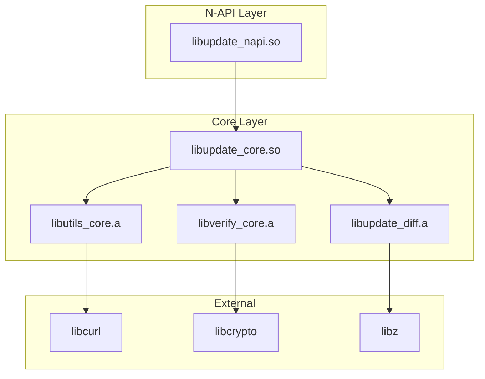

# GN 构建系统

> 本文档描述 update_app 模块的 GN 构建配置，包括关键配置文件、主要 targets、依赖关系和编译选项。

## 1 概述

### 1.1 构建系统

update_app 使用 **GN (Generate Ninja)** 作为构建系统，配合 Ninja 执行构建。

| 组件 | 版本 | 说明 |
|------|------|------|
| GN | r155+ | 构建配置生成 |
| Ninja | 1.10+ | 构建执行 |
| Clang | 14+ | 编译器 |

### 1.2 构建流程

```
BUILD.gn/.gni  →  gn generate  →  .ninja files  →  ninja build  →  artifacts
```

### 1.3 构建命令

```bash
# 完整构建
./build.sh

# 仅编译
gn gen out/default
ninja -C out/default

# 清理构建
ninja -C out/default clean

# 查看依赖
gn desc out/default //src/base/update:update_core deps
```

## 2 关键配置文件

### 2.1 文件清单

| 文件 | 路径 | 用途 |
|------|------|------|
| config.gni | 根目录 | 根配置、全局变量 |
| bundle.json | 根目录 | 组件描述文件 |
| src/BUILD.gn | src/ | 源代码构建入口 |
| src/base/BUILD.gn | src/base/ | 核心模块构建 |
| src/napi/BUILD.gn | src/napi/ | N-API 构建 |
| interfaces/BUILD.gn | interfaces/ | 接口构建 |

### 2.2 根配置 config.gni

```gni
# config.gni - 根配置文件

# ==========================================
# 基础配置
# ==========================================

# 模块名称
update_app_module_name = "update_app"

# 模块版本
update_app_version = "1.0.0"

# 构建类型
build_type = "release"  # debug / release / component

# ==========================================
# 编译选项
# ==========================================

# C++ 标准
cpp_std = "c++17"

# 警告级别
warning_level = "all"

# 优化级别
if (build_type == "debug") {
  optimize = "none"
} else {
  optimize = "speed"
}

# ==========================================
# 依赖配置
# ==========================================

# 基础依赖
deps_base = [
  "//third_party/libcurl:curl",
  "//third_party/openssl:crypto",
  "//third_party/zlib:zlib",
]

# 系统能力
system_capabilities = [
  "ohos.permission.UPDATE_APP",
  "ohos.permission.INTERNET",
]

# ==========================================
# 输出配置
# ==========================================

# 输出目录
output_dir = "$root_out_dir/libs"

# 安装路径
install_dir = "/system/lib/module/update"
```

### 2.3 组件配置 bundle.json

```json
{
  "name": "update_app",
  "version": "1.0.0",
  "description": "OpenHarmony 应用更新模块",
  "type": "system",
  "api_type": "system_basic",
  "min_api_version": 9,
  "max_api_version": 11,
  "features": [
    "update_core",
    "update_napi",
    "update_service"
  ],
  "deps": {
    "third_party": [
      "libcurl",
      "openssl",
      "zlib"
    ],
    "system": [
      "ability_runtime",
      "appexecfwk_base",
      "security_core"
    ]
  },
  "build": {
    "sub_component": [
      "//src/base/update:update_core",
      "//src/napi/native:update_napi",
      "//src/server:update_service"
    ]
  }
}
```

## 3 主要 Targets

### 3.1 Target 概览

| Target | 类型 | 用途 | 输出 |
|--------|------|------|------|
| update_core | static_library | 核心逻辑库 | libupdate_core.z.so |
| update_napi | shared_library | N-API 接口 | libupdate_napi.z.so |
| update_service | executable | 更新服务 | update_service |
| update_client | shared_library | 客户端库 | libupdate_client.z.so |
| update_utils | static_library | 工具库 | libupdate_utils.z.a |
| update_diff | static_library | 差分算法 | libupdate_diff.z.a |

### 3.2 核心模块 Targets

#### 3.2.1 update_core (静态库)

```gn
# src/base/update/BUILD.gn

static_library("update_core") {
  sources = [
    "version_manager.cpp",
    "version_info.cpp",
    "update_context.cpp",
  ]
  
  include_dirs = [
    "//include/update",
    "//include/utils",
    "//src/base/common",
  ]
  
  deps = [
    "//src/base/verify:verify_core",
    "//src/base/patch:patch_core",
    "//src/utils:utils_core",
  ]
  
  public_deps = [
    "//third_party/openssl:crypto",
    "//third_party/zlib:zlib",
  ]
  
  defines = [
    "UPDATE_VERSION=\"1.0.0\"",
    "UPDATE_BUILD_TYPE=\"$build_type\"",
  ]
  
  configs = [
    "//build/config:exceptions_disabled",
    "//build/config:runtime_library_shared",
  ]
  
  # 条件编译
  if (enable_debug_log) {
    defines += [ "UPDATE_DEBUG_LOG=1" ]
  }
  
  if (use_brotli) {
    deps += [ "//third_party/brotli:brotli" ]
  }
}
```

#### 3.2.2 update_napi (动态库)

```gn
# src/napi/native/BUILD.gn

shared_library("update_napi") {
  sources = [
    "init.cpp",
    "update.cpp",
    "download.cpp",
    "apply.cpp",
    "verify.cpp",
    "task.cpp",
    "callback.cpp",
  ]
  
  include_dirs = [
    "//include/napi",
    "//include/update",
    "//src/napi/common",
  ]
  
  deps = [
    ":update_napi_internal",
    "//src/base/update:update_core",
  ]
  
  public_deps = [
    "//third_party/node:node_headers",
  ]
  
  defines = [
    "NAPI_EXPERIMENTAL=1",
  ]
  
  # 输出配置
  output_name = "libupdate_napi.z.so"
  
  # 链接选项
  ldflags = [
    "-Wl,-z,relro,-z,now",
    "-Wl,--warn-unresolved-symbols",
  ]
}
```

#### 3.2.3 update_service (可执行文件)

```gn
# src/server/BUILD.gn

executable("update_service") {
  sources = [
    "main.cpp",
    "update_service.cpp",
    "download_service.cpp",
    "service_stub.cpp",
  ]
  
  include_dirs = [
    "//include/server",
    "//third_party/libhwsystem/system_ability",
  ]
  
  deps = [
    "//src/base/update:update_core",
    "//src/server/adapter:service_adapter",
  ]
  
  public_deps = [
    "//system/ability/sa:sa_core",
  ]
  
  # 进程类型 - 系统服务
  process_type = "system_service"
  
  # 安装路径
  install_dir = "/system/bin"
  
  # 守护进程配置
  if (use_sa_fwk) {
    defines = [ "USE_SA_FRAMEWORK=1" ]
  }
}
```

### 3.3 差分算法模块 Targets

```gn
# src/base/diff/BUILD.gn

static_library("update_diff") {
  sources = [
    "bsdiff.cpp",
    "bsdiff_interface.cpp",
    "checksum.cpp",
  ]
  
  include_dirs = [
    "//include/diff",
  ]
  
  deps = [
    "//src/utils/compress:compress_utils",
  ]
  
  # 优化配置
  if (enable_neon) {
    sources += [ "bsdiff_neon.cpp" ]
    defines += [ "USE_NEON=1" ]
  }
  
  if (enable_multithread) {
    sources += [ "bsdiff_mt.cpp" ]
    defines += [ "USE_MULTITHREAD=1" ]
  }
}
```

### 3.4 校验模块 Targets

```gn
# src/base/verify/BUILD.gn

static_library("verify_core") {
  sources = [
    "signature.cpp",
    "certificate.cpp",
    "timestamp.cpp",
    "manifest.cpp",
  ]
  
  include_dirs = [
    "//include/verify",
  ]
  
  deps = [
    "//third_party/openssl:openssl",
  ]
  
  defines = [
    "VERIFY_REQUIRE_SIGNATURE=1",
    "VERIFY_REQUIRE_TIMESTAMP=1",
  ]
  
  # 证书配置
  cert_config = "//config/certs/root_ca.json"
}
```

## 4 依赖关系

### 4.1 依赖图



### 4.2 依赖配置说明

| 依赖类型 | 语法 | 用途 |
|----------|------|------|
| private_deps | 私有依赖 | 仅本 target 使用 |
| public_deps | 公开依赖 | 导出给消费者 |
| data_deps | 数据依赖 | 测试/资源文件 |
| all_deps | 所有依赖 | 包含全部类型 |

### 4.3 依赖最佳实践

```gn
# 好的示例
static_library("good_example") {
  # 私有依赖 - 仅实现使用
  private_deps = [
    "//third_party/zlib:zlib",
  ]
  
  # 公开依赖 - 导出给消费者
  public_deps = [
    "//src/base/common:common_utils",
  ]
  
  # 条件依赖
  if (use_openssl) {
    deps += [ "//third_party/openssl:openssl" ]
  }
}

# 不好的示例
static_library("bad_example") {
  # 所有依赖都设为 public
  public_deps = [
    "//third_party/zlib:zlib",  # 不应该导出
    "//third_party/curl:curl",  # 不应该导出
  ]
}
```

## 5 配置选项

### 5.1 构建变量

| 变量 | 类型 | 默认值 | 说明 |
|------|------|--------|------|
| build_type | string | "release" | 构建类型 |
| enable_debug_log | bool | false | 启用调试日志 |
| enable_neon | bool | true | 启用 NEON 优化 |
| enable_multithread | bool | true | 启用多线程 |
| use_brotli | bool | false | 使用 Brotli 压缩 |
| use_sa_fwk | bool | true | 使用 SA 框架 |

### 5.2 设置构建选项

```bash
# 使用调试构建
gn gen out/debug --args="build_type=\"debug\" enable_debug_log=true"

# 使用发布构建
gn gen out/release --args="build_type=\"release\""

# 自定义配置
gn gen out/custom --args='
build_type = "release"
enable_debug_log = false
enable_neon = true
use_brotli = true
'
```

### 5.3 配置模板

```gn
# build_extension.gni - 自定义配置模板

# 调试配置
template("debug_extension") {
  invoker(target_name) {
    # 继承原始配置
    deps = invoker.deps
    sources = invoker.sources
    
    # 添加调试配置
    if (defined(invoker.enable_log) && invoker.enable_log) {
      defines += [ "DEBUG_LOG=1" ]
    }
    
    # 优化设置
    if (defined(invoker.disable_optimize) && invoker.disable_optimize) {
      configs += [ "//build/config:optimize_none" ]
    }
  }
}

# 使用
debug_extension("my_module") {
  enable_log = true
  sources = [ "module.cpp" ]
  deps = [ "//src/base:core" ]
}
```

## 6 条件编译

### 6.1 平台条件

```gn
# 平台检测
if (target_os == "ohos") {
  defines += [ "BUILD_FOR_OHOS=1" ]
}

if (target_cpu == "arm64") {
  defines += [ "ARCH_ARM64=1" ]
}

if (target_cpu == "x86_64") {
  defines += [ "ARCH_X86_64=1" ]
}
```

### 6.2 功能开关

```gn
# 功能配置
declare_args() {
  enable_backup = true
  enable_rollback = true
  enable_multithread = true
}

# 条件编译
static_library("feature_support") {
  sources = [ "core.cpp" ]
  
  if (enable_backup) {
    sources += [ "backup.cpp" ]
    defines += [ "ENABLE_BACKUP=1" ]
  }
  
  if (enable_rollback) {
    sources += [ "rollback.cpp" ]
    defines += [ "ENABLE_ROLLBACK=1" ]
  }
  
  if (enable_multithread) {
    sources += [ "thread_pool.cpp" ]
    defines += [ "ENABLE_MULTITHREAD=1" ]
  }
}
```

### 6.3 外部依赖

```gn
# 依赖检测
if (defined(barrel) && barrel != "") {
  deps += [ "//third_party/$barrel:$barrel" ]
} else {
  # 使用备用方案
  defines += [ "USE_BUILTIN=1" ]
}

# 可选依赖
optional_deps = [
  "//third_party/lz4:lz4",
  "//third_party/zstd:zstd",
]

foreach(dep, optional_deps) {
  if (defined(dep) && dep != "") {
    deps += [ dep ]
    defines += [ "USE_${dep}_NAME" = 1 ]
  }
}
```

## 7 编译产物

### 7.1 产物清单

| Target | 类型 | 产物路径 | 说明 |
|--------|------|----------|------|
| update_core | .so | out/libs/libupdate_core.z.so | 核心库 |
| update_napi | .so | out/libs/libupdate_napi.z.so | N-API 库 |
| update_service | 可执行 | out/bin/update_service | 服务 |
| update_client | .so | out/libs/libupdate_client.z.so | 客户端 |
| update_diff | .a | out/obj/src/base/diff/libupdate_diff.z.a | 静态库 |

### 7.2 产物验证

```bash
# 查看产物
ls -la out/libs/
# 输出:
# -rwxr-xr-x 1 libupdate_core.z.so
# -rwxr-xr-x 1 libupdate_napi.z.so
# -rwxr-xr-x 1 libupdate_client.z.so

# 检查符号
nm -D out/libs/libupdate_napi.z.so | grep T update_

# 检查依赖
ldd out/libs/libupdate_napi.z.so
```

### 7.3 安装配置

```gn
# 安装到系统
install("install_system") {
  deps = [
    ":update_core",
    ":update_napi",
  ]
  
  install_dir = "/system/lib/module/update"
  
  sources = get_target_outputs(":update_core") + \
            get_target_outputs(":update_napi")
}

# 安装到开发目录
install("install_dev") {
  deps = [ ":update_napi" ]
  
  install_dir = "$root_out_dir"
  
  sources = get_target_outputs(":update_napi")
}
```

## 8 常见问题

### 8.1 构建失败排查

```bash
# 1. 清理后重新构建
ninja -C out/default clean
ninja -C out/default

# 2. 查看详细日志
ninja -C out/default -v

# 3. 检查依赖
gn desc out/default //src/base/update:update_core deps

# 4. 检查配置
gn args out/default --list
```

### 8.2 依赖冲突解决

```bash
# 1. 查看依赖冲突
gn check out/default //src/base/update:update_core

# 2. 强制重新生成
rm -rf out/default
gn gen out/default

# 3. 使用不同配置
gn gen out/debug --args="build_type=\"debug\""
```

### 8.3 性能优化

```bash
# 1. 使用组件构建
ninja -C out/default -j8

# 2. 增量编译
ninja -C out/default

# 3. 分布式构建
ninja -C out/default -j$(nproc)
```

## 9 相关文档

| 文档 | 描述 |
|------|------|
| [06_Build_Artifacts.md](./06_Build_Artifacts.md) | 编译产物清单 |
| [04_Inner_API.md](./04_Inner_API.md) | 内部模块 API |
| [08_Troubleshooting.md](./08_Troubleshooting.md) | 故障排查 |
| [appendix/Config_Flags.md](./appendix/Config_Flags.md) | 配置开关 |
