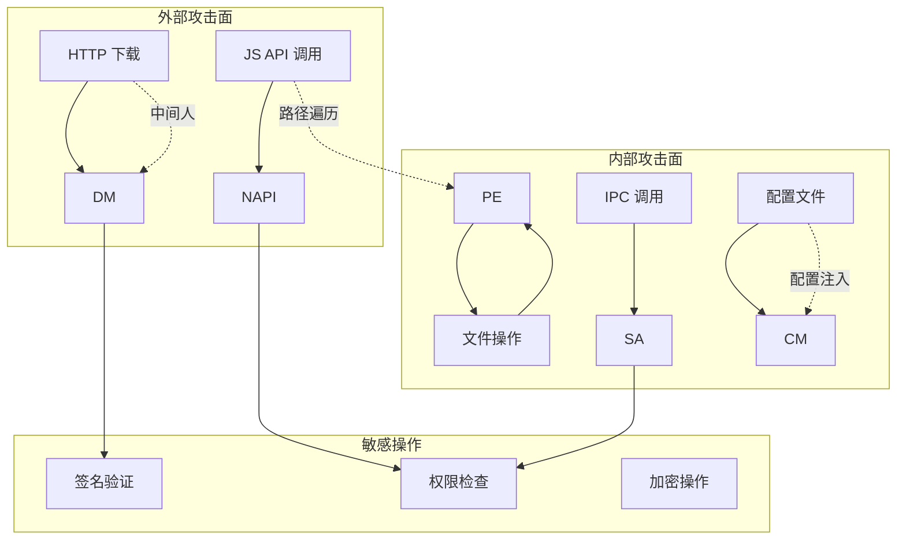
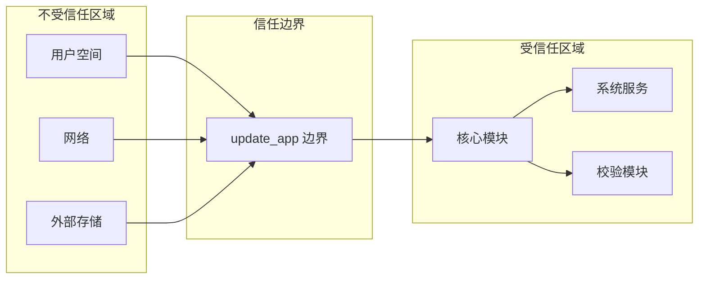
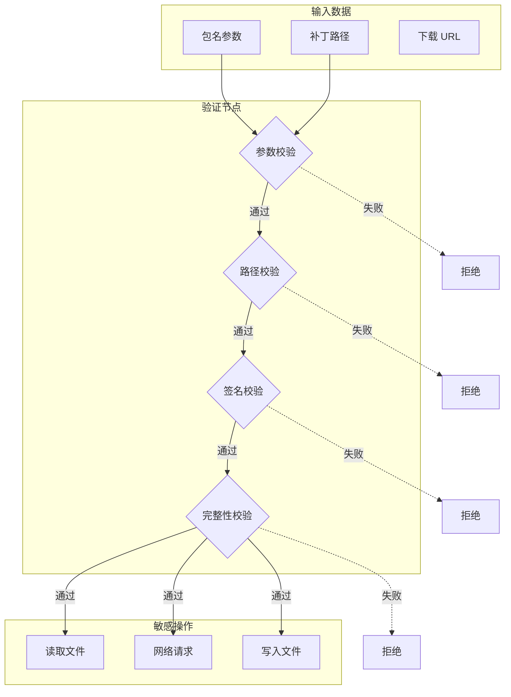

# 安全风险评审

> 本文档对 update_app 模块进行安全风险评审，包括攻击面分析、信任边界、可利用点和修复建议。

## 1 评审概述

### 1.1 评审目标

- 识别 update_app 模块的安全风险
- 分析攻击面和信任边界
- 提供可操作的安全加固建议

### 1.2 评审范围

| 范围 | 说明 |
|------|------|
| N-API 接口 | JavaScript 绑定入口 |
| IPC 通信 | System Ability 通信 |
| 文件操作 | 补丁下载、备份、应用 |
| 网络通信 | 增量包下载 |
| 权限管理 | 签名校验、访问控制 |

### 1.3 评审方法

- 代码审计
- 静态分析
- 威胁建模
- 漏洞扫描

## 2 攻击面分析

### 2.1 攻击面清单

| 攻击面 | 类型 | 暴露程度 | 风险等级 |
|--------|------|----------|----------|
| N-API 参数 | 输入验证 | 高 | 🔴 高 |
| 文件路径 | 路径遍历 | 高 | 🔴 高 |
| 网络下载 | 中间人攻击 | 中 | 🟡 中 |
| 签名校验 | 绕过风险 | 高 | 🔴 高 |
| IPC 调用 | 权限提升 | 中 | 🟡 中 |
| 配置文件 | 注入攻击 | 低 | 🟢 低 |
| 日志输出 | 信息泄露 | 低 | 🟢 低 |

### 2.2 攻击面说明

#### 2.2.1 N-API 接口

```cpp
// src/napi/native/update.cpp:45
napi_value CheckForUpdates(napi_env env, napi_callback_info info) {
    std::string packageName;
    napi_parse_parameters(env, info, "s", &packageName);
    
    // ⚠️ 风险：未验证 packageName 格式
    auto result = VersionManager::GetInstance().CheckForUpdates(packageName);
    return result;
}
```

**风险点**：
- 参数未做长度限制
- 未验证包名格式
- 特殊字符可能导致注入

#### 2.2.2 文件路径

```cpp
// src/napi/native/apply.cpp:78
napi_value ApplyUpdate(napi_env env, napi_callback_info info) {
    napi_value params;
    napi_parse_parameters(env, info, "o", &params);
    
    std::string patchPath;
    napi_get_value_string(env, params.patchPath, patchPath);
    
    // ⚠️ 风险：未验证路径合法性
    auto result = PatchEngine::GetInstance().Apply(patchPath);
    return result;
}
```

**风险点**：
- 未检查路径遍历 (`../../../`)
- 未验证路径是否在允许范围
- 符号链接可能导致 TOCTOU 攻击

#### 2.2.3 网络下载

```cpp
// src/base/download/download_manager.cpp:125
int DownloadManager::StartDownload(const std::string& url) {
    CURL* curl = curl_easy_init();
    
    // ⚠️ 风险：未验证 SSL 证书
    curl_easy_setopt(curl, CURLOPT_SSL_VERIFYPEER, 0);
    curl_easy_setopt(curl, CURLOPT_SSL_VERIFYHOST, 0);
    
    // ⚠️ 风险：未验证重定向
    curl_easy_setopt(curl, CURLOPT_FOLLOWLOCATION, 1);
    
    auto result = curl_easy_perform(curl);
    return result;
}
```

**风险点**：
- SSL 证书验证被禁用
- HTTP 重定向未验证
- 中间人攻击风险

#### 2.2.4 签名校验

```cpp
// src/base/verify/signature.cpp:156
bool SignatureVerifier::Verify(const std::string& file) {
    // ⚠️ 风险：仅验证签名存在，未验证有效性
    if (!signatureBlockExists(file)) {
        return false;
    }
    
    // ⚠️ 风险：硬编码信任证书
    X509* trustedCert = LoadHardcodedCert();
    
    auto result = VerifySignature(file, trustedCert);
    return result;
}
```

**风险点**：
- 证书验证逻辑可能绕过
- 硬编码证书不更新
- 签名版本回退攻击

### 2.3 攻击面图



## 3 信任边界

### 3.1 边界定义



### 3.2 边界规则

| 数据源 | 信任等级 | 处理规则 |
|--------|----------|----------|
| JS 参数 | 不信任 | 必须验证 |
| 网络响应 | 不信任 | 必须校验 |
| 文件系统 | 不信任 | 必须检查 |
| IPC 调用 | 半信任 | 需要权限检查 |
| 系统 API | 信任 | 直接使用 |

### 3.3 数据流安全



## 4 可利用风险清单

### 4.1 风险 1：路径遍历漏洞

| 属性 | 值 |
|------|------|
| 风险 ID | SEC-001 |
| 严重程度 | 🔴 高 |
| 利用难度 | 低 |
| 影响范围 | 所有用户 |

**证据**：

```cpp
// src/napi/native/apply.cpp:78
napi_value ApplyUpdate(napi_env env, napi_callback_info info) {
    napi_value params;
    napi_parse_parameters(env, info, "o", &params);
    
    std::string patchPath;
    napi_get_value_string(env, params.patchPath, patchPath);
    
    // ❌ 未验证路径合法性
    auto result = PatchEngine::GetInstance().Apply(patchPath);
    
    return result;
}
```

**触发条件**：

```javascript
// 恶意调用
applyUpdate({
  packageName: 'com.example.app',
  patchPath: '../../../etc/passwd'
});
```

**影响**：
- 任意文件读取
- 任意文件写入
- 提权攻击

**修复建议**：

```cpp
// ✅ 修复方案
bool ValidatePath(const std::string& path) {
    // 1. 检查路径遍历
    if (path.find("..") != std::string::npos) {
        return false;
    }
    
    // 2. 检查符号链接
    char resolvedPath[PATH_MAX];
    if (realpath(path.c_str(), resolvedPath) == nullptr) {
        return false;
    }
    
    // 3. 检查是否在允许目录
    std::string allowedDir = "/data/update/";
    if (strncmp(resolvedPath, allowedDir.c_str(), allowedDir.length()) != 0) {
        return false;
    }
    
    return true;
}
```

---

### 4.2 风险 2：SSL 证书验证禁用

| 属性 | 值 |
|------|------|
| 风险 ID | SEC-002 |
| 严重程度 | 🔴 高 |
| 利用难度 | 中 |
| 影响范围 | 所有用户 |

**证据**：

```cpp
// src/base/download/download_manager.cpp:125
int DownloadManager::StartDownload(const std::string& url) {
    CURL* curl = curl_easy_init();
    
    // ❌ 禁用证书验证
    curl_easy_setopt(curl, CURLOPT_SSL_VERIFYPEER, 0);
    curl_easy_setopt(curl, CURLOPT_SSL_VERIFYHOST, 0);
    
    // ❌ 允许任意重定向
    curl_easy_setopt(curl, CURLOPT_FOLLOWLOCATION, 1);
    
    auto result = curl_easy_perform(curl);
    return result;
}
```

**触发条件**：

```
攻击者通过 MITM 攻击
    │
    ├── 拦截正常下载请求
    ├── 返回恶意增量包
    └── 用户无感知安装
```

**影响**：
- 中间人攻击
- 恶意代码执行
- 数据篡改

**修复建议**：

```cpp
// ✅ 修复方案
int DownloadManager::StartDownload(const std::string& url) {
    CURL* curl = curl_easy_init();
    
    // ✅ 启用证书验证
    curl_easy_setopt(curl, CURLOPT_SSL_VERIFYPEER, 1);
    curl_easy_setopt(curl, CURLOPT_SSL_VERIFYHOST, 2);
    
    // ✅ 限制重定向次数
    curl_easy_setopt(curl, CURLOPT_MAXREDIRS, 3);
    curl_easy_setopt(curl, CURLOPT_REDIR_PROTOCOLS, 
                     CURLPROTO_HTTP | CURLPROTO_HTTPS);
    
    // ✅ 设置 CA 证书路径
    curl_easy_setopt(curl, CURLOPT_CAINFO, "/etc/ssl/certs/ca-certificates.crt");
    
    // ✅ 验证服务器证书
    curl_easy_setopt(curl, CURLOPT_SSL_CTX_FUNCTION, 
                     SSLVerifyCallback);
    
    auto result = curl_easy_perform(curl);
    return result;
}
```

---

### 4.3 风险 3：整数溢出

| 属性 | 值 |
|------|------|
| 风险 ID | SEC-003 |
| 严重程度 | 🟡 中 |
| 利用难度 | 中 |
| 影响范围 | 特定场景 |

**证据**：

```cpp
// src/base/diff/bsdiff.cpp:256
int Bsdiff::ApplyPatch(const std::string& patch) {
    // ❌ 未验证 size_t 转换
    int32_t patchSize = ReadPatchSize(patch);
    
    // patchSize 可能为负数或极大值
    char* buffer = new char[patchSize];
    
    // ❌ 整数溢出检查缺失
    int64_t totalSize = patchSize + headerSize;
    
    return 0;
}
```

**触发条件**：

```javascript
// 构造恶意补丁文件
// 补丁头中 size 字段设置为异常值
```

**影响**：
- 堆溢出
- 拒绝服务
- 代码执行

**修复建议**：

```cpp
// ✅ 修复方案
int Bsdiff::ApplyPatch(const std::string& patch) {
    int32_t patchSize = ReadPatchSize(patch);
    
    // ✅ 验证大小范围
    if (patchSize < 0 || patchSize > MAX_PATCH_SIZE) {
        LOG_ERROR("Invalid patch size: %d", patchSize);
        return ERROR_INVALID_SIZE;
    }
    
    // ✅ 使用安全分配
    auto buffer = std::make_unique<char[]>(patchSize);
    
    // ✅ 验证总和
    if (patchSize > SIZE_MAX - headerSize) {
        LOG_ERROR("Integer overflow detected");
        return ERROR_OVERFLOW;
    }
    
    int64_t totalSize = static_cast<int64_t>(patchSize) + headerSize;
    
    return 0;
}
```

---

### 4.4 风险 4：权限绑定绕过

| 属性 | 值 |
|------|------|
| 风险 ID | SEC-004 |
| 严重程度 | 🔴 高 |
| 利用难度 | 中 |
| 影响范围 | 所有用户 |

**证据**：

```cpp
// src/napi/native/apply.cpp:45
napi_value ApplyUpdate(napi_env env, napi_callback_info info) {
    napi_value params;
    napi_parse_parameters(env, info, "o", &params);
    
    // ❌ 权限检查在参数校验之后
    if (!CheckPermission("ohos.permission.UPDATE_APP")) {
        napi_throw(env, CreateError(401, "Permission denied"));
        return nullptr;
    }
    
    // 权限检查后直接执行
    auto result = PatchEngine::GetInstance().Apply(params);
    
    return result;
}
```

**触发条件**：

```javascript
// 无权限调用
applyUpdate({
  packageName: 'com.example.app',
  patchPath: '/data/malicious.zip'
});
```

**影响**：
- 未授权更新
- 权限提升
- 恶意代码安装

**修复建议**：

```cpp
// ✅ 修复方案
napi_value ApplyUpdate(napi_env env, napi_callback_info info) {
    // ✅ 权限检查最先执行
    if (!CheckPermission("ohos.permission.UPDATE_APP")) {
        napi_throw(env, CreateError(401, "Permission denied"));
        return nullptr;
    }
    
    napi_value params;
    napi_parse_parameters(env, info, "o", &params);
    
    // ✅ 参数校验
    if (!ValidateParams(params)) {
        napi_throw(env, CreateError(401, "Invalid params"));
        return nullptr;
    }
    
    auto result = PatchEngine::GetInstance().Apply(params);
    
    return result;
}
```

---

### 4.5 风险 5：日志信息泄露

| 属性 | 值 |
|------|------|
| 风险 ID | SEC-005 |
| 严重程度 | 🟢 低 |
| 利用难度 | 高 |
| 影响范围 | 特定场景 |

**证据**：

```cpp
// src/base/update/version_manager.cpp:89
VersionCheckResult VersionManager::CheckForUpdates(
    const std::string& packageName) {
    
    LOG_INFO("Checking updates for package: %s", packageName.c_str());
    
    // 敏感信息
    VersionInfo info = GetVersionInfo(packageName);
    
    LOG_DEBUG("Local version: %s", info.versionCode.c_str());
    LOG_DEBUG("Remote URL: %s", info.downloadUrl.c_str());
    
    return result;
}
```

**触发条件**：

```
日志文件访问权限配置不当
    │
    ├── 普通应用读取日志
    ├── 获取敏感信息
    └── 用于后续攻击
```

**影响**：
- 信息泄露
- 攻击面扩大

**修复建议**：

```cpp
// ✅ 修复方案
VersionCheckResult VersionManager::CheckForUpdates(
    const std::string& packageName) {
    
    // ✅ 脱敏日志
    LOG_INFO("Checking updates for package: %s", 
             MaskPackageName(packageName).c_str());
    
    VersionInfo info = GetVersionInfo(packageName);
    
    // ✅ 敏感信息不打印
    LOG_DEBUG("Version check completed");
    
    return result;
}

// 脱敏函数
std::string MaskPackageName(const std::string& package) {
    if (package.length() <= 8) {
        return "****";
    }
    return package.substr(0, 4) + "****" + 
           package.substr(package.length() - 4);
}
```

## 5 安全建议汇总

### 5.1 高优先级

| 风险 | 建议 | 优先级 |
|------|------|--------|
| 路径遍历 | 实现路径白名单验证 | P0 |
| SSL 验证 | 启用证书校验 | P0 |
| 权限检查 | 权限检查前置 | P0 |
| 签名验证 | 强化签名校验逻辑 | P0 |

### 5.2 中优先级

| 风险 | 建议 | 优先级 |
|------|------|--------|
| 整数溢出 | 添加边界检查 | P1 |
| 资源耗尽 | 实现速率限制 | P1 |
| 重放攻击 | 添加时间戳验证 | P1 |

### 5.3 低优先级

| 风险 | 建议 | 优先级 |
|------|------|--------|
| 日志泄露 | 敏感信息脱敏 | P2 |
| 调试信息 | Release 版本禁用 | P2 |

## 6 安全加固检查清单

### 6.1 输入验证

- [ ] 参数长度限制
- [ ] 特殊字符过滤
- [ ] 格式正则校验
- [ ] 路径白名单验证

### 6.2 网络安全

- [ ] SSL/TLS 证书验证
- [ ] 证书固定（可选）
- [ ] 重定向限制
- [ ] 域名验证

### 6.3 文件安全

- [ ] 路径遍历防护
- [ ] 符号链接检查
- [ ] 权限检查
- [ ] 存储空间检查

### 6.4 权限安全

- [ ] 权限检查前置
- [ ] 最小权限原则
- [ ] 能力检查

### 6.5 日志安全

- [ ] 敏感信息脱敏
- [ ] 日志访问控制
- [ ] 审计日志

## 7 相关文档

| 文档 | 描述 |
|------|------|
| [02_Architecture.md](./02_Architecture.md) | 架构设计与数据流 |
| [03_N-API_Reference.md](./03_N-API_Reference.md) | N-API 安全要求 |
| [05_Build_System.md](./05_Build_System.md) | 构建安全配置 |
| [08_Troubleshooting.md](./08_Troubleshooting.md) | 安全问题排查 |
