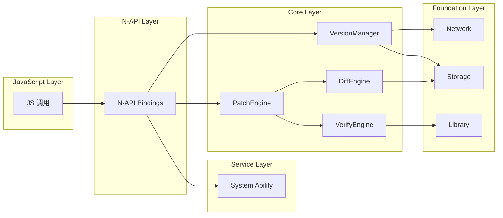
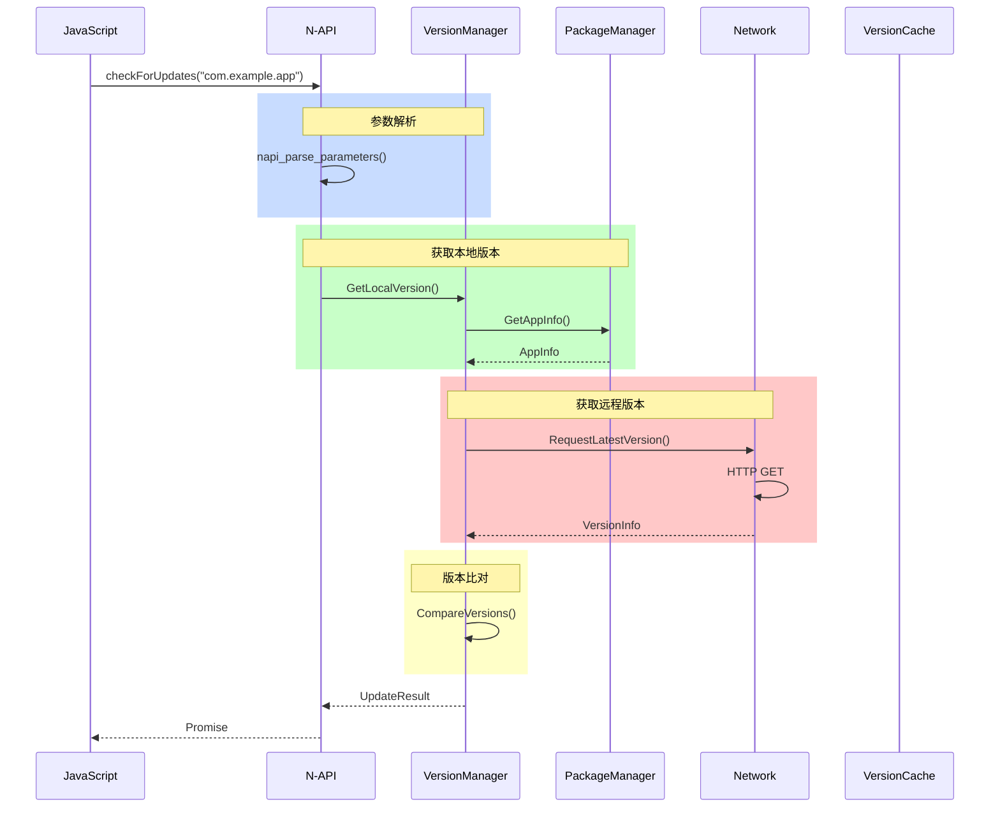
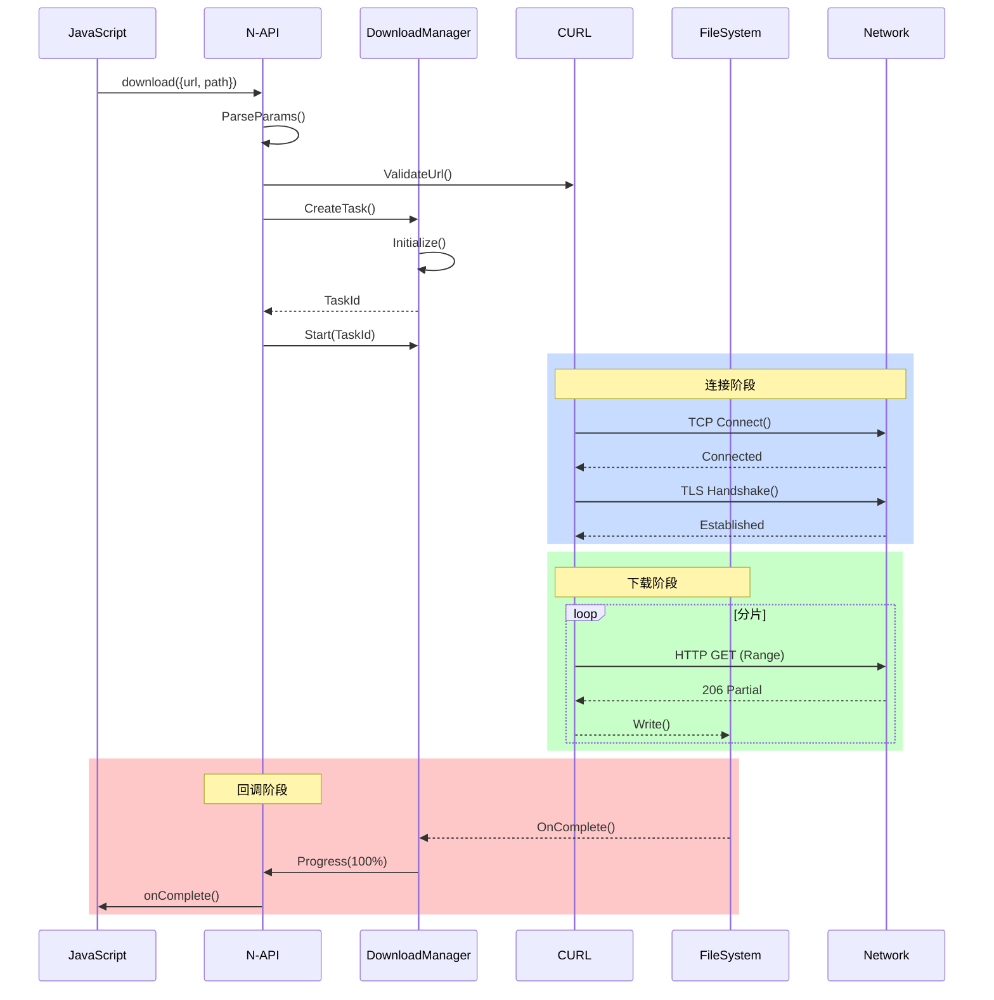
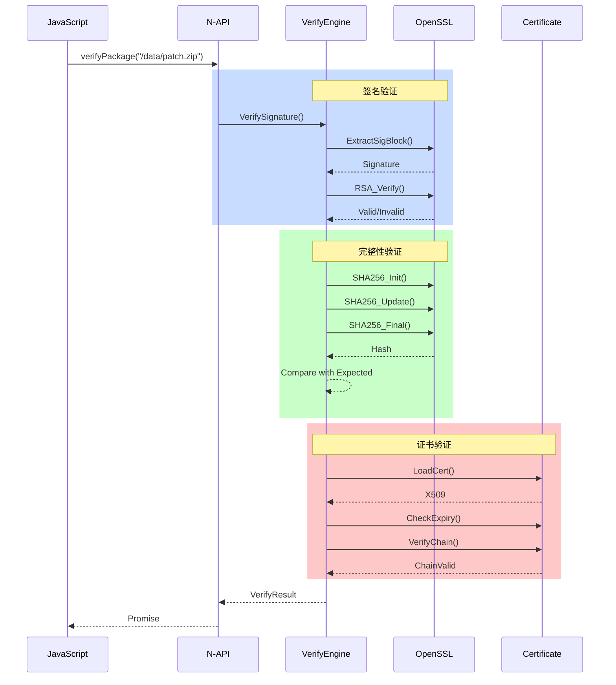
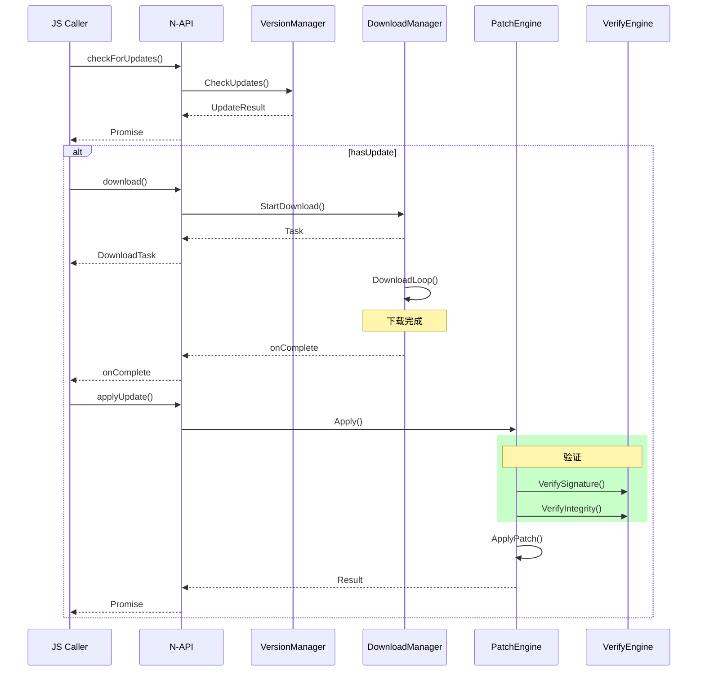

# 关键调用链

> 本文档描述 update_app 模块的关键调用链，从入口到核心逻辑的完整调用路径。

## 1 调用链概览

### 1.1 主调用链



## 2 版本检查调用链

### 2.1 调用路径

```
JS: checkForUpdates(packageName)
    │
    ▼
N-API: checkForUpdates(napi_env, napi_callback_info)
    │
    ├── 1. 参数解析
    │   └── napi_parse_parameters()
    │
    ├── 2. 权限检查
    │   └── CheckPermission("ohos.permission.UPDATE_APP")
    │
    ├── 3. 版本管理
    │   └── VersionManager::GetInstance()
    │           │
    │           ├── GetLocalVersion(packageName)
    │           │       │
    │           │       └── PackageManager::GetAppInfo()
    │           │
    │           └── GetRemoteVersion(packageName)
    │                   │
    │                   └── Network::Request()
    │                           │
    │                           └── HTTP GET
    │
    └── 4. 返回结果
        └── napi_create_object()
```

### 2.2 详细调用链



### 2.3 代码调用点

| 调用层级 | 文件:行号 | 函数 |
|----------|----------|------|
| JS | - | checkForUpdates() |
| N-API | `src/napi/native/update.cpp:45` | napi_checkForUpdates() |
| Core | `src/base/update/version_manager.cpp:45` | CheckForUpdates() |
| PackageManager | `//system/appexecfwk` | GetAppInfo() |
| Network | `src/base/network/http_client.cpp:89` | Request() |

## 3 下载调用链

### 3.1 调用路径

```
JS: download(params)
    │
    ▼
N-API: napi_download(napi_env, napi_callback_info)
    │
    ├── 1. 参数解析
    │   └── ParseDownloadParams()
    │
    ├── 2. URL 验证
    │   └── ValidateUrl(url)
    │
    ├── 3. 创建下载任务
    │   └── DownloadManager::CreateTask(config)
    │           │
    │           └── DownloadTask::Initialize()
    │
    ├── 4. 启动下载
    │   └── DownloadTask::Start()
    │           │
    │           ├── 1. 建立连接
    │           │   └── CURL::Connect(url)
    │           │
    │           ├── 2. 分片下载
    │           │   └── DownloadSegment(segmentInfo)
    │           │           │
    │           │           └── HTTP GET (Range)
    │           │
    │           ├── 3. 写入文件
    │           │   └── FileWriter::Write(data)
    │           │
    │           └── 4. 进度回调
    │                   └── NAPI::OnProgress(progress)
    │
    └── 5. 返回任务
        └── CreateDownloadTask()
```

### 3.2 详细调用链



### 3.3 代码调用点

| 调用层级 | 文件:行号 | 函数 |
|----------|----------|------|
| JS | - | download() |
| N-API | `src/napi/native/download.cpp:35` | napi_download() |
| DownloadManager | `src/base/download/manager.cpp:45` | CreateTask() |
| DownloadTask | `src/base/download/task.cpp:78` | Start() |
| CURL | `third_party/curl` | curl_easy_perform() |

## 4 补丁应用调用链

### 4.1 调用路径

```
JS: applyUpdate(params)
    │
    ▼
N-API: napi_applyUpdate(napi_env, napi_callback_info)
    │
    ├── 1. 参数解析
    │   └── ParseApplyParams()
    │
    ├── 2. 权限检查
    │   └── CheckPermission("ohos.permission.UPDATE_APP")
    │
    ├── 3. 路径验证
    │   └── ValidatePath(patchPath)
    │
    ├── 4. 备份当前版本
    │   └── StorageManager::Backup()
    │           │
    │           └── FileUtils::Copy(appPath, backupPath)
    │
    ├── 5. 校验签名
    │   └── VerifyEngine::VerifySignature()
    │           │
    │           ├── ExtractSignature(patchPath)
    │           ├── LoadTrustedCert()
    │           └── VerifyRSA(signature, cert)
    │
    ├── 6. 应用补丁
    │   └── PatchEngine::Apply()
    │           │
    │           ├── 1. 读取补丁头
    │           │   └── PatchHeader::Parse()
    │           │
    │           ├── 2. 解压差分数据
    │           │   └── Decompress(patchData)
    │           │
    │           ├── 3. 应用差分
    │           │   └── DiffEngine::ApplyDiff()
    │           │           │
    │           │           └── Bsdiff::Apply()
    │           │
    │           └── 4. 合并结果
    │                   └── MergeChunks()
    │
    ├── 7. 校验完整性
    │   └── VerifyEngine::VerifyIntegrity()
    │           │
    │           └── SHA256::Calculate(newPath)
    │
    └── 8. 清理与返回
        ├── Cleanup(patchPath)
        └── napi_resolve()
```

### 4.2 详细调用链

```mermaid
sequenceDiagram
    participant JS as JavaScript
    participant NAPI as N-API
    participant PE as PatchEngine
    participant VE as VerifyEngine
    participant DE as DiffEngine
    participant Storage as Storage
    
    JS->>NAPI: applyUpdate({packageName, patchPath})
    
    rect rgb(200, 220, 255)
        Note over NAPI,VE: 验证阶段
        NAPI->>PE: PreApply()
        PE->>VE: VerifySignature()
        VE-->>PE: Valid
    end
    
    rect rgb(200, 255, 200)
        Note over PE,Storage: 备份阶段
        PE->>Storage: Backup(appPath)
        Storage-->>PE: BackupPath
    end
    
    rect rgb(255, 200, 200)
        Note over PE,DE: 应用阶段
        PE->>DE: ApplyDiff(oldApp, patchPath)
        DE->>DE: ReadPatchHeader()
        DE->>DE: Decompress()
        DE->>DE: ApplyBsdiff()
        DE-->>PE: NewAppPath
    end
    
    rect rgb(255, 255, 200)
        Note over VE,PE: 校验阶段
        PE->>VE: VerifyIntegrity()
        VE-->>PE: Valid
    end
    
    rect rgb(200, 200, 255)
        Note over PE,PE: 清理阶段
        PE->>Storage: Cleanup(patchPath)
        PE-->>NAPI: Success
        NAPI-->>JS: Promise Resolve
```

### 4.3 代码调用点

| 调用层级 | 文件:行号 | 函数 |
|----------|----------|------|
| JS | - | applyUpdate() |
| N-API | `src/napi/native/apply.cpp:42` | napi_applyUpdate() |
| PatchEngine | `src/base/patch/patch_manager.cpp:35` | Apply() |
| VerifyEngine | `src/base/verify/verify_engine.cpp:45` | VerifySignature() |
| DiffEngine | `src/base/diff/diff_engine.cpp:89` | ApplyDiff() |

## 5 校验调用链

### 5.1 调用路径

```
JS: verifyPackage(packagePath)
    │
    ▼
N-API: napi_verifyPackage(napi_env, napi_callback_info)
    │
    ├── 1. 参数解析
    │   └── napi_parse_parameters()
    │
    ├── 2. 路径验证
    │   └── ValidatePath(packagePath)
    │
    ├── 3. 验证签名
    │   └── VerifyEngine::VerifySignature()
    │           │
    │           ├── ExtractSignatureBlock()
    │           ├── DecodeSignature()
    │           └── VerifyRSA(signature, certificate)
    │
    ├── 4. 验证完整性
    │   └── VerifyEngine::VerifyIntegrity()
    │           │
    │           ├── CalculateSHA256()
    │           └── Compare(expectedHash, actualHash)
    │
    ├── 5. 验证证书
    │   └── VerifyEngine::VerifyCertificate()
    │           │
    │           ├── CheckExpiry()
    │           ├── CheckRevocation()
    │           └── VerifyChain()
    │
    └── 6. 返回结果
        └── CreateVerifyResult()
```

### 5.2 详细调用链



### 5.3 代码调用点

| 调用层级 | 文件:行号 | 函数 |
|----------|----------|------|
| JS | - | verifyPackage() |
| N-API | `src/napi/native/verify.cpp:35` | napi_verifyPackage() |
| VerifyEngine | `src/base/verify/verify_engine.cpp:35` | FullVerify() |
| Signature | `src/base/verify/signature.cpp:42` | Verify() |
| SHA256 | `third_party/openssl` | SHA256_*() |

## 6 回滚调用链

### 6.1 调用路径

```
JS: rollbackUpdate(packageName)
    │
    ▼
N-API: napi_rollbackUpdate(napi_env, napi_callback_info)
    │
    ├── 1. 参数解析
    │   └── napi_parse_parameters()
    │
    ├── 2. 权限检查
    │   └── CheckPermission("ohos.permission.UPDATE_APP")
    │
    ├── 3. 查找备份
    │   └── BackupManager::FindBackup()
    │           │
    │           └── FindLatestBackup(packageName)
    │
    ├── 4. 恢复备份
    │   └── BackupManager::Restore()
    │           │
    │           ├── ValidateBackup(backupPath)
    │           ├── Backup::Apply()
    │           │       │
    │           │       └── FileUtils::Copy(backupPath, appPath)
    │           │
    │           └── VerifyRestored()
    │
    ├── 5. 清理失败备份
    │   └── CleanupFailedBackup()
    │
    └── 6. 返回结果
        └── napi_resolve()
```

### 6.2 代码调用点

| 调用层级 | 文件:行号 | 函数 |
|----------|----------|------|
| JS | - | rollbackUpdate() |
| N-API | `src/napi/native/apply.cpp:89` | napi_rollbackUpdate() |
| BackupManager | `src/base/backup/manager.cpp:45` | Restore() |
| FileUtils | `src/utils/file/file_utils.cpp:78` | Copy() |

## 7 关键时序汇总

### 7.1 完整更新流程时序



## 8 相关文档

| 文档 | 描述 |
|------|------|
| [02_Architecture.md](./02_Architecture.md) | 架构设计与数据流 |
| [03_N-API_Reference.md](./03_N-API_Reference.md) | N-API 接口文档 |
| [04_Inner_API.md](./04_Inner_API.md) | 内部模块 API |
| [05_Build_System.md](./05_Build_System.md) | 构建系统 |
