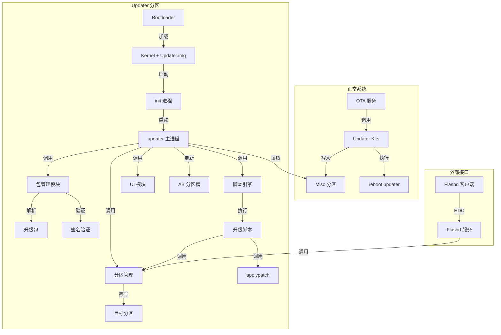
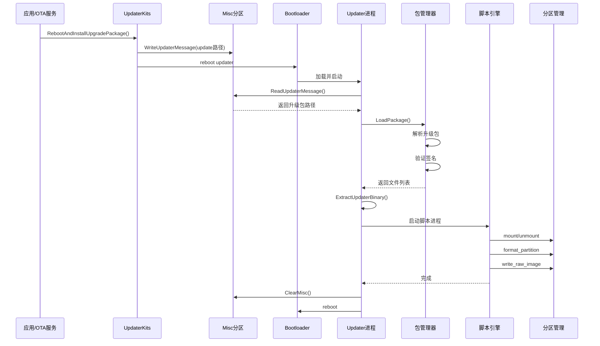
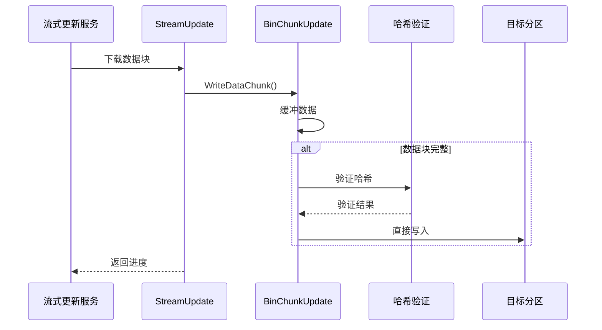
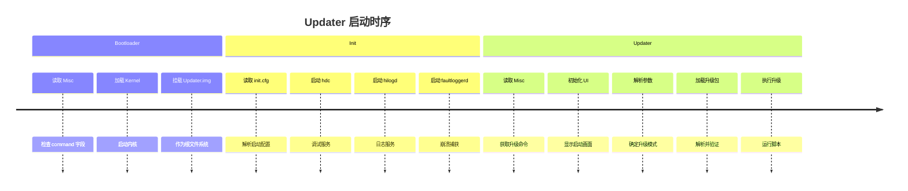
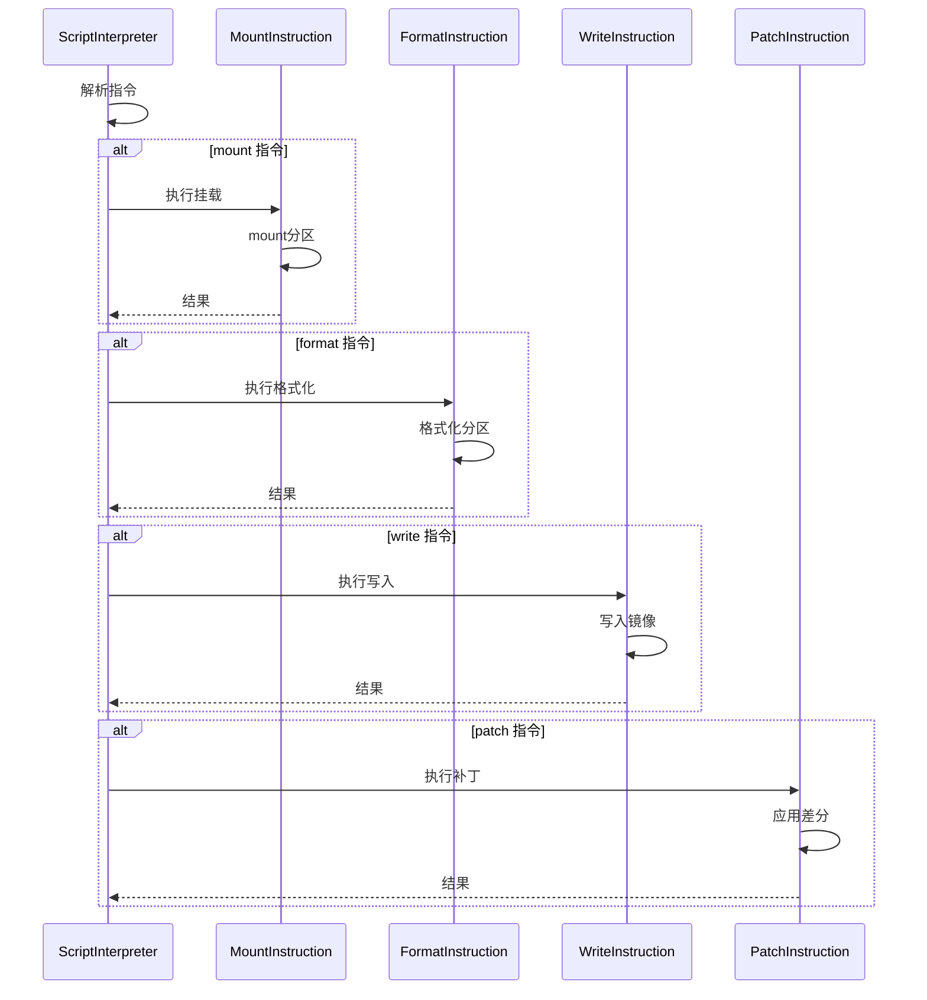
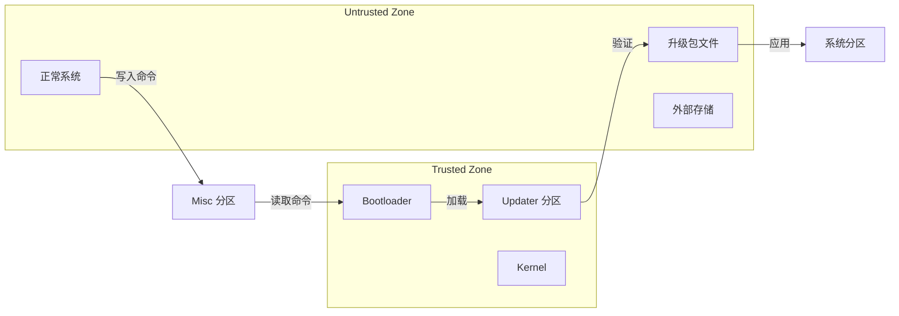

# OpenHarmony Updater 架构说明

## 目的

本文档描述 Updater 子系统的整体架构，包括组件图、数据流、线程模型和关键时序。

## 适用范围

- 子系统开发者
- 架构师
- 安全工程师

## 系统架构

### 架构图



### 组件职责

| 组件 | 职责 | 代码位置 |
|------|------|---------|
| **OTA 服务** | 下载升级包、触发升级 | `//base/update/update_service` |
| **Updater Kits** | 对外 API，写入 Misc 分区 | `interfaces/kits/updaterkits/` |
| **updater 主进程** | 升级流程控制 | `services/main.cpp`, `services/updater_main.cpp` |
| **包管理** | 解析和验证升级包 | `services/package/` |
| **脚本引擎** | 解释执行升级脚本 | `services/script/` |
| **applypatch** | 应用差分补丁 | `services/applypatch/` |
| **分区管理** | 分区挂载/擦除/格式化 | `services/fs_manager/` |
| **UI 模块** | 显示升级界面 | `services/ui/` |
| **Flashd** | 工厂刷机模式 | `services/flashd/` |

## 数据流

### OTA 升级数据流



### 包解析数据流

```
升级包文件
    ↓
PkgStream (文件流抽象)
    ↓
PkgManager::LoadPackage()
    ↓
ZipPkgFile::LoadPackage() ──→ 解析 ZIP 结构
    ↓
HashDataVerifier ──→ 验证文件哈希
    ↓
PkgVerifyUtil::VerifySourceDigest() ──→ 验证签名
    ↓
返回文件列表
```

### AB 流式升级数据流



## 线程模型

### 主进程线程

| 线程 | 职责 | 代码位置 |
|------|------|---------|
| **主线程** | 流程控制、UI 更新 | `services/updater_main.cpp` |
| **脚本执行线程** | 执行升级脚本（子进程） | `services/updater.cpp:StartUpdaterProc()` |
| **工作线程池** | 并行处理（差分应用等） | `services/script/threadpool/` |

### 脚本引擎线程池

```cpp
// services/script/threadpool/thread_pool.h
class ThreadPool {
    // 固定数量工作线程
    // 任务队列
    // 支持异步执行脚本指令
};
```

## 关键时序

### 启动时序



### 升级脚本指令时序



## 分区模型

### 分区映射关系

```
正常系统分区          Updater 分区操作          目标
├── system_a          → mount/umount          → 挂载点 /system
├── system_b          → mount/umount          → 挂载点 /system
├── vendor_a          → mount/umount          → 挂载点 /vendor
├── userdata          → mount/umount/format   → 挂载点 /data
├── misc              → read/write            → Misc 分区
└── updater           → (自身运行分区)         → 根文件系统
```

### 信任边界



## 安全模型

### 校验链

```
1. 升级包签名验证 (PKCS#7)
   ↓
2. 文件哈希验证 (SHA256/SHA384)
   ↓
3. 元数据完整性检查
   ↓
4. AB 分区哈希验证 (升级后)
```

### 权限控制

| 操作 | 权限要求 | 检查点 |
|------|---------|--------|
| 写入 Misc | Root | `misc_info.cpp` |
| 擦写分区 | Root | `fs_manager/do_partition.cpp` |
| 挂载系统分区 | Root | `fs_manager/mount.cpp` |
| 加载驱动 | Root | `init` |

## 关键结论

1. **分层架构**：Updater 采用清晰的分层架构，包管理、脚本引擎、分区管理各司其职。

2. **脚本驱动升级**：升级逻辑通过脚本描述，灵活性高，支持复杂升级场景。

3. **Misc 分区作为桥梁**：Misc 分区是正常系统与 Updater 之间通信的唯一通道。

4. **流式 AB 升级**：支持后台流式写入，用户可继续使用设备，下次重启切换分区。

5. **多重验证保障**：签名验证、哈希验证、分区哈希验证构成完整的校验链。

## 相关跳转

- [项目概览](./00_Overview.md)
- [目录结构](./02_Directory_Structure.md)
- [包管理内部接口](./04_Inner_API.md#pkg_manager)
- [脚本引擎](./04_Inner_API.md#script_engine)
- [安全分析](./06_Security_Analysis.md)
