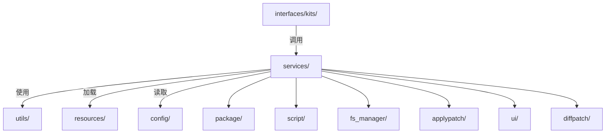

# OpenHarmony Updater 目录结构

## 目的

本文档描述 Updater 子系统的目录组织结构，说明各目录的职责和关键文件。

## 适用范围

- 子系统开发者
- 新加入项目的工程师

## 顶层目录

```
base/update/updater/
├── BUILD.gn                    # 根构建文件
├── bundle.json                 # 组件配置
├── updater_default_cfg.gni     # GN 默认配置
├── README.md                   # 英文说明
├── README_zh.md                # 中文说明
├── updater.md                  # 中文适配文档
├── config/                     # 配置文件
├── figures/                    # 文档图片
├── interfaces/                 # 对外接口
├── resources/                  # UI 资源
├── services/                   # 核心服务代码
├── test/                       # 测试代码（本文档不详细展开）
└── utils/                      # 通用工具
```

## 目录职责详解

### `interfaces/kits/` - 对外接口层

提供 C/C++ 对外 API，其他子系统通过链接库方式调用。

| 子目录 | 职责 | 主要产物 |
|--------|------|---------|
| `misc_info/` | Misc 分区读写 | `libmiscinfo` |
| `packages/` | 包创建和验证 | `libpackage_shared`, `libpackageExt` |
| `updaterkits/` | 升级触发和重启 | `libupdater_shared`, `libupdaterkits` |
| `slot_info/` | AB 分区槽管理 | `libslotinfo` |
| `diff_patch/` | 差分补丁应用 | `libdiff_patch`, `libdiff_patch_shared` |
| `include/` | 公共头文件 | - |

**关键头文件**:
- `interfaces/kits/include/misc_info/misc_info.h`
- `interfaces/kits/include/package/package.h`
- `interfaces/kits/include/updaterkits/updaterkits.h`

### `services/` - 核心服务层

Updater 的核心实现，包含所有业务逻辑。

#### 入口与主控

| 文件/目录 | 职责 |
|----------|------|
| `main.cpp` | 程序入口，模式选择（updater/flashd） |
| `updater_main.cpp` | 主更新逻辑实现 |
| `updater.cpp` | 升级器核心类 |
| `updater_init.h` | 初始化事件框架 |

#### 包管理 (`package/`)

```
services/package/
├── pkg_algorithm/       # 压缩/解压算法
│   ├── pkg_algo_deflate.cpp    # deflate 压缩
│   ├── pkg_algo_digest.cpp     # 摘要算法
│   ├── pkg_algo_lz4.cpp        # LZ4 压缩
│   └── pkg_algo_sign.cpp       # 签名验证
├── pkg_manager/         # 包管理器
│   ├── pkg_manager_impl.cpp    # 实现
│   └── pkg_stream.cpp          # 流抽象
├── pkg_package/         # 包类型实现
│   ├── pkg_gzipfile.cpp        # GZIP 包
│   ├── pkg_lz4file.cpp         # LZ4 包
│   ├── pkg_pkgfile.cpp         # 升级包
│   └── pkg_zipfile.cpp         # ZIP 包
└── pkg_verify/          # 包验证
    ├── cert_verify.cpp         # 证书验证
    ├── hash_data_verifier.cpp  # 哈希数据验证
    ├── openssl_util.cpp        # OpenSSL 工具
    ├── pkcs7_signed_data.cpp   # PKCS#7 签名处理
    ├── pkg_verify_util.cpp     # 验证工具
    └── zip_pkg_parse.cpp       # ZIP 包解析
```

#### 脚本引擎 (`script/`)

```
services/script/
├── script_instruction/       # 指令实现
│   ├── script_basicinstruction.cpp   # 基础指令
│   ├── script_instructionhelper.cpp  # 指令辅助
│   ├── script_loadscript.cpp         # 加载脚本
│   ├── script_registercmd.cpp        # 注册命令
│   └── script_updateprocesser.cpp    # 更新处理器
├── script_interpreter/       # 脚本解释器
│   ├── script_context.cpp            # 执行上下文
│   ├── script_expression.cpp         # 表达式
│   ├── script_function.cpp           # 函数
│   ├── script_interpreter.cpp        # 解释器主类
│   ├── script_param.cpp              # 参数处理
│   └── script_statement.cpp          # 语句
├── script_manager/           # 脚本管理
│   ├── script_manager_impl.cpp       # 实现
│   └── script_utils.cpp              # 工具
└── threadpool/               # 线程池
    └── thread_pool.cpp               # 实现
```

**脚本指令清单**:
- `mount` - 挂载分区
- `unmount` - 卸载分区
- `format` - 格式化分区
- `write_raw_image` - 写入原始镜像
- `apply_patch` - 应用差分补丁
- `package_extract_file` - 提取包文件
- `set_progress` - 设置进度

#### 分区管理 (`fs_manager/`)

| 文件 | 职责 |
|------|------|
| `mount.cpp` | 挂载/卸载分区 |
| `do_partition.cpp` | 分区操作（擦除、格式化） |
| `partitions.cpp` | 分区信息管理 |
| `cmp_partition.cpp` | 分区比较 |

#### 差分补丁 (`diffpatch/`)

```
services/diffpatch/
├── patch/                  # 补丁应用
│   ├── blocks_patch.cpp    # 块补丁
│   └── image_patch.cpp     # 镜像补丁
├── patch_shared/           # 共享补丁库
│   └── patch_shared.cpp
├── diff/                   # 差分生成
│   ├── blocks_diff.cpp     # 块差分
│   └── image_diff.cpp      # 镜像差分
└── bzip2/                  # 压缩适配
    ├── bzip2_adapter.cpp
    ├── deflate_adapter.cpp
    ├── lz4_adapter.cpp
    └── zip_adapter.cpp
```

#### 补丁应用 (`applypatch/`)

| 文件 | 职责 |
|------|------|
| `apply_patch.cpp` | 补丁应用入口 |
| `block_set.cpp` | 块集合管理 |
| `block_writer.cpp` | 块写入器 |
| `command.cpp` | 命令处理 |
| `data_writer.cpp` | 数据写入 |
| `partition_record.cpp` | 分区记录 |
| `raw_writer.cpp` | 原始写入 |
| `store.cpp` | 存储管理 |
| `transfer_manager.cpp` | 传输管理 |

#### UI 模块 (`ui/`)

```
services/ui/
├── control/                # 控制逻辑
│   ├── callback_manager.cpp
│   ├── event_listener.cpp
│   └── event_manager.cpp
├── driver/                 # 显示驱动
│   ├── drm_driver.cpp      # DRM 驱动
│   ├── fbdev_driver.cpp    # Framebuffer 驱动
│   ├── graphic_drv.cpp     # 图形驱动
│   ├── input_event.cpp     # 输入事件
│   ├── keys_input_device.cpp    # 按键输入
│   ├── pointers_input_device.cpp # 触摸输入
│   └── surface_dev.cpp     # 显示设备
├── language/               # 语言支持
│   └── language_ui.cpp
├── strategy/               # 显示策略
│   ├── logo_strategy.cpp   # Logo 策略
│   ├── progress_strategy.cpp # 进度策略
│   └── ui_strategy.cpp     # UI 策略
└── view/                   # 视图组件
    ├── view_api.cpp        # 视图 API
    └── component/          # 组件
        ├── box_progress_adapter.cpp
        ├── component_factory.cpp
        ├── component_register.cpp
        ├── img_view_adapter.cpp
        ├── label_btn_adapter.cpp
        └── text_label_adapter.cpp
```

#### 其他服务模块

| 目录 | 职责 | 关键文件 |
|------|------|---------|
| `log/` | 日志系统 | `log.cpp`, `updater_hilog.cpp` |
| `updater_binary/` | 升级二进制处理 | `update_processor.cpp`, `update_partitions.cpp` |
| `stream_update/` | AB 流式更新 | `bin_chunk_update.cpp` |
| `flow_update/` | 流式二进制更新 | `bin_flow_update.cpp` |
| `flashd/` | 工厂刷机模式 | `flashd.h`, `daemon/` |
| `sdcard_update/` | SD 卡升级 | `sdcard_update.cpp` |
| `factory_reset/` | 恢复出厂 | `factory_reset.cpp` |
| `write_state/` | 状态写入 | `write_state.cpp` |
| `ptable_parse/` | 分区表解析 | `ptable_manager.cpp` |
| `hdi/` | HDI 接口 | `client/`, `server/` |
| `common/ring_buffer/` | 环形缓冲区 | `ring_buffer.cpp` |
| `rust/hash_signed_data/` | Rust 哈希签名 | `src/lib.rs` |

#### 公共头文件 (`include/`)

```
services/include/
├── updater/                # Updater 相关
│   ├── updater.h
│   ├── updater_const.h
│   ├── updater_main.h
│   └── updater_preprocess.h
├── package/                # 包管理
│   ├── cert_verify.h
│   ├── hash_data_verifier.h
│   ├── pkg_info_utils.h
│   ├── pkg_manager.h
│   └── packages_info.h
├── script/                 # 脚本
│   ├── script_instruction.h
│   └── script_manager.h
├── fs_manager/             # 文件系统
│   ├── cmp_partition.h
│   ├── mount.h
│   └── partitions.h
├── applypatch/             # 补丁应用
│   ├── apply_patch.h
│   ├── block_set.h
│   ├── block_writer.h
│   ├── command.h
│   ├── command_const.h
│   ├── command_function.h
│   ├── data_writer.h
│   ├── partition_record.h
│   ├── store.h
│   ├── transfer_manager.h
│   └── updater_env.h
├── log/                    # 日志
│   ├── dump.h
│   ├── log.h
│   └── updater_hilog.h
├── patch/                  # 补丁
│   └── update_patch.h
├── flashd/                 # Flashd
│   └── flashd.h
└── rust/                   # Rust FFI
    ├── hash_signed_data.h
    └── image_hash_check.h
```

### `utils/` - 通用工具

| 文件/目录 | 职责 |
|----------|------|
| `utils.cpp` | 主工具函数（文件操作、字符串处理、系统操作） |
| `utils_fs.cpp` | 文件系统工具（目录创建、递归删除等） |
| `utils_common.cpp` | 通用工具（路径转换、库加载等） |
| `partition_utils.cpp` | 分区工具（安全擦除等） |
| `updater_reboot.cpp` | 重启命令行工具 |
| `write_updater.cpp` | 写入 Misc 分区工具 |
| `json/` | JSON 处理模块 |
| `include/` | 头文件 |

### `resources/` - UI 资源

存放 UI 使用的图片、字体等资源文件。

### `config/` - 配置文件

```
config/
└── shared_library/
    └── BUILD.gn    # 共享库编译配置
```

## 目录关系图



## 模块依赖关系

```
utils/ (底层工具)
    ↑
services/package/ (包管理)
    ↑
services/script/ (脚本引擎) ←→ services/fs_manager/ (分区管理)
    ↑                             ↑
services/applypatch/ (补丁应用) ←┘
    ↑
services/updater_main.cpp (主控)
    ↑
interfaces/kits/ (对外接口)
```

## 关键结论

1. **清晰的层次结构**：`interfaces/` → `services/` → `utils/` 三层结构清晰，职责分离明确。

2. **包管理是核心**：`services/package/` 是最复杂的模块，支持多种包格式和验证方式。

3. **脚本驱动设计**：升级逻辑通过脚本描述，`services/script/` 提供完整的脚本引擎。

4. **模块化设计**：各模块通过头文件接口交互，便于单元测试和替换。

5. **Rust 混合编程**：使用 Rust 实现哈希签名验证（`services/rust/`），提升安全性。

## 相关跳转

- [项目概览](./00_Overview.md)
- [架构说明](./01_Architecture.md)
- [对外 API](./03_Public_API.md)
- [内部接口](./04_Inner_API.md)
