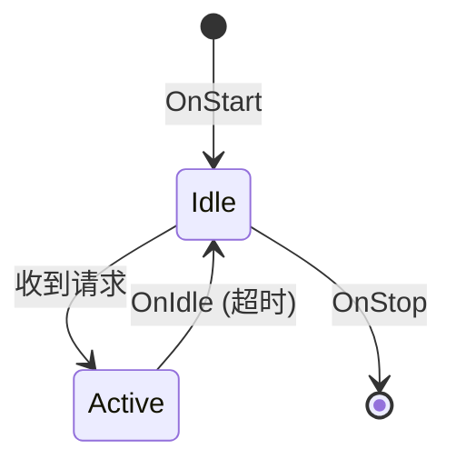

# 00_项目概览

> 快速了解 OpenHarmony Update Service 的定位与核心能力。

## 1. 项目定位

| 属性 | 值 |
|------|-----|
| **组件名称** | @ohos/update_service |
| **子系统** | updater |
| **版本** | 3.1 |
| **SysCap** | SystemCapability.Update.UpdateService |
| **类型** | System Ability (SA) |
| **启动方式** | init 进程启动，按需拉起 |

**证据**: `bundle.json:14-17`

## 2. 核心功能

### 2.1 功能清单

| 功能 | 描述 | 代码证据 |
|------|------|----------|
| **查找升级包** | 检查是否有可用的 OTA 升级包 | `README_zh.md:17-18` |
| **下载升级包** | 下载升级包到本地 | `README_zh.md:19-20` |
| **设置升级策略** | 配置自动下载/升级策略 | `README_zh.md:21-22` |
| **获取升级策略** | 查询当前升级策略 | `README_zh.md:21-22` |
| **触发升级** | 将升级命令写入 misc 分区 | `README_zh.md:23-24` |

### 2.2 SA 生命周期



**证据**: `update_service.cpp:477-527` (OnStart/OnStop/OnIdle)

## 3. 目录结构

```
base/update/updateservice/
├── interfaces/             # 接口层
│   ├── kits/              # 对外 JS 接口
│   └── inner_api/         # SA IPC 接口
├── frameworks/            # 框架层
│   └── js/               # N-API/ANI 绑定
│       ├── ani/          # ANI (Ark Native Interface)
│       └── napi/         # N-API (Node-API)
├── services/             # 服务层
│   ├── engine/          # 主 SA 实现
│   ├── firmware/        # OTA 固件升级
│   ├── core/            # 核心能力
│   ├── startup/         # 启动管理
│   └── utils/           # 工具类
├── foundations/          # 基础层
├── adapter/             # 适配层
└── test/                # 测试 (不记录)
```

**证据**: `README_zh.md:28-49`, `bundle.json:59-68`

## 4. 模块职责

| 模块 | 职责 | 关键文件 |
|------|------|----------|
| **engine** | SA 主实现、权限校验 | `services/engine/src/update_service.cpp` |
| **firmware** | OTA 升级业务流程 | `services/firmware/upgrade/` |
| **core** | 数据库/网络/偏好设置 | `services/core/ability/` |
| **startup** | 启动调度/访问控制 | `services/startup/` |
| **napi** | JS API 绑定 | `frameworks/js/napi/update/` |
| **ani** | Ark Native Interface | `frameworks/js/ani/` |

## 5. 运行环境

### 5.1 系统要求

- **适配系统类型**: standard (标准设备)
- **依赖子系统**:
  - ability_runtime
  - bundle_framework
  - ipc/safwk/samgr
  - napi
  - access_token
  - hilog/hisysevent

**证据**: `bundle.json:28-55`

### 5.2 运行权限

- **进程用户**: uid=update, gid=update/netsys_socket
- **SELinux 上下文**: u:r:updater_sa:s0
- **系统权限**:
  - ohos.permission.UPDATE_SYSTEM
  - ohos.permission.GET_NETWORK_INFO
  - ohos.permission.STORAGE_MANAGER_CRYPT

**证据**: `updater_sa.cfg:21-35`

### 5.3 数据目录

| 路径 | 权限 | 用途 |
|------|------|------|
| `/data/service/el1/public/update/` | 0751 | 升级数据根目录 |
| `/data/service/el1/public/update/dupdate_engine/` | 0700 | 引擎数据 |
| `/data/update/ota_package/` | 0770 | OTA 升级包 |

**证据**: `updater_sa.cfg:4-17`, `constant.h:63-71`

## 6. 关键概念

### 6.1 UpgradeInfo (升级信息)

```cpp
struct UpgradeInfo {
    std::string upgradeApp;           // 升级应用
    BusinessType businessType;        // 业务类型 (vendor/subType)
};
```

**证据**: `interfaces/inner_api/feature/update/model/upgrade_info/upgrade_info.h`

### 6.2 VersionDigestInfo (版本摘要)

```cpp
struct VersionDigestInfo {
    std::string versionDigest;        // 版本摘要
    std::string versionId;            // 版本 ID
};
```

**证据**: `interfaces/inner_api/feature/update/model/version_info/version_digest_info.h`

### 6.3 UpgradePolicy (升级策略)

```cpp
struct UpgradePolicy {
    int64_t downloadStrategy;         // 下载策略
    int64_t upgradeStrategy;          // 升级策略
    std::string abnormalStrategy;     // 异常策略
};
```

**证据**: `interfaces/inner_api/feature/update/model/policy/upgrade_policy.h`

## 7. 相关仓库

| 仓库 | 描述 |
|------|------|
| [update_app](https://gitee.com/openharmony/update_app) | 更新子系统主仓库 |
| [update_updater](https://gitee.com/openharmony/update_updater) | Updater 子系统 |

**证据**: `README_zh.md:159-167`

---

## 8. 快速开始

### 获取 Updater 对象

```javascript
import client from 'libupdateclient.z.so'
let updater = client.getUpdater('OTA')
```

### 检查新版本

```javascript
updater.checkNewVersion(info => {
    info // 新版本信息
})
```

### 下载升级包

```javascript
updater.download()
updater.on("downloadProgress", progress => {
    progress // 下载进度
})
```

### 触发升级

```javascript
updater.upgrade()
updater.on("upgradeProgress", progress => {
    progress // 升级进度
})
```

**证据**: `README_zh.md:94-157`

---

## 9. 下一步

- **深入架构**: [01_Architecture.md](./01_Architecture.md)
- **API 参考**: [02_N-API.md](./02_N-API.md)
- **构建配置**: [04_GN_Build.md](./04_GN_Build.md)
