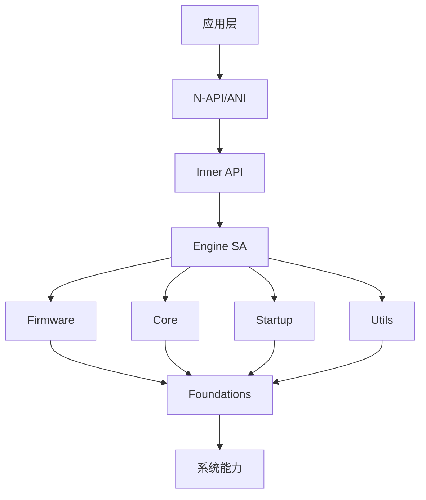
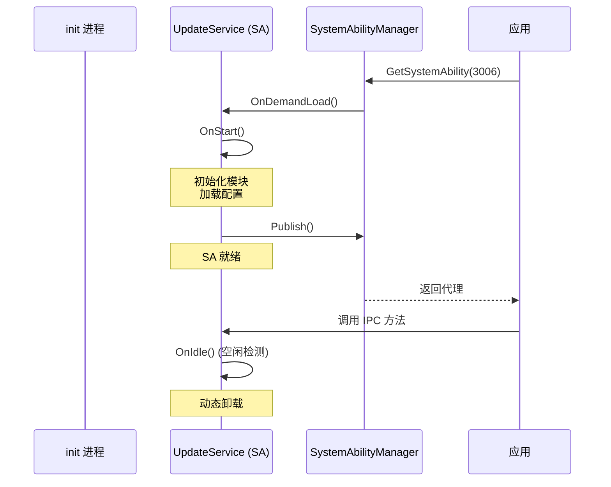
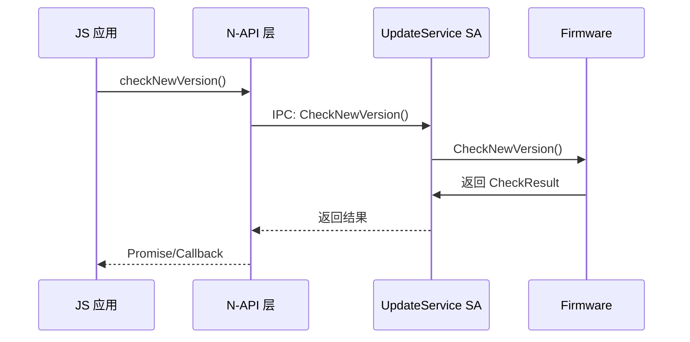
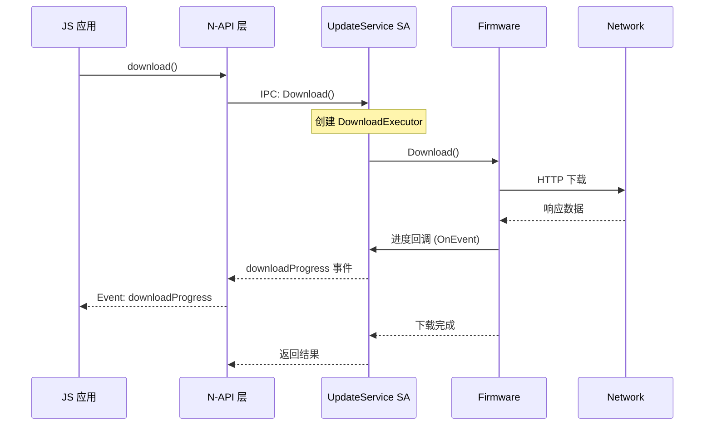

# 01_系统架构

> 深入理解 Update Service 的系统架构设计。

## 1. 整体架构

```
┌─────────────────────────────────────────────────────────────────┐
│                      APPLICATION LAYER                          │
│                  (JS/TS 应用使用 @ohos.update)                    │
└─────────────────────────────────────────────────────────────────┘
                              │
                              ▼
┌─────────────────────────────────────────────────────────────────┐
│                     FRAMEWORK LAYER                               │
│  ┌────────────────┐  ┌────────────────────────────────────────┐ │
│  │      ANI       │  │            N-API                        │ │
│  │  (Ark Native)   │  │         (Node-API)                    │ │
│  └────────────────┘  └────────────────────────────────────────┘ │
└─────────────────────────────────────────────────────────────────┘
                              │
                              ▼
┌─────────────────────────────────────────────────────────────────┐
│                     INTERFACE LAYER                               │
│  ┌────────────────────────────────────────────────────────────┐  │
│  │   Inner APIs (IPC)  │  Feature Models  │  Module Manager  │  │
│  └────────────────────────────────────────────────────────────┘  │
└─────────────────────────────────────────────────────────────────┘
                              │
                              ▼
┌─────────────────────────────────────────────────────────────────┐
│                      SERVICE LAYER                                │
│  ┌─────────┐ ┌──────────┐ ┌─────────┐ ┌──────────┐ ┌─────────┐  │
│  │ Engine │ │ Firmware │ │  Core   │ │ Startup  │ │  Utils  │  │
│  │  (SA)  │ │  (OTA)   │ │ (Base)  │ │ (Boot)   │ │ (Net)   │  │
│  └─────────┘ └──────────┘ └─────────┘ └──────────┘ └─────────┘  │
└─────────────────────────────────────────────────────────────────┘
                              │
                              ▼
┌─────────────────────────────────────────────────────────────────┐
│                    FOUNDATION LAYER                               │
│         (Logging, Utils, SA Loader, Models, SysEvents)           │
└─────────────────────────────────────────────────────────────────┘
```

## 2. 模块依赖关系



**关键依赖**:
- `UpdateClient` → `UpdateService` (SA) → `Firmware` → `Executor` → `Check/Download/Install`

## 3. System Ability (SA) 架构

### 3.1 SA 配置

| 属性 | 值 | 证据 |
|------|-----|------|
| **SA ID** | 3006 | `services/engine/sa_profile/3006.json:5` |
| **库路径** | libupdateservice.z.so | `services/engine/sa_profile/3006.json:6` |
| **进程名** | updater_sa | `services/engine/sa_profile/3006.json:2` |
| **启动方式** | 按需启动 (ondemand=true) | `services/engine/etc/updater_sa.cfg:24` |
| **Boot Phase** | BootStartPhase | `services/engine/sa_profile/3006.json:9` |

**SA Profile** (`3006.json`):
```json
{
  "name": 3006,
  "libpath": "libupdateservice.z.so",
  "run-on-create": false,
  "distributed": false,
  "bootphase": "BootStartPhase",
  "auto-restart": true,
  "start-on-demand": {
    "allow-update": true,
    "timedevent": {"name": "loopevent", "value": "14400"}
  }
}
```

### 3.2 SA 生命周期



**证据**: `update_service.cpp:477-527`

## 4. IPC 通信架构

### 4.1 IPC 接口定义

**服务接口** (`IUpdateService.idl`):

| 接口代码 | 方法名 | 描述 |
|----------|--------|------|
| 1 | CheckNewVersion | 检查新版本 |
| 2 | Download | 下载升级包 |
| 3 | PauseDownload | 暂停下载 |
| 4 | ResumeDownload | 恢复下载 |
| 5 | Upgrade | 执行升级 |
| 6 | ClearError | 清除错误 |
| 7 | TerminateUpgrade | 终止升级 |
| 8 | SetUpgradePolicy | 设置策略 |
| 9 | GetUpgradePolicy | 获取策略 |
| 10 | GetNewVersionInfo | 获取新版本信息 |
| ... | ... | ... |

**证据**: `interfaces/inner_api/engine/IUpdateService.idl:39-72`

### 4.2 回调接口

```idl
[callback] interface OHOS.UpdateService.IUpdateCallback {
    void OnEvent([in] EventInfo eventInfo);
}
```

**证据**: `interfaces/inner_api/engine/callback/IUpdateCallback.idl:18-20`

### 4.3 IPC 权限校验流程

```
┌─────────────────┐     ┌─────────────────┐     ┌─────────────────┐
│   IPC 调用      │────▶│  Caller 校验    │────▶│  权限 校验      │
│                 │     │ IsCallerValid() │     │ IsPermissionGranted() │
└─────────────────┘     └─────────────────┘     └─────────────────┘
                              │                        │
                              ▼                        ▼
                       TOKEN_HAP: 系统应用      UPDATE_SYSTEM 权限
                       TOKEN_NATIVE: root/edm   FACTORY_RESET 权限
                                                    FORCE_FACTORY_RESET 权限
```

**证据**: `update_service.cpp:529-631`

## 5. 模块详解

### 5.1 Engine (主服务)

**职责**: SA 生命周期管理、权限校验、分发请求

**关键类**:
```cpp
class UpdateService : public SystemAbility, public UpdateServiceStub
{
    // 权限校验
    bool IsCallerValid();
    bool IsPermissionGranted(uint32_t code);
    
    // 回调管理
    int32_t RegisterUpdateCallback(...);
    int32_t UnregisterUpdateCallback(...);
    
    // 升级操作
    int32_t CheckNewVersion(...);
    int32_t Download(...);
    int32_t Upgrade(...);
};
```

**证据**: `services/engine/include/update_service.h:35-167`

### 5.2 Firmware (OTA 升级)

**职责**: 完整的 OTA 升级流程

**模块结构**:
```
services/firmware/
├── check/                    # 版本检查
├── download/                 # 下载管理
├── install/                  # 安装执行
├── executor/                 # 执行器接口
├── mode/                     # 执行模式
├── status/                   # 状态管理
├── event/                    # 事件处理
├── data/                     # 数据存储
└── utils/                    # 工具类
```

**证据**: `services/firmware/firmware.gni`

### 5.3 Core (核心能力)

**职责**: 数据库、网络、偏好设置等基础能力

**关键模块**:
- `sqlite/` - SQLite 数据库封装
- `preference/` - 偏好设置
- `alarm/` - 定时器管理
- `utils/` - 文件/SHA256 工具

**证据**: `services/core/ability/`

### 5.4 Startup (启动管理)

**职责**: SA 启动调度、访问控制

**关键类**:
```cpp
class StartupManager {
    void Start();         // 启动流程
    void Stop();          // 停止流程
    void IdleLoop();      // 空闲检测
};

class AccessManager {
    bool CheckAccess();   // 访问控制
};
```

**证据**: `services/startup/manage/`, `services/startup/access/`

## 6. 线程模型

### 6.1 线程配置

| 线程类型 | 说明 | 配置 |
|----------|------|------|
| **Main Thread** | SA 主线程，处理 IPC 调用 | 默认 |
| **Worker Thread** | 异步任务执行 | napi_create_async_work |
| **Download Thread** | 下载任务线程 | progress_thread.cpp |
| **Stream Thread** | 流式安装线程 | stream_progress_thread.cpp |

### 6.2 QOS 优先级 (可选)

当 `UPDATE_SERVICE_ENABLE_RUN_ON_DEMAND_QOS` 开启时:
- **OPEN_SO_PRIO** (-20): 打开动态库时提升优先级
- **NORMAL_PRIO** (0): 正常优先级

**证据**: `update_service.cpp:46-73`

## 7. 关键时序图

### 7.1 检查新版本



### 7.2 下载升级包



## 8. 数据流

### 8.1 升级包下载流程

```
┌──────────┐    ┌──────────┐    ┌──────────┐    ┌──────────┐
│  Server  │───▶│  Firmware │───▶│ Network  │───▶│  Local   │
│          │    │   Manager │    │   Manager│    │ Storage  │
└──────────┘    └──────────┘    └──────────┘    └──────────┘
                                                     │
                                                     ▼
                                               ┌──────────┐
                                               │  SQLite  │
                                               │ Database │
                                               └──────────┘
```

### 8.2 版本信息存储

- **偏好设置**: `/data/service/el1/public/update/dupdate_engine/preferences/`
- **数据库**: `/data/service/el1/public/update/dupdate_engine/databases/`
- **升级包**: `/data/update/ota_package/`

**证据**: `updater_sa.cfg:4-17`

## 9. 稳定性设计

### 9.1 自动重启

SA 配置了 `auto-restart: true`，在异常退出时自动重启。

**证据**: `services/engine/sa_profile/3006.json:11`

### 9.2 客户端死亡处理

```cpp
class ClientDeathRecipient : public IRemoteObject::DeathRecipient {
    void OnRemoteDied(const wptr<IRemoteObject> &remote) {
        // 清理客户端注册的回调
        service->UnregisterUpdateCallback(upgradeInfo_);
    }
};
```

**证据**: `update_service.cpp:65-73`

## 10. 下一步

- **API 参考**: [02_N-API.md](./02_N-API.md)
- **Inner API**: [03_Inner_API.md](./03_Inner_API.md)
- **构建配置**: [04_GN_Build.md](./04_GN_Build.md)
