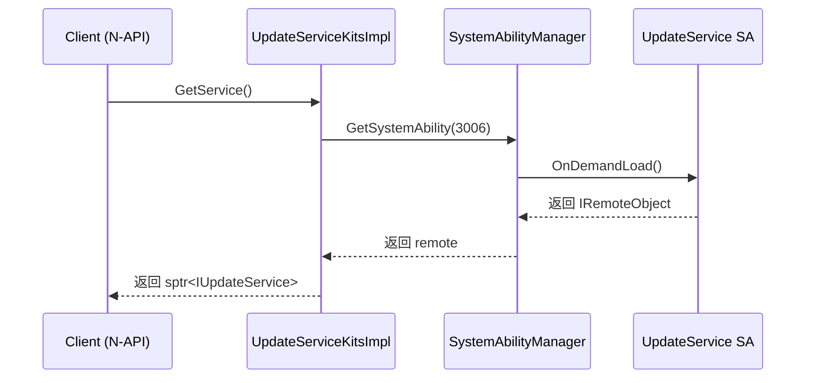
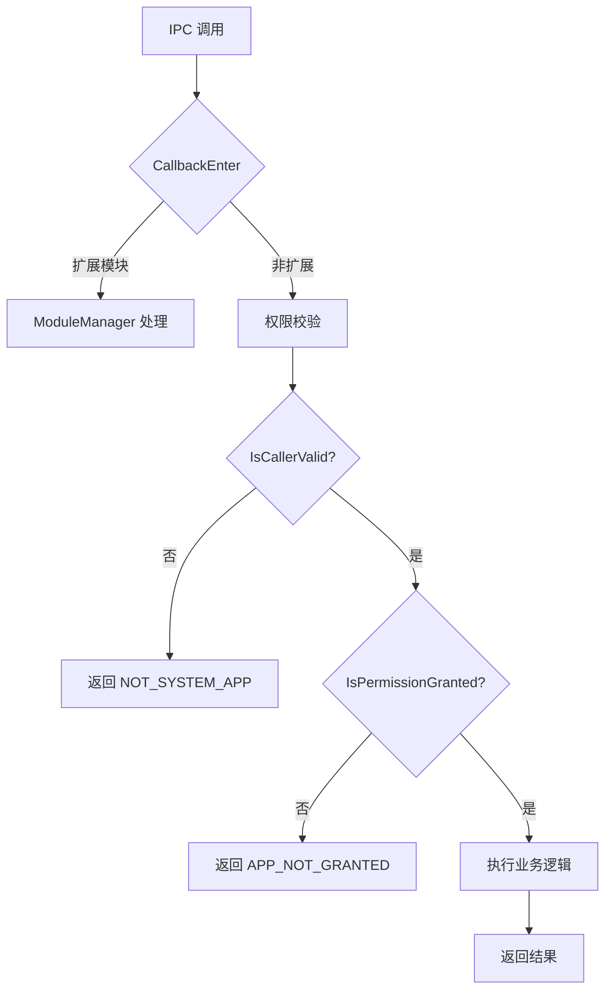

# 03_Inner_API 与 IPC

> 内部 API 与进程间通信机制详解。

## 1. Inner API 概述

### 1.1 Inner API 分层

```
┌─────────────────────────────────────────────────────────────────┐
│                     FRAMEWORK LAYER                             │
│                  (N-API / ANI Bindings)                          │
└─────────────────────────────────────────────────────────────────┘
                              │
                              ▼
┌─────────────────────────────────────────────────────────────────┐
│                     INTERFACE LAYER                              │
│  ┌─────────────────────────────────────────────────────────────┐│
│  │                    Inner APIs                               ││
│  │  ┌──────────────┐ ┌──────────────┐ ┌────────────────────┐  ││
│  │  │ UpdateService │ │ ModuleManager │ │ Feature Models     │  ││
│  │  │   (IPC SA)    │ │  (扩展钩子)   │ │  (数据模型)        │  ││
│  │  └──────────────┘ └──────────────┘ └────────────────────┘  ││
│  └─────────────────────────────────────────────────────────────┘│
└─────────────────────────────────────────────────────────────────┘
```

### 1.2 Inner API 产物

| 产物 | 库名 | 说明 |
|------|------|------|
| `updateservicekits` | `libupdateservicekits.z.so` | SA 客户端套件 |
| `update_module_mgr` | `libupdate_module_mgr.z.so` | 模块管理器 |

**证据**: `bundle.json:62-63`, `interfaces/inner_api/engine/BUILD.gn`, `interfaces/inner_api/modulemgr/BUILD.gn`

---

## 2. IUpdateService IPC 接口

### 2.1 接口定义

**文件**: `interfaces/inner_api/engine/IUpdateService.idl`

**接口代码映射**:

| IPC Code | Method | 参数 | 描述 |
|----------|--------|------|------|
| 1 | `CheckNewVersion` | UpgradeInfo, BusinessError, CheckResult | 检查新版本 |
| 2 | `Download` | UpgradeInfo, VersionDigestInfo, DownloadOptions, BusinessError | 下载 |
| 3 | `PauseDownload` | UpgradeInfo, VersionDigestInfo, PauseDownloadOptions, BusinessError | 暂停下载 |
| 4 | `ResumeDownload` | UpgradeInfo, VersionDigestInfo, ResumeDownloadOptions, BusinessError | 恢复下载 |
| 5 | `Upgrade` | UpgradeInfo, VersionDigestInfo, UpgradeOptions, BusinessError | 执行升级 |
| 6 | `ClearError` | UpgradeInfo, VersionDigestInfo, ClearOptions, BusinessError | 清除错误 |
| 7 | `TerminateUpgrade` | UpgradeInfo, BusinessError | 终止升级 |
| 8 | `SetUpgradePolicy` | UpgradeInfo, UpgradePolicy, BusinessError | 设置策略 |
| 9 | `GetUpgradePolicy` | UpgradeInfo, UpgradePolicy, BusinessError | 获取策略 |
| 10 | `GetNewVersionInfo` | UpgradeInfo, NewVersionInfo, BusinessError | 获取新版本信息 |
| 11 | `GetNewVersionDescription` | UpgradeInfo, VersionDigestInfo, DescriptionOptions, VersionDescriptionInfo, BusinessError | 获取版本描述 |
| 12 | `GetCurrentVersionInfo` | UpgradeInfo, CurrentVersionInfo, BusinessError | 获取当前版本 |
| 13 | `GetCurrentVersionDescription` | UpgradeInfo, DescriptionOptions, VersionDescriptionInfo, BusinessError | 获取当前版本描述 |
| 14 | `GetTaskInfo` | UpgradeInfo, TaskInfo, BusinessError | 获取任务信息 |
| 15 | `RegisterUpdateCallback` | UpgradeInfo, IUpdateCallback | 注册回调 |
| 16 | `UnregisterUpdateCallback` | UpgradeInfo | 注销回调 |
| 17 | `Cancel` | UpgradeInfo, int, BusinessError | 取消操作 |
| 18 | `FactoryReset` | BusinessError | 恢复出厂 |
| 19 | `ApplyNewVersion` | UpgradeInfo, String, String[], BusinessError | 应用新版本 |
| 20 | `VerifyUpgradePackage` | String, String, BusinessError | 验证升级包 |
| 21 | `ForceFactoryReset` | BusinessError | 强制恢复出厂 |

**证据**: `IUpdateService.idl:39-72`

### 2.2 回调接口

**文件**: `interfaces/inner_api/engine/callback/IUpdateCallback.idl`

```idl
[callback] interface OHOS.UpdateService.IUpdateCallback {
    void OnEvent([in] EventInfo eventInfo);
}
```

**EventInfo 结构**:
```cpp
struct EventInfo {
    EventClassify eventClassify;    // 事件分类
    EventId eventId;                // 事件 ID
    int32_t errorCode;             // 错误码
    std::string errorMessage;       // 错误信息
    // ... 其他字段
}
```

---

## 3. SA 客户端实现

### 3.1 UpdateServiceKitsImpl

**文件**: `interfaces/inner_api/engine/src/update_service_kits_impl.cpp`

```cpp
class UpdateServiceKitsImpl : public BaseServiceKitsImpl<IUpdateService> {
public:
    sptr<IUpdateService> GetService() override {
        auto manager = SystemAbilityManagerClient::GetSystemAbilityManager();
        auto remote = manager->GetSystemAbility(UPDATE_DISTRIBUTED_SERVICE_ID);
        return iface_cast<IUpdateService>(remote);
    }
};
```

**证据**: `update_service_kits_impl.cpp:33` (SA ID: 3006)

### 3.2 服务获取流程



---

## 4. 模块管理器 (ModuleManager)

### 4.1 作用

ModuleManager 提供了 IPC 调用的扩展钩子机制，允许在 SA 内部拦截和扩展 IPC 处理流程。

**文件**: `interfaces/inner_api/modulemgr/src/module_manager.cpp`

### 4.2 核心功能

```cpp
class ModuleManager {
public:
    bool IsModuleLoaded();           // 模块是否已加载
    bool IsMapFuncExist(uint32_t code);  // 是否是扩展接口
    int32_t HandleFunc(uint32_t code, MessageParcel &data, 
                       MessageParcel &reply, MessageOption &option);  // 处理扩展调用
    
    void HandleOnStartOnStopFunc(const std::string &funcName, 
                                  const SystemAbilityOnDemandReason &reason);  // 处理生命周期
    int32_t HandleOnIdleFunc(const std::string &funcName,
                              const SystemAbilityOnDemandReason &reason);  // 处理空闲
};
```

**证据**: `module_manager.h:33-69`

### 4.3 CallbackHook 机制

```cpp
class CallbackHook {
public:
    int32_t CallbackEnter(uint32_t code);   // IPC 调用入口检查
    int32_t CallbackExit(uint32_t code, int32_t result);  // IPC 调用退出
    int32_t CallbackParcel(uint32_t code, MessageParcel &data,
                           MessageParcel &reply, MessageOption &option);  // Parcel 处理
};
```

**证据**: `update_service.cpp:529-592`

---

## 5. 权限校验机制

### 5.1 IPC 调用权限流程

```
┌─────────────────────┐     ┌─────────────────────┐     ┌─────────────────────┐
│   MessageParcel     │────▶│   CallbackEnter     │────▶│  IsCallerValid()    │
│     (IPC 请求)      │     │   (入口检查)        │     │  (调用者校验)        │
└─────────────────────┘     └─────────────────────┘     └─────────────────────┘
                                                           │
                                                           ▼
                                                  TOKEN_HAP: IsSystemAppByFullTokenID
                                                  TOKEN_NATIVE: UID == 0 or 3057
                                                           │
                                                           ▼
                                                  ❌ 返回 INT_NOT_SYSTEM_APP
                                                           │
                                                           ▼
                                                  ✅ 继续权限检查
                                                           │
                                                           ▼
                                              IsPermissionGranted(code)
                                                           │
                                         UPDATE_SYSTEM ─────┼───── FACTORY_RESET
                                                           │
                                                           ▼
                                              ❌ 返回 INT_APP_NOT_GRANTED
                                                           │
                                                           ▼
                                              ✅ 调用实际方法
```

**证据**: `update_service.cpp:529-631`

### 5.2 核心校验函数

#### IsCallerValid

```cpp
bool UpdateService::IsCallerValid()
{
    auto callerTokenType = AccessTokenKit::GetTokenType(callerToken);
    
    switch (callerTokenType) {
        case TOKEN_HAP:
            // HAP 进程只允许系统应用调用
            return TokenIdKit::IsSystemAppByFullTokenID(callerFullTokenID);
            
        case TOKEN_NATIVE:
            // Native 进程只允许 root(0) 和 edm(3057)
            pid_t callerUid = IPCSkeleton::GetCallingUid();
            return callerUid == ROOT_UID || callerUid == EDM_UID;
            
        default:
            return false;
    }
}
```

**证据**: `update_service.cpp:594-613`

#### IsPermissionGranted

```cpp
bool UpdateService::IsPermissionGranted(uint32_t code)
{
    std::string permission = "ohos.permission.UPDATE_SYSTEM";
    
    if (code == FACTORY_RESET) {
        permission = "ohos.permission.FACTORY_RESET";
    } else if (code == FORCE_FACTORY_RESET) {
        permission = "ohos.permission.FORCE_FACTORY_RESET";
    }
    
    return AccessTokenKit::VerifyAccessToken(callerToken, permission) 
           == PERMISSION_GRANTED;
}
```

**证据**: `update_service.cpp:615-631`

---

## 6. 数据序列化

### 6.1 Parcel 序列化

**文件**: `update_service_kits_impl.cpp` 中的方法实现

```cpp
// 示例: SetUpgradePolicy
int32_t UpdateServiceKitsImpl::SetUpgradePolicy(const UpgradeInfo &info,
    const UpgradePolicy &policy, BusinessError &businessError, int32_t &funcResult)
{
    MessageParcel data, reply;
    MessageOption option;
    
    // 序列化参数
    if (!data.WriteInterfaceToken(GetDescriptor())) {
        return ERR_IPC;
    }
    if (!data.WriteParcelable(&info)) {
        return ERR_IPC;
    }
    if (!data.WriteParcelable(&policy)) {
        return ERR_IPC;
    }
    
    // 发送 IPC 调用
    auto remote = GetRemote();
    int32_t ret = remote->SendRequest(
        CAST_UINT(UpdaterSaInterfaceCode::SET_POLICY),
        data, reply, option);
    
    // 反序列化结果
    if (ret == 0) {
        funcResult = reply.ReadInt32();
        businessError.ReadFromParcel(reply);
    }
    
    return ret;
}
```

### 6.2 Sequenceable 对象

| 类型 | 描述 | 文件 |
|------|------|------|
| `UpgradeInfo` | 升级信息 | `upgrade_info.h` |
| `VersionDigestInfo` | 版本摘要 | `version_digest_info.h` |
| `NewVersionInfo` | 新版本信息 | `new_version_info.h` |
| `CurrentVersionInfo` | 当前版本信息 | `current_version_info.h` |
| `UpgradePolicy` | 升级策略 | `upgrade_policy.h` |
| `TaskInfo` | 任务信息 | `task_info.h` |
| `BusinessError` | 业务错误 | `business_error.h` |

**证据**: `IUpdateService.idl:20-34`

---

## 7. 死亡接收处理

### 7.1 客户端死亡监听

```cpp
// 客户端死亡的回调处理
class ClientDeathRecipient : public IRemoteObject::DeathRecipient {
public:
    void OnRemoteDied(const wptr<IRemoteObject> &remote) override {
        ENGINE_LOGI("client DeathRecipient OnRemoteDied");
        
        auto service = UpdateService::GetInstance();
        if (service != nullptr) {
            // 清理该客户端注册的回调
            service->UnregisterUpdateCallback(upgradeInfo_, funcResult);
        }
    }
};
```

**证据**: `update_service.cpp:65-73`

### 7.2 注册死亡接收

```cpp
void UpdateService::ClientProxy::AddDeathRecipient()
{
    if (proxy_ != nullptr) {
        auto remoteObject = proxy_->AsObject();
        if ((remoteObject != nullptr) && (deathRecipient_ != nullptr)) {
            remoteObject->AddDeathRecipient(deathRecipient_);
        }
    }
}
```

**证据**: `update_service.cpp:87-97`

---

## 8. SA 生命周期与 IPC

### 8.1 OnStart 流程

```cpp
void UpdateService::OnStart(const SystemAbilityOnDemandReason &startReason)
{
    ENGINE_LOGI("UpdateService OnStart, startReason: %{public}s", 
                startReason.GetName().c_str());
    
    // 1. 设置单例
    updateService_ = this;
    
    // 2. 加载配置
    DelayedSingleton<ConfigParse>::GetInstance()->LoadConfigInfo();
    
    // 3. 加载模块
    ModuleManager::GetInstance().LoadModule(libPath);
    
    // 4. 如果未加载模块，初始化网络等
    if (!ModuleManager::GetInstance().IsModuleLoaded()) {
        DelayedSingleton<NetManager>::GetInstance()->Init();
        DelayedSingleton<StartupManager>::GetInstance()->Start();
    }
    
    // 5. 发布 SA
    Publish(this);
}
```

**证据**: `update_service.cpp:477-515`

### 8.2 OnDemand 启动

```cpp
int32_t UpdateService::OnIdle(const SystemAbilityOnDemandReason &idleReason)
{
    ENGINE_LOGI("UpdateService OnIdle");
    return ModuleManager::GetInstance().HandleOnIdleFunc("OnIdle", idleReason);
}
```

**证据**: `update_service.cpp:517-521`

---

## 9. 错误码映射

### 9.1 IPC 错误码

| 常量 | 值 | 描述 |
|------|-------|------|
| `INT_CALL_SUCCESS` | 0 | 成功 |
| `INT_CALL_FAIL` | 100 | 通用失败 |
| `INT_APP_NOT_GRANTED` | 201 | 无权限 |
| `INT_NOT_SYSTEM_APP` | 202 | 非系统应用 |
| `INT_PARAM_ERR` | 401 | 参数错误 |
| `INT_UN_SUPPORT` | 801 | 不支持 |

### 9.2 错误处理流程



**证据**: `call_result.h:24-58`

---

## 10. 接口稳定性

### 10.1 稳定接口

以下接口为稳定接口，外部可正常使用：
- `CheckNewVersion` / `Download` / `Upgrade`
- `GetNewVersionInfo` / `GetCurrentVersionInfo`
- `SetUpgradePolicy` / `GetUpgradePolicy`
- `RegisterUpdateCallback` / `UnregisterUpdateCallback`

### 10.2 扩展接口

ModuleManager 提供的扩展接口，用于内部功能扩展，不建议外部依赖。

---

## 11. 下一步

- **架构设计**: [01_Architecture.md](./01_Architecture.md)
- **N-API 参考**: [02_N-API.md](./02_N-API.md)
- **GN 构建**: [04_GN_Build.md](./04_GN_Build.md)
- **安全评审**: [05_Security.md](./05_Security.md)
