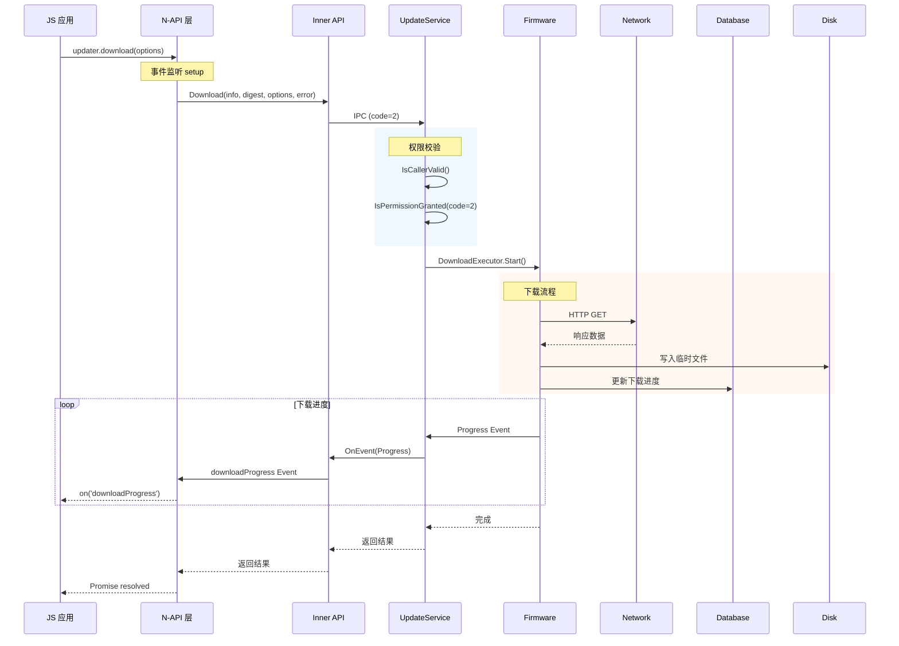
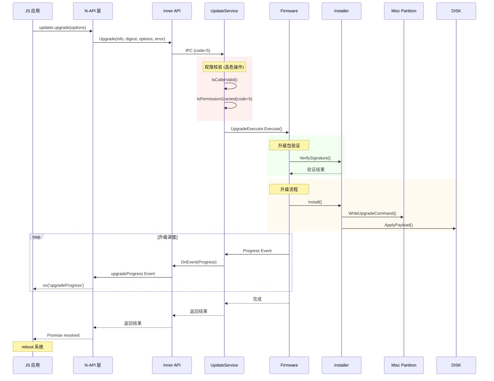
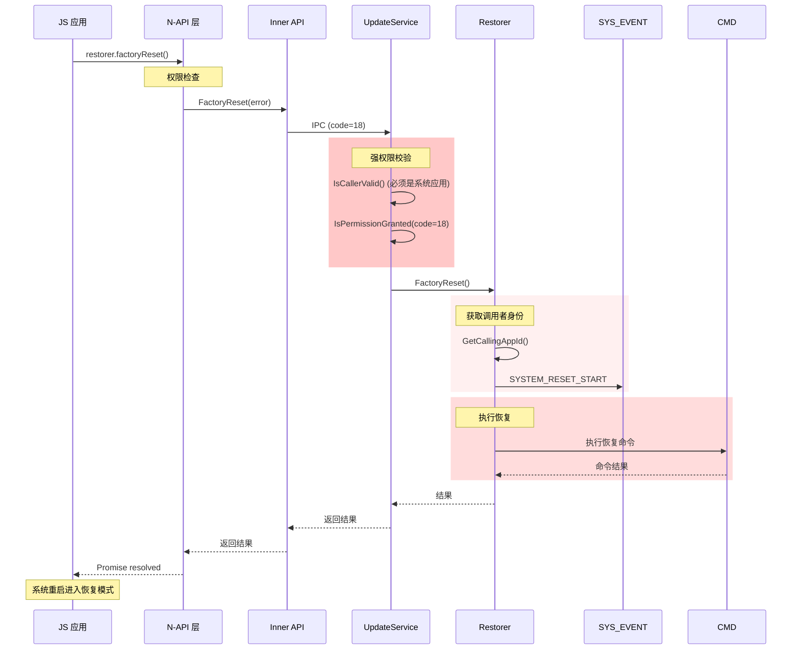
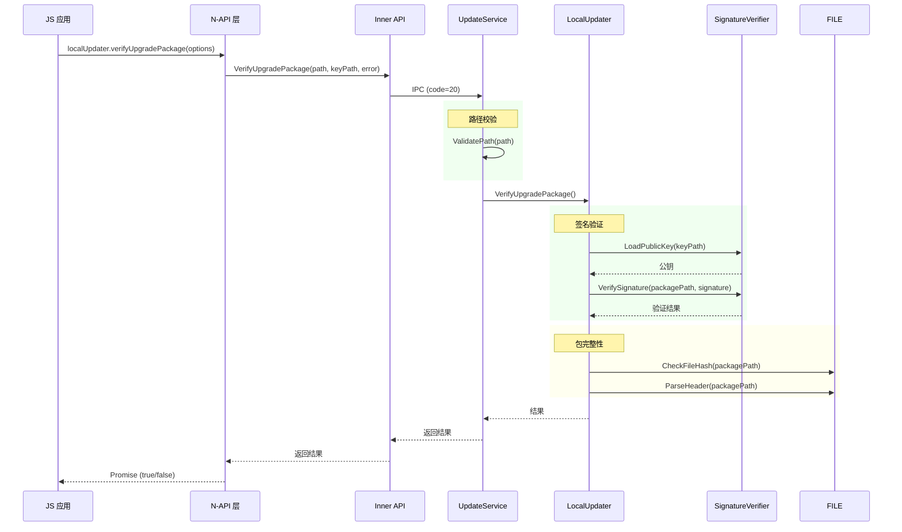
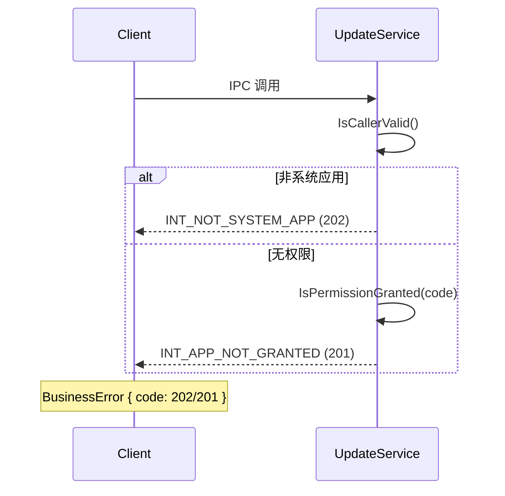
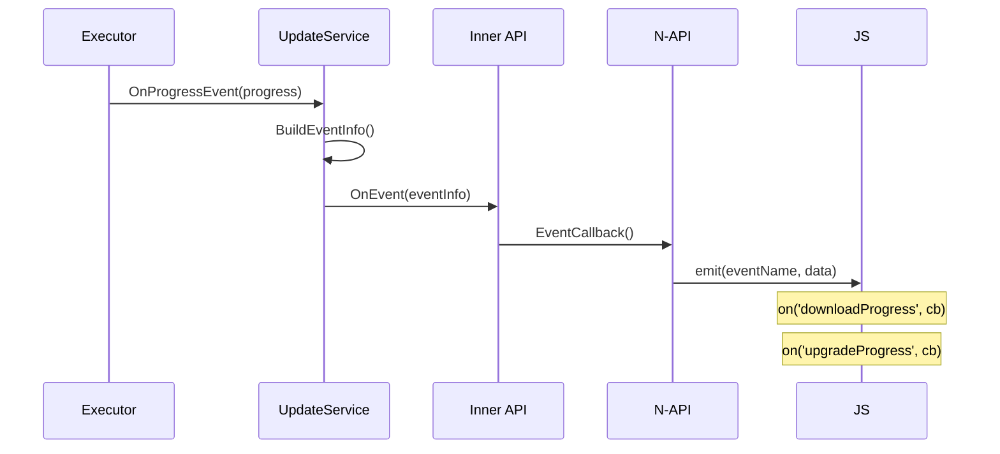
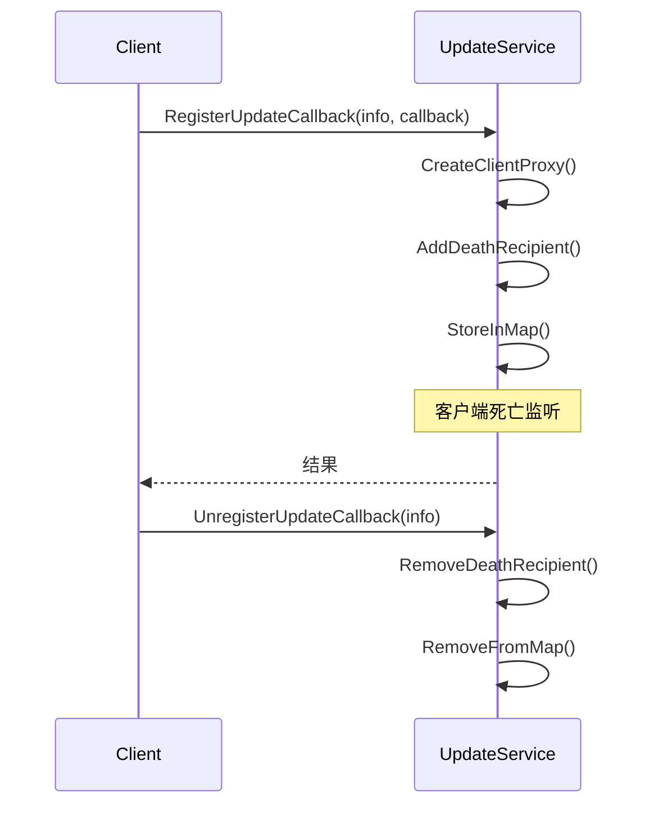

# 附录: 关键调用链

> 核心操作的完整调用链，从 JS 层到系统调用。

## 1. checkNewVersion 调用链

### 1.1 完整调用链

```mermaid
sequenceDiagram
    participant JS as JS 应用
    participant NAPI as N-API 层
    participant KITS as Inner API
    participant SA as UpdateService
    participant FW as Firmware

    JS->>NAPI: updater.checkNewVersion()
    Note over NAPI: 参数校验
    NAPI->>KITS: CheckNewVersion(info, error, result)
    Note over KITS: Parcel 序列化
    KITS->>SA: IPC (code=1)
    Note over SA: 权限检查
    SA->>SA: IsCallerValid()
    SA->>SA: IsPermissionGranted(code=1)
    SA->>FW: FirmwareManager.CheckNewVersion()
    Note over FW: 版本检查逻辑
    FW-->>SA: CheckResult
    SA-->>KIPS 返回 Parcel
    KITS-->>NAPI: 返回结果
    NAPI-->>JS: Promise/Callback
```

### 1.2 代码路径

| 层级 | 文件 | 行号 |
|------|------|------|
| JS | `README_zh.md` | 111-122 |
| N-API | `frameworks/js/napi/update/src/update_module.cpp` | 153-158 |
| N-API | `frameworks/js/napi/update/src/update_client.cpp` | CheckNewVersion 方法 |
| Inner API | `interfaces/inner_api/engine/src/update_service_kits_impl.cpp` | CheckNewVersion |
| SA | `services/engine/src/update_service.cpp` | 258-267 |
| Firmware | `services/firmware/check/` | 版本检查逻辑 |

### 1.3 时序说明

1. **JS 层**: 调用 `checkNewVersion()`，支持 Promise 或 Callback 模式
2. **N-API 层**: 
   - 解析 JS 参数
   - 调用 `UpdateClient::CheckNewVersion()`
   - 创建异步工作 (`napi_create_async_work`)
3. **Inner API 层**:
   - 获取 SA 代理 (`GetSystemAbility`)
   - 序列化参数 (`MessageParcel::WriteParcelable`)
   - 发送 IPC 请求
4. **SA 层**:
   - 权限校验 (`IsCallerValid`, `IsPermissionGranted`)
   - 分发请求到 Firmware 模块
5. **Firmware 层**:
   - 执行版本检查
   - 返回检查结果

---

## 2. download 调用链

### 2.1 完整调用链



### 2.2 代码路径

| 层级 | 文件 | 行号 |
|------|------|------|
| JS | `README_zh.md` | 124-131 |
| N-API | `frameworks/js/napi/update/src/update_module.cpp` | 174-179 |
| N-API | `frameworks/js/napi/update/src/update_client.cpp` | Download 方法 |
| Inner API | `interfaces/inner_api/engine/src/update_service_kits_impl.cpp` | Download |
| SA | `services/engine/src/update_service.cpp` | 269-278 |
| Firmware | `services/firmware/upgrade/executor/src/firmware_download_executor.cpp` | Execute |
| Network | `services/core/ability/net/` | 网络请求 |

### 2.3 关键组件

| 组件 | 说明 |
|------|------|
| `DownloadExecutor` | 下载执行器 |
| `ProgressThread` | 进度汇报线程 |
| `NetManager` | 网络管理 |
| `PreferencesUtils` | 偏好设置存储 |

---

## 3. upgrade 调用链

### 3.1 完整调用链



### 3.2 代码路径

| 层级 | 文件 | 行号 |
|------|------|------|
| JS | `README_zh.md` | 133-140 |
| N-API | `frameworks/js/napi/update/src/update_module.cpp` | 204-210 |
| N-API | `frameworks/js/napi/update/src/update_client.cpp` | Upgrade 方法 |
| Inner API | `interfaces/inner_api/engine/src/update_service_kits_impl.cpp` | Upgrade |
| SA | `services/engine/src/update_service.cpp` | 297-306 |
| Firmware | `services/firmware/upgrade/executor/src/firmware_install_executor.cpp` | Execute |

### 3.3 关键组件

| 组件 | 说明 |
|------|------|
| `InstallExecutor` | 安装执行器 |
| `SysInstaller` | 系统安装器 |
| `StreamInstaller` | 流式安装器 |
| `MiscWriter` | Misc 分区写入 |

---

## 4. factoryReset 调用链

### 4.1 完整调用链



### 4.2 代码路径

| 层级 | 文件 | 行号 |
|------|------|------|
| JS | `README_zh.md` | - |
| N-API | `frameworks/js/napi/update/src/update_module.cpp` | 282 |
| Inner API | `interfaces/inner_api/engine/src/update_service_kits_impl.cpp` | FactoryReset |
| SA | `services/engine/src/update_service.cpp` | 341-349 |
| Restorer | `services/engine/src/update_service_restorer.cpp` | FactoryReset |

### 4.3 权限要求

| 要求 | 说明 |
|------|------|
| **调用者类型** | HAP (系统应用) 或 Native (root/edm) |
| **权限** | `ohos.permission.FACTORY_RESET` |
| **事件记录** | SYS_EVENT_SYSTEM_RESET |

---

## 5. verifyUpgradePackage 调用链

### 5.1 完整调用链



### 5.2 代码路径

| 层级 | 文件 | 行号 |
|------|------|------|
| JS | `README_zh.md` | - |
| N-API | `frameworks/js/napi/update/src/update_module.cpp` | 298-299 |
| Inner API | `interfaces/inner_api/engine/src/update_service_kits_impl.cpp` | VerifyUpgradePackage |
| SA | `services/engine/src/update_service.cpp` | 372-381 |
| LocalUpdater | `services/engine/src/update_service_local_updater.cpp` | VerifyUpgradePackage |

---

## 6. 错误处理调用链

### 6.1 权限错误



### 6.2 错误码映射

| 结果码 | 业务错误码 | 描述 |
|--------|------------|------|
| INT_CALL_SUCCESS | 0 | 成功 |
| INT_APP_NOT_GRANTED | 201 | 无权限 |
| INT_NOT_SYSTEM_APP | 202 | 非系统应用 |
| INT_PARAM_ERR | 401 | 参数错误 |
| INT_UN_SUPPORT | 801 | 不支持 |

---

## 7. 回调事件流

### 7.1 进度事件



### 7.2 注册/注销回调



---

## 8. 关键文件索引

| 调用链 | 关键文件 |
|--------|----------|
| checkNewVersion | `update_service.cpp:258-267` |
| download | `update_service.cpp:269-278` |
| upgrade | `update_service.cpp:297-306` |
| factoryReset | `update_service.cpp:341-349` |
| verifyUpgradePackage | `update_service.cpp:372-381` |
| 权限校验 | `update_service.cpp:529-631` |
| 回调注册 | `update_service.cpp:135-151` |
