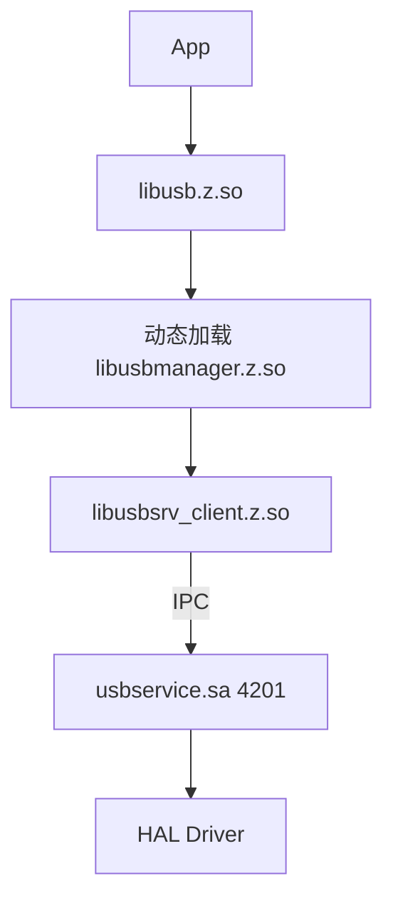

# GN 构建文档

## 根配置

**文件**: `usbmgr.gni`

```gni
usb_manager_path = "//base/usb/usb_manager"
usb_manager_part_name = "usb_manager"
utils_path = "${usb_manager_path}/utils"
```

## Feature Flags

| 标志 | 默认值 | 描述 |
|------|--------|------|
| `usb_manager_feature_pop_up_func_switch_model` | true | 功能切换弹窗 |
| `usb_manager_feature_usb_right_dialog` | true | USB 权限对话框 |
| `usb_manager_feature_host` | true | 主机模式 |
| `usb_manager_feature_device` | true | 设备模式 |
| `usb_manager_feature_port` | true | 端口管理 |
| `usb_manager_pass_through` | true | 直通模式 |
| `usb_manager_peripheral_fault_notifier` | false | 外设故障通知 |

## 构建产物清单

### 服务层 (services/)

| Target | 类型 | 产物 | 路径 |
|--------|------|------|------|
| `usbservice` | ohos_shared_library | libusbservice.z.so | system/lib64/ |
| `usb_service.init` | ohos_prebuilt_etc | usb_service.cfg | system/etc/init/ |

### 接口层 (interfaces/)

| Target | 类型 | 产物 | 路径 |
|--------|------|------|------|
| `usbsrv_client` | ohos_shared_library | libusbsrv_client.z.so | system/lib64/ |
| `usb_server_stub` | ohos_source_set | (静态链接) | - |
| `usb` | ohos_shared_library | libusb.z.so | system/lib/module/ |
| `usbmanager` | ohos_shared_library | libusbmanager.z.so | system/lib/module/ |
| `serial` | ohos_shared_library | libserial.z.so | system/lib/module/usbmanager/ |

### 框架层 (frameworks/)

| Target | 类型 | 产物 | 路径 |
|--------|------|------|------|
| `dialog_hap` | ohos_hap | usb_right_dialog.hap | system/app/com.usb.right/ |
| `usb_manager_abc` | generate_static_abc | usb_manager_abc.abc | system/framework/ |
| `usbmanager_serial_abc` | generate_static_abc | usbmanager_serial_abc.abc | system/framework/ |

### 系统配置 (etc/)

| Target | 类型 | 产物 | 路径 |
|--------|------|------|------|
| `usb_etc_files` | group | - | - |
| `usb_service.para` | ohos_prebuilt_etc | usb_service.para | system/etc/param/ |
| `usb_service.para.dac` | ohos_prebuilt_etc | usb_service.para.dac | system/etc/param/ |

## SA 配置

**文件**: `sa_profile/4201.json`

```json
{
    "process": "usb_service",
    "systemability": [{
        "name": 4201,
        "libpath": "libusbservice.z.so",
        "run-on-create": false,
        "auto-restart": true
    }]
}
```

## 依赖关系

```
                    ┌─────────────────┐
                    │  usbmgr.gni    │
                    │  (配置)         │
                    └────────┬────────┘
                             │
        ┌────────────────────┼────────────────────┐
        ▼                    ▼                    ▼
┌───────────────┐   ┌───────────────┐   ┌───────────────┐
│   services/   │   │  interfaces/  │   │ frameworks/   │
│  BUILD.gn     │   │  BUILD.gn     │   │  BUILD.gn     │
└───────┬───────┘   └───────┬───────┘   └───────┬───────┘
        │                   │                    │
        ▼                   ▼                    ▼
┌───────────────┐   ┌───────────────┐   ┌───────────────┐
│  usbservice   │   │ usbsrv_client │   │  dialog_hap   │
│   (SA)        │   │   (SDK)       │   │   (UI)        │
└───────┬───────┘   └───────┬───────┘   └───────────────┘
        │                   │
        │     ┌─────────────┘
        ▼     ▼
┌───────────────────┐
│  usbmanager.so    │
│  serial.so        │
│  usb.so (动态加载) │
└───────────────────┘
```

## 关键 Target 详解

### usbservice

**类型**: ohos_shared_library (sa)

**Sources**:
- 基础: usb_service.cpp, usb_right_manager.cpp, serial_manager.cpp
- 条件: usb_host_manager.cpp (host), usb_device_manager.cpp (device), usb_port_manager.cpp (port)

**Defines**:
- `USB_MANAGER_FEATURE_HOST`
- `USB_MANAGER_FEATURE_DEVICE`
- `USB_MANAGER_FEATURE_PORT`
- `USB_MANAGER_PASS_THROUGH` (条件)
- `USB_FUNC_SWITCH_MODE` (条件)

**External Deps**:
- ability_base, ability_runtime
- bundle_framework
- hilog, hisysevent
- ipc, safwk, samgr
- drivers_interface_usb (v1.1/v1.2/v2.0)
- access_token (权限)
- data_share (权限数据库)

### usbsrv_client

**类型**: ohos_shared_library (innerapi)

**InnerAPI Tags**: platformsdk

**Sources**:
- usb_srv_client.cpp, usb_device_pipe.cpp
- usb_interface_type.cpp, usb_request.cpp
- usbd_bulk_callback.cpp
- IDL 生成: *_proxy.cpp, *_types.cpp

### usbmanager

**类型**: ohos_shared_library

**Sources**:
- usb_info.cpp, usbmanager_middle.cpp
- napi_util.cpp, usb_napi_errors.cpp
- struct_parcel.cpp

**Deps**: `//base/usb/usb_manager/interfaces/innerkits:usbsrv_client`

## 条件编译

### 主机模式 (USB_MANAGER_FEATURE_HOST)

```gni
if (usb_manager_feature_host) {
    defines += [ "USB_MANAGER_FEATURE_HOST" ]
    sources += [
        "usb_host_manager.cpp",
        "usb_descriptor_parser.cpp",
        ...
    ]
}
```

### 设备模式 (USB_MANAGER_FEATURE_DEVICE)

```gni
if (usb_manager_feature_device) {
    defines += [ "USB_MANAGER_FEATURE_DEVICE" ]
    sources += [
        "usb_device_manager.cpp",
        "usb_accessory_manager.cpp",
        ...
    ]
}
```

### 直通模式 (USB_MANAGER_PASS_THROUGH)

```gni
if (usb_manager_pass_through) {
    defines += [ "USB_MANAGER_PASS_THROUGH" ]
    external_deps += [ "drivers_interface_usb:libusb_proxy_2.0" ]
} else {
    external_deps += [
        "drivers_interface_usb:libusb_proxy_1.1",
        "drivers_interface_usb:libusb_proxy_1.2",
    ]
}
```

## 运行时加载关系



## 相关文档

- [架构与数据流](02_Architecture.md)
- [对外接口文档](04_Interface.md)
