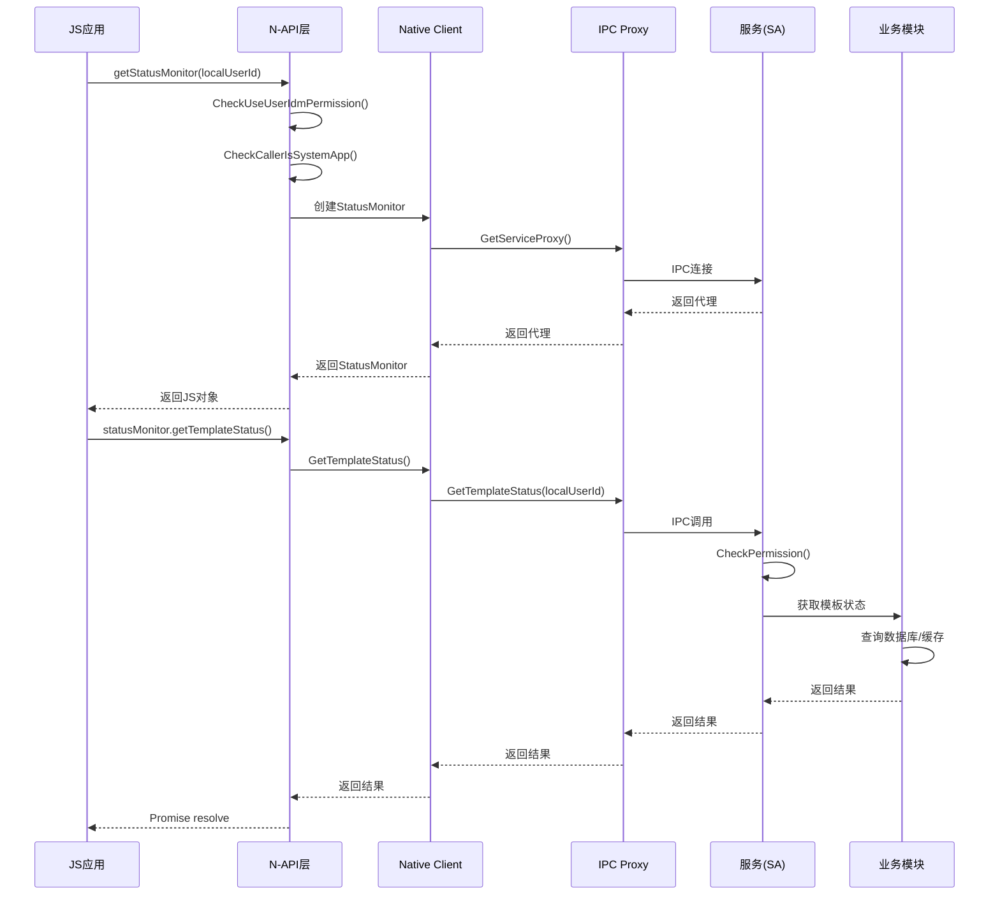
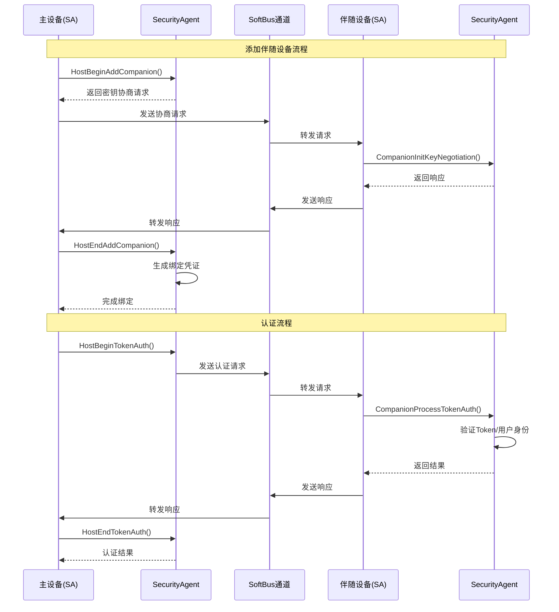
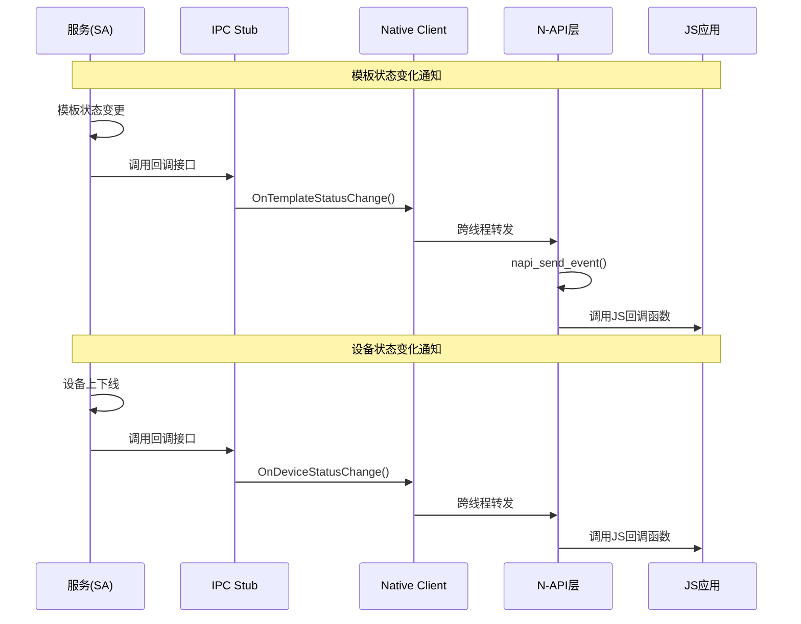
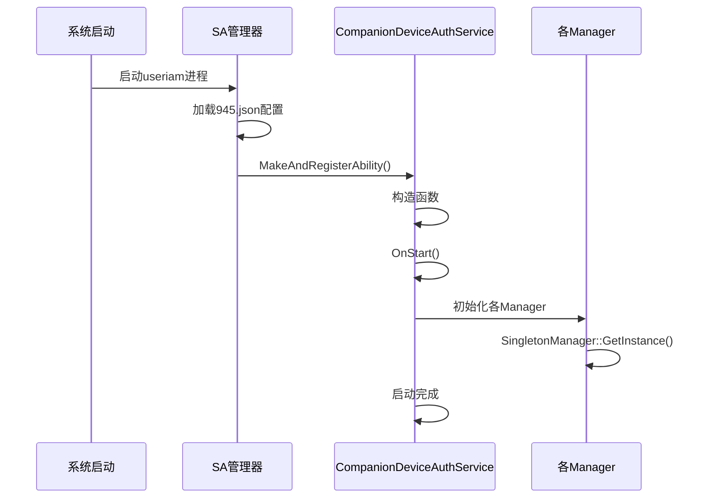
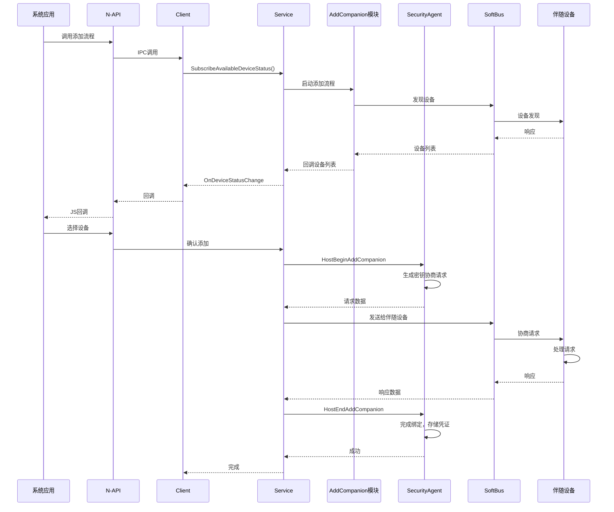

# 01_Architecture - 架构说明

> 组件图、数据流、线程模型与关键时序

---

## 1. 整体架构

### 1.1 组件层次图

```
┌─────────────────────────────────────────────────────────────────┐
│                      应用层 (Application)                        │
│  ┌──────────────────────────────────────────────────────────┐  │
│  │  JS/ETS 应用                                              │  │
│  │  - 调用N-API接口                                          │  │
│  │  - 注册回调监听状态变化                                    │  │
│  └──────────────────────────────────────────────────────────┘  │
└─────────────────────────────────────────────────────────────────┘
                              │
                              ▼
┌─────────────────────────────────────────────────────────────────┐
│                      接口层 (Framework)                          │
│  ┌──────────────────────────────────────────────────────────┐  │
│  │  N-API/ANI 模块                                           │  │
│  │  frameworks/js/napi/                                      │  │
│  │  - companion_device_auth_entry.cpp                       │  │
│  │  - status_monitor.cpp                                     │  │
│  │  - *_callback.cpp                                         │  │
│  └──────────────────────────────────────────────────────────┘  │
│                              │                                  │
│                              ▼                                  │
│  ┌──────────────────────────────────────────────────────────┐  │
│  │  Native Client 库                                         │  │
│  │  frameworks/native/client/                                │  │
│  │  - companion_device_auth_client_impl.cpp                 │  │
│  │  - ipc_*_callback_service.cpp                            │  │
│  └──────────────────────────────────────────────────────────┘  │
└─────────────────────────────────────────────────────────────────┘
                              │
                              ▼ (IPC)
┌─────────────────────────────────────────────────────────────────┐
│                      服务层 (Service)                            │
│  ┌──────────────────────────────────────────────────────────┐  │
│  │  SystemAbility 入口                                       │  │
│  │  services/service_entry/                                  │  │
│  │  - companion_device_auth_service.cpp                     │  │
│  │  - 权限检查、API分发                                      │  │
│  └──────────────────────────────────────────────────────────┘  │
│                              │                                  │
│  ┌──────────────────────────┼──────────────────────────────┐  │
│  │                          ▼                              │  │
│  │  ┌──────────────────────────────────────────────────┐  │  │
│  │  │  业务逻辑模块                                      │  │  │
│  │  │  - CompanionManager (伴随设备管理)                 │  │  │
│  │  │  - HostBindingManager (主设备绑定管理)             │  │  │
│  │  │  - RequestManager (请求生命周期)                   │  │  │
│  │  │  - SubscriptionManager (订阅管理)                  │  │  │
│  │  └──────────────────────────────────────────────────┘  │  │
│  │                          │                              │  │
│  │  ┌───────────────────────┼──────────────────────────┐  │  │
│  │  │                       ▼                          │  │  │
│  │  │  ┌──────────────────────────────────────────┐   │  │  │
│  │  │  │  跨设备交互模块                             │   │  │  │
│  │  │  │  - AddCompanion (添加伴随设备)              │   │  │  │
│  │  │  │  - TokenAuth (Token认证)                    │   │  │  │
│  │  │  │  - DelegateAuth (委托认证)                  │   │  │  │
│  │  │  │  - IssueToken/ObtainToken (Token签发/获取)  │   │  │  │
│  │  │  └──────────────────────────────────────────┘   │  │  │
│  │  │                       │                          │  │  │
│  │  │                       ▼                          │  │  │
│  │  │  ┌──────────────────────────────────────────┐   │  │  │
│  │  │  │  通信层                                     │   │  │  │
│  │  │  │  - CrossDeviceCommManager                 │   │  │  │
│  │  │  │  - SoftBusChannel (软总线通道)             │   │  │  │
│  │  │  │  - MessageRouter (消息路由)                │   │  │  │
│  │  │  └──────────────────────────────────────────┘   │  │  │
│  │  └──────────────────────────────────────────────────┘  │  │
│  │                          │                              │  │
│  │  ┌───────────────────────┼──────────────────────────┐  │  │
│  │  │                       ▼                          │  │  │
│  │  │  ┌──────────────────────────────────────────┐   │  │  │
│  │  │  │  安全代理层 (C++/Rust FFI)                  │   │  │  │
│  │  │  │  - SecurityAgentImpl (C++接口)             │   │  │  │
│  │  │  │  - Rust安全核心                             │   │  │  │
│  │  │  │    - 密钥协商                                │   │  │  │
│  │  │  │    - Token签发/验证                          │   │  │  │
│  │  │  │    - 安全存储                                │   │  │  │
│  │  │  └──────────────────────────────────────────┘   │  │  │
│  │  └──────────────────────────────────────────────────┘  │  │
│  └──────────────────────────────────────────────────────────┘  │
└─────────────────────────────────────────────────────────────────┘
                              │
                              ▼
┌─────────────────────────────────────────────────────────────────┐
│                  外部依赖层 (External Services)                   │
│  ┌──────────┐  ┌──────────┐  ┌──────────┐  ┌──────────┐        │
│  │UserAuth  │  │ SoftBus  │  │AccessToken│  │ OSAccount│        │
│  │Framework │  │          │  │   Kit    │  │          │        │
│  └──────────┘  └──────────┘  └──────────┘  └──────────┘        │
└─────────────────────────────────────────────────────────────────┘
```

### 1.2 模块职责表

| 模块 | 文件/目录 | 职责 |
|------|----------|------|
| **N-API模块** | `frameworks/js/napi/` | JS/TS接口实现，参数校验，错误转换 |
| **Client库** | `frameworks/native/client/` | 客户端IPC代理，回调封装 |
| **IPC接口** | `frameworks/native/ipc/` | IDL定义，Stub/Proxy生成 |
| **SA入口** | `services/service_entry/` | 服务生命周期，权限检查 |
| **Companion管理** | `services/companion/` | 伴随设备CRUD操作 |
| **Host绑定** | `services/host_binding/` | 主设备绑定关系管理 |
| **跨设备通信** | `services/cross_device_comm/` | 通道管理，连接管理，消息路由 |
| **跨设备交互** | `services/cross_device_interaction/` | 业务协议实现 |
| **安全代理** | `services/security_agent/` | 安全操作接口，Rust FFI桥接 |
| **外部适配** | `services/external_adapters/` | 外部系统服务适配器 |

---

## 2. 数据流

### 2.1 JS API调用流



### 2.2 跨设备认证流



### 2.3 回调通知流



---

## 3. 线程模型

### 3.1 线程层次

```
┌─────────────────────────────────────────────────────────────┐
│  JS/ArkUI线程 (主线程)                                        │
│  - N-API接口调用                                              │
│  - JS回调执行                                                 │
└─────────────────────────────────────────────────────────────┘
                              │
                              ▼ (napi_send_event)
┌─────────────────────────────────────────────────────────────┐
│  UV事件循环线程                                               │
│  frameworks/js/napi/src/*_callback.cpp                       │
│  - 回调调度 (napi_send_event)                                 │
│  - 线程安全的数据传递                                          │
└─────────────────────────────────────────────────────────────┘
                              │
                              ▼ (IPC)
┌─────────────────────────────────────────────────────────────┐
│  IPC线程池                                                   │
│  frameworks/native/ipc/                                      │
│  - 同步IPC调用处理                                            │
│  - 回调消息接收                                               │
└─────────────────────────────────────────────────────────────┘
                              │
                              ▼ (SA MessageQueue)
┌─────────────────────────────────────────────────────────────┐
│  SA主线程 (useriam进程)                                       │
│  services/service_entry/                                     │
│  - SystemAbility消息循环                                      │
│  - API请求处理                                                │
└─────────────────────────────────────────────────────────────┘
                              │
                              ▼
┌─────────────────────────────────────────────────────────────┐
│  任务线程池 (TaskRunner)                                     │
│  services/utils/src/task_runner_manager.cpp                  │
│  - ResidentTaskRunner (常驻任务)                              │
│  - TemporaryTaskRunner (临时任务)                             │
│  - 异步操作执行                                               │
└─────────────────────────────────────────────────────────────┘
                              │
                              ▼
┌─────────────────────────────────────────────────────────────┐
│  SoftBus回调线程                                             │
│  services/cross_device_channels/soft_bus/                    │
│  - 网络消息接收                                               │
│  - 设备状态变化                                               │
└─────────────────────────────────────────────────────────────┘
```

### 3.2 关键线程安全机制

**1. N-API回调线程安全**

从 `frameworks/js/napi/src/napi_template_status_callback.cpp:138-177`:
```cpp
void NapiTemplateStatusCallback::OnTemplateStatusChange(...) {
    // 获取UV事件循环
    uv_loop_s *loop = nullptr;
    napi_get_uv_event_loop(env_, &loop);
    
    // 创建task lambda
    auto task = [templateStatusCallbackHolder]() {
        // 在新线程中执行JS回调
        napi_handle_scope scope = nullptr;
        napi_open_handle_scope(...);
        callback->DoCallback(...);
    };
    
    // 发送到JS线程执行
    napi_send_event(env_, task, napi_eprio_immediate, ...);
}
```

**2. JsRefHolder线程安全析构**

从 `frameworks/js/napi/src/companion_device_auth_napi_helper.cpp:71-103`:
```cpp
JsRefHolder::~JsRefHolder() {
    // 在UV线程中安全删除引用
    auto task = [deleteRefHolder]() {
        napi_delete_reference(deleteRefHolder->env, deleteRefHolder->ref);
    };
    napi_send_event(env_, task, napi_eprio_immediate, ...);
}
```

**3. 服务线程模型**

从 `services/service_entry/src/companion_device_auth_service.cpp`:
- 主线程处理SystemAbility消息
- 耗时操作通过 `TaskRunner` 异步执行
- 回调通过IPC线程通知客户端

---

## 4. 信任边界

### 4.1 信任域划分

```
┌─────────────────────────────────────────────────────────────┐
│                    非信任域 (Untrusted)                       │
│  ┌───────────────────────────────────────────────────────┐  │
│  │  第三方应用                                             │  │
│  │  - 无USE_USER_IDM权限                                  │  │
│  │  - 无法调用API                                         │  │
│  └───────────────────────────────────────────────────────┘  │
└─────────────────────────────────────────────────────────────┘
                              │
                              ▼ (权限检查)
┌─────────────────────────────────────────────────────────────┐
│                   半信任域 (Semi-Trusted)                     │
│  ┌───────────────────────────────────────────────────────┐  │
│  │  系统应用 (JS/Native)                                   │  │
│  │  - 有USE_USER_IDM权限                                  │  │
│  │  - 需通过N-API/IPC调用                                  │  │
│  └───────────────────────────────────────────────────────┘  │
└─────────────────────────────────────────────────────────────┘
                              │
                              ▼ (IPC调用)
┌─────────────────────────────────────────────────────────────┐
│                   信任域 (Trusted)                            │
│  ┌───────────────────────────────────────────────────────┐  │
│  │  companion_device_auth服务 (SA 945)                     │  │
│  │  - useriam进程                                         │  │
│  │  - 权限验证                                              │  │
│  │  - 业务逻辑处理                                          │  │
│  └───────────────────────────────────────────────────────┘  │
└─────────────────────────────────────────────────────────────┘
                              │
                              ▼ (Rust FFI)
┌─────────────────────────────────────────────────────────────┐
│                 高信任域 (Highly Trusted)                     │
│  ┌───────────────────────────────────────────────────────┐  │
│  │  SecurityAgent (Rust核心)                               │  │
│  │  - 密钥操作                                              │  │
│  │  - Token签发/验证                                        │  │
│  │  - 安全存储接口                                          │  │
│  └───────────────────────────────────────────────────────┘  │
└─────────────────────────────────────────────────────────────┘
```

### 4.2 边界检查点

| 边界 | 检查机制 | 代码位置 |
|------|----------|----------|
| JS → Native | 权限检查 + 系统应用检查 | `companion_device_auth_entry.cpp:35-60` |
| Client → SA | 权限检查 | `companion_device_auth_service.cpp:515-528` |
| C++ → Rust | FFI接口边界 | `security_agent_impl.cpp` |

---

## 5. 关键时序图

### 5.1 服务启动时序



### 5.2 设备添加时序



---

## 6. 部署模式

### 6.1 Standard模式 (默认)

```
┌─────────────────────────────────────┐
│           主设备 (Host)              │
│  ┌───────────────────────────────┐  │
│  │  useriam进程                   │  │
│  │  - companion_device_auth (SA)  │  │
│  │  - user_auth_framework (SA)    │  │
│  └───────────────────────────────┘  │
└─────────────────────────────────────┘
              │ SoftBus
              ▼
┌─────────────────────────────────────┐
│        伴随设备 (Companion)          │
│  ┌───────────────────────────────┐  │
│  │  useriam进程                   │  │
│  │  - companion_device_auth (SA)  │  │
│  └───────────────────────────────┘  │
└─────────────────────────────────────┘
```

### 6.2 AP模式

配置: `companion_device_auth_deploy_mode = "ap"`

差异: 不使用user_auth_framework适配器

---

## 7. 扩展点

### 7.1 设备选择回调

应用可注册自定义设备选择逻辑:

```cpp
// frameworks/native/client/inc/idevice_select_callback.h
class IDeviceSelectCallback : public IRemoteBroker {
public:
    virtual void OnDeviceSelect(int32_t selectPurpose, 
        const sptr<ISetDeviceSelectResultCallback> &callback) = 0;
};
```

### 7.2 安全代理接口

厂商可替换安全存储实现:

```cpp
// services/security_agent/inc/security_agent_imp.h
class ISecurityAgent {
    virtual ResultCode HostBeginAddCompanion(...) = 0;
    virtual ResultCode HostBeginTokenAuth(...) = 0;
    // ... 其他安全操作
};
```

---

*文档生成时间: 2025-02-06*
